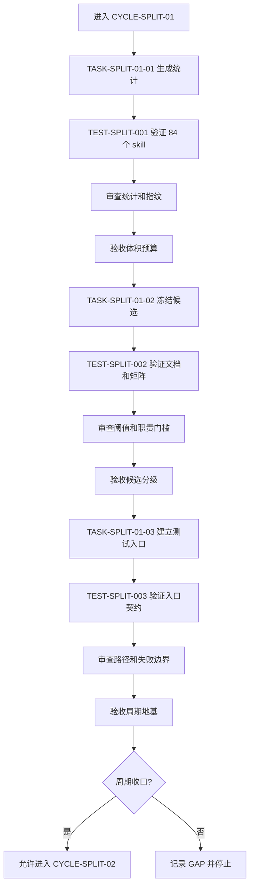

# 实施周期 01：预算与候选冻结

结论：本周期已完成统计与候选矩阵冻结，并已完成通用拆分测试入口的实现、测试、审查和验收；影响：后续周期可复用统一的 size、mapping、trigger、pre-delete、post-delete 验证契约，并在越界时安全失败；范围：全仓统计、P0/P1/P2 分级、暂缓证据、离线 fixture、PowerShell wrapper 和路径边界；非范围：不修改任何 skill 资产、不删除旧目录、不刷新字典；变化：候选进入和删除前承接均获得可执行入口；完成标准：三个任务逐个完成落盘、真实测试、审查和验收，周期收口条件全部明确；术语说明：默认文本包是一个 skill 的 `SKILL.md` 与直接 references 文本总大小；验证状态：周期 01 已收口，不进入下一周期，真实 skill 拆分仍未开始。

## 当前周期目标

- 周期 ID / 期次定位：`CYCLE-SPLIT-01` / 第一期：地基。
- 只做这一件事：冻结全仓 skill 体积预算、候选分级和后续拆分入口。
- 对应文档：[`需求`](../2-需求/2026-07-16_114619_Skill体积治理与拆分.md)、[`验收标准`](../7-验收/2026-07-16_114619_Skill体积治理与拆分_验收标准.md)、[`实施总览`](2026-07-16_114619_Skill体积治理与拆分_实施总览.md)、[`全量顺序方案`](2026-07-16_114619_Skill体积治理与拆分_需求与实施计划全量顺序实施方案.md)。
- 本周期不做：任何 `SKILL.md`、`references`、`scripts`、`agents`、字典、`AGENTS.md`、`CLAUDE.md` 和 Git 历史变更。

## 周期图片资产决策与边界

- 图片资产决策：`N/A + 原因 + 证据`：本周期只输出统计、规则、表格和 Mermaid 流程，不涉及 UI、截图、视觉对比或真实位图产物。
- Mermaid 边界：预算门槛、周期依赖、任务顺序和失败回流使用 Mermaid；图片不替代流程、依赖或时序表达。
- 真实图片生成：`N/A + 原因 + 证据`：没有图片输入、输出或引用章节；未来 2D 资产实施周期若需要原创位图，必须单独命中 `imagegen`。

## 周期图片资产清单

| 图片 ID | 用途 / 生成输入 | 来源 | 相对路径 | 版本 | 关联 REQ/RULE / AC / CYCLE / TASK | 引用章节 | 敏感状态 | 版权状态 |
|---|---|---|---|---|---|---|---|---|
| 不适用：依据本周期范围，无图片资产 | 不适用：依据图形边界，预算与候选关系由 Mermaid 和表格表达 | 不适用：依据范围，无图片来源 | 不适用：依据范围，无图片路径 | 不适用：依据范围，无版本 | `REQ-SKILL-SIZE-001` / `CYCLE-SPLIT-01` | 不适用：依据范围，无图片引用章节 | 不适用：依据范围，无图片敏感信息 | 不适用：依据范围，无图片版权对象 |

## 进入条件与收口条件

| 类型 | 条件 | 证据/命令 | 状态 |
|---|---|---|---|
| 进入 | 需求、验收标准、实施总览和全量顺序方案均已落盘 | `Get-Item` 检查四个文档路径；四份文件使用 UTF-8 回读 | completed |
| 进入 | 当前基线仍为 `40cae893706639eb2323328f84b70b1c3aba66d9` | `git rev-parse HEAD` 只读核对 | completed |
| 收口 | `TEST-SPLIT-001`、`TEST-SPLIT-002`、`TEST-SPLIT-003` 对应任务均完成四项闭环 | 本周期验证矩阵与 `EVD-TASK-SPLIT-01-*-*` 证据 | completed |
| 收口 | 84 个 skill 的预算结果、候选清单和暂缓清单相互一致 | `candidate-matrix.yaml` 与四份实施文档回指 | completed |

图形目的：固定本周期三个任务必须逐个完成“落盘/实现 -> 真实测试 -> 审查 -> 验收”后才能收口。关联 ID：`CYCLE-SPLIT-01`、`TASK-SPLIT-01-01`、`TASK-SPLIT-01-02`、`TASK-SPLIT-01-03`。

## 当前代码/文档基线

- 分支 / 提交：基线提交 `40cae893706639eb2323328f84b70b1c3aba66d9`；当前只允许文档计划工作。
- 已核实文件和符号：四份来源文档、`artifact-delivery-gate-rules/scripts/validate_engineering_docs.py`、`skill-dictionary/generate_dictionary.py`、候选 skill 目录、`validate_skill_split.py::main`、`run_trigger_cases.ps1`；本周期不改真实 skill 和字典实现。
- 依赖版本与 local 配置：Python、PowerShell 7、Git Bash 和本地文件系统；业务数据库、缓存、消息队列、HTTP/RPC、test/prod 配置均为 `N/A + 原因 + 证据`。
- 与计划不一致时的停止规则：发现基线提交、文件路径、skill 数量、编码或统计字段与计划不一致，立即记录 `GAP-SKILL-007`，不猜测替代路径。

## 周期内最小任务执行顺序

| 顺序 | 任务 ID | 唯一目标 | 前置依赖 | 允许文件 | 禁止触碰区 | 状态 |
|---:|---|---|---|---|---|---|
| 1 | `TASK-SPLIT-01-01` | 生成全仓体积、单 reference 和默认文本包统计 | 四份计划文档已存在 | `doc/5-tests/2026-07-17_155229/skill-split-validation/skill_size_report.py`、`skill-size-report.json` | 所有 skill 资产、字典、规则文件和 Git 历史 | completed |
| 2 | `TASK-SPLIT-01-02` | 将统计结果转成预算、候选和暂缓矩阵 | `TASK-SPLIT-01-01` 四项闭环通过 | `doc/5-tests/2026-07-17_155229/skill-split-validation/mapping/candidate-matrix.yaml`、四份计划文档 | 候选 skill 目录和任何运行时代码 | completed |
| 3 | `TASK-SPLIT-01-03` | 固化后续静态覆盖和 pre/post-delete 触发测试入口 | `TASK-SPLIT-01-02` 四项闭环通过 | `doc/5-tests/2026-07-17_155229/技能拆分验证/README.md`、`validate_skill_split.py`、`run_trigger_cases.ps1`、`cases/*.json` | 旧 skill 删除、字典刷新、真实业务服务 | completed |

## 文件与符号操作契约

| 任务 | 文件路径 | 符号/区段 | 操作 | 修改前职责 | 修改后职责 | 调用方影响 | 兼容要求 |
|---|---|---|---|---|---|---|---|
| `TASK-SPLIT-01-01` | `doc/5-tests/2026-07-17_155229/skill-split-validation/skill_size_report.py` | `main`、统计输出结构 | 新增 | 无 | 只读遍历 skill 目录并输出固定字段 | 后续映射和候选任务读取 JSON | UTF-8、稳定字段名、不得读取业务环境 |
| `TASK-SPLIT-01-02` | 四份计划文档与 `mapping/candidate-matrix.yaml` | 预算表、候选表、追踪附录 | 修改/新增 | 分散的初步结论 | 唯一的预算、候选和暂缓决策入口 | 周期 02 至 08 只读取冻结结论 | 所有 ID、阈值和链接保持一致 |
| `TASK-SPLIT-01-03` | `validate_skill_split.py`、`run_trigger_cases.ps1`、`README.md` | `--mode`、`-Phase`、样本矩阵 | 新增 | 无通用入口 | 支持 size、mapping、trigger、pre-delete、post-delete | 后续候选周期复用 | local fixture、失败保留旧 skill |

## 最小任务闭环

### `TASK-SPLIT-01-01`：生成统计

- 唯一目标：输出 84 个 skill 的 `SKILL.md`、单 reference 和默认文本包字节数及分类。
- 允许文件：`doc/5-tests/2026-07-17_155229/skill-split-validation/skill_size_report.py`、`doc/5-tests/2026-07-17_155229/skill-split-validation/skill-size-report.json`。
- 实施步骤与验证点：先实现只读扫描；再执行 `python -X utf8 "doc/5-tests/2026-07-17_155229/skill-split-validation/skill_size_report.py" --root "D:\\luode\\luode-skills" --output "doc/5-tests/2026-07-17_155229/skill-split-validation/skill-size-report.json"`；随后断言 skill 数为 84、每个条目均有 `SKILL.md` 字节数、reference 总字节数、默认文本包字节数和预算等级；最后用 `Get-FileHash` 与文件长度回读报告。
- 失败预期：脚本退出码非 0、JSON 无法解析、skill 数不是 84、任何字段缺失或 UTF-8 解码失败时任务失败并记录 `GAP-SKILL-007`。
- 清理：保留正式 `skill-size-report.json` 作为证据；删除运行期间生成的临时目录，不删除历史测试资产。
- 回滚：删除本任务新增的统计脚本和临时报告，恢复到 CYCLE-SPLIT-01 进入前文档基线；不得修改任何 skill 目录。
- 完成条件：`TEST-SPLIT-001` 通过，`EVD-TASK-SPLIT-01-01-IMPL`、`EVD-TASK-SPLIT-01-01-TEST`、`EVD-TASK-SPLIT-01-01-REVIEW`、`EVD-TASK-SPLIT-01-01-ACCEPT` 均已登记。
- 停止条件：统计入口、编码、数量、字段或基线任一不一致立即停止。
- 最大推进边界：本任务闭环后只允许进入 `TASK-SPLIT-01-02`，不得自动创建新 skill。

### `TASK-SPLIT-01-02`：冻结候选

- 唯一目标：将统计结果固化为预算阈值、P0/P1/P2 候选和暂缓清单。
- 允许文件：需求文档、验收标准、全量顺序方案、实施总览和 `doc/5-tests/2026-07-17_155229/skill-split-validation/mapping/candidate-matrix.yaml`。
- 实施步骤与验证点：先按 `DEC-SKILL-SIZE-BUDGET-20260716` 写入三类阈值；再按“体积/加载风险 + 两个独立职责组”双门槛标记候选；再写入正式 84 个 skill 与扩展种子 27 个的边界、候选顺序、旧/新 skill 路径、决策 ID、矩阵测试与后续实施测试分层、停止条件、资源范围和复评条件；最后运行四份文档对应的 `validate_engineering_docs.py` profile，并执行矩阵 YAML/哈希/名称集合断言。
- 失败预期：任一文档 profile 失败、矩阵 YAML 无法解析、84/111/27 数量口径不一致、报告哈希或名称集合不一致、阈值在不同文档不一致、候选没有独立职责证据、暂缓项没有复评条件或出现空泛占位时任务失败。
- 清理：保留 `candidate-matrix.yaml` 和四份正式文档；不删除原始盘点证据。
- 回滚：恢复本任务变更前的四份计划文档和矩阵文件，保留失败报告，回到候选判定。
- 完成条件：`TEST-SPLIT-002` 通过；矩阵包含 84 个正式条目、27 个扩展种子、7 个候选顺序条目；所有 P0/P1 候选和暂缓项均能回指 `REQ-*`、`AC-*` 与 `EVIDENCE-*`；四类 `EVD-TASK-SPLIT-01-02-*` 证据已登记。
- 停止条件：存在未决 P0/P1、主职责不唯一、阈值争议或文档互链失效时立即停止。
- 最大推进边界：本任务闭环后只允许进入 `TASK-SPLIT-01-03`，不得进入 CYCLE-SPLIT-02。

### `TASK-SPLIT-01-03`：建立测试入口

- 唯一目标：建立后续周期可以复用的静态覆盖、自动触发和删除前/删除后测试入口契约。
- 允许文件：`doc/5-tests/2026-07-17_155229/技能拆分验证/README.md`、`validate_skill_split.py`、`run_trigger_cases.ps1`。
- 实施步骤与验证点：先冻结 `--mode`、`-Phase`、`--root`、`--cases`、`-RepoRoot`、`-CasesRoot` 和输出字段；再实现 `size`、`mapping`、`trigger`、`pre-delete`、`post-delete` 五类模式；再为 pre-delete 与 post-delete 读取同一组样本；随后限制报告/矩阵必须位于仓库根目录、fixture 必须位于当前时间戳测试根目录；最后执行 help、语法、all、pre-delete、post-delete 和越界负向命令。
- 失败预期：参数缺失、模式不可识别、样本目录越界、报告/矩阵路径越界、脚本非 UTF-8、入口依赖业务服务或不能区分 pre-delete/post-delete 时任务返回非 0；PowerShell wrapper 必须转发相同失败结果。
- 清理：保留 README、入口脚本、JSON fixture、正式报告和候选矩阵；删除 `__pycache__`、临时输出和负向命令缓存。
- 回滚：删除本任务新增的 `validate_skill_split.py`、`run_trigger_cases.ps1` 及 README 本任务段落，保持旧 skill 冻结，不修改字典。
- 完成条件：`TEST-SPLIT-003` 通过，Python/PowerShell help、all、pre-delete、post-delete 和路径越界负向证据齐全，四类 `EVD-TASK-SPLIT-01-03-*` 证据已登记，CYCLE-SPLIT-01 收口表可被 CYCLE-SPLIT-02 引用。
- 停止条件：Codex CLI、PowerShell 入口或 fixture 路由不可用时标记 `GAP-SKILL-004`，保留旧 skill，不宣称触发验证通过。
- 最大推进边界：本任务闭环后停止，等待周期审查和验收；不得自动进入 CYCLE-SPLIT-02。

## 真实测试与断言

| 测试 ID | 对应任务 | 精确命令 | local 依赖 | fixture/数据 | 断言 | 失败预期 | 清理 |
|---|---|---|---|---|---|---|---|
| `TEST-SPLIT-001` | `TASK-SPLIT-01-01` | `python -X utf8 "doc/5-tests/2026-07-17_155229/skill-split-validation/skill_size_report.py" --root "D:\\luode\\luode-skills" --output "doc/5-tests/2026-07-17_155229/skill-split-validation/skill-size-report.json"` | 当前仓库文件 | 84 个 skill 的本地目录 | JSON 可解析；条目数为 84；每项有三类字节数和等级 | 退出码非 0、数量或字段不符 | 删除临时目录，保留正式 JSON |
| `TEST-SPLIT-002` | `TASK-SPLIT-01-02` | 运行 `validate_engineering_docs.py` 的 `requirement`、`acceptance`、`implementation_master`、`implementation_overview` profile，并执行 UTF-8 Python YAML 结构断言 | 当前仓库文件 | 四份计划文档、`skill-size-report.json`、`candidate-matrix.yaml` | 四个 profile `valid=true`；84/111/27、报告哈希、名称集合、4 个 `enter_split` 二分、候选顺序/路径/决策 ID和追踪字段均通过 | 任一 profile 失败、YAML 损坏、数量/哈希/名称集合或 P0/P1 断言失败 | 保留失败结果，回滚文档改动并回到候选判定 |
| `TEST-SPLIT-003` | `TASK-SPLIT-01-03` | `python -X utf8 "doc/5-tests/2026-07-17_155229/skill-split-validation/validate_skill_split.py" --mode all --root "D:\\luode\\luode-skills" --cases "D:\\luode\\luode-skills\\doc\\5-tests\\2026-07-17_155229\\skill-split-validation\\cases"`；`pwsh -NoProfile -File "doc/5-tests/2026-07-17_155229/skill-split-validation/run_trigger_cases.ps1" -Phase all -RepoRoot "D:\\luode\\luode-skills" -CasesRoot "D:\\luode\\luode-skills\\doc\\5-tests\\2026-07-17_155229\\skill-split-validation\\cases"`；同入口执行 `pre-delete`、`post-delete` 和越界负向命令 | Python、PowerShell 7、local fixture | 五类模式退出码为 0；required 全命中、forbidden 不命中；报告/矩阵和 fixture 路径边界有效；越界命令非 0 且输出 `[失败]`/`[FAIL]` | 入口不可执行、参数集合不完整、路径越界未拒绝、真实目录被修改或模式无法区分 | 删除 `__pycache__`、临时输出和负向缓存，保留正式 fixture |

## 回滚与停止条件

- `ROLLBACK-SKILL-SPLIT-01`：先删除本周期新增的测试入口和候选矩阵，再恢复四份计划文档到任务开始前内容；不得删除历史正式证据，不得修改 skill 资产。
- 停止条件：基线漂移、UTF-8 失败、文档 profile 失败、统计数量不符、候选职责无法独立证明、local fixture 不可用或出现越界文件写入。
- 恢复路径：统计失败回到 `TASK-SPLIT-01-01`；候选边界失败回到 `TASK-SPLIT-01-02`；测试入口失败回到 `TASK-SPLIT-01-03`；恢复后必须重跑原失败测试。
- 当前 agent 最大推进边界：本周期最多完成计划测试入口和文档证据，不修改任何 skill，不删除旧入口，不刷新字典，不写 Git 历史。

## 当前周期验证矩阵

| 任务 | 实现/落盘证据 | 真实测试证据 | 审查证据 | 验收证据 | 当前状态 |
|---|---|---|---|---|---|
| `TASK-SPLIT-01-01` | `EVD-TASK-SPLIT-01-01-IMPL` | `EVD-TASK-SPLIT-01-01-TEST` / `TEST-SPLIT-001` | `EVD-TASK-SPLIT-01-01-REVIEW` | `EVD-TASK-SPLIT-01-01-ACCEPT` / `AC-SKILL-SPLIT-001` | completed |
| `TASK-SPLIT-01-02` | `EVD-TASK-SPLIT-01-02-IMPL` | `EVD-TASK-SPLIT-01-02-TEST` / `TEST-SPLIT-002` | `EVD-TASK-SPLIT-01-02-REVIEW` | `EVD-TASK-SPLIT-01-02-ACCEPT` / `AC-SKILL-SPLIT-002` | completed |
| `TASK-SPLIT-01-03` | `EVD-TASK-SPLIT-01-03-IMPL` | `EVD-TASK-SPLIT-01-03-TEST` / `TEST-SPLIT-003` | `EVD-TASK-SPLIT-01-03-REVIEW` | `EVD-TASK-SPLIT-01-03-ACCEPT` / `AC-SKILL-SPLIT-003` | completed |

## 周期追踪矩阵

| `REQ-*` / `DEC-*` | `AC-*` | `TASK-*` | 文件/符号 | `TEST-*` | `EVIDENCE-*` | 闭环状态 |
|---|---|---|---|---|---|---|
| `DEC-SKILL-SIZE-BUDGET-20260716` / `REQ-SKILL-SIZE-001` | `AC-SKILL-SPLIT-001` | `TASK-SPLIT-01-01` | `skill_size_report.py::main`、统计 JSON | `TEST-SPLIT-001` | `EVIDENCE-SKILL-BASELINE-20260716`、`EVD-TASK-SPLIT-01-01-*` | completed |
| `DEC-SKILL-SPLIT-BINARY-20260716` / `REQ-SKILL-SPLIT-001` | `AC-SKILL-SPLIT-002` | `TASK-SPLIT-01-02` | `candidate-matrix.yaml`、四份计划文档 | `TEST-SPLIT-002`（矩阵）+ 后续周期测试 ID | `EVIDENCE-SKILL-ROLE-20260716`、`EVD-TASK-SPLIT-01-02-*` | completed |
| `DEC-SKILL-SPLIT-PLAN-ONLY-20260716` / `REQ-SKILL-SPLIT-004` | `AC-SKILL-SPLIT-003` | `TASK-SPLIT-01-03` | `validate_skill_split.py`、`run_trigger_cases.ps1`、`cases/*.json` | `TEST-SPLIT-003` | `EVIDENCE-SKILL-HISTORY-20260716`、`EVD-TASK-SPLIT-01-03-*` | completed |

## 本轮计划变更同步

- `CHG-SPLIT-20260717-001`：本周期从 planned 切换为 in_progress，当前只推进 `TASK-SPLIT-01-01`；任务 01-02、01-03 和后续周期仍由依赖门禁控制。
- `CHG-SPLIT-20260717-002`：新建当天测试根目录 `doc/5-tests/2026-07-17_155229/`；`技能拆分验证/` 只承载 README，真实脚本、JSON、mapping 和 fixture 统一放入 `skill-split-validation/`。
- `CHG-SPLIT-20260717-003`：当前任务推进到 `TASK-SPLIT-01-02`；候选矩阵补齐正式/扩展种子边界、候选顺序、旧/新路径、决策 ID和矩阵/实施测试双层追踪；不创建不存在的 `validate_skill_split.py`。
- `CHG-SPLIT-20260717-004`：当前任务推进到 `TASK-SPLIT-01-03`；新增 `validate_skill_split.py` 的五类模式、PowerShell `-CasesRoot` 转发、报告/矩阵仓库边界和 fixture 时间戳目录边界；不修改真实 skill、字典或业务服务。
- `CHG-SPLIT-20260717-005`：`TASK-SPLIT-01-03` 已完成实现、真实测试、审查和验收，周期 01 收口；按当前最大推进边界不进入 CYCLE-SPLIT-02，不修改真实 skill、字典或 Git 历史。
- 证据要求：统计脚本、报告、UTF-8 回读、字节数、哈希、数量/字段断言和四项闭环结果分别登记到 `EVD-TASK-SPLIT-01-01-*`、`EVD-TASK-SPLIT-01-02-*` 与 `EVD-CHG-SPLIT-20260717-*`。

## 任务证据登记

| 证据 ID | 类型 | 真实证据 | 结果 |
|---|---|---|---|
| `EVD-TASK-SPLIT-01-01-IMPL` | 实现/落盘 | `doc/5-tests/2026-07-17_155229/skill-split-validation/skill_size_report.py`；259 行、11 个函数；SHA-256 `F4960F11F858326E5C0DDD4398CA465D88CD81FE43094D4BB2C08610DE669DB9` | PASS |
| `EVD-TASK-SPLIT-01-01-TEST` | 真实测试 | `python -X utf8 "doc/5-tests/2026-07-17_155229/skill-split-validation/skill_size_report.py" --root "D:\\luode\\luode-skills" --output "doc/5-tests/2026-07-17_155229/skill-split-validation/skill-size-report.json"`；退出码 0；JSON 84 条；默认文本包加总、字段和 UTF-8 断言通过 | PASS |
| `EVD-TASK-SPLIT-01-01-REVIEW` | 实现审查 | `git diff --check`；标准库依赖扫描；函数头 `[参数]`/`[返回]`/`最近修改时间` 检查；ASCII 路径和 500 行门槛检查 | PASS |
| `EVD-TASK-SPLIT-01-01-ACCEPT` | 任务验收 | 正向统计、缺失注册清单负向测试、报告哈希/长度回读和当前目录布局均通过；报告 SHA-256 `76A73A61AD843EDDFD6C62F9846F2C8AD8FBBA588278EA963F507CA3D26DA062` | PASS |
| `EVD-CHG-SPLIT-20260717-001` | 执行授权变更 | 需求、验收、全量顺序方案、实施总览和周期 01 已同步 `in_progress` 与当前任务边界 | PASS |
| `EVD-CHG-SPLIT-20260717-002` | 测试路径变更 | 当天时间戳根目录、中文 README 与 ASCII 真实资产并列落盘；旧目录仅保留历史变更说明 | PASS |
| `EVD-TASK-SPLIT-01-02-IMPL` | 实现/落盘 | `doc/5-tests/2026-07-17_155229/skill-split-validation/mapping/candidate-matrix.yaml`；152,002 B；SHA-256 `8C587F3316F7651979617EBF410823A1A2968E4ED3F79F441D91FF34ED38C673`；包含 84 个正式条目、27 个扩展种子、7 个候选顺序条目 | PASS |
| `EVD-TASK-SPLIT-01-02-TEST` | 真实测试 | `TEST-SPLIT-002`：四个工程文档 profile 均 `valid=true`、`errors=[]`、`unresolved_decisions.count=0`；UTF-8 YAML 断言通过；报告 SHA-256 `76A73A61AD843EDDFD6C62F9846F2C8AD8FBBA588278EA963F507CA3D26DA062`；矩阵 SHA-256 `8C587F3316F7651979617EBF410823A1A2968E4ED3F79F441D91FF34ED38C673` | PASS |
| `EVD-TASK-SPLIT-01-02-REVIEW` | 文档/计划审查 | `git diff --check` 通过；5 份计划文档与矩阵 UTF-8 回读和哈希检查通过；当前 slice、数量口径、`TEST-SPLIT-002` 入口、候选顺序和 skill 资产边界一致；未发现 P0/P1 | PASS |
| `EVD-TASK-SPLIT-01-02-ACCEPT` | 任务验收 | 84/111/27 统计口径、4 个正式 `enter_split` 二分、`2d-asset-design` 扩展种子 P1 例外、7 个顺序入口和四份 profile 证据均满足当前验收口径；不进入 `TASK-SPLIT-01-03` 以外的周期 | PASS |
| `EVD-CHG-SPLIT-20260717-003` | 当前任务切换 | 需求、验收、实施总览、周期 01、全量顺序方案和矩阵均已切换到 `TASK-SPLIT-01-02`；未修改 skill 资产、字典或 Git 历史 | PASS |
| `EVD-TASK-SPLIT-01-03-IMPL` | 实现/落盘 | `validate_skill_split.py`、`run_trigger_cases.ps1`、`技能拆分验证/README.md` 和 `cases/*.json` 已落盘；Python 入口支持五类模式，PowerShell 支持 `-CasesRoot`，路径边界拒绝已实现；真实 skill、字典和业务服务未触碰 | PASS |
| `EVD-TASK-SPLIT-01-03-TEST` | 真实测试 | Python/PowerShell help、all、pre-delete、post-delete、`py_compile` 和两类路径越界负向测试均有真实退出码；正向退出码 0，越界负向按预期非 0 并输出 `[失败]`/`[FAIL]` | PASS |
| `EVD-CHG-SPLIT-20260717-004` | 当前任务切换 | 需求、验收、实施总览、全量顺序方案、周期 01、测试 README 已切换到 `TASK-SPLIT-01-03`；新增入口只读取 local fixture，不删除真实 skill | PASS |
| `EVD-TASK-SPLIT-01-03-REVIEW` | 当前改动总审查 | `doc/6-审查/2026-07-17_181312_REQ-SKILL-SPLIT-20260716_通用测试入口当前改动审查.md`；审查结论通过，未发现 P0/P1，确认入口只读 fixture、路径边界和停止边界符合计划 | PASS |
| `EVD-TASK-SPLIT-01-03-ACCEPT` | 任务验收 | `TEST-SPLIT-003` 正向/负向证据、六个工程文档 profile、测试 README profile、UTF-8 回读和真实 skill/字典未修改状态均通过；仅表示通用入口任务完成，不表示真实 skill 已拆分 | PASS |
| `EVD-CHG-SPLIT-20260717-005` | 周期收口 | 三个任务均完成“实现 -> 真实测试 -> 审查 -> 验收”，周期 01 收口；CYCLE-SPLIT-02 保持未进入，真实 skill、字典和 Git 历史保持未修改 | PASS |

## 自审结论

- 每个任务是否只承载一个目标：是；统计、候选冻结和测试入口分开。
- 是否按实现 -> 真实测试 -> 审查 -> 验收逐个闭环：是；任务顺序和验证矩阵逐项列出。
- 是否存在未决决策或模糊落点：否；`unresolved_decisions: []`，所有落点为当前仓库内具体路径。
- 图形、表格和正文是否一致：是；Mermaid 节点与三个任务 ID、周期收口条件一致。

## 执行附录

- local 环境：仅 `D:\luode\luode-skills`、Python、PowerShell 7、Git Bash 和本地 fixture；不连接 test/prod 或业务服务。
- 操作顺序：任务 01-01 完成四项闭环后才能执行任务 01-02；任务 01-02 完成四项闭环后才能执行任务 01-03；周期收口后才能进入周期 02。
- 清理与回滚顺序：先清理临时输出，再保留正式报告；若失败按 `ROLLBACK-SKILL-SPLIT-01` 反向恢复，最后重跑原失败测试。

## 追踪附录

- 来源回指：`SRC-SKILL-SPLIT-20260716` -> [`REQ-SKILL-SPLIT-20260716`](../2-需求/2026-07-16_114619_Skill体积治理与拆分.md) -> [`AC-SKILL-SPLIT-20260716`](../7-验收/2026-07-16_114619_Skill体积治理与拆分_验收标准.md) -> `CYCLE-SPLIT-01`。
- 删除边界：本周期没有旧 skill 删除动作；旧入口继续作为冻结基线。
- 任务证据：三个任务分别使用 `EVD-TASK-SPLIT-01-01-*`、`EVD-TASK-SPLIT-01-02-*`、`EVD-TASK-SPLIT-01-03-*` 四类证据槽位。
