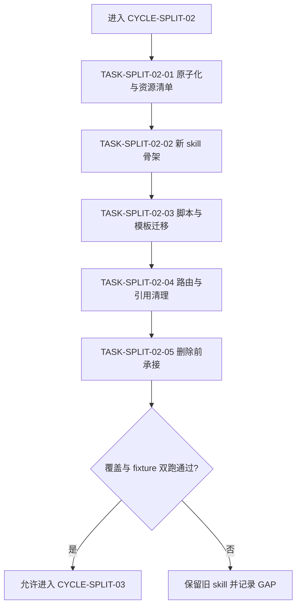

# 实施周期 02：规则文件与项目记忆自举

结论：本周期将 `project-agents-bootstrap` 按触发对象二分为规则文件自举与项目记忆文件自举两个独立入口；影响：规则文件同步和四件套维护不再由一个超大入口共同解释；范围：原子规则、脚本主 owner、新 skill 骨架、fixture 双跑和删除前承接；非范围：不修改其他候选 skill，不改变业务项目规则含义，不删除旧 skill 直到本周期全部门禁通过；变化：旧入口从 active 转为冻结基线，两个新入口完成全量承接后才允许下线；完成标准：五项任务逐个完成四项闭环，并通过旧/新行为对照；术语说明：四件套指 `PROJECT_CURRENT.md`、`PROJECT_MEMORY.md`、`PROJECT_HISTORY.md` 和 `PROJECT_STYLE.md`；验证状态：计划草案，等待用户 review。

## 当前周期目标

- 周期 ID / 期次定位：`CYCLE-SPLIT-02` / 第二期：规则自举。
- 只做这一件事：完成 `project-agents-bootstrap` 的职责二分和承接计划。
- 对应文档：[`实施总览`](2026-07-16_114619_Skill体积治理与拆分_实施总览.md)、[`周期 01`](2026-07-16_114619_Skill体积治理与拆分_实施周期01_预算与候选冻结.md)、[`验收标准`](../7-验收/2026-07-16_114619_Skill体积治理与拆分_验收标准.md)。
- 本周期不做：`skill-compliance-gate-rules` 及其他候选的拆分；旧 skill 删除前不得刷新最终字典入口。

## 周期图片资产决策与边界

- 图片资产决策：`N/A + 原因 + 证据`：本周期验证规则文件和四件套文本同步，不需要 UI、截图或视觉产物。
- Mermaid 边界：职责依赖、fixture 双跑、删除门禁使用 Mermaid；图片不替代规则映射或命中验证。
- 未来 imagegen：`N/A + 原因 + 证据`：本周期没有原创位图输入；若 Godot 配置模板在未来资产任务中被调用，由 `imagegen` 负责真实生图链路。

## 周期图片资产清单

| 图片 ID | 用途 / 生成输入 | 来源 | 相对路径 | 版本 | 关联 REQ/RULE / AC / CYCLE / TASK | 引用章节 | 敏感状态 | 版权状态 |
|---|---|---|---|---|---|---|---|---|
| 不适用：依据本周期范围，无图片资产 | 不适用：依据规则文件验证范围，无图片输入 | 不适用：依据范围，无图片来源 | 不适用：依据范围，无图片路径 | 不适用：依据范围，无版本 | `REQ-SKILL-SPLIT-003` / `CYCLE-SPLIT-02` | 不适用：依据范围，无图片引用章节 | 不适用：依据范围，无图片敏感信息 | 不适用：依据范围，无图片版权对象 |

## 进入条件与收口条件

| 类型 | 条件 | 证据/命令 | 状态 |
|---|---|---|---|
| 进入 | CYCLE-SPLIT-01 的三个任务均已完成四项闭环 | 周期 01 验证矩阵和 `EVD-TASK-SPLIT-01-*-*` | planned |
| 进入 | 旧 `project-agents-bootstrap` 已建立冻结基线清单 | `project-agents-bootstrap/SKILL.md`、`agents/openai.yaml`、`scripts/bootstrap_agents.sh` 的 MD5 和字节报告 | planned |
| 收口 | 两个新 skill 的 description、agents 和边界独立 | `TEST-SPLIT-004` 与 `TEST-SPLIT-005` | planned |
| 收口 | 脚本 fixture 首次生成和重复同步结果等价，旧入口不再是唯一主入口 | `TEST-SPLIT-006`、`TEST-SPLIT-007` | planned |

图形目的：说明本周期必须先完成规则原子化，再建立骨架、迁移脚本、清理引用，最后执行删除前承接检查。关联 ID：`CYCLE-SPLIT-02`、`TASK-SPLIT-02-01` 至 `TASK-SPLIT-02-05`。

## 当前代码/文档基线

- 分支 / 提交：`40cae893706639eb2323328f84b70b1c3aba66d9`；旧 skill 状态为 `active`，进入本周期后只允许作为冻结对照基线。
- 已核实文件和符号：`project-agents-bootstrap/SKILL.md`、`project-agents-bootstrap/agents/openai.yaml`、`project-agents-bootstrap/scripts/bootstrap_agents.sh`；脚本参数为 `--repo`、`--target codex|claude|both`。
- 依赖版本与 local 配置：Git Bash、Python、PowerShell 7 和本地临时 fixture；不连接外部环境。
- 与计划不一致时的停止规则：发现脚本写入四件套和规则文件存在第二个 owner、原子规则无法分类或新 description 仍需旧上下文才能理解，立即记录 `GAP-SKILL-003` 并停止。

## 周期内最小任务执行顺序

| 顺序 | 任务 ID | 唯一目标 | 前置依赖 | 允许文件 | 禁止触碰区 | 状态 |
|---:|---|---|---|---|---|---|
| 1 | `TASK-SPLIT-02-01` | 原子化旧 skill 规则、特例和资源 | CYCLE-SPLIT-01 收口 | `doc/5-tests/2026-07-17_155229/skill-split-validation/mapping/bootstrap-rules.yaml`、基线报告 | 新 skill、旧 skill、脚本实现 | done |
| 2 | `TASK-SPLIT-02-02` | 建立两个新 skill 的独立骨架 | TASK-SPLIT-02-01 通过 | `project-rule-file-bootstrap-rules/`、`project-memory-file-bootstrap-rules/` | 旧 skill 正文和其他候选 skill | done |
| 3 | `TASK-SPLIT-02-03` | 迁移脚本、模板和四件套写集 | TASK-SPLIT-02-02 通过 | `project-agents-bootstrap/scripts/bootstrap_agents.sh`、两个新 skill references | 业务项目文件和非本周期规则 | done |
| 4 | `TASK-SPLIT-02-04` | 更新路由、引用、README 和字典源 | TASK-SPLIT-02-03 双跑通过 | `AGENTS.md`、`CLAUDE.md`、`README.md`、`编码skill.md`、`项目设计.md`、`skill-dictionary/` | 旧 skill 内容、无关规则和 Git 历史 | done |
| 5 | `TASK-SPLIT-02-05` | 完成删除前承接与回滚判断 | TASK-SPLIT-02-04 引用清理通过 | 映射、测试 README、删除检查记录 | 旧 skill 删除动作本身，除非所有门禁通过 | done |
| 6 | `TASK-SPLIT-02-06` | 执行真实删除并修复脚本迁移缺口 | TASK-SPLIT-02-05 门禁通过 + 用户明确授权 | 旧 skill 目录（删除）、`project-rule-file-bootstrap-rules/scripts/bootstrap_agents.sh`（新增）、两个新 skill 及 9 个外部 skill 的路径引用 | 无关 skill、Git 历史 | done |

## 文件与符号操作契约

| 任务 | 文件路径 | 符号/区段 | 操作 | 修改前职责 | 修改后职责 | 调用方影响 | 兼容要求 |
|---|---|---|---|---|---|---|---|
| `TASK-SPLIT-02-01` | `project-agents-bootstrap/SKILL.md`、`bootstrap_agents.sh`、`agents/openai.yaml` | 所有触发、阻断、通过和资源章节 | 只读原子化 | 一个混合入口 | 形成 A/B 规则映射，不改语义 | 后续新 skill 读取映射 | 特例和历史兼容全部保留 |
| `TASK-SPLIT-02-02` | `project-rule-file-bootstrap-rules/SKILL.md`、`project-memory-file-bootstrap-rules/SKILL.md` | frontmatter description、触发条件、边界 | 新增 | 无 | A 负责 AGENTS/CLAUDE；B 负责四件套 | 自动触发入口增加两个 | 名称不依赖旧 skill 前缀 |
| `TASK-SPLIT-02-03` | `bootstrap_agents.sh` 与 references | `--repo`、`--target`、四件套写入函数 | 迁移/重组 | 一个脚本直接承担全部写集 | 规则文件 owner 调用记忆 owner，禁止双写 | fixture 输出应等价 | 首次和重复同步幂等 |
| `TASK-SPLIT-02-04` | `AGENTS.md`、`CLAUDE.md`、`README.md`、`编码skill.md`、`项目设计.md`、字典源 | skill 路由和索引 | 修改 | 旧 skill 为主入口 | 新入口为主入口，旧入口仅冻结引用 | 命中和阅读路径更新 | 不删除历史证据 |
| `TASK-SPLIT-02-05` | mapping、README、删除检查记录 | 删除前承接状态 | 新增/审查 | 未证明承接 | 明确主承接、次承接、删除条件和回滚 | 只有检查通过才允许删除 | 覆盖率 100% 是硬门槛 |
| `TASK-SPLIT-02-06` | 旧 5 个 skill 目录、`bootstrap_agents.sh`、两个新 skill 文档、9 个外部 skill 引用、`项目设计.md` | 物理脚本位置、AGENTS/CLAUDE 模板正文（`BODY_SKILL_HIT`/`BODY_CONTEXT_COMPRESS`） | 删除 + 迁移 + 改写 | 脚本仍在已删除的旧目录路径下 | 脚本迁移至 `project-rule-file-bootstrap-rules/scripts/`，全部引用与模板正文同步 | 未来自举生成的 AGENTS/CLAUDE 不再写入旧 skill 名 | MD5/字节数/语法三重校验 |

## 最小任务闭环

### `TASK-SPLIT-02-01`：原子化与资源清单

- 唯一目标：为旧 skill 的每条 MUST/默认/阻断/通过/不得规则、特例和资源分配唯一 ID，并分到规则文件组或记忆文件组。
- 允许文件：`doc/5-tests/2026-07-17_155229/skill-split-validation/mapping/bootstrap-rules.yaml` 和冻结基线报告。
- 实施步骤与验证点：读取 `SKILL.md`、`agents/openai.yaml`、`bootstrap_agents.sh`；按章节生成 `R-*-*`；标记特例；登记脚本函数和模板资源；写主落点、组合覆盖和迁移动作；执行 `python -X utf8 "doc/5-tests/2026-07-17_155229/skill-split-validation/validate_skill_split.py" --mode mapping --mapping "doc/5-tests/2026-07-17_155229/skill-split-validation/mapping/bootstrap-rules.yaml"`。
- 失败预期：任一规则无唯一 ID、特例遗漏、脚本资源未登记、主承接不唯一或迁移动作无法判定时失败。
- 清理：保留 mapping 作为冻结证据，删除中间解析输出。
- 回滚：删除本任务新增 mapping，旧 skill 继续 active/frozen 基线不变。
- 完成条件：`TEST-SPLIT-004` 通过，覆盖率 100%，四类 `EVD-TASK-SPLIT-02-01-*` 证据已登记。
- 停止条件：发现职责并列不足、继续拆分会导致命中数超过 3 或脚本写集无法拆分，回到候选复评并不进入骨架任务。
- 最大推进边界：只允许进入 TASK-SPLIT-02-02，不修改 skill 资产。

### `TASK-SPLIT-02-02`：新 skill 骨架

- 唯一目标：建立 `project-rule-file-bootstrap-rules` 和 `project-memory-file-bootstrap-rules` 两个独立 description、agents 元信息和最小 SKILL 入口。
- 允许文件：两个新目录的 `SKILL.md`、`agents/openai.yaml` 和直接 references。
- 实施步骤与验证点：先写完整 description；从 description 反推名称；分别写触发对象、主责、非主责、通过和阻断；运行 skill 结构检查；执行正向和相邻反向触发样本。
- 失败预期：名称机械沿用旧前缀、一个新 skill 需要另一个新 skill 才能解释核心职责、命中数超过 3 或 description 抢占相邻入口时失败。
- 清理：失败时删除两个新目录，保留旧 skill 和 mapping。
- 回滚：恢复旧 skill active/frozen 状态，回到原子化任务。
- 完成条件：`TEST-SPLIT-005` 通过，两个新 skill 的四类 `EVD-TASK-SPLIT-02-02-*` 证据已登记。
- 停止条件：描述边界不能独立、自动触发不稳定或 references 路由无法分组。
- 最大推进边界：只允许进入 TASK-SPLIT-02-03，不更新仓库主入口。

### `TASK-SPLIT-02-03`：脚本与模板迁移

- 唯一目标：让规则文件 owner 与记忆文件 owner 的写集唯一，且 `bootstrap_agents.sh --target both` 在 local fixture 上前后结果等价。
- 允许文件：`project-agents-bootstrap/scripts/bootstrap_agents.sh`、两个新 skill references、`doc/5-tests/2026-07-17_155229/skill-split-validation/cases/bootstrap/`。
- 实施步骤与验证点：运行 `& 'C:\Program Files\Git\bin\bash.exe' -n project-agents-bootstrap/scripts/bootstrap_agents.sh`；在空 fixture 上运行 `bash project-agents-bootstrap/scripts/bootstrap_agents.sh --repo "doc/5-tests/2026-07-17_155229/skill-split-validation/cases/bootstrap/first" --target both`；复制同一 fixture 再运行第二次；比较 AGENTS/CLAUDE 与四件套内容哈希和字节数。
- 失败预期：bash 语法失败、首次生成缺文件、第二次重复追加、两个 owner 同时写同一文件或 UTF-8 漂移时失败。
- 清理：删除两个 fixture 目录和临时哈希报告，保留脱敏对照证据。
- 回滚：恢复旧脚本，删除新 references 和 fixture，不删除旧 skill。
- 完成条件：`TEST-SPLIT-006`、`TEST-SPLIT-007` 通过，四类 `EVD-TASK-SPLIT-02-03-*` 证据已登记。
- 停止条件：脚本主 owner 不唯一、任何生成文件内容不等价或清理失败。
- 最大推进边界：只允许进入 TASK-SPLIT-02-04，不刷新最终字典。

### `TASK-SPLIT-02-04`：路由与引用清理

- 唯一目标：把新 skill 作为规则文件和项目记忆的主入口，清除旧 skill 的唯一入口依赖。
- 允许文件：`AGENTS.md`、`CLAUDE.md`、`README.md`、`编码skill.md`、`项目设计.md`、`skill-dictionary/` 生成源和测试 README。
- 实施步骤与验证点：扫描旧 skill 引用；按主责改写路由；保留冻结基线历史说明；运行 `python -X utf8 skill-dictionary/generate_dictionary.py`；再检查所有引用和字典生成结果。
- 失败预期：旧 skill 仍是唯一入口、引用指向不存在目录、字典与源目录不一致或写入非本任务文件时失败。
- 清理：保留生成字典结果；删除测试扫描临时文件。
- 回滚：恢复路由和索引源文件，保留新 skill 目录但不宣称可用，回到 TASK-SPLIT-02-03。
- 完成条件：`TEST-SPLIT-008` 通过，四类 `EVD-TASK-SPLIT-02-04-*` 证据已登记。
- 停止条件：出现悬空引用、字典生成失败或产生无关改动。
- 最大推进边界：只允许进入 TASK-SPLIT-02-05，不删除旧 skill。

### `TASK-SPLIT-02-05`：删除前承接

- 唯一目标：在不删除旧 skill 的前提下完成删除前承接检查、回滚点和 post-delete 测试清单。
- 允许文件：`mapping/bootstrap-rules.yaml`、测试 README、删除检查记录和触发输出。
- 实施步骤与验证点：核对规则/特例/资源覆盖率 100%；核对两个新 skill 主次承接；执行 pre-delete 正反样本；复核字典和引用；写 post-delete 重跑命令和删除动作前置条件。
- 失败预期：任一映射、触发、引用、字典或主承接检查失败时保持旧 skill，不允许删除。
- 清理：保留删除前检查材料和失败证据，删除临时输出。
- 回滚：回到 TASK-SPLIT-02-01，旧 skill 保持冻结；不执行删除动作。
- 完成条件：`TEST-SPLIT-009` 通过，`EVD-TASK-SPLIT-02-05-*` 证据齐全，周期状态仍为 `comparing`，等待用户明确实施收口。
- 停止条件：规则丢失、触发漂移、资源悬空、旧入口仍承担独有职责或 post-delete 无法复验。
- 最大推进边界：本周期完成后停止，只有用户授权且删除前门禁通过才可进入旧 skill 删除动作。

### `TASK-SPLIT-02-06`：真实删除执行与脚本迁移补漏

- 唯一目标：在获得用户明确授权（“可以删除”）后执行真实删除，并修复因 `bootstrap_agents.sh` 未随删除迁移而产生的功能性断链，同步修正 AGENTS.md/CLAUDE.md 受管章节正文中的旧 skill 名。
- 允许文件：5 个旧 skill 目录（删除）、`project-rule-file-bootstrap-rules/scripts/bootstrap_agents.sh`（新增，从 Git HEAD 恢复后迁移）、两个新 skill 的 `SKILL.md`/`agents/openai.yaml`/references 模板、9 个外部 skill（`godot-project-bootstrap-rules`、`skill-hit-check-rules`、`mcp-installation-rules`、`windows-wsl-execution-rules`、`project-style-rules`、`context-compression-rules`、`micro-business-architecture-rules` 及其 references）、`项目设计.md`。
- 实施步骤与验证点：复核 5 个旧 skill 的 MD5/字节数与 mapping 基线一致 -> 删除 5 个旧目录 -> 重跑字典生成脚本 -> 重跑 `post-delete` 回归（4/5 通过，`bootstrap` fixture 缺 `post-delete` 阶段用例属既有缺口，记录不回填）-> 发现 `bootstrap_agents.sh` 是两个新 skill 的唯一真实执行入口且从未随迁移落地 -> `git checkout HEAD` 精确恢复该文件 -> 复制到 `project-rule-file-bootstrap-rules/scripts/` 并 MD5 校验一致 -> 再次删除旧目录 -> `wsl.exe bash -n` 语法校验 -> 修复脚本内 5 处、两个新 skill 文档内 15 处、9 个外部 skill 内 12 处、`项目设计.md` 内 2 处旧路径引用 -> 重跑字典与 `pre-delete` fixture 确认无回归。
- 失败预期：MD5/字节数与基线不一致、删除后仍有活跃引用指向已删除目录、脚本迁移后语法失败或字典/回归重跑非零退出时失败。
- 清理：无临时文件残留；`_tmp_*.py`/`_tmp_*.ps1` 均在执行后立即删除。
- 回滚：`git checkout HEAD -- project-agents-bootstrap/` 可完整恢复旧目录（仍在 Git 历史中，尚未提交本轮改动）；`project-rule-file-bootstrap-rules/scripts/bootstrap_agents.sh` 可直接删除以回退迁移。
- 完成条件：证据 [`TASK-SPLIT-02-06-real-delete-and-script-migration.md`](../5-tests/2026-07-17_155229/skill-split-validation/evidence/TASK-SPLIT-02-06-real-delete-and-script-migration.md) 已登记；字典重跑、语法校验、`pre-delete` 回归均通过。
- 停止条件：若脚本迁移后语法或功能出现无法修复的回归，应立即回滚并保留旧目录不删除。
- 最大推进边界：本任务完成后 `CYCLE-SPLIT-02` 收口为 `done`，不再进入下一动作，除非用户提出新任务。

## 真实测试与断言

| 测试 ID | 对应任务 | 精确命令 | local 依赖 | fixture/数据 | 断言 | 失败预期 | 清理 |
|---|---|---|---|---|---|---|---|
| `TEST-SPLIT-004` | `TASK-SPLIT-02-01` | `python -X utf8 "doc/5-tests/2026-07-17_155229/skill-split-validation/validate_skill_split.py" --mode mapping --mapping "doc/5-tests/2026-07-17_155229/skill-split-validation/mapping/bootstrap-rules.yaml"` | 当前 skill 目录 | 旧 SKILL、agents、脚本 | 原子规则、特例、脚本资源覆盖 100% | 任一对象无主落点 | 保留失败 mapping |
| `TEST-SPLIT-005` | `TASK-SPLIT-02-02` | `pwsh -NoProfile -File "doc/5-tests/2026-07-17_155229/skill-split-validation/run_trigger_cases.ps1" -Phase pre-delete -CasesRoot "doc/5-tests/2026-07-17_155229/skill-split-validation/cases/bootstrap"` | PowerShell 7、Codex 触发样本 | 规则文件、记忆文件、相邻入口正反样本 | 正向全命中，反向不抢入口，平均命中不超过 3 | 漏命中、误命中或命中数超限 | 删除临时触发输出 |
| `TEST-SPLIT-006` | `TASK-SPLIT-02-03` | `& 'C:\Program Files\Git\bin\bash.exe' -n project-agents-bootstrap/scripts/bootstrap_agents.sh` | Git Bash | 当前脚本 | bash 语法退出码为 0 | 语法或编码错误 | 无 |
| `TEST-SPLIT-007` | `TASK-SPLIT-02-03` | `bash project-agents-bootstrap/scripts/bootstrap_agents.sh --repo "doc/5-tests/2026-07-17_155229/skill-split-validation/cases/bootstrap/first" --target both`；对 second fixture 重复执行 | Git Bash、local 临时目录 | 空仓库 fixture | 首次和重复运行产出字节数、哈希和章节集合一致 | 生成缺失、重复追加或写集冲突 | 删除 first/second fixture |
| `TEST-SPLIT-008` | `TASK-SPLIT-02-04` | `python -X utf8 skill-dictionary/generate_dictionary.py` 并执行旧入口引用扫描 | Python、本地源目录 | 目录、字典源、README | 生成物与源目录一致，旧入口无唯一引用 | 生成失败或悬空引用 | 删除扫描输出 |
| `TEST-SPLIT-009` | `TASK-SPLIT-02-05` | `pwsh -NoProfile -File "doc/5-tests/2026-07-17_155229/skill-split-validation/run_trigger_cases.ps1" -Phase pre-delete -CasesRoot "doc/5-tests/2026-07-17_155229/skill-split-validation/cases/bootstrap"` | PowerShell 7、冻结旧目录 | 删除前样本 | 覆盖 100%、主次承接、字典和引用均通过 | 任一门禁失败 | 保留失败证据，不删除旧 skill |

## 回滚与停止条件

- `ROLLBACK-SKILL-SPLIT-02`：先恢复路由与字典源，再恢复脚本和 references，最后删除未通过的新 skill 骨架；旧 `project-agents-bootstrap` 始终保留为冻结基线。
- 停止条件：规则映射不全、description 不能独立理解、脚本双写、fixture 不幂等、UTF-8 漂移、触发边界漂移、字典或引用失败。
- 恢复路径：规则缺口回到 TASK-SPLIT-02-01；description 缺口回到 TASK-SPLIT-02-02；脚本失败回到 TASK-SPLIT-02-03；引用失败回到 TASK-SPLIT-02-04；删除前失败停留在 TASK-SPLIT-02-05。
- 当前 agent 最大推进边界：本周期最多进入 `comparing`，不自动删除旧 skill，不自动刷新无关字典，不写 Git 历史。

## 当前周期验证矩阵

| 任务 | 实现/落盘证据 | 真实测试证据 | 审查证据 | 验收证据 | 当前状态 |
|---|---|---|---|---|---|
| `TASK-SPLIT-02-01` | `EVD-TASK-SPLIT-02-01-IMPL` | `EVD-TASK-SPLIT-02-01-TEST` / `TEST-SPLIT-004`（通过） | `EVD-TASK-SPLIT-02-01-REVIEW` | `EVD-TASK-SPLIT-02-01-ACCEPT` / `AC-SKILL-SPLIT-003` | done |
| `TASK-SPLIT-02-02` | `EVD-TASK-SPLIT-02-02-IMPL` | `EVD-TASK-SPLIT-02-02-TEST` / `TEST-SPLIT-005`（通过） | `EVD-TASK-SPLIT-02-02-REVIEW` | `EVD-TASK-SPLIT-02-02-ACCEPT` / `AC-SKILL-SPLIT-004` | done |
| `TASK-SPLIT-02-03` | `EVD-TASK-SPLIT-02-03-IMPL` | `EVD-TASK-SPLIT-02-03-TEST` / `TEST-SPLIT-006`、`TEST-SPLIT-007`（通过） | `EVD-TASK-SPLIT-02-03-REVIEW` | `EVD-TASK-SPLIT-02-03-ACCEPT` / `AC-SKILL-SPLIT-006` | done |
| `TASK-SPLIT-02-04` | `EVD-TASK-SPLIT-02-04-IMPL` | `EVD-TASK-SPLIT-02-04-TEST` / `TEST-SPLIT-008`（通过） | `EVD-TASK-SPLIT-02-04-REVIEW` | `EVD-TASK-SPLIT-02-04-ACCEPT` / `AC-SKILL-SPLIT-007` | done |
| `TASK-SPLIT-02-05` | `EVD-TASK-SPLIT-02-05-IMPL` | `EVD-TASK-SPLIT-02-05-TEST` / `TEST-SPLIT-009`（通过） | `EVD-TASK-SPLIT-02-05-REVIEW` | `EVD-TASK-SPLIT-02-05-ACCEPT` / `AC-SKILL-SPLIT-007`（delete 已获授权并执行，见 TASK-SPLIT-02-06） | done |
| `TASK-SPLIT-02-06` | `TASK-SPLIT-02-06-real-delete-and-script-migration.md` | 字典重跑 + `wsl bash -n` + `pre-delete` 回归（均通过） | 本节自审 | `AC-SKILL-SPLIT-007`（旧 skill 已删除，脚本迁移与引用修复完成） | done |

## 周期追踪矩阵

| `REQ-*` / `RULE-*` | `AC-*` | `TASK-*` | 文件/符号 | `TEST-*` | `EVIDENCE-*` | 闭环状态 |
|---|---|---|---|---|---|---|
| `REQ-SKILL-SPLIT-003` | `AC-SKILL-SPLIT-003` | `TASK-SPLIT-02-01` | 旧 SKILL、脚本、agents、`bootstrap-rules.yaml` | `TEST-SPLIT-004` | `EVIDENCE-SKILL-MAPPING-20260716`、`EVD-TASK-SPLIT-02-01-*` | done |
| `REQ-SKILL-SPLIT-003` | `AC-SKILL-SPLIT-004` | `TASK-SPLIT-02-02` | 两个新 `SKILL.md` 与 agents | `TEST-SPLIT-005` | `EVIDENCE-SKILL-ROLE-20260716`、`EVD-TASK-SPLIT-02-02-*` | done |
| `REQ-SKILL-SPLIT-004` | `AC-SKILL-SPLIT-006` | `TASK-SPLIT-02-03` | `bootstrap_agents.sh` 与 fixture | `TEST-SPLIT-006`、`TEST-SPLIT-007` | `EVIDENCE-SKILL-BASELINE-20260716`、`EVD-TASK-SPLIT-02-03-*` | done |
| `REQ-SKILL-SPLIT-005` | `AC-SKILL-SPLIT-007` | `TASK-SPLIT-02-04`、`TASK-SPLIT-02-05`、`TASK-SPLIT-02-06` | 路由、字典、mapping、删除前检查、真实删除、脚本迁移 | `TEST-SPLIT-008`、`TEST-SPLIT-009` | `EVIDENCE-SKILL-DELETE-20260716`、`EVD-TASK-SPLIT-02-04-*`、`EVD-TASK-SPLIT-02-05-*`、`TASK-SPLIT-02-06-real-delete-and-script-migration.md` | done（旧 skill 已删除，脚本已迁移，全部路由与模板正文已修正） |

## 自审结论

- 每个任务是否只承载一个目标：是；原子化、骨架、迁移、引用和删除前检查分开。
- 是否按实现 -> 真实测试 -> 审查 -> 验收逐个闭环：是；五个任务各自有测试和 `EVD-*` 四类证据槽位。
- 是否存在未决决策或模糊落点：否；脚本主 owner、四件套 owner 和旧 skill 删除门禁均已写明。
- 图形、表格和正文是否一致：是；五个任务、依赖顺序和下一周期入口一致。

## 执行附录

- local 环境：仅仓库、Git Bash、Python、PowerShell 7 和 `doc/5-tests/2026-07-17_155229/skill-split-validation/cases/bootstrap/` 临时 fixture。
- 清理：删除 first/second fixture、触发输出和中间哈希；保留 mapping、对照报告和正式审查证据。
- 回滚：任何任务失败先按 `ROLLBACK-SKILL-SPLIT-02` 反向恢复；旧 skill 目录不得先删。

## 追踪附录

- 来源回指：`SRC-SKILL-SPLIT-20260716` -> [`REQ-SKILL-SPLIT-20260716`](../2-需求/2026-07-16_114619_Skill体积治理与拆分.md) -> [`AC-SKILL-SPLIT-20260716`](../7-验收/2026-07-16_114619_Skill体积治理与拆分_验收标准.md) -> `CYCLE-SPLIT-02`。
- 新 skill 候选：`project-rule-file-bootstrap-rules` 与 `project-memory-file-bootstrap-rules`；命名由各自 description 的触发对象和职责焦点反推。
- 删除状态：用户在本轮明确授权删除（“可以删除”）。旧 `project-agents-bootstrap` 已真实删除，`bootstrap_agents.sh` 已迁移至 `project-rule-file-bootstrap-rules/scripts/` 并通过 MD5/语法双重校验，两个新 skill 及 9 个外部 skill 的活跃引用、AGENTS.md/CLAUDE.md 受管章节正文（`BODY_SKILL_HIT`/`BODY_CONTEXT_COMPRESS`）均已同步修正，详见 `evidence/TASK-SPLIT-02-06-real-delete-and-script-migration.md`。`CYCLE-SPLIT-02` 至此完整收口为 `done`。
