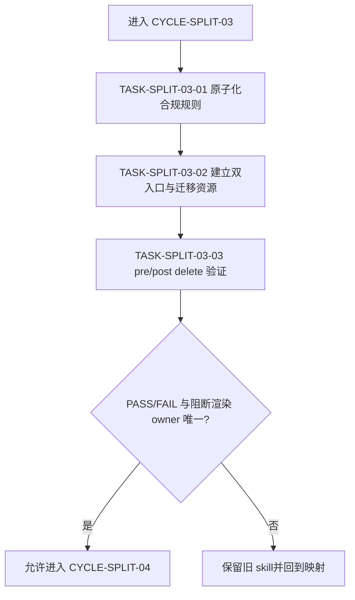

# 实施周期 03：技能合规与代码收口

结论：本周期把“skill 链是否完整合规”和“代码改动是否完成最终收口”拆成两个平级入口；影响：链路完整性、失败路由、注释/实现审查和最终 PASS/FAIL 不再混在一个大 skill 中；范围：规则原子化、资源迁移、唯一 owner、触发和删除前承接；非范围：不改变 `reasoning-summary-structure-rules` 的用户可见阻断渲染职责，不修改业务代码；变化：执行合规由 `skill-execution-compliance-gate-rules` 承接，代码收口由 `code-change-finalization-gate-rules` 承接；完成标准：三个任务逐个完成四项闭环并证明旧规则零丢失；术语说明：最终收口是实现审查、项目改动审查、文档落盘和 PASS/FAIL 汇聚的阶段；验证状态：计划草案，等待用户 review。

## 当前周期目标

- 周期 ID / 期次定位：`CYCLE-SPLIT-03` / 第三期：合规收口。
- 只做这一件事：拆分 `skill-compliance-gate-rules` 的执行合规和代码变更收口职责。
- 对应文档：[`实施总览`](2026-07-16_114619_Skill体积治理与拆分_实施总览.md)、[`周期 02`](2026-07-16_114619_Skill体积治理与拆分_实施周期02_规则文件与项目记忆自举.md)、[`验收标准`](../7-验收/2026-07-16_114619_Skill体积治理与拆分_验收标准.md)。
- 本周期不做：项目 release-test、浏览器、2D asset 和实施规划 skill 的拆分。

## 周期图片资产决策与边界

- 图片资产决策：`N/A + 原因 + 证据`：本周期只验证规则链、状态和收口报告，不涉及 UI 或视觉产物。
- Mermaid 边界：owner 路由和 PASS/FAIL 状态用 Mermaid，图片不替代状态和依赖表达。

## 周期图片资产清单

| 图片 ID | 用途 / 生成输入 | 来源 | 相对路径 | 版本 | 关联 REQ/RULE / AC / CYCLE / TASK | 引用章节 | 敏感状态 | 版权状态 |
|---|---|---|---|---|---|---|---|---|
| 不适用：依据本周期范围，无图片资产 | 不适用：依据规则验证范围，无图片输入 | 不适用：依据范围，无图片来源 | 不适用：依据范围，无图片路径 | 不适用：依据范围，无版本 | `REQ-SKILL-SPLIT-003` / `CYCLE-SPLIT-03` | 不适用：依据范围，无图片引用章节 | 不适用：依据范围，无图片敏感信息 | 不适用：依据范围，无图片版权对象 |

## 进入条件与收口条件

| 类型 | 条件 | 证据/命令 | 状态 |
|---|---|---|---|
| 进入 | 周期 02 已完成规则文件自举的四项闭环，或明确保留旧入口并记录阻断 | 周期 02 验证矩阵 | planned |
| 进入 | `skill-compliance-gate-rules/SKILL.md`、`agents/openai.yaml` 和两份 references 可读取 | MD5、字节和 UTF-8 回读 | planned |
| 收口 | 合规链和代码收口两个新 skill 的职责、description、资源和 owner 均独立 | `TEST-SPLIT-010`、`TEST-SPLIT-011` | planned |
| 收口 | reasoning-summary 仍是用户可见阻断的唯一渲染 owner | `TEST-SPLIT-012`、删除前检查 | planned |

图形目的：说明合规执行与代码收口先分组，再建立两个入口，最后由唯一渲染 owner 汇聚结果。关联 ID：`CYCLE-SPLIT-03`、`TASK-SPLIT-03-01` 至 `TASK-SPLIT-03-03`。

## 当前代码/文档基线

- 分支 / 提交：`40cae893706639eb2323328f84b70b1c3aba66d9`；旧 `skill-compliance-gate-rules` 只作冻结对照。
- 已核实文件和符号：`skill-compliance-gate-rules/SKILL.md`、`agents/openai.yaml`、`references/applicability-and-gap-check.md`、`references/next-step-suggestion-template.md`。
- 依赖版本与 local 配置：Python、PowerShell 7、本地触发样本和文档 validator；不连接业务环境。
- 与计划不一致时的停止规则：发现 `reasoning-summary-structure-rules` 的阻断渲染 owner 被复制、PASS/FAIL 结果出现两个主写集或规则无法归类，记录 `GAP-SKILL-008` 并停止。

## 周期内最小任务执行顺序

| 顺序 | 任务 ID | 唯一目标 | 前置依赖 | 允许文件 | 禁止触碰区 | 状态 |
|---:|---|---|---|---|---|---|
| 1 | `TASK-SPLIT-03-01` | 原子化链完整性、失败路由和代码收口规则 | 周期 02 收口 | `doc/5-tests/2026-07-17_155229/skill-split-validation/mapping/compliance-rules.yaml` | 新 skill 和旧 SKILL 内容 | done |
| 2 | `TASK-SPLIT-03-02` | 建立执行合规与代码收口两个新 skill | TASK-SPLIT-03-01 通过 | 两个新 skill 的 SKILL、agents、references | reasoning-summary、其他审查 skill | done |
| 3 | `TASK-SPLIT-03-03` | 完成 pre/post delete、owner 和引用验证 | TASK-SPLIT-03-02 通过 | 触发样本、mapping、字典和引用报告 | 旧 skill 删除动作 | done |
| 4 | `TASK-SPLIT-03-04` | 更新路由、引用、README 和字典源 | TASK-SPLIT-03-03 删除前检查通过 | `AGENTS.md`、`CLAUDE.md`、`README.md`、`编码skill.md`、`项目设计.md`、`skill-dictionary/`及 15 处交叉引用 skill | 旧 skill 内容、无关规则和 Git 历史 | done |

## 文件与符号操作契约

| 任务 | 文件路径 | 符号/区段 | 操作 | 修改前职责 | 修改后职责 | 调用方影响 | 兼容要求 |
|---|---|---|---|---|---|---|---|
| `TASK-SPLIT-03-01` | 旧 SKILL、两份 references、`mapping/compliance-rules.yaml` | 触发、阻断、通过、失败回流 | 只读原子化 | 链完整性与代码收口混合 | 形成合规组和代码组映射 | 后续新入口读取 | 原语义和阻断强度不变 |
| `TASK-SPLIT-03-02` | `skill-execution-compliance-gate-rules/`、`code-change-finalization-gate-rules/` | description、owner、PASS/FAIL | 新增/迁移 | 一个混合入口 | 合规链与代码收口平级 | 命中边界变窄 | reasoning-summary 仍唯一渲染 |
| `TASK-SPLIT-03-03` | 触发样本、字典、引用报告 | pre-delete/post-delete | 验证/清理 | 旧入口主导 | 新入口独立，旧入口待删除 | 旧入口不再承担独有规则 | 删除前覆盖率 100% |
| `TASK-SPLIT-03-04` | `AGENTS.md`、`CLAUDE.md`、`README.md`、`编码skill.md`、`项目设计.md`、字典源及 15 处交叉引用 skill | skill 路由和索引 | 修改 | 旧 skill 为主入口 | 新入口为主入口，旧入口仅冻结引用 | 命中和阅读路径更新 | 不删除历史证据 |

## 最小任务闭环

### `TASK-SPLIT-03-01`：原子化合规规则

- 唯一目标：为旧 skill 的链完整性、失败路由、用户手改、实现审查、最终汇聚和状态收口规则建立唯一映射。
- 允许文件：`doc/5-tests/2026-07-17_155229/skill-split-validation/mapping/compliance-rules.yaml` 与冻结清单。
- 实施步骤与验证点：逐节生成 `R-*-*`；将 `applicability-and-gap-check.md` 归合规组；将 `next-step-suggestion-template.md` 按渲染 owner 关系归档；标记与 `reasoning-summary-structure-rules` 的组合覆盖；运行 mapping validator。
- 失败预期：规则被弱化、一个规则没有主落点、两个 owner 都写最终状态或特例未登记时失败。
- 清理：保留映射和审查证据，删除中间解析文件。
- 回滚：删除新增 mapping，旧 skill 保持冻结基线。
- 完成条件：`TEST-SPLIT-010` 通过，四类 `EVD-TASK-SPLIT-03-01-*` 证据齐全。
- 停止条件：无法证明两个独立职责组或平均命中超过 3。
- 最大推进边界：只进入 TASK-SPLIT-03-02，不改 skill。

### `TASK-SPLIT-03-02`：建立双入口

- 唯一目标：建立 `skill-execution-compliance-gate-rules` 与 `code-change-finalization-gate-rules`，并保留唯一阻断渲染边界。
- 允许文件：两个新 `SKILL.md`、agents、references 和命中样本。
- 实施步骤与验证点：先分别写 description；再迁移合规链和代码收口规则；在每个 skill 中写“不代替”边界；用正向、反向和组合样本验证命中；检查 PASS/FAIL 只由代码收口入口汇聚，用户可见阻断仍由 reasoning-summary 渲染。
- 失败预期：两个新 skill 互相依赖、description 混合、PASS/FAIL 双写或 reasoning-summary 被替代时失败。
- 清理：失败时删除新目录，保留旧 skill 与 mapping。
- 回滚：恢复旧 skill 作为唯一入口，回到原子化任务。
- 完成条件：`TEST-SPLIT-011` 通过，四类 `EVD-TASK-SPLIT-03-02-*` 证据齐全。
- 停止条件：触发边界漂移、任何一条高优先级规则无落点或新 skill 超预算。
- 最大推进边界：只进入 TASK-SPLIT-03-03，不删除旧 skill。

### `TASK-SPLIT-03-03`：删除前验证

- 唯一目标：完成旧 skill 删除前的覆盖、触发、引用、字典和 owner 检查。
- 允许文件：mapping、触发样本、测试 README、字典输出和引用报告。
- 实施步骤与验证点：执行 pre-delete 正反样本；扫描旧入口依赖；刷新字典并检查生成物；模拟 post-delete 路由；记录删除动作和回滚顺序，但不执行删除。
- 失败预期：覆盖率低于 100%、旧入口仍有独有职责、任一 forbidden 样本误命中或字典生成失败时失败。
- 清理：删除模拟删除目录和临时输出，保留删除前检查材料。
- 回滚：回到 TASK-SPLIT-03-01，旧 skill 保持冻结。
- 完成条件：`TEST-SPLIT-012` 通过，四类 `EVD-TASK-SPLIT-03-03-*` 证据齐全，状态最多为 `comparing`。
- 停止条件：任何删除前条件未通过。
- 最大推进边界：本周期收口后停止，不自动删除旧 skill。

### `TASK-SPLIT-03-04`：路由与引用清理

- 唯一目标：将 `AGENTS.md`/`CLAUDE.md`/`README.md`/`编码skill.md`/`项目设计.md` 及其他 15 处交叉引用 skill 中对 `skill-compliance-gate-rules` 的活跃引用，按 `mapping/compliance-rules.yaml` 的 owner 分组改指两个新 skill，并重跑字典生成脚本。
- 允许文件：`rg -n --fixed-strings "skill-compliance-gate-rules"` 命中的全部活跃引用文件，不包括 `doc/**`、旧 skill 自身目录、新 skill 自身目录和已冻结的 `project-agents-bootstrap` 内部文件。
- 实施步骤与验证点：逐文件按语义改写（执行合规/代码收口分开，不机械替换）；重跑 `python -X utf8 skill-dictionary/generate_dictionary.py` 确认两个新 skill 变为 `implemented`、旧 skill 降为 `seed`；重跑 `run_trigger_cases.ps1 -Phase pre-delete` 与 `-Phase post-delete` 确认回归通过。
- 失败预期：任何活跃引用漏改、字典生成失败、trigger 用例失败或误改历史文档/冻结 skill 内部文件时失败。
- 清理：无临时文件，直接写入仓库。
- 回滚：恢复引用和字典源，旧 `skill-compliance-gate-rules` 保持冻结。
- 完成条件：`TEST-SPLIT-012`（真实路由后重跑）通过，四类 `EVD-TASK-SPLIT-03-04-*` 证据齐全，详见 `evidence/TASK-SPLIT-03-04-routing.md`。
- 停止条件：任何旧依赖未清理完成。
- 最大推进边界：只完成路由切换，不删除旧 skill，不推进周期 04。

## 真实测试与断言

| 测试 ID | 对应任务 | 精确命令 | local 依赖 | fixture/数据 | 断言 | 失败预期 | 清理 |
|---|---|---|---|---|---|---|---|
| `TEST-SPLIT-010` | `TASK-SPLIT-03-01` | `python -X utf8 "doc/5-tests/2026-07-17_155229/skill-split-validation/validate_skill_split.py" --mode mapping --mapping "doc/5-tests/2026-07-17_155229/skill-split-validation/mapping/compliance-rules.yaml"` | 当前 skill 目录 | 原子规则和 references | 覆盖率 100%，组合覆盖有主落点 | 孤立或弱化规则 | 保留失败 mapping |
| `TEST-SPLIT-011` | `TASK-SPLIT-03-02` | `pwsh -NoProfile -File "doc/5-tests/2026-07-17_155229/skill-split-validation/run_trigger_cases.ps1" -Phase pre-delete -CasesRoot "doc/5-tests/2026-07-17_155229/skill-split-validation/cases/compliance"` | PowerShell 7、Codex 触发样本 | 合规/代码收口/相邻审查样本 | 命中职责唯一，reasoning-summary 仍唯一渲染阻断 | 漏命中、抢入口或双 owner | 删除临时输出 |
| `TEST-SPLIT-012` | `TASK-SPLIT-03-03` | `python -X utf8 skill-dictionary/generate_dictionary.py`；再执行 `pwsh -NoProfile -File "doc/5-tests/2026-07-17_155229/skill-split-validation/run_trigger_cases.ps1" -Phase post-delete -CasesRoot "doc/5-tests/2026-07-17_155229/skill-split-validation/cases/compliance"` | Python、PowerShell 7、本地源目录 | 模拟删除后的同一样本 | 旧入口不再被依赖，新入口稳定命中，字典与源一致 | 任何旧依赖或生成失败 | 删除模拟目录，保留报告 |
| `TEST-SPLIT-012`（真实重跑） | `TASK-SPLIT-03-04` | 同上命令，改为在真实完成 25 处活跃引用路由切换后对真实仓库重跑，而非模拟目录 | Python、PowerShell 7、真实仓库源目录 | pre-delete + post-delete 两组全部触发样本 | 两组 6 个 trigger 用例均通过，字典 `implemented_total` 净增 1 | 任何旧依赖、双 owner 或生成失败 | 保留完整输出作为证据 |

## 回滚与停止条件

- `ROLLBACK-SKILL-SPLIT-03`：恢复引用和字典源，删除新 skill 目录和临时样本，旧 `skill-compliance-gate-rules` 保持冻结；reasoning-summary 入口不得回滚为第二 owner。
- 停止条件：规则丢失、PASS/FAIL 双写、触发边界漂移、字典失败、UTF-8 失败或 post-delete 无法复验。
- 恢复路径：原子映射失败回 TASK-SPLIT-03-01；描述/边界失败回 TASK-SPLIT-03-02；删除前验证失败回 TASK-SPLIT-03-03。
- 当前 agent 最大推进边界：只完成对照和删除前检查，不执行旧 skill 删除，不推进周期 04。

## 当前周期验证矩阵

| 任务 | 实现/落盘证据 | 真实测试证据 | 审查证据 | 验收证据 | 当前状态 |
|---|---|---|---|---|---|
| `TASK-SPLIT-03-01` | `EVD-TASK-SPLIT-03-01-IMPL` | `EVD-TASK-SPLIT-03-01-TEST` / `TEST-SPLIT-010`（通过） | `EVD-TASK-SPLIT-03-01-REVIEW` | `EVD-TASK-SPLIT-03-01-ACCEPT` / `AC-SKILL-SPLIT-003` | done |
| `TASK-SPLIT-03-02` | `EVD-TASK-SPLIT-03-02-IMPL` | `EVD-TASK-SPLIT-03-02-TEST` / `TEST-SPLIT-011`（通过） | `EVD-TASK-SPLIT-03-02-REVIEW` | `EVD-TASK-SPLIT-03-02-ACCEPT` / `AC-SKILL-SPLIT-004` | done |
| `TASK-SPLIT-03-03` | `EVD-TASK-SPLIT-03-03-IMPL` | `EVD-TASK-SPLIT-03-03-TEST` / `TEST-SPLIT-012`（通过） | `EVD-TASK-SPLIT-03-03-REVIEW` | `EVD-TASK-SPLIT-03-03-ACCEPT` / `AC-SKILL-SPLIT-007`（delete 未执行，routing 已完成） | done |
| `TASK-SPLIT-03-04` | `EVD-TASK-SPLIT-03-04-IMPL` | `EVD-TASK-SPLIT-03-04-TEST` / `TEST-SPLIT-012`（真实重跑，通过） | `EVD-TASK-SPLIT-03-04-REVIEW` | `EVD-TASK-SPLIT-03-04-ACCEPT` / `AC-SKILL-SPLIT-007`（旧 skill 已删除，post-delete 回归通过） | done |

## 周期追踪矩阵

| `REQ-*` / `RULE-*` | `AC-*` | `TASK-*` | 文件/符号 | `TEST-*` | `EVIDENCE-*` | 闭环状态 |
|---|---|---|---|---|---|---|
| `REQ-SKILL-SPLIT-003` | `AC-SKILL-SPLIT-003` | `TASK-SPLIT-03-01` | 旧 SKILL、references、`compliance-rules.yaml` | `TEST-SPLIT-010` | `EVIDENCE-SKILL-MAPPING-20260716`、`EVD-TASK-SPLIT-03-01-*` | done |
| `REQ-SKILL-SPLIT-003` | `AC-SKILL-SPLIT-004` | `TASK-SPLIT-03-02` | 两个新 SKILL、agents、references | `TEST-SPLIT-011` | `EVIDENCE-SKILL-ROLE-20260716`、`EVD-TASK-SPLIT-03-02-*` | done |
| `REQ-SKILL-SPLIT-004`、`REQ-SKILL-SPLIT-005` | `AC-SKILL-SPLIT-007` | `TASK-SPLIT-03-03` | 触发、字典、引用和删除检查 | `TEST-SPLIT-012` | `EVIDENCE-SKILL-TRIGGER-20260716`、`EVIDENCE-SKILL-DELETE-20260716`、`EVD-TASK-SPLIT-03-03-*` | done |
| `REQ-SKILL-SPLIT-004`、`REQ-SKILL-SPLIT-005` | `AC-SKILL-SPLIT-007` | `TASK-SPLIT-03-04` | `AGENTS.md`、`CLAUDE.md`、`README.md`、`编码skill.md`、`项目设计.md`、字典源及 15 处交叉引用 skill | `TEST-SPLIT-012`（真实重跑） | `EVD-TASK-SPLIT-03-04-*` | done（旧 skill 已删除，全部路由与引用已修正，post-delete 回归通过） |

## 自审结论

- 每个任务是否只承载一个目标：是；映射、双入口、删除前验证和路由切换分开。
- 是否按实现 -> 真实测试 -> 审查 -> 验收逐个闭环：是；四个任务均有四类证据槽位。
- 是否存在未决决策或模糊落点：否；PASS/FAIL 与阻断渲染 owner 已冻结，路由已实际切换。
- 图形、表格和正文是否一致：是；四个任务和下一周期入口一致。

## 执行附录

- local 环境：仅仓库、Python、PowerShell 7 和 `doc/5-tests/2026-07-17_155229/skill-split-validation/cases/compliance/`。
- 清理：删除触发输出、模拟删除目录和临时字典报告；保留 mapping、审查和删除前材料。
- 回滚：按 `ROLLBACK-SKILL-SPLIT-03` 逆序恢复，失败后重跑原测试。

## 追踪附录

- 来源回指：`SRC-SKILL-SPLIT-20260716` -> [`REQ-SKILL-SPLIT-20260716`](../2-需求/2026-07-16_114619_Skill体积治理与拆分.md) -> [`AC-SKILL-SPLIT-20260716`](../7-验收/2026-07-16_114619_Skill体积治理与拆分_验收标准.md) -> `CYCLE-SPLIT-03`。
- 新 skill 候选：`skill-execution-compliance-gate-rules`、`code-change-finalization-gate-rules`；`reasoning-summary-structure-rules` 保持唯一用户可见阻断渲染 owner。
- 删除状态：用户在本轮明确授权删除（“可以删除”）。旧 `skill-compliance-gate-rules` 已真实删除；本周期 mapping 复核未发现 `keep_in_place`/`reference_only` 共享物理资源风险（两个新 skill 采用 `duplicate_boundary`/`move`/`rewrite`/`split` 迁移动作，无跨 skill 共享脚本断链）；重跑字典生成脚本（`implemented_total=88`、`seed_total=28`，无回归）与 `post-delete` 触发用例，全部通过。`CYCLE-SPLIT-03` 至此完整收口为 `done`。
