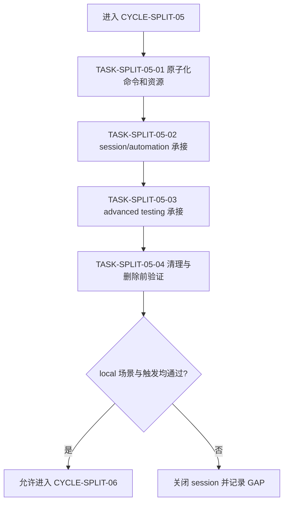

# 实施周期 05：浏览器会话与高级验证

结论：本周期将 `agent-browser` 二分为核心 session/认证/交互自动化与 HAR/diff/trace/proxy/profiling 高级验证；影响：常规浏览器动作更容易稳定命中，高级观测能力不会抢占普通页面路由；范围：命令、认证、session、snapshot、截图清理、网络记录、视频、差异和性能资源；非范围：不接管用户真实 Chrome profile，不访问外部 URL，不替代认证 URL 路由 skill；变化：`browser-session-automation-rules` 和 `browser-advanced-testing-rules` 成为两个平级入口；完成标准：四项任务逐个通过 local browser fixture 和 post-delete 触发验证；术语说明：session 是隔离的浏览器状态容器，advanced testing 是记录、差异、代理和性能验证能力；验证状态：计划草案，等待用户 review。

## 当前周期目标

- 周期 ID / 期次定位：`CYCLE-SPLIT-05` / 第五期：浏览器工具。
- 只做这一件事：拆分 `agent-browser` 的核心自动化和高级验证职责。
- 对应文档：[`实施总览`](2026-07-16_114619_Skill体积治理与拆分_实施总览.md)、[`周期 04`](2026-07-16_114619_Skill体积治理与拆分_实施周期04_接口基线与上线测试执行.md)、[`验收标准`](../7-验收/2026-07-16_114619_Skill体积治理与拆分_验收标准.md)。
- 本周期不做：用户真实 Chrome 接管、登录态绕过、外部站点访问、线上网络调试和 2D asset 生产。

## 周期图片资产决策与边界

- 图片资产决策：`N/A + 原因 + 证据`：浏览器验证使用 local DOM、HAR、trace 和 JSON，不需要把截图作为交付图片资产；若测试需要截图，截图只作为临时证据并按清理契约处理。
- Mermaid 边界：session 与 advanced 的职责、执行顺序和清理使用 Mermaid；临时截图不替代流程或状态表达。

## 周期图片资产清单

| 图片 ID | 用途 / 生成输入 | 来源 | 相对路径 | 版本 | 关联 REQ/RULE / AC / CYCLE / TASK | 引用章节 | 敏感状态 | 版权状态 |
|---|---|---|---|---|---|---|---|---|
| 不适用：依据本周期交付范围，无正式图片资产 | 不适用：依据 local DOM 验证范围，截图不是正式交付 | 不适用：依据范围，无图片来源 | 不适用：依据范围，无正式图片路径 | 不适用：依据范围，无版本 | `REQ-SKILL-SPLIT-004` / `CYCLE-SPLIT-05` | 不适用：依据范围，无 Markdown 图片引用章节 | 不适用：依据范围，无图片敏感信息 | 不适用：依据范围，无图片版权对象 |

## 进入条件与收口条件

| 类型 | 条件 | 证据/命令 | 状态 |
|---|---|---|---|
| 进入 | 周期 04 的 engine 回归和职责 owner 已闭环 | 周期 04 验证矩阵 | planned |
| 进入 | `agent-browser` 的 SKILL、commands、authentication、session、snapshot、diff、video、profiling、proxy 和 templates 清单已冻结 | MD5、字节和目录清单 | planned |
| 收口 | session/automation 与 advanced testing 两组触发边界独立 | `TEST-SPLIT-017`、`TEST-SPLIT-018` | planned |
| 收口 | local fixture 核心动作、高级记录、清理和 post-delete 均通过 | `TEST-SPLIT-019`、`TEST-SPLIT-020` | planned |

图形目的：固定普通 session 动作与高级验证的边界，并要求每次浏览器演练关闭 session、删除临时输出。关联 ID：`CYCLE-SPLIT-05`、`TASK-SPLIT-05-01` 至 `TASK-SPLIT-05-04`。

## 当前代码/文档基线

- 分支 / 提交：`40cae893706639eb2323328f84b70b1c3aba66d9`；旧 `agent-browser` 为冻结对照。
- 已核实文件和符号：`agent-browser/references/commands.md` 的 `open`、`snapshot`、`click`、`fill`、`network har`、`diff`、`trace`、`profiler`、`record` 和 session 参数；认证、session、snapshot、video、profiling、proxy、templates 资源已登记。
- 依赖版本与 local 配置：`agent-browser` CLI、Python local HTTP server、PowerShell 7 和 `127.0.0.1:8765` fixture；不使用 Chrome Plugin、外部 URL 或真实用户 profile。
- 与计划不一致时的停止规则：发现浏览器 CLI 不可用、fixture 访问外部站点、session 清理失败、普通 Chrome 路由被抢或认证语义被弱化，记录 `GAP-SKILL-010` 并停止。

## 周期内最小任务执行顺序

| 顺序 | 任务 ID | 唯一目标 | 前置依赖 | 允许文件 | 禁止触碰区 | 状态 |
|---:|---|---|---|---|---|---|
| 1 | `TASK-SPLIT-05-01` | 原子化 browser 命令、session、认证和高级资源 | 周期 04 收口 | `mapping/agent-browser-rules.yaml`、资源清单 | 新 skill 和浏览器运行 | done |
| 2 | `TASK-SPLIT-05-02` | 承接核心 session/automation | TASK-SPLIT-05-01 通过 | `browser-session-automation-rules/`、core refs/templates | advanced refs 和用户 profile | done |
| 3 | `TASK-SPLIT-05-03` | 承接 HAR/diff/trace/proxy/profiling | TASK-SPLIT-05-02 通过 | `browser-advanced-testing-rules/`、advanced refs/templates | 普通 Chrome 路由和用户 profile | done |
| 4 | `TASK-SPLIT-05-04` | 完成 local 场景、清理、字典和删除前验证 | TASK-SPLIT-05-03 通过 | local cases、mapping、字典、引用报告 | 外部站点、旧 skill 删除动作 | done |
| 5 | `TASK-SPLIT-05-05` | 更新仓库级路由与交叉引用 | TASK-SPLIT-05-04 删除前检查通过 | `mcp-installation-rules`、`authenticated-url-routing-rules`、`execution-failure-learning-rules`、`team-development-rules`、`编码skill.md`、`README.md`、`项目设计.md`、`PROJECT_MEMORY.md` | agent-browser 实现、旧 skill 内容 | done |

## 文件与符号操作契约

| 任务 | 文件路径 | 符号/区段 | 操作 | 修改前职责 | 修改后职责 | 调用方影响 | 兼容要求 |
|---|---|---|---|---|---|---|---|
| `TASK-SPLIT-05-01` | 旧 SKILL、commands/auth/session/snapshot/diff refs、templates | 命令与资源条目 | 只读原子化 | 核心与高级混合 | 形成 core/advanced 映射 | 后续两个入口读取 | 认证、清理、引用格式不变 |
| `TASK-SPLIT-05-02` | `browser-session-automation-rules/` | open、snapshot、interaction、session、auth | 新增/迁移 | 旧 skill 负责全部浏览器 | 新 skill 负责核心动作 | 普通 local 页面路由稳定 | 不接管真实 Chrome |
| `TASK-SPLIT-05-03` | `browser-advanced-testing-rules/` | HAR、diff、trace、proxy、profiling、video | 新增/迁移 | 旧 skill 负责高级观测 | 新 skill 只负责高级验证 | 需先有 session 上下文 | 高级能力不抢普通入口 |
| `TASK-SPLIT-05-04` | local cases、mapping、字典、引用 | 清理与 post-delete | 验证/清理 | 旧 skill 仍是主入口 | 新入口完整承接 | 旧入口只作基线 | session 必须关闭 |
| `TASK-SPLIT-05-05` | `mcp-installation-rules`、`authenticated-url-routing-rules`、`execution-failure-learning-rules`、`team-development-rules`、`编码skill.md`、`README.md`、`项目设计.md`、`PROJECT_MEMORY.md` | 路由和索引 | 修改 | 旧 skill 为主入口 | 两个新入口分别承接 core/advanced | 命中和阅读路径更新 | 历史变更日志与候选矩阵历史记录不回改 |

## 最小任务闭环

### `TASK-SPLIT-05-01`：原子化 browser 资源

- 唯一目标：把命令、认证、session、snapshot、截图清理、HAR、diff、video、profiling、proxy 和 templates 逐条映射。
- 允许文件：`doc/5-tests/2026-07-17_155229/skill-split-validation/mapping/agent-browser-rules.yaml`。
- 实施步骤与验证点：以 commands 为核心拆出 core/advanced；将认证和 session 归 core；将 HAR/diff/trace/profiling/proxy 归 advanced；标记 screenshot cleanup 和 templates 的组合覆盖；运行 mapping validator。
- 失败预期：普通命令分散无主、advanced 依赖旧上下文、用户 profile 规则被误迁或清理语义丢失时失败。
- 清理：保留 mapping，删除扫描输出。
- 回滚：删除 mapping，旧 skill 继续冻结。
- 完成条件：`TEST-SPLIT-017` 通过，四类 `EVD-TASK-SPLIT-05-01-*` 证据齐全。
- 停止条件：两个职责组不能独立触发或平均命中超过 3。
- 最大推进边界：只进入 TASK-SPLIT-05-02。

### `TASK-SPLIT-05-02`：核心 session/automation

- 唯一目标：建立 `browser-session-automation-rules`，承接 local 页面打开、等待、snapshot、交互、认证分支和 session 清理。
- 允许文件：新 skill、core refs、`authenticated-session.sh`、`capture-workflow.sh`、`form-automation.sh` 和 local fixture 说明。
- 实施步骤与验证点：用 local page 执行 `agent-browser --session split-local open http://127.0.0.1:8765/index.html`、`snapshot -i`、`find role button click --name Submit`、`wait --text "Success"`、`close`；断言页面状态和 session 清理。
- 失败预期：打开外部 URL、session 残留、认证规则错误、snapshot 引用失效或普通动作需 advanced skill 才能完成时失败。
- 清理：执行 `agent-browser --session split-local close`，删除 local browser profile 和输出。
- 回滚：删除新 core skill，恢复旧入口和 local fixture。
- 完成条件：`TEST-SPLIT-018` 通过，四类 `EVD-TASK-SPLIT-05-02-*` 证据齐全。
- 停止条件：agent-browser CLI、local HTTP server 或 session cleanup 任一不可用。
- 最大推进边界：只进入 TASK-SPLIT-05-03。

### `TASK-SPLIT-05-03`：高级验证

- 唯一目标：建立 `browser-advanced-testing-rules`，承接 HAR、diff、trace、profiler、proxy、video 和高级网络记录。
- 允许文件：新 skill、advanced refs、`tapd-weekly-report.sh`、video/profiling/proxy/diff 资源和 local case。
- 实施步骤与验证点：在同一 local session 执行 `network har start`、`trace start`、`profiler start`、动作、`diff snapshot`、`network har stop`、`trace stop`、`profiler stop`；断言产物存在、可读且不包含外部请求；最后关闭 session。
- 失败预期：高级命令抢占普通入口、产物缺失、代理连接外部、trace 或 HAR 未清理时失败。
- 清理：关闭 session，删除 HAR/trace/profile/video 临时文件，保留脱敏摘要。
- 回滚：删除 advanced skill 和临时产物，回到 mapping。
- 完成条件：`TEST-SPLIT-019` 通过，四类 `EVD-TASK-SPLIT-05-03-*` 证据齐全。
- 停止条件：任何高级产物不可信或 local-only 边界被突破。
- 最大推进边界：只进入 TASK-SPLIT-05-04。

### `TASK-SPLIT-05-04`：清理与删除前验证

- 唯一目标：完成 core/advanced 的触发、清理、字典、引用和 post-delete 验证。
- 允许文件：local cases、mapping、字典、引用报告和测试 README。
- 实施步骤与验证点：运行正反触发；执行 local session 与 advanced 场景；检查所有 session 已关闭；刷新字典；模拟删除旧目录后重复触发。
- 失败预期：旧入口仍独有、session 残留、外部 URL 被调用、字典或 post-delete 失败时失败。
- 清理：删除模拟删除目录、浏览器 profile 和临时输出，保留删除前检查。
- 回滚：恢复旧 skill 和引用，回到 TASK-SPLIT-05-01。
- 完成条件：`TEST-SPLIT-020` 通过，四类 `EVD-TASK-SPLIT-05-04-*` 证据齐全，旧 skill 最多进入 `comparing`。
- 停止条件：真实场景或清理失败。
- 最大推进边界：本周期收口后停止，不自动删除旧 skill。

### `TASK-SPLIT-05-05`：路由与引用清理

- 唯一目标：将 `mcp-installation-rules`（含 `references/tool-priority.md`）、`authenticated-url-routing-rules`、`execution-failure-learning-rules`、`team-development-rules`、`编码skill.md`、`README.md`、`项目设计.md`、`PROJECT_MEMORY.md` 中对 `agent-browser` 的活跃引用，按 `mapping/agent-browser.yaml` 的 owner 分组改指两个新 skill，并重跑字典生成脚本。
- 允许文件：`rg -n --fixed-strings "agent-browser"` 命中的全部活跃引用文件，不包括 `doc/**`、旧 skill 自身目录、新 skill 自身目录、已冻结的 `agent-browser` 内部文件，以及 `README.md`/`PROJECT_MEMORY.md` 中的历史变更日志与 `TASK-SPLIT-01-02` 候选矩阵历史决策记录。
- 实施步骤与验证点：逐文件按语义改写（核心会话自动化与高级验证观测分开，不机械替换）；重跑 `python -X utf8 skill-dictionary/generate_dictionary.py` 确认两个新 skill 变为 `implemented`、旧 skill 降为 `seed`；重跑 `run_trigger_cases.ps1 -Phase pre-delete` 与 `-Phase post-delete` 确认回归通过；`certutil -hashfile` 核对旧 skill `SKILL.md` MD5 与基线一致。
- 失败预期：任何活跃引用漏改、字典生成失败、trigger 用例失败、MD5 与基线不一致或误改历史文档/冻结 skill 内部文件时失败。
- 清理：无临时文件，直接写入仓库。
- 回滚：恢复引用和字典源，旧 `agent-browser` 保持冻结。
- 完成条件：`TEST-SPLIT-020`（真实重跑）通过，四类 `EVD-TASK-SPLIT-05-05-*` 证据齐全，详见 `evidence/TASK-SPLIT-05-05-routing.md`。
- 停止条件：任何旧依赖未清理完成。
- 最大推进边界：只完成路由切换，不删除旧 skill，不推进周期 06。

## 真实测试与断言

| 测试 ID | 对应任务 | 精确命令 | local 依赖 | fixture/数据 | 断言 | 失败预期 | 清理 |
|---|---|---|---|---|---|---|---|
| `TEST-SPLIT-017` | `TASK-SPLIT-05-01` | `python -X utf8 "doc/5-tests/2026-07-17_155229/skill-split-validation/validate_skill_split.py" --mode mapping --mapping "doc/5-tests/2026-07-17_155229/skill-split-validation/mapping/agent-browser-rules.yaml"` | 当前 skill 目录 | agent-browser SKILL、refs、templates | 规则和资源覆盖 100% | 资源悬空或职责无法二分 | 保留失败 mapping |
| `TEST-SPLIT-018` | `TASK-SPLIT-05-02` | `python -X utf8 -m http.server 8765 --directory "doc/5-tests/2026-07-17_155229/skill-split-validation/cases/local-browser"`；另行执行 `agent-browser --session split-local open http://127.0.0.1:8765/index.html`、`snapshot -i`、`close` | Python local HTTP server、agent-browser | local static page | 核心动作和 session 清理成功，无外部请求 | server/browser/session 失败 | 停止 server，删除 session/profile |
| `TEST-SPLIT-019` | `TASK-SPLIT-05-03` | `agent-browser --session split-advanced network har start`、`trace start`、`profiler start`、`diff snapshot`、停止命令 | local browser、local page | HAR/trace/profile/diff | 产物存在、可读、只含 local 请求 | 产物缺失或外部请求 | 删除高级产物，关闭 session |
| `TEST-SPLIT-020` | `TASK-SPLIT-05-04` | `pwsh -NoProfile -File "doc/5-tests/2026-07-17_155229/skill-split-validation/run_trigger_cases.ps1" -Phase post-delete -CasesRoot "doc/5-tests/2026-07-17_155229/skill-split-validation/cases/agent-browser"` | PowerShell 7、local cases | 模拟删除后 core/advanced 样本 | 新入口稳定命中，旧入口不承担独有职责 | 触发漂移或清理失败 | 删除模拟目录，保留报告 |
| `TEST-SPLIT-020`（真实重跑） | `TASK-SPLIT-05-05` | 同上命令，改为在真实完成 11 处活跃引用路由切换后对真实仓库重跑，而非模拟目录 | PowerShell 7、真实仓库源目录 | pre-delete + post-delete 两组全部触发样本 | 两组 trigger 用例均通过，字典 `implemented_total` 净增 1 | 任何旧依赖、双 owner 或生成失败 | 保留完整输出作为证据 |

## 回滚与停止条件

- `ROLLBACK-SKILL-SPLIT-05`：关闭所有 session，删除 profile 和临时高级产物，再恢复新 skill、引用和字典；旧 `agent-browser` 继续作为冻结基线。
- 停止条件：外部 URL、真实 Chrome profile、session 泄漏、产物不可信、触发抢入口、字典失败或 local server 不可用。
- 恢复路径：映射回 TASK-SPLIT-05-01；core 回 TASK-SPLIT-05-02；advanced 回 TASK-SPLIT-05-03；删除前回 TASK-SPLIT-05-04。
- 当前 agent 最大推进边界：只做 local fixture 计划和删除前检查，不接管用户浏览器，不访问外部网络。

## 当前周期验证矩阵

| 任务 | 实现/落盘证据 | 真实测试证据 | 审查证据 | 验收证据 | 当前状态 |
|---|---|---|---|---|---|
| `TASK-SPLIT-05-01` | `EVD-TASK-SPLIT-05-01-IMPL` | `EVD-TASK-SPLIT-05-01-TEST` / `TEST-SPLIT-017`（通过） | `EVD-TASK-SPLIT-05-01-REVIEW` | `EVD-TASK-SPLIT-05-01-ACCEPT` / `AC-SKILL-SPLIT-003` | done |
| `TASK-SPLIT-05-02` | `EVD-TASK-SPLIT-05-02-IMPL` | `EVD-TASK-SPLIT-05-02-TEST` / `TEST-SPLIT-018`（通过） | `EVD-TASK-SPLIT-05-02-REVIEW` | `EVD-TASK-SPLIT-05-02-ACCEPT` / `AC-SKILL-SPLIT-006` | done |
| `TASK-SPLIT-05-03` | `EVD-TASK-SPLIT-05-03-IMPL` | `EVD-TASK-SPLIT-05-03-TEST` / `TEST-SPLIT-019`（通过） | `EVD-TASK-SPLIT-05-03-REVIEW` | `EVD-TASK-SPLIT-05-03-ACCEPT` / `AC-SKILL-SPLIT-006` | done |
| `TASK-SPLIT-05-04` | `EVD-TASK-SPLIT-05-04-IMPL` | `EVD-TASK-SPLIT-05-04-TEST` / `TEST-SPLIT-020`（通过） | `EVD-TASK-SPLIT-05-04-REVIEW` | `EVD-TASK-SPLIT-05-04-ACCEPT` / `AC-SKILL-SPLIT-007`（delete 未执行，routing 已完成） | done |
| `TASK-SPLIT-05-05` | `EVD-TASK-SPLIT-05-05-IMPL` | `EVD-TASK-SPLIT-05-05-TEST` / `TEST-SPLIT-020`（真实重跑，通过） | `EVD-TASK-SPLIT-05-05-REVIEW` | `EVD-TASK-SPLIT-05-05-ACCEPT` / `AC-SKILL-SPLIT-007`（旧 skill 已删除，post-delete 回归通过） | done |

## 周期追踪矩阵

| `REQ-*` / `RULE-*` | `AC-*` | `TASK-*` | 文件/符号 | `TEST-*` | `EVIDENCE-*` | 闭环状态 |
|---|---|---|---|---|---|---|
| `REQ-SKILL-SPLIT-003` | `AC-SKILL-SPLIT-003` | `TASK-SPLIT-05-01` | mapping、commands、refs、templates | `TEST-SPLIT-017` | `EVIDENCE-SKILL-MAPPING-20260716`、`EVD-TASK-SPLIT-05-01-*` | done |
| `REQ-SKILL-SPLIT-004` | `AC-SKILL-SPLIT-006` | `TASK-SPLIT-05-02` | core skill、session/auth/snapshot refs | `TEST-SPLIT-018` | `EVIDENCE-SKILL-ROLE-20260716`、`EVD-TASK-SPLIT-05-02-*` | done |
| `REQ-SKILL-SPLIT-004` | `AC-SKILL-SPLIT-006` | `TASK-SPLIT-05-03` | advanced skill、HAR/diff/trace/profiling/proxy refs | `TEST-SPLIT-019` | `EVIDENCE-SKILL-BUNDLE-20260716`、`EVD-TASK-SPLIT-05-03-*` | done |
| `REQ-SKILL-SPLIT-005` | `AC-SKILL-SPLIT-007` | `TASK-SPLIT-05-04` | local cases、字典、引用和删除前检查 | `TEST-SPLIT-020` | `EVIDENCE-SKILL-DELETE-20260716`、`EVD-TASK-SPLIT-05-04-*` | done |
| `REQ-SKILL-SPLIT-004`、`REQ-SKILL-SPLIT-005` | `AC-SKILL-SPLIT-007` | `TASK-SPLIT-05-05` | `mcp-installation-rules`、`authenticated-url-routing-rules`、`execution-failure-learning-rules`、`team-development-rules`、`编码skill.md`、`README.md`、`项目设计.md`、`PROJECT_MEMORY.md` | `TEST-SPLIT-020`（真实重跑） | `EVD-TASK-SPLIT-05-05-*` | done（旧 skill 已删除，全部路由与引用已修正，post-delete 回归通过） |

## 自审结论

- 每个任务是否只承载一个目标：是；资源映射、core、advanced 和删除前验证分开。
- 是否按实现 -> 真实测试 -> 审查 -> 验收逐个闭环：是；五个任务浏览器测试全部限定 local fixture 并有清理。
- 是否存在未决决策或模糊落点：否；真实 Chrome、外部 URL 和 session 清理边界均已冻结。
- 图形、表格和正文是否一致：是；四个任务和 local-only 约束一致。

## 执行附录

- local 环境：`127.0.0.1:8765` 静态页面、agent-browser 隔离 session、Python 和 PowerShell 7；禁止使用用户真实 profile。
- 清理：关闭 `split-local`、`split-advanced`，停止 Python server，删除 profile、HAR、trace、profile、video 和 diff 临时文件。
- 回滚：按 `ROLLBACK-SKILL-SPLIT-05` 逆序恢复，任何浏览器工具失败都不切换到外部站点。

## 追踪附录

- 来源回指：`SRC-SKILL-SPLIT-20260716` -> [`REQ-SKILL-SPLIT-20260716`](../2-需求/2026-07-16_114619_Skill体积治理与拆分.md) -> [`AC-SKILL-SPLIT-20260716`](../7-验收/2026-07-16_114619_Skill体积治理与拆分_验收标准.md) -> `CYCLE-SPLIT-05`。
- 新 skill 候选：`browser-session-automation-rules`、`browser-advanced-testing-rules`；`authenticated-url-routing-rules` 和 Chrome Plugin 的职责不迁移。
- 删除状态：用户在本轮明确授权删除（“可以删除”）。旧 `agent-browser` 已真实删除；本周期 mapping 复核未发现 `keep_in_place`/`reference_only` 共享物理资源风险。重跑字典生成脚本（`implemented_total=88`、`seed_total=28`，无回归）与 `post-delete` 触发用例，全部通过。`CYCLE-SPLIT-05` 至此完整收口为 `done`。
