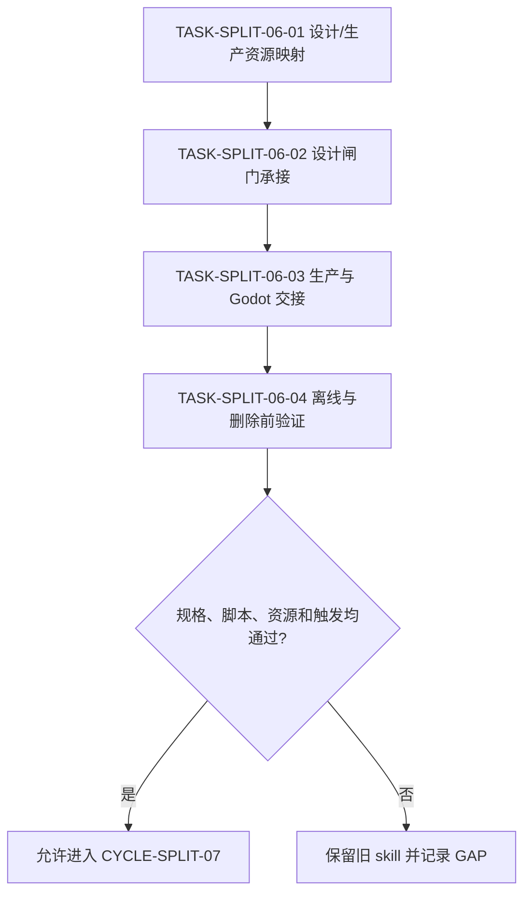

# 实施周期 06：2D 素材设计与生产交接

结论：本周期将 `2d-asset-design` 按“设计确认/原创质量/预览规格”和“生产/动画/地图/后处理/Godot 交接”二分；影响：设计决策不会和脚本生产、切帧、地图和引擎交接一起加载；范围：references、scripts、agents、imagegen 触发边界和离线 fixture；非范围：本周期不调用真实图像生成、不交付新素材、不修改 Godot 项目；变化：设计入口由 `game-asset-design-gate-rules` 承接，生产入口由 `game-asset-production-handoff-rules` 承接；完成标准：四项任务逐个完成规则映射、结构、离线脚本和删除前验证；术语说明：设计闸门用于冻结美术方向和规格，生产交接用于将已确认设计转成可交付资产；imagegen 指真实图像生成入口；验证状态：计划草案，等待用户 review。

## 当前周期目标

- 周期 ID / 期次定位：`CYCLE-SPLIT-06` / 第六期：游戏资产。
- 只做这一件事：拆分 `2d-asset-design` 的设计闸门与生产交接职责。
- 对应文档：[`实施总览`](2026-07-16_114619_Skill体积治理与拆分_实施总览.md)、[`周期 05`](2026-07-16_114619_Skill体积治理与拆分_实施周期05_浏览器会话与高级验证.md)、[`验收标准`](../7-验收/2026-07-16_114619_Skill体积治理与拆分_验收标准.md)。
- 本周期不做：真实 imagegen、生图模型调用、外部参考图下载、Godot 项目修改和最终素材交付。

## 周期图片资产决策与边界

- 图片资产决策：`N/A + 原因 + 证据`：本周期验证 skill 规则和离线后处理脚本，不生成新的正式位图；真实生图任务必须在未来任务中命中 `imagegen`。
- Mermaid 边界：设计到生产的依赖、交接状态和失败回流使用 Mermaid；离线 fixture 图像只作为脚本测试输入，不作为本周期交付图片。
- imagegen 边界：本周期不调用 imagegen；若未来真实资产任务需要原创位图，必须使用真实 imagegen 链路并落到 `doc/data/images/` 或用户指定资产目录。

## 周期图片资产清单

| 图片 ID | 用途 / 生成输入 | 来源 | 相对路径 | 版本 | 关联 REQ/RULE / AC / CYCLE / TASK | 引用章节 | 敏感状态 | 版权状态 |
|---|---|---|---|---|---|---|---|---|
| 不适用：依据本周期范围，无正式图片资产 | 不适用：依据离线脚本验证范围，不生成正式图片 | 不适用：依据范围，无图片来源 | 不适用：依据范围，无正式图片路径 | 不适用：依据范围，无版本 | `REQ-SKILL-SPLIT-004` / `CYCLE-SPLIT-06` | 不适用：依据范围，无 Markdown 图片引用章节 | 不适用：依据范围，无图片敏感信息 | 不适用：依据范围，无图片版权对象 |

## 进入条件与收口条件

| 类型 | 条件 | 证据/命令 | 状态 |
|---|---|---|---|
| 进入 | 周期 05 的 local browser 计划闭环已完成或记录阻断 | 周期 05 验证矩阵 | planned |
| 进入 | `2d-asset-design` 的 SKILL、14 个 references、3 个 scripts 和 agents 清单已冻结 | MD5、字节和目录清单 | planned |
| 收口 | 设计/生产资源、imagegen 边界和 Godot 交接主 owner 唯一 | `TEST-SPLIT-021`、`TEST-SPLIT-022` | planned |
| 收口 | 离线后处理脚本行为等价，设计到生产的真实交接样本可复核 | `TEST-SPLIT-023`、`TEST-SPLIT-024` | planned |

图形目的：说明设计确认是生产、动画、地图和后处理的前置条件，任何设计未确认不得进入生产交接。关联 ID：`CYCLE-SPLIT-06`、`TASK-SPLIT-06-01` 至 `TASK-SPLIT-06-04`。

## 当前代码/文档基线

- 分支 / 提交：`40cae893706639eb2323328f84b70b1c3aba66d9`；旧 `2d-asset-design` 只作冻结基线。
- 已核实文件和符号：`references/design-preview-confirmation-gate.md`、`art-direction-quality-gate.md`、`image-spec-contract.md`、`prompt-rules.md`、`reference-only-policy.md`、`project-style-consistency-contract.md`；`references/character-animation-production-gate.md`、`layered-map-contract.md`、`map-strategies.md`、`postprocess-workflow.md`、`prop-pack-contract.md`、`image-generation-workflow.md`；`scripts/compose_layered_preview.py`、`make_layout_guide.py`、`postprocess_sprite_sheet.py`。
- 依赖版本与 local 配置：Python、离线 fixture 和现有脚本；不调用 imagegen、外部站点或 Godot 运行时。
- 与计划不一致时的停止规则：发现设计确认条件被弱化、真实生图被脚本伪造、生产脚本无主 owner 或 Godot 交接边界不清，记录 `GAP-SKILL-011` 并停止。

## 周期内最小任务执行顺序

| 顺序 | 任务 ID | 唯一目标 | 前置依赖 | 允许文件 | 禁止触碰区 | 状态 |
|---:|---|---|---|---|---|---|
| 1 | `TASK-SPLIT-06-01` | 原子化设计、生产、imagegen 和资源规则 | 周期 05 收口 | `mapping/2d-asset-rules.yaml`、资源清单 | 新 skill、脚本实现和图片生成 | done |
| 2 | `TASK-SPLIT-06-02` | 承接设计确认、原创质量、预览和规格 | TASK-SPLIT-06-01 通过 | `game-asset-design-gate-rules/`、design refs/agents | production refs 和 scripts | done |
| 3 | `TASK-SPLIT-06-03` | 承接生产、动画、地图、后处理和 Godot 交接 | TASK-SPLIT-06-02 通过 | `game-asset-production-handoff-rules/`、production refs/scripts/agents | 设计决策和真实 imagegen | done |
| 4 | `TASK-SPLIT-06-04` | 完成离线脚本、触发、字典和删除前验证 | TASK-SPLIT-06-03 通过 | local fixture、mapping、字典和引用报告 | 外部素材和旧 skill 删除 | done |
| 5 | `TASK-SPLIT-06-05` | 更新仓库级路由与交叉引用 | TASK-SPLIT-06-04 删除前检查通过 | `character-sprite-animation-production`、`agent-sprite-forge-design` | `2d-asset-design` 实现、`PROJECT_MEMORY.md`/`PROJECT_CURRENT.md` 候选矩阵历史记录 | done |

## 文件与符号操作契约

| 任务 | 文件路径 | 符号/区段 | 操作 | 修改前职责 | 修改后职责 | 调用方影响 | 兼容要求 |
|---|---|---|---|---|---|---|---|
| `TASK-SPLIT-06-01` | 旧 SKILL、14 refs、3 scripts、agents、mapping | 规则/资源条目 | 只读原子化 | 设计与生产混合 | 设计/生产两组映射 | 后续两个入口读取 | imagegen 真实链路不弱化 |
| `TASK-SPLIT-06-02` | design 新 skill、design refs、agents | 设计确认、原创、规格、预览 | 新增/迁移 | 旧 skill 负责全链路 | 新 skill 只冻结设计 | 生产依赖设计结果 | 未确认不得生产 |
| `TASK-SPLIT-06-03` | production 新 skill、production refs、scripts、agents | 动画、地图、后处理、Godot | 新增/迁移 | 旧 skill 负责全链路 | 新 skill 负责生产交接 | 设计入口只提供确认结果 | 不伪造 imagegen |
| `TASK-SPLIT-06-04` | local fixture、mapping、字典和引用 | 离线后处理与 post-delete | 验证/清理 | 旧入口主导 | 新入口完整承接 | 删除前可复验 | 失败保留旧 skill |
| `TASK-SPLIT-06-05` | `character-sprite-animation-production`、`agent-sprite-forge-design` | 与旧 skill 的关系小节 | 修改 | 旧 skill 为生产环节主入口 | `game-asset-production-handoff-rules` 承接生产环节 | 命中和阅读路径更新 | 候选矩阵历史记录不回改 |

## 最小任务闭环

### `TASK-SPLIT-06-01`：原子化资产规则

- 唯一目标：将设计闸门、原创性、规格、imagegen、动画、地图、后处理、prop pack 和 Godot 交接资源逐条映射。
- 允许文件：`doc/5-tests/2026-07-17_155229/skill-split-validation/mapping/2d-asset-rules.yaml`。
- 实施步骤与验证点：按设计/生产两组登记；标记 imagegen 真实创作与后处理边界；登记脚本、agents 和特例；运行 mapping validator。
- 失败预期：把脚本合成伪装成 imagegen、生产规则无主落点、设计确认可被绕过或资源悬空时失败。
- 清理：保留 mapping，删除扫描输出。
- 回滚：删除 mapping，旧 skill 保持冻结。
- 完成条件：`TEST-SPLIT-021` 通过，四类 `EVD-TASK-SPLIT-06-01-*` 证据齐全。
- 停止条件：设计与生产不能独立触发或 imagegen 边界无法证明。
- 最大推进边界：只进入 TASK-SPLIT-06-02。

### `TASK-SPLIT-06-02`：设计闸门承接

- 唯一目标：建立 `game-asset-design-gate-rules`，承接参考筛选、原创要求、质量、预览确认、规格和项目风格一致性。
- 允许文件：新 skill、design refs、agents 和设计确认 fixture 说明。
- 实施步骤与验证点：迁移设计确认、art direction、prompt、reference-only、image spec、project-style refs；执行纯文本设计 brief 样本；断言未确认状态不能进入生产。
- 失败预期：设计 skill 直接执行生产脚本、原创性约束变弱、质量/规格缺失或 imagegen 被替换为程序绘图时失败。
- 清理：删除设计 fixture 和临时 brief，保留脱敏判断报告。
- 回滚：删除新设计 skill，恢复旧入口。
- 完成条件：`TEST-SPLIT-022` 通过，四类 `EVD-TASK-SPLIT-06-02-*` 证据齐全。
- 停止条件：设计确认不完整或触发抢占生产入口。
- 最大推进边界：只进入 TASK-SPLIT-06-03。

### `TASK-SPLIT-06-03`：生产与 Godot 交接

- 唯一目标：建立 `game-asset-production-handoff-rules`，承接动画、地图、后处理、prop pack、脚本和 Godot 交接。
- 允许文件：新 skill、production refs、agents、`compose_layered_preview.py`、`make_layout_guide.py`、`postprocess_sprite_sheet.py` 和离线 fixture。
- 实施步骤与验证点：执行 `python -X utf8 "2d-asset-design/scripts/compose_layered_preview.py" --help`、`make_layout_guide.py --help`、`postprocess_sprite_sheet.py --help`；对已存在的本地 fixture 做去背/切帧/预览输出；断言输入设计规格存在且输出路径符合契约。
- 失败预期：没有设计确认仍生产、脚本输出路径越界、资源签名错误、Godot 交接字段缺失或把脚本结果伪装为原创生图时失败。
- 清理：删除临时预览、切帧和布局文件，保留哈希与离线报告。
- 回滚：恢复旧生产 references 和脚本入口，删除新 skill。
- 完成条件：`TEST-SPLIT-023` 通过，四类 `EVD-TASK-SPLIT-06-03-*` 证据齐全。
- 停止条件：脚本失败、输出损坏或需要真实 imagegen/外部服务才能继续。
- 最大推进边界：只进入 TASK-SPLIT-06-04。

### `TASK-SPLIT-06-04`：离线与删除前验证

- 唯一目标：完成设计/生产触发、离线脚本、资源引用、字典和 post-delete 验证。
- 允许文件：local fixture、mapping、字典、引用报告和测试 README。
- 实施步骤与验证点：执行设计正反样本；执行生产离线 fixture；扫描 imagegen 与程序绘图边界；刷新字典；模拟删除旧 skill 后重复触发。
- 失败预期：触发抢入口、脚本输出不等价、设计未确认可生产、旧入口仍独有或 post-delete 失败时失败。
- 清理：删除模拟目录、临时预览和测试输出，不删除用户正式素材。
- 回滚：恢复旧 skill 和引用，回到 TASK-SPLIT-06-01。
- 完成条件：`TEST-SPLIT-024` 通过，四类 `EVD-TASK-SPLIT-06-04-*` 证据齐全，旧 skill 最多进入 `comparing`。
- 停止条件：任何设计/生产边界或资产路径门禁失败。
- 最大推进边界：本周期收口后停止，不自动进入 MCP 复评。

### `TASK-SPLIT-06-05`：路由与引用清理

- 唯一目标：将 `character-sprite-animation-production`、`agent-sprite-forge-design` 两个共享设计/生产联动 skill 中对 `2d-asset-design` 的活跃引用，按 `mapping/2d-asset-rules.yaml` 的 `group_production` owner 改指 `game-asset-production-handoff-rules`，并重跑字典生成脚本。
- 允许文件：`rg -n --fixed-strings "2d-asset-design"` 命中的全部活跃引用文件，不包括 `doc/**`、旧 skill 自身目录、新 skill 自身目录、已冻结的 `2d-asset-design` 内部文件，以及 `PROJECT_MEMORY.md`/`PROJECT_CURRENT.md` 中 `TASK-SPLIT-01-02` 候选矩阵历史决策记录（`TASK-SPLIT-06-04` 删除前检查已确认排除，本任务延续该结论）。
- 实施步骤与验证点：逐文件按语义改写“与旧 skill 的关系”小节标题和正文；重跑 `python -X utf8 skill-dictionary/generate_dictionary.py` 确认 `2d-asset-design` 及两个新 skill 均保持 `扩展种子`/`seed`（本轮不涉及主规划域表 `implemented_total` 变化，`2d-asset-design` 从未进入 `编码skill.md` 主表）；重跑 `run_trigger_cases.ps1 -Phase pre-delete` 与 `-Phase post-delete` 确认回归通过；`certutil -hashfile` 核对旧 skill `SKILL.md` MD5 与基线一致。
- 失败预期：任何活跃引用漏改、字典生成失败、trigger 用例失败、MD5 与基线不一致或误改历史文档/冻结 skill 内部文件时失败。
- 清理：无临时文件，直接写入仓库。
- 回滚：恢复引用和字典源，旧 `2d-asset-design` 保持冻结。
- 完成条件：`TEST-SPLIT-024`（真实重跑）通过，四类 `EVD-TASK-SPLIT-06-05-*` 证据齐全，详见 `evidence/TASK-SPLIT-06-05-routing.md`。
- 停止条件：任何旧依赖未清理完成。
- 最大推进边界：只完成路由切换，不删除旧 skill，不推进周期 07。

## 真实测试与断言

| 测试 ID | 对应任务 | 精确命令 | local 依赖 | fixture/数据 | 断言 | 失败预期 | 清理 |
|---|---|---|---|---|---|---|---|
| `TEST-SPLIT-021` | `TASK-SPLIT-06-01` | `python -X utf8 "doc/5-tests/2026-07-17_155229/skill-split-validation/validate_skill_split.py" --mode mapping --mapping "doc/5-tests/2026-07-17_155229/skill-split-validation/mapping/2d-asset-rules.yaml"` | 当前 skill 目录 | 2d SKILL、refs、scripts、agents | 规则和资源覆盖 100%，imagegen 边界有主落点 | 资源悬空或伪图路径 | 保留失败 mapping |
| `TEST-SPLIT-022` | `TASK-SPLIT-06-02` | `pwsh -NoProfile -File "doc/5-tests/2026-07-17_155229/skill-split-validation/run_trigger_cases.ps1" -Phase pre-delete -CasesRoot "doc/5-tests/2026-07-17_155229/skill-split-validation/cases/2d-design"` | PowerShell 7、文本 fixture | 设计 brief、质量、规格正反样本 | 设计 skill 命中，生产 skill 不抢，imagegen 触发边界不被弱化 | 设计规则漏命中或生产抢入口 | 删除临时输出 |
| `TEST-SPLIT-023` | `TASK-SPLIT-06-03` | `python -X utf8 "2d-asset-design/scripts/compose_layered_preview.py" --help`、`make_layout_guide.py --help`、`postprocess_sprite_sheet.py --help`，再运行 local fixture | Python、离线 fixture | 预览、布局、sprite sheet 样本 | 脚本退出码为 0，输出签名和路径符合预期 | 脚本失败或输出损坏 | 删除临时资产 |
| `TEST-SPLIT-024` | `TASK-SPLIT-06-04` | `python -X utf8 skill-dictionary/generate_dictionary.py`；`pwsh -NoProfile -File "doc/5-tests/2026-07-17_155229/skill-split-validation/run_trigger_cases.ps1" -Phase post-delete -CasesRoot "doc/5-tests/2026-07-17_155229/skill-split-validation/cases/2d-design"` | Python、PowerShell 7、local cases | 模拟删除后的设计/生产样本 | 新入口稳定命中，旧入口不承担独有职责 | 触发、字典或路径失败 | 删除模拟目录和临时资产 |
| `TEST-SPLIT-024`（真实重跑） | `TASK-SPLIT-06-05` | 同上命令，改为在真实完成 2 处活跃引用路由切换后对真实仓库重跑，而非模拟目录 | Python、PowerShell 7、真实仓库源目录 | pre-delete + post-delete 两组全部触发样本 | 两组 trigger 用例均通过，字典 `2d-asset-design`/两个新 skill 状态保持 `seed`/`扩展种子` | 任何旧依赖或生成失败 | 保留完整输出作为证据 |

## 回滚与停止条件

- `ROLLBACK-SKILL-SPLIT-06`：先删除临时资产和新 skill，再恢复 references、字典和引用；不删除用户正式素材，不伪造 imagegen 产物。
- 停止条件：设计确认缺失、脚本输出损坏、路径越界、imagegen 不可用、外部资料访问、触发抢入口或 post-delete 失败。
- 恢复路径：映射回 TASK-SPLIT-06-01；设计回 TASK-SPLIT-06-02；生产回 TASK-SPLIT-06-03；删除前回 TASK-SPLIT-06-04。
- 当前 agent 最大推进边界：本周期最多完成离线 fixture 和删除前检查，不生成原创位图，不修改 Godot 项目。

## 当前周期验证矩阵

| 任务 | 实现/落盘证据 | 真实测试证据 | 审查证据 | 验收证据 | 当前状态 |
|---|---|---|---|---|---|
| `TASK-SPLIT-06-01` | `EVD-TASK-SPLIT-06-01-IMPL` | `EVD-TASK-SPLIT-06-01-TEST` / `TEST-SPLIT-021`（通过） | `EVD-TASK-SPLIT-06-01-REVIEW` | `EVD-TASK-SPLIT-06-01-ACCEPT` / `AC-SKILL-SPLIT-003` | done |
| `TASK-SPLIT-06-02` | `EVD-TASK-SPLIT-06-02-IMPL` | `EVD-TASK-SPLIT-06-02-TEST` / `TEST-SPLIT-022`（通过） | `EVD-TASK-SPLIT-06-02-REVIEW` | `EVD-TASK-SPLIT-06-02-ACCEPT` / `AC-SKILL-SPLIT-006` | done |
| `TASK-SPLIT-06-03` | `EVD-TASK-SPLIT-06-03-IMPL` | `EVD-TASK-SPLIT-06-03-TEST` / `TEST-SPLIT-023`（通过，含离线 PIL fixture 修复 numpy 环境缺口） | `EVD-TASK-SPLIT-06-03-REVIEW` | `EVD-TASK-SPLIT-06-03-ACCEPT` / `AC-SKILL-SPLIT-006` | done |
| `TASK-SPLIT-06-04` | `EVD-TASK-SPLIT-06-04-IMPL` | `EVD-TASK-SPLIT-06-04-TEST` / `TEST-SPLIT-024`（通过） | `EVD-TASK-SPLIT-06-04-REVIEW` | `EVD-TASK-SPLIT-06-04-ACCEPT` / `AC-SKILL-SPLIT-007`（delete 未执行，routing 已完成） | done |
| `TASK-SPLIT-06-05` | `EVD-TASK-SPLIT-06-05-IMPL` | `EVD-TASK-SPLIT-06-05-TEST` / `TEST-SPLIT-024`（真实重跑，通过） | `EVD-TASK-SPLIT-06-05-REVIEW` | `EVD-TASK-SPLIT-06-05-ACCEPT` / `AC-SKILL-SPLIT-007`（旧 skill 已删除，post-delete 回归通过） | done |

## 周期追踪矩阵

| `REQ-*` / `RULE-*` | `AC-*` | `TASK-*` | 文件/符号 | `TEST-*` | `EVIDENCE-*` | 闭环状态 |
|---|---|---|---|---|---|---|
| `REQ-SKILL-SPLIT-003` | `AC-SKILL-SPLIT-003` | `TASK-SPLIT-06-01` | `2d-asset-rules.yaml`、全部 refs/scripts/agents | `TEST-SPLIT-021` | `EVIDENCE-SKILL-MAPPING-20260716`、`EVD-TASK-SPLIT-06-01-*` | done |
| `REQ-SKILL-SPLIT-004` | `AC-SKILL-SPLIT-006` | `TASK-SPLIT-06-02` | design skill、design refs | `TEST-SPLIT-022` | `EVIDENCE-SKILL-ROLE-20260716`、`EVD-TASK-SPLIT-06-02-*` | done |
| `REQ-SKILL-SPLIT-004` | `AC-SKILL-SPLIT-006` | `TASK-SPLIT-06-03` | production skill、scripts、Godot refs | `TEST-SPLIT-023` | `EVIDENCE-SKILL-BUNDLE-20260716`、`EVD-TASK-SPLIT-06-03-*` | done |
| `REQ-SKILL-SPLIT-005` | `AC-SKILL-SPLIT-007` | `TASK-SPLIT-06-04` | local fixture、字典、引用和删除前检查 | `TEST-SPLIT-024` | `EVIDENCE-SKILL-DELETE-20260716`、`EVD-TASK-SPLIT-06-04-*` | done |
| `REQ-SKILL-SPLIT-004`、`REQ-SKILL-SPLIT-005` | `AC-SKILL-SPLIT-007` | `TASK-SPLIT-06-05` | `character-sprite-animation-production`、`agent-sprite-forge-design` | `TEST-SPLIT-024`（真实重跑） | `EVD-TASK-SPLIT-06-05-*` | done（旧 skill 已删除，全部路由与引用已修正，post-delete 回归通过） |

## 自审结论

- 每个任务是否只承载一个目标：是；映射、设计、生产和删除前验证分开。
- 是否按实现 -> 真实测试 -> 审查 -> 验收逐个闭环：是；五个任务的生产脚本只使用离线 fixture。
- 是否存在未决决策或模糊落点：否；imagegen、后处理和 Godot 交接边界已写明。
- 图形、表格和正文是否一致：是；设计先于生产，生产先于删除前验证。

## 执行附录

- local 环境：仓库、Python、离线 2D fixture；不调用 imagegen、外部素材站点或 Godot 运行时。
- 清理：删除临时预览、布局、sprite sheet、模拟删除目录和输出；不删除用户正式资产。
- 回滚：按 `ROLLBACK-SKILL-SPLIT-06` 逆序恢复，任一生图通道不可用时保持阻断，不降级为伪图。

## 追踪附录

- 来源回指：`SRC-SKILL-SPLIT-20260716` -> [`REQ-SKILL-SPLIT-20260716`](../2-需求/2026-07-16_114619_Skill体积治理与拆分.md) -> [`AC-SKILL-SPLIT-20260716`](../7-验收/2026-07-16_114619_Skill体积治理与拆分_验收标准.md) -> `CYCLE-SPLIT-06`。
- 新 skill 候选：`game-asset-design-gate-rules`、`game-asset-production-handoff-rules`；真实原创位图未来仍由 `imagegen` 负责。
- 删除状态：用户在本轮明确授权删除（“可以删除”）。旧 `2d-asset-design` 已真实删除；本周期 mapping 复核未发现 `keep_in_place`/`reference_only` 共享物理资源风险，但补充排查发现 `game-asset-production-handoff-rules/references/image-generation-workflow.md` 与 `game-asset-design-gate-rules/references/image-spec-contract.md` 中共 4 处用现在时描述旧 skill 名的活跃引用，已同步改为新 skill 名。重跑字典生成脚本（`implemented_total=88`、`seed_total=28`，无回归）与 `post-delete` 触发用例，全部通过。`CYCLE-SPLIT-06` 至此完整收口为 `done`。
