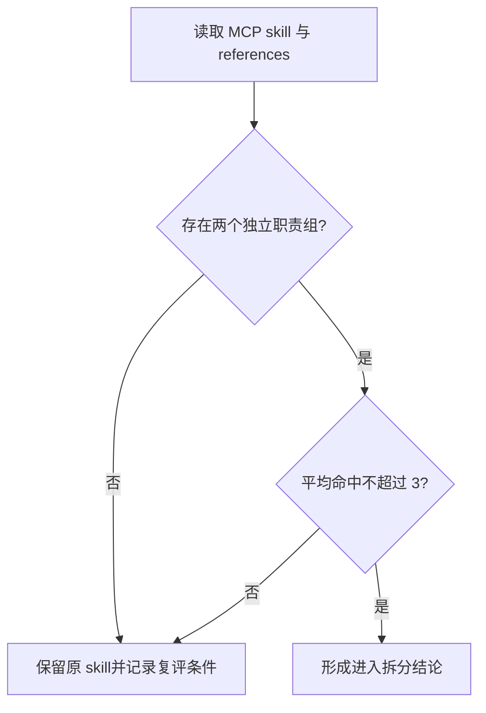

# 实施周期 07：MCP 工具路由复评

结论：本周期不预先拆 `mcp-installation-rules`，只验证浏览器 MCP、Godot MCP、CodeGraph 和配置补齐是否能形成两个以上独立触发职责组；影响：避免安装/注册/工具优先级被机械拆成多个高命中入口；范围：命中样本、配置 owner、references 分组和拆/不拆结论；非范围：不安装、启用、注册或连接 MCP，不创建新 skill；变化：将“可能拆分”改为有门槛的复评；完成标准：单任务完成路由矩阵、命中数、停止条件和结论审查；术语说明：MCP 指工具连接协议，provisioning 指安装、注册和首次可用性准备；本周期只检查路由职责，不执行真实 provisioning；验证状态：计划草案，等待用户 review。

## 当前周期目标

- 周期 ID / 期次定位：`CYCLE-SPLIT-07` / 第七期：条件复评。
- 只做这一件事：复评 `mcp-installation-rules` 是否满足分类二分和平均命中不超过 3 的条件。
- 对应文档：[`实施总览`](2026-07-16_114619_Skill体积治理与拆分_实施总览.md)、[`周期 06`](2026-07-16_114619_Skill体积治理与拆分_实施周期06_2D素材设计与生产交接.md)、[`验收标准`](../7-验收/2026-07-16_114619_Skill体积治理与拆分_验收标准.md)。
- 本周期不做：MCP 安装/注册/启用、浏览器联调、Godot 编辑器启动和 CodeGraph 重建。

## 周期图片资产决策与边界

- 图片资产决策：`N/A + 原因 + 证据`：复评只输出路由矩阵和文字结论，不需要 UI、截图或视觉产物。
- Mermaid 边界：候选类别、命中数和停止路径使用 Mermaid；图片不替代路由矩阵。

## 周期图片资产清单

| 图片 ID | 用途 / 生成输入 | 来源 | 相对路径 | 版本 | 关联 REQ/RULE / AC / CYCLE / TASK | 引用章节 | 敏感状态 | 版权状态 |
|---|---|---|---|---|---|---|---|---|
| 不适用：依据复评范围，无图片资产 | 不适用：依据路由矩阵范围，无图片输入 | 不适用：依据范围，无图片来源 | 不适用：依据范围，无图片路径 | 不适用：依据范围，无版本 | `REQ-SKILL-SPLIT-001` / `CYCLE-SPLIT-07` | 不适用：依据范围，无图片引用章节 | 不适用：依据范围，无图片敏感信息 | 不适用：依据范围，无图片版权对象 |

## 进入条件与收口条件

| 类型 | 条件 | 证据/命令 | 状态 |
|---|---|---|---|
| 进入 | 周期 06 的设计/生产复评已收口 | 周期 06 验证矩阵 | planned |
| 进入 | MCP skill 和 5 个 references 的当前 description、触发词和 owner 已读取 | UTF-8 回读、MD5 和路由清单 | planned |
| 收口 | 至少有两个独立触发组，平均稳定命中不超过 3，配置 owner 唯一 | `TEST-SPLIT-025` | planned |
| 收口 | 不满足条件时形成不拆结论和下一次复评条件，不创建新目录 | `TEST-SPLIT-025` 输出报告 | planned |

图形目的：说明 MCP 复评只有在独立职责和命中数门槛同时通过时才进入后续拆分，否则保留原 skill。关联 ID：`CYCLE-SPLIT-07`、`TASK-SPLIT-07-01`。

## 当前代码/文档基线

- 分支 / 提交：`40cae893706639eb2323328f84b70b1c3aba66d9`；`mcp-installation-rules` 未进入拆分状态。
- 已核实文件和符号：`mcp-installation-rules/SKILL.md`、`agents/openai.yaml`、`references/config-bootstrap.md`、`current-sources.md`、`execution-failure-casebook.md`、`project-signals.md`、`tool-priority.md`。
- 依赖版本与 local 配置：Python、本地样本和静态路由矩阵；不执行 MCP provisioning。
- 与计划不一致时的停止规则：发现复评需要真实连接、配置 owner 不唯一或触发样本无法稳定重复，记录 `GAP-SKILL-012` 并保留原 skill。

## 周期内最小任务执行顺序

| 顺序 | 任务 ID | 唯一目标 | 前置依赖 | 允许文件 | 禁止触碰区 | 状态 |
|---:|---|---|---|---|---|---|
| 1 | `TASK-SPLIT-07-01` | 生成 MCP 路由矩阵、命中数和拆/不拆结论 | 周期 06 收口 | `mapping/mcp-route-matrix.yaml`、复评报告 | MCP 配置、安装器、外部服务和新 skill 目录 | done（结论：no_split） |

## 文件与符号操作契约

| 任务 | 文件路径 | 符号/区段 | 操作 | 修改前职责 | 修改后职责 | 调用方影响 | 兼容要求 |
|---|---|---|---|---|---|---|---|
| `TASK-SPLIT-07-01` | `mcp-installation-rules/SKILL.md`、5 refs、`mapping/mcp-route-matrix.yaml` | description、触发条件、owner、边界 | 只读复评/新增报告 | 单一 provisioning 与工具路由入口 | 形成拆/不拆结论，不改变现有入口 | 后续若拆分另建计划 | 不安装、不连接、不改配置 |

## 最小任务闭环

### `TASK-SPLIT-07-01`：MCP 路由复评

- 唯一目标：用静态样本证明 MCP skill 是否存在两个以上独立职责，平均稳定命中是否不超过 3，并确定配置 owner。
- 允许文件：`doc/5-tests/2026-07-17_155229/skill-split-validation/mapping/mcp-route-matrix.yaml`、复评报告和本周期文档。
- 实施步骤与验证点：登记 provisioning、浏览器 MCP、Godot MCP、CodeGraph、配置补齐和工具优先级样本；运行 route-matrix validator；统计同一任务的平均命中数；记录进入拆分或保留原 skill 的结论。
- 失败预期：样本需要真实 MCP、命中数无法重复、配置 owner 不唯一或出现隐性安装动作时失败。
- 清理：保留复评报告，删除临时命中输出。
- 回滚：删除 mapping/report，原 skill 保持 active。
- 完成条件：`TEST-SPLIT-025` 通过，四类 `EVD-TASK-SPLIT-07-01-*` 证据齐全，且报告明确下一入口。
- 停止条件：任何真实连接、安装、注册或外部授权需求出现。
- 最大推进边界：本任务完成后只允许进入周期 08 复评，不创建 MCP 新 skill。

## 真实测试与断言

| 测试 ID | 对应任务 | 精确命令 | local 依赖 | fixture/数据 | 断言 | 失败预期 | 清理 |
|---|---|---|---|---|---|---|---|
| `TEST-SPLIT-025` | `TASK-SPLIT-07-01` | `python -X utf8 "doc/5-tests/2026-07-17_155229/skill-split-validation/validate_skill_split.py" --mode route-matrix --mapping "doc/5-tests/2026-07-17_155229/skill-split-validation/mapping/mcp-route-matrix.yaml"` | Python、静态 skill 文件 | provisioning/route 正反样本 | 两个独立职责证据、平均命中数、配置 owner 和停止条件均存在 | 连接外部 MCP、命中数超限或矩阵不完整 | 删除临时 route 输出，保留报告 |

## 回滚与停止条件

- `ROLLBACK-SKILL-SPLIT-07`：删除复评临时文件，保留 `mcp-installation-rules` 原目录和原引用；不执行安装、注册、启用、连接或配置写入。
- 停止条件：真实 MCP 连接需求、配置 owner 不唯一、命中数不稳定或 route matrix validator 失败。
- 恢复路径：回到 TASK-SPLIT-07-01 补静态样本；若无法补齐则保持原 skill 并把结论标为 gated。
- 当前 agent 最大推进边界：只完成复评报告，不进入 MCP 安装或新 skill 创建。

## 当前周期验证矩阵

| 任务 | 实现/落盘证据 | 真实测试证据 | 审查证据 | 验收证据 | 当前状态 |
|---|---|---|---|---|---|
| `TASK-SPLIT-07-01` | `EVD-TASK-SPLIT-07-01-IMPL`（`mapping/mcp-route-matrix.yaml`） | `EVD-TASK-SPLIT-07-01-TEST` / `TEST-SPLIT-025`（通过） | `EVD-TASK-SPLIT-07-01-REVIEW`（`evidence/TASK-SPLIT-07-01-mcp-route-review.md`） | `EVD-TASK-SPLIT-07-01-ACCEPT` / `AC-SKILL-SPLIT-002`（N/A：复评非拆分收口，结论已记录） | done |

## 周期追踪矩阵

| `REQ-*` / `RULE-*` | `AC-*` | `TASK-*` | 文件/符号 | `TEST-*` | `EVIDENCE-*` | 闭环状态 |
|---|---|---|---|---|---|---|
| `REQ-SKILL-SPLIT-001` | `AC-SKILL-SPLIT-002` | `TASK-SPLIT-07-01` | MCP SKILL、5 refs、`mcp-route-matrix.yaml` | `TEST-SPLIT-025` | `EVIDENCE-SKILL-ROLE-20260716`、`EVD-TASK-SPLIT-07-01-*` | done（结论：no_split） |

## 自审结论

- 每个任务是否只承载一个目标：是；本周期只有一个复评任务。
- 是否按实现 -> 真实测试 -> 审查 -> 验收逐个闭环：是；复评报告和 route-matrix validator 是任务证据。
- 是否存在未决决策或模糊落点：否；拆/不拆门槛和禁止 provisioning 已冻结。
- 图形、表格和正文是否一致：是；独立职责、命中数和保留路径一致。

## 执行附录

- local 环境：仅静态 skill 文件、Python 和 route fixture；不调用 MCP CLI、不写配置。
- 清理：删除临时矩阵输出，保留正式复评报告。
- 回滚：按 `ROLLBACK-SKILL-SPLIT-07` 删除本周期新增报告，恢复原入口。

## 追踪附录

- 来源回指：`SRC-SKILL-SPLIT-20260716` -> [`REQ-SKILL-SPLIT-20260716`](../2-需求/2026-07-16_114619_Skill体积治理与拆分.md) -> [`AC-SKILL-SPLIT-20260716`](../7-验收/2026-07-16_114619_Skill体积治理与拆分_验收标准.md) -> `CYCLE-SPLIT-07`。
- 复评结论状态：`concluded: no_split`；`mapping/mcp-route-matrix.yaml` 的 `conclusion` 字段记录了体积证据（16,880B 仅超 normal_max 880B）与独立性证据（co_occurrence_rate=0.4 超过本轮 0.34 判据）两方面理由，判定 `mcp-installation-rules` 当前不拆分；下次复评触发条件：体积超过 `hard_warning_bytes`，或新增第三类与现有 provisioning/routing 完全解耦的职责。
