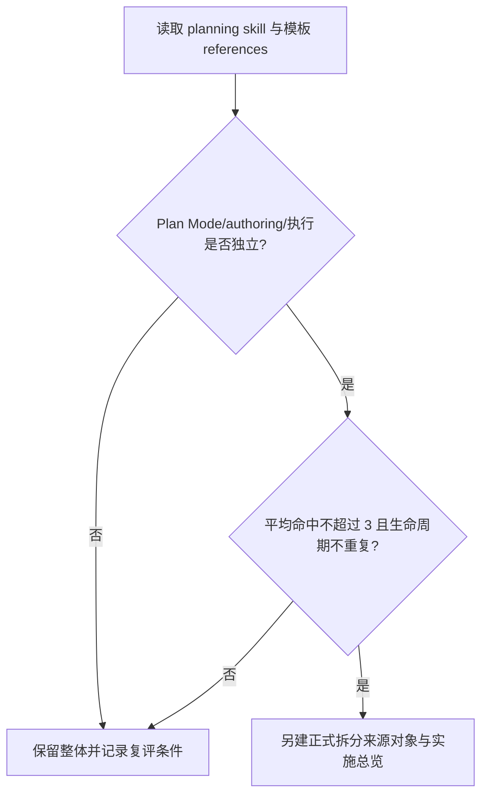

# 实施周期 08：实施规划职责复评

结论：本周期不直接拆 `implementation-planning-rules`，而是验证 Plan Mode 路由、计划 authoring、实施周期/最小任务契约和全量顺序总表是否存在两个以上可独立触发职责；影响：避免把强生命周期耦合的计划规则拆成多个入口后造成重复命中和流程断裂；范围：命中样本、references 路由、周期模板、全量顺序入口和暂缓项复评；非范围：不修改 planning skill、不创建新 skill、不进入编码；变化：把“体积大所以拆”改为“命中和生命周期证据不足则保留”；完成标准：一个复评任务完成 route matrix、命中数、拆/不拆结论、停止条件和后续入口；术语说明：Plan Mode 是计划型请求的第一层路由，实施周期是执行顺序边界，全量顺序方案是跨来源总调度表；验证状态：计划草案，等待用户 review。

## 当前周期目标

- 周期 ID / 期次定位：`CYCLE-SPLIT-08` / 第八期：规划复评。
- 只做这一件事：复评 `implementation-planning-rules` 和暂缓项是否满足职责拆分条件。
- 对应文档：[`实施总览`](2026-07-16_114619_Skill体积治理与拆分_实施总览.md)、[`周期 07`](2026-07-16_114619_Skill体积治理与拆分_实施周期07_MCP工具路由复评.md)、[`验收标准`](../7-验收/2026-07-16_114619_Skill体积治理与拆分_验收标准.md)。
- 本周期不做：Planning skill 修改、模板拆分、Plan Mode 路由变更和正式编码。

## 周期图片资产决策与边界

- 图片资产决策：`N/A + 原因 + 证据`：复评只处理路由矩阵、模板依赖和文档结论，不需要图片资产。
- Mermaid 边界：Plan Mode、全量顺序和周期执行的依赖用 Mermaid；图片不替代计划结构。

## 周期图片资产清单

| 图片 ID | 用途 / 生成输入 | 来源 | 相对路径 | 版本 | 关联 REQ/RULE / AC / CYCLE / TASK | 引用章节 | 敏感状态 | 版权状态 |
|---|---|---|---|---|---|---|---|---|
| 不适用：依据复评范围，无图片资产 | 不适用：依据计划路由范围，无图片输入 | 不适用：依据范围，无图片来源 | 不适用：依据范围，无图片路径 | 不适用：依据范围，无版本 | `REQ-SKILL-SPLIT-002` / `CYCLE-SPLIT-08` | 不适用：依据范围，无图片引用章节 | 不适用：依据范围，无图片敏感信息 | 不适用：依据范围，无图片版权对象 |

## 进入条件与收口条件

| 类型 | 条件 | 证据/命令 | 状态 |
|---|---|---|---|
| 进入 | 周期 07 已形成 MCP 拆/不拆复评结论 | 周期 07 验证矩阵 | planned |
| 进入 | planning skill、references、全量顺序模板、周期模板和最小任务契约已冻结 | UTF-8 回读、MD5 和路由清单 | planned |
| 收口 | 触发对象、平均命中数、生命周期耦合和暂缓项复评结果齐全 | `TEST-SPLIT-026` | planned |
| 收口 | 若进入拆分，输出新的来源对象/实施总览前置条件；若不进入，输出复评日期和证据 | `TEST-SPLIT-026` 报告 | planned |

图形目的：说明 planning skill 只有在 route matrix 同时证明职责独立、命中数稳定和生命周期不重复时才允许另建拆分计划，否则保留整体。关联 ID：`CYCLE-SPLIT-08`、`TASK-SPLIT-08-01`。

## 当前代码/文档基线

- 分支 / 提交：`40cae893706639eb2323328f84b70b1c3aba66d9`；`implementation-planning-rules` 保持整体 active。
- 已核实文件和符号：`implementation-planning-rules/SKILL.md`、`plan-entry-checklist.md`、`plan-structure-template.md`、`implementation-cycle-template.md`、`minimum-task-execution-contract.md`、`full-sequence-master-plan.md`、`plan-output-gate.md`、`plan-review-checklist.md`。
- 依赖版本与 local 配置：Python 和本地 Markdown；不进入 Plan Mode 外部工具调用，不执行代码。
- 与计划不一致时的停止规则：发现任何拆分会使同一个请求平均命中超过 3、周期模板与全量顺序职责重复或普通模型需要自行补决策，记录 `GAP-SKILL-013` 并保持整体。

## 周期内最小任务执行顺序

| 顺序 | 任务 ID | 唯一目标 | 前置依赖 | 允许文件 | 禁止触碰区 | 状态 |
|---:|---|---|---|---|---|---|
| 1 | `TASK-SPLIT-08-01` | 生成 planning 与暂缓项的命中/生命周期复评结论 | 周期 07 收口 | `mapping/planning-route-matrix.yaml`、复评报告、本周期文档 | planning skill、模板、字典和任何新 skill | planned |

## 文件与符号操作契约

| 任务 | 文件路径 | 符号/区段 | 操作 | 修改前职责 | 修改后职责 | 调用方影响 | 兼容要求 |
|---|---|---|---|---|---|---|---|
| `TASK-SPLIT-08-01` | planning SKILL、references、`mapping/planning-route-matrix.yaml` | Plan Mode、authoring、cycle、master plan、task contract | 只读复评/新增报告 | 一个强耦合计划入口 | 形成拆/不拆结论，不改现有路由 | 后续若拆分另建来源对象 | 不修改 planning skill |

## 最小任务闭环

### `TASK-SPLIT-08-01`：planning 复评

- 唯一目标：证明 planning skill 是否存在可独立触发且不重复生命周期的职责组，并给出拆/不拆结论。
- 允许文件：`doc/5-tests/2026-07-17_155229/skill-split-validation/mapping/planning-route-matrix.yaml`、复评报告和本周期文档。
- 实施步骤与验证点：登记 Plan Mode、计划 authoring、实施周期/任务契约、全量顺序、输出门禁和自审样本；统计平均命中；检查每组是否能独立闭环；写明不拆理由或进入新需求/总览的前置条件。
- 失败预期：无法复现命中、生命周期重复、命中数超过 3、样本需要编码授权或报告缺少停止条件时失败。
- 清理：保留复评报告，删除临时 route 输出。
- 回滚：删除 mapping/report，planning skill 保持 active。
- 完成条件：`TEST-SPLIT-026` 通过，四类 `EVD-TASK-SPLIT-08-01-*` 证据齐全，输出正式的拆/不拆结论。
- 停止条件：需要修改 planning skill 才能完成复评，或无法证明独立职责。
- 最大推进边界：本任务完成后停止；若要拆分，必须新建来源对象、验收标准和实施总览，不从本周期直接进入编码。

## 真实测试与断言

| 测试 ID | 对应任务 | 精确命令 | local 依赖 | fixture/数据 | 断言 | 失败预期 | 清理 |
|---|---|---|---|---|---|---|---|
| `TEST-SPLIT-026` | `TASK-SPLIT-08-01` | `python -X utf8 "doc/5-tests/2026-07-17_155229/skill-split-validation/validate_skill_split.py" --mode route-matrix --mapping "doc/5-tests/2026-07-17_155229/skill-split-validation/mapping/planning-route-matrix.yaml"` | Python、本地 skill 文档 | Plan Mode、authoring、cycle、master plan 正反样本 | 独立职责、平均命中、生命周期和拆/不拆结论齐全 | route matrix 不完整或命中超限 | 删除临时输出，保留复评报告 |

## 回滚与停止条件

- `ROLLBACK-SKILL-SPLIT-08`：删除复评 mapping/report，保持 `implementation-planning-rules`、模板、字典和路由不变。
- 停止条件：需要修改 planning skill、命中数不稳定、生命周期重复、普通模型需要自行补决策或 route matrix 失败。
- 恢复路径：回到 TASK-SPLIT-08-01 补静态样本；若仍无法证明独立职责，结论固定为暂缓，不另建新 skill。
- 当前 agent 最大推进边界：本周期最多输出复评结论，不创建新 skill、不修改规划规则、不进入编码。

## 当前周期验证矩阵

| 任务 | 实现/落盘证据 | 真实测试证据 | 审查证据 | 验收证据 | 当前状态 |
|---|---|---|---|---|---|
| `TASK-SPLIT-08-01` | `EVD-TASK-SPLIT-08-01-IMPL`（`mapping/planning-route-matrix.yaml`） | `EVD-TASK-SPLIT-08-01-TEST` / `TEST-SPLIT-026`（通过） | `EVD-TASK-SPLIT-08-01-REVIEW`（`evidence/TASK-SPLIT-08-01-planning-role-review.md`） | `EVD-TASK-SPLIT-08-01-ACCEPT` / `AC-SKILL-SPLIT-002`（N/A：复评非拆分收口，结论已记录） | done |

## 周期追踪矩阵

| `REQ-*` / `RULE-*` | `AC-*` | `TASK-*` | 文件/符号 | `TEST-*` | `EVIDENCE-*` | 闭环状态 |
|---|---|---|---|---|---|---|
| `REQ-SKILL-SPLIT-001`、`REQ-SKILL-SPLIT-002` | `AC-SKILL-SPLIT-002` | `TASK-SPLIT-08-01` | planning SKILL、references、`planning-route-matrix.yaml` | `TEST-SPLIT-026` | `EVIDENCE-SKILL-ROLE-20260716`、`EVIDENCE-SKILL-HISTORY-20260716`、`EVD-TASK-SPLIT-08-01-*` | done（结论：no_split） |

## 自审结论

- 每个任务是否只承载一个目标：是；本周期只有一个复评任务。
- 是否按实现 -> 真实测试 -> 审查 -> 验收逐个闭环：是；复评报告和 route-matrix validator 是任务证据。
- 是否存在未决决策或模糊落点：否；拆/不拆门槛、命中数和新来源对象条件已冻结。
- 图形、表格和正文是否一致：是；Planning 独立性、命中数和保留路径一致。

## 执行附录

- local 环境：仅本地 Markdown、Python 和静态 route fixture；不修改 planning skill，不执行编码。
- 清理：删除临时 route 输出，保留正式复评报告。
- 回滚：按 `ROLLBACK-SKILL-SPLIT-08` 删除本周期新增报告，恢复原 planning 入口。

## 追踪附录

- 来源回指：`SRC-SKILL-SPLIT-20260716` -> [`REQ-SKILL-SPLIT-20260716`](../2-需求/2026-07-16_114619_Skill体积治理与拆分.md) -> [`AC-SKILL-SPLIT-20260716`](../7-验收/2026-07-16_114619_Skill体积治理与拆分_验收标准.md) -> `CYCLE-SPLIT-08`。
- 复评结论状态：`concluded: no_split`；`mapping/planning-route-matrix.yaml` 的 `conclusion` 字段记录了体积证据（SKILL.md 39,147B 超过 hard_warning 15,147B，约63%）与独立性证据（0/3 非核心候选组能脱离核心 authoring 组独立命中，且 Plan Mode 已被 AGENTS.md 硬编码为强耦合第一层路由）两方面理由，判定 `implementation-planning-rules` 当前不适合按候选组拆分；推荐后续路径是 SKILL.md 内部去重压缩（参照 `CYCLE-SPLIT-05` 对 `browser-session-automation-rules` 的处理方式），但该整改形状需要新建来源对象、验收标准和独立实施总览才能授权推进，不在本周期范围内。
