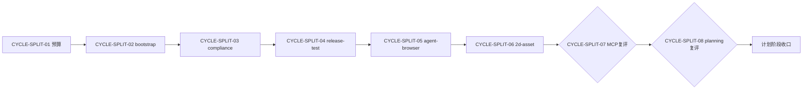
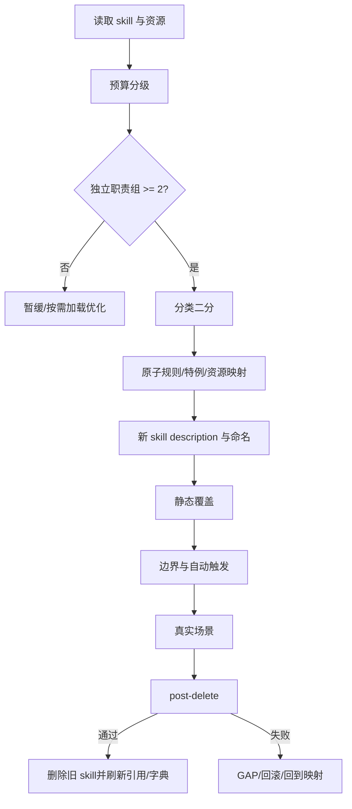
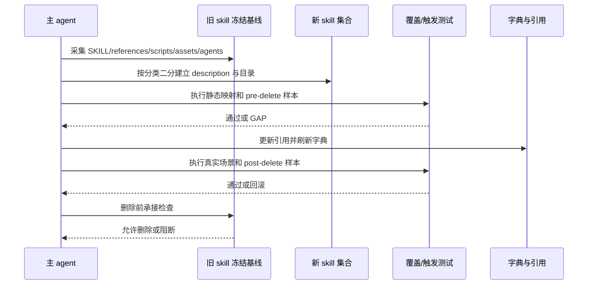

# 需求实施总览：Skill 体积治理与职责拆分

结论：先以可量化预算筛出高风险 skill，再按“职责二分 -> 全量映射 -> 多轮触发验证 -> 删除前承接检查”的单 skill 垂直闭环逐个推进；影响：减少规则合并读取被截断、降低误命中和职责抢占；范围：候选 skill、通用测试入口、fixture 路由和删除门禁；非范围：本轮不修改真实 skill 资产、不删除旧目录、不刷新字典；变化：每个候选先获得 size/mapping/trigger/pre/post-delete 统一入口和越界失败边界；完成标准：计划完整落盘，周期 01 三个任务逐个完成四项闭环，后续任务仍按周期门禁推进；术语说明：默认文本包指 `SKILL.md` 与本 skill 直接 references 的总文本大小，fixture 指当前测试时间戳目录内的离线样本；验证状态：统计报告、候选矩阵和周期 01 通用测试入口均已完成闭环，真实 skill 资产仍未修改。

## 1. 当前计划最终方案简要说明

- 推荐方案一句话结论：先落地预算与候选冻结，再优先拆 `project-agents-bootstrap`、`skill-compliance-gate-rules`、`project-release-test-rules`、`agent-browser` 和 `2d-asset-design`。
- 主落点 / 主路径：`SKILL.md` 只保留触发、流程、边界、暂停条件、通过标准和 references 路由；独立职责进入平级新 skill；旧 skill 作为冻结基线，直到删除前门禁通过。
- 为什么先走这条路线：当前最大风险不是单纯字节数，而是大正文与并列触发对象同时存在；先冻结预算能避免将资源多但职责单一的 skill 机械拆碎。

## 2. 基本信息

- 对应需求文档：`doc/2-需求/2026-07-16_114619_Skill体积治理与拆分.md`
- 来源对象标识：`SRC-SKILL-SPLIT-20260716`
- 当前实施文档命名主干：`2026-07-16_114619_Skill体积治理与拆分`
- 对应需求与实施计划全量顺序实施方案：`doc/3-实施/2026-07-16_114619_Skill体积治理与拆分_需求与实施计划全量顺序实施方案.md`
- 对应验收标准文档：`doc/7-验收/2026-07-16_114619_Skill体积治理与拆分_验收标准.md`
- 对应最终验收文档：`N/A + 原因 + 证据：本轮只请求计划，最终验收在 skill 拆分实施完成后新建`
- Agent 理解的问题 / 目标：将当前体积较大、合并读取易截断且职责存在并列触发组的 skill 识别出来，给出不丢规则、可验证、可回滚的拆分执行顺序。
- 当前计划范围：预算、候选评级、P0/P1 拆分设计、P2/复评边界、资源迁移、触发测试、字典/引用更新、旧 skill 删除门禁。
- 明确不在范围：本轮不修改真实 skill 的 `SKILL.md`、`references`、`scripts`、`agents`、字典源、`AGENTS.md`、`CLAUDE.md`；允许修改当前测试目录 README、Python/PowerShell 入口和离线 fixture；不提交、不推送、不连接业务环境。
- 当前优先闭环：`CYCLE-SPLIT-01` 预算与候选冻结；后续任何拆分必须从该周期收口后开始。
- 关键假设 / 待确认点：预算阈值采用推荐值；`implementation-planning-rules` 只有在命中数与生命周期耦合验证通过后才决定是否拆；用户 review 后才获得实施授权。
- 当前状态：`in_progress`，当前闭环为 `CYCLE-SPLIT-01 / TASK-SPLIT-01-03`。
- 是否已获得开始实施授权：是；授权统计、候选矩阵、测试脚本、fixture 和 README 证据，不授权真实 skill 资产修改、删除、字典刷新或 Git 历史写入。
- `unresolved_decisions`：无 P0/P1 未决决策；阈值是本计划冻结的推荐方案，若用户否决需回到 `CYCLE-SPLIT-01` 更新。

### 计划决策回指

| 决策 ID | 决策 | 影响周期 | 回指来源 |
|---|---|---|---|
| `DEC-SKILL-SIZE-BUDGET-20260716` | 预算阈值采用 16,000 B / 20,000 B / 24,000 B 与 12,000 B / 16,000 B reference、48,000 B / 64,000 B 文本包分级 | `CYCLE-SPLIT-01` 至 `CYCLE-SPLIT-08` | `REQ-SKILL-SIZE-001` |
| `DEC-SKILL-SPLIT-BINARY-20260716` | 每轮先做分类二分，只有过载组才递归二分 | `CYCLE-SPLIT-02` 至 `CYCLE-SPLIT-08` | `REQ-SKILL-SPLIT-002` |
| `DEC-SKILL-SPLIT-DELETE-GATE-20260716` | 覆盖、触发、资源、引用和删除前检查全部通过后才允许旧 skill 下线 | `CYCLE-SPLIT-02` 至 `CYCLE-SPLIT-06` | `REQ-SKILL-SPLIT-005` |
| `DEC-SKILL-SPLIT-PLAN-ONLY-20260716` | 当前轮允许完成统计、候选矩阵和计划文档证据，不修改 skill 资产、不删除旧目录、不刷新字典、不写 Git 历史 | `CYCLE-SPLIT-01` | 当前用户授权和 `REQ-SKILL-SPLIT-20260716` |

## 3. 实施周期总览

- 总周期说明：8 个顺序周期；前 6 个为 P0/P1 进入项，后 2 个为条件复评，不允许跳周期。
- 本次计划拆分的子任务周期数：8。
- 周期拆分原则：一个周期只承载一个 skill 或一个全局预算目标；每个任务只承载一个垂直切片，预计改动文件默认不超过 5 个。
- 周期排序说明：先冻结预算和候选，再按风险与依赖依次处理控制面、交付测试、浏览器和游戏资产；MCP 与规划 skill 只有复评通过才进入。

| 顺序 | 周期 ID | 期次定位 | 单一周期目标 | 进入条件 | 收口条件 | 依赖 |
|---:|---|---|---|---|---|---|
| 1 | `CYCLE-SPLIT-01` | 第一期：地基 | 冻结预算与候选分级 | 需求/验收/当前盘点已落盘 | 统计、阈值、候选和暂缓证据通过 | 无 |
| 2 | `CYCLE-SPLIT-02` | 第二期：规则自举 | 只拆 `project-agents-bootstrap` | CYCLE-01 通过 | 新旧规则映射、fixture 双跑和引用清理通过 | CYCLE-01 |
| 3 | `CYCLE-SPLIT-03` | 第三期：合规收口 | 只拆 `skill-compliance-gate-rules` | CYCLE-02 通过 | 唯一 PASS/FAIL owner 和状态渲染边界通过 | CYCLE-02 |
| 4 | `CYCLE-SPLIT-04` | 第四期：上线测试 | 只拆 `project-release-test-rules` | CYCLE-03 通过 | baseline 与执行/报告/放行职责独立 | CYCLE-03 |
| 5 | `CYCLE-SPLIT-05` | 第五期：浏览器工具 | 只拆 `agent-browser` | CYCLE-04 通过 | session/automation 与 advanced testing 触发通过 | CYCLE-04 |
| 6 | `CYCLE-SPLIT-06` | 第六期：游戏资产 | 只拆 `2d-asset-design` | CYCLE-05 通过 | design gate 与 production handoff 等价承接 | CYCLE-05 |
| 7 | `CYCLE-SPLIT-07` | 第七期：条件复评 | 复评 `mcp-installation-rules` | CYCLE-06 通过 | 命中数、配置 owner 和二分证据通过 | CYCLE-06 |
| 8 | `CYCLE-SPLIT-08` | 第八期：规划复评 | 复评 `implementation-planning-rules` 与暂缓项 | CYCLE-07 通过 | 形成拆/不拆决议，不自动开工 | CYCLE-07 |

### 周期依赖图

图形目的：说明所有周期严格按顺序闭环，条件复评不能跳过前置拆分。关联 ID：`CYCLE-SPLIT-01` 至 `CYCLE-SPLIT-08`。



### 周期文档回指

| 周期 | 周期文档 | 任务承载 |
|---|---|---|
| `CYCLE-SPLIT-01` | `[预算与候选冻结](2026-07-16_114619_Skill体积治理与拆分_实施周期01_预算与候选冻结.md)` | `TASK-SPLIT-01-01` 至 `TASK-SPLIT-01-03` |
| `CYCLE-SPLIT-02` | `[规则文件与项目记忆自举](2026-07-16_114619_Skill体积治理与拆分_实施周期02_规则文件与项目记忆自举.md)` | `TASK-SPLIT-02-01` 至 `TASK-SPLIT-02-05` |
| `CYCLE-SPLIT-03` | `[技能合规与代码收口](2026-07-16_114619_Skill体积治理与拆分_实施周期03_技能合规与代码收口.md)` | `TASK-SPLIT-03-01` 至 `TASK-SPLIT-03-03` |
| `CYCLE-SPLIT-04` | `[接口基线与上线测试执行](2026-07-16_114619_Skill体积治理与拆分_实施周期04_接口基线与上线测试执行.md)` | `TASK-SPLIT-04-01` 至 `TASK-SPLIT-04-04` |
| `CYCLE-SPLIT-05` | `[浏览器会话与高级验证](2026-07-16_114619_Skill体积治理与拆分_实施周期05_浏览器会话与高级验证.md)` | `TASK-SPLIT-05-01` 至 `TASK-SPLIT-05-04` |
| `CYCLE-SPLIT-06` | `[2D素材设计与生产交接](2026-07-16_114619_Skill体积治理与拆分_实施周期06_2D素材设计与生产交接.md)` | `TASK-SPLIT-06-01` 至 `TASK-SPLIT-06-04` |
| `CYCLE-SPLIT-07` | `[MCP工具路由复评](2026-07-16_114619_Skill体积治理与拆分_实施周期07_MCP工具路由复评.md)` | `TASK-SPLIT-07-01` |
| `CYCLE-SPLIT-08` | `[实施规划职责复评](2026-07-16_114619_Skill体积治理与拆分_实施周期08_实施规划职责复评.md)` | `TASK-SPLIT-08-01` |

## 4. 阶段计划

| 阶段 | 周期 | 唯一目标 | 输入 | 输出 | 验证门槛 |
|---|---|---|---|---|---|
| `PHASE-SPLIT-01` | CYCLE-01 | 只冻结体积预算和候选矩阵 | 当前 84 个 skill 统计 | 预算报告、候选分级、暂缓项证据 | 统计脚本、指纹、UTF-8 通过 |
| `PHASE-SPLIT-02` | CYCLE-02 | 只完成 bootstrap 的职责二分设计与承接 | CYCLE-01 | 两个新 skill、映射表、fixture 方案 | 规则映射 100%、双跑方案完整 |
| `PHASE-SPLIT-03` | CYCLE-03 | 只完成 compliance 的最终合规职责二分 | CYCLE-02 | 新 skill、唯一 owner、触发样本 | PASS/FAIL 唯一归属且不抢总结渲染 |
| `PHASE-SPLIT-04` | CYCLE-04 | 只完成 release-test 的 baseline/执行二分 | CYCLE-03 | 新 skill、engine 归属和测试样本 | 真实 engine 场景等价 |
| `PHASE-SPLIT-05` | CYCLE-05 | 只完成 browser 的 session/advanced 二分 | CYCLE-04 | 新 skill、命令/模板迁移和触发样本 | 核心 CLI 与高级验证均通过 |
| `PHASE-SPLIT-06` | CYCLE-06 | 只完成 2D 设计/生产二分 | CYCLE-05 | 新 skill、资产资源迁移和前后依赖 | 设计确认与生产交接均可独立解释 |
| `PHASE-SPLIT-07` | CYCLE-07 | 只对 MCP 做是否拆分复评 | CYCLE-06 | 拆/不拆决议和 route 样本 | 平均命中不超过 3 |
| `PHASE-SPLIT-08` | CYCLE-08 | 只对 planning 与暂缓项做复评 | CYCLE-07 | 复评报告，不直接修改 | 触发数与职责独立性有证据 |

## 5. 最小任务清单

任务执行顺序固定为：当前周期内按顺序逐个完成“实现/文档落盘 -> 真实测试 -> 审查 -> 验收”，周期收口后才进入下一周期。当前 `TASK-SPLIT-01-01` 与 `TASK-SPLIT-01-02` 已完成，`TASK-SPLIT-01-03` 正在闭环，后续周期仍为 planned，不能视为已实施。

| 任务 ID | 周期/顺序 | 垂直切片目标 | 允许文件/符号 | 预计文件数 | 真实测试 | 完成条件 | 停止条件 |
|---|---|---|---|---:|---|---|---|
| `TASK-SPLIT-01-01` | C01/1 | 生成全仓体积与文本包统计 | `doc/5-tests/2026-07-17_155229/skill-split-validation/skill_size_report.py`、`doc/5-tests/2026-07-17_155229/skill-split-validation/skill-size-report.json` | 2 | `python -X utf8 "doc/5-tests/2026-07-17_155229/skill-split-validation/skill_size_report.py" --root "D:\\luode\\luode-skills" --output "doc/5-tests/2026-07-17_155229/skill-split-validation/skill-size-report.json"` | 84 个 skill 均有 SKILL、reference、默认文本包结果 | 统计失败、编码异常或结果数量不为 84 |
| `TASK-SPLIT-01-02` | C01/2 | 冻结预算、候选和暂缓清单 | 四份计划文档、`doc/5-tests/2026-07-17_155229/skill-split-validation/mapping/candidate-matrix.yaml` | 5 | 运行 `validate_engineering_docs.py` 的 requirement、acceptance、implementation_master、implementation_overview profile；另执行 UTF-8 Python YAML 结构断言 | 阈值、分级、正式/扩展种子边界、候选顺序、路径、决策 ID、追踪和图片决策一致 | 任一 profile 失败、矩阵 YAML 损坏、数量/哈希/名称集合不一致或 P0/P1 二分证据缺失 |
| `TASK-SPLIT-01-03` | C01/3 | 建立通用拆分覆盖/触发测试入口 | `doc/5-tests/2026-07-17_155229/skill-split-validation/validate_skill_split.py`、`doc/5-tests/2026-07-17_155229/skill-split-validation/run_trigger_cases.ps1`、`doc/5-tests/2026-07-17_155229/技能拆分验证/README.md`、`cases/*.json` | 5 | Python/PowerShell help、all、pre-delete、post-delete、`py_compile` 和路径越界负向命令 | 五类模式、required/forbidden、pre/post 状态、UTF-8、退出码和仓库/fixture 路径边界均可复核 | 测试入口不可用、路径越界未拒绝、fixture 路由不稳定、真实 skill 被修改或删除 |
| `TASK-SPLIT-02-01` | C02/1 | 原子化 bootstrap 规则与资源 | baseline 清单、映射表、旧 SKILL 只读基线 | 3 | 静态规则计数 | 每条必须/阻断/特例有 ID | 规则/资源无法分类 |
| `TASK-SPLIT-02-02` | C02/2 | 建立规则文件自举新 skill 骨架 | 两个新 `SKILL.md`、两个 `agents/openai.yaml` | 4 | skill 结构校验 | description 独立且边界不重叠 | 新名无法脱离旧上下文理解 |
| `TASK-SPLIT-02-03` | C02/3 | 迁移同步脚本与模板承接 | `bootstrap_agents.sh`、新 references、迁移说明 | 4 | `bash -n` + fixture 首次运行 | AGENTS/CLAUDE 生成等价 | 脚本主 owner 不唯一 |
| `TASK-SPLIT-02-04` | C02/4 | 更新路由、引用和字典源 | `AGENTS.md`、`CLAUDE.md`、`README.md`、`编码skill.md`、`项目设计.md` | 5 | `rg` 悬空引用检查 | 旧 skill 不再是主入口 | 任一引用仍依赖旧 skill |
| `TASK-SPLIT-02-05` | C02/5 | bootstrap 删除前承接与回滚 | 映射、测试、删除检查材料 | 3 | pre/post delete 触发样本 | 100% 覆盖后才允许删除 | 覆盖或触发任一失败 |
| `TASK-SPLIT-03-01` | C03/1 | 原子化 compliance 规则 | 旧 SKILL、两份 reference、映射 | 4 | 静态覆盖脚本 | 链完整性/代码收口职责分开 | PASS/FAIL owner 不清 |
| `TASK-SPLIT-03-02` | C03/2 | 迁移最终合规与代码变更收口 | 两个新 SKILL、agents、references | 5 | description 触发样本 | reasoning-summary 的阻断渲染权不变 | 出现第二阻断渲染 owner |
| `TASK-SPLIT-03-03` | C03/3 | compliance pre/post delete 验证 | 测试样本、字典、引用清单 | 4 | `python` + `pwsh` | 命中、边界、删除检查通过 | 任一场景抢入口 |
| `TASK-SPLIT-04-01` | C04/1 | 原子化 baseline 与 release execution 规则 | 旧 SKILL、14 refs、engine 清单 | 4 | 静态映射 | storage/discovery 与 runner/report 分组 | 共享 engine 无主承接 |
| `TASK-SPLIT-04-02` | C04/2 | 迁移接口基线职责 | baseline/openapi/dependency references、对应 SKILL | 4 | baseline fixture | inventory、漂移、参数依赖语义等价 | OpenAPI 双索引丢失 |
| `TASK-SPLIT-04-03` | C04/3 | 迁移执行、报告和放行职责 | runner/report/gate references、对应 SKILL | 4 | `python -m unittest` 既有 engine tests | 真实 engine 仍可运行 | local 测试失败 |
| `TASK-SPLIT-04-04` | C04/4 | release-test 删除前验证 | 触发样本、映射、字典、引用 | 4 | pre/post delete | 旧入口下线且 engine 唯一归属 | 任何接口结果语义改变 |
| `TASK-SPLIT-05-01` | C05/1 | 原子化 browser 核心自动化与高级验证 | 旧 SKILL、commands/auth/session refs | 4 | 静态映射 | 两组可独立触发 | CLI 核心命令被分散无主 |
| `TASK-SPLIT-05-02` | C05/2 | 迁移 session/automation 资源 | 新 SKILL、commands/auth/session/snapshot refs | 5 | session/auth 场景 | profile、session、refs、eval 等价 | 认证/清理语义丢失 |
| `TASK-SPLIT-05-03` | C05/3 | 迁移 advanced testing 资源 | 新 SKILL、diff/proxy/video/profiling refs、templates | 5 | HAR/diff/trace 场景 | 高级验证可独立命中 | 普通 Chrome 路由被抢 |
| `TASK-SPLIT-05-04` | C05/4 | browser 删除前承接 | 测试 README、映射、字典、引用 | 4 | pre/post delete | 旧 skill 删除条件全通过 | 真实场景演练失败 |
| `TASK-SPLIT-06-01` | C06/1 | 原子化设计闸门与生产交接规则 | 旧 SKILL、design refs、production refs | 4 | 静态映射 | 设计/生产边界有前后依赖说明 | 两组无法独立描述 |
| `TASK-SPLIT-06-02` | C06/2 | 迁移设计确认与原创质量资源 | 新 SKILL、prompt/quality/preview/spec refs | 5 | 设计预览样本 | 参考筛选、原创、质量门禁等价 | 设计确认条件丢失 |
| `TASK-SPLIT-06-03` | C06/3 | 迁移生产、动画、地图和后处理资源 | 新 SKILL、scripts、production refs、agents | 5 | 资产后处理离线 fixture | sprite/map/Godot 交付等价 | 资产路径或脚本失败 |
| `TASK-SPLIT-06-04` | C06/4 | 2D asset 删除前承接 | 测试 README、映射、字典、引用 | 4 | design/production 真实演练 | 前后周期交接可复核 | 设计与生产互相抢入口 |
| `TASK-SPLIT-07-01` | C07/1 | MCP 二分独立性复评 | MCP SKILL、5 refs、触发样本 | 4 | 命中数统计 | 仅在平均命中 <=3 时进入 | config owner 不唯一 |
| `TASK-SPLIT-08-01` | C08/1 | planning 与暂缓项复评 | planning SKILL、refs、触发样本 | 4 | route matrix | 只输出拆/不拆决议 | 计划生命周期重复命中 |

### 单任务通用执行契约

- 前置条件：所属周期已收口、上游 ID 已确认、代码/文档基线未漂移、当前任务允许文件已冻结。
- 实施动作：只修改允许文件；原子规则逐条编号；新 description 先写再反推名称；资源按主承接迁移。
- 真实测试：使用 local 文件和 fixture；不得连接 test/prod；不得用 build、lint、人工阅读替代行为验证。
- 审查与验收：完成当前任务的实现审查、覆盖映射和 `AC-SKILL-SPLIT-*` 对照后，才允许下一任务。
- 回滚：任一断言失败恢复旧 skill 冻结基线，保留失败证据，回到原子化/映射阶段。
- 最大推进边界：当前任务闭环后停止，不自动推进下一个任务或删除旧 skill。

## 6. 现状与落点

- 现有核心目录：`project-agents-bootstrap/`、`skill-compliance-gate-rules/`、`project-release-test-rules/`、`agent-browser/`、`2d-asset-design/`、`mcp-installation-rules/`、`implementation-planning-rules/`。
- 复用点：`skill-split-preserve-rules` 的映射/命名/验证 references；2026-04 拆分测试的 pre-delete/post-delete 触发脚本结构；`skill-dictionary/generate_dictionary.py`；`artifact-delivery-gate-rules/scripts/validate_engineering_docs.py`；`project-release-test-rules` 既有 engine tests。
- 图片资产决策：`N/A + 原因 + 证据`。本计划表达的是流程、依赖、状态和追踪关系，全部由 Mermaid、表格和文本完成；不需要 UI、截图或外观基线图片。

### 计划新增文件目录树

```text
doc/5-tests/2026-07-17_155229/
├── 技能拆分验证/
│   └── README.md                           # 当前拆分批次测试说明与命中矩阵
└── skill-split-validation/                 # ASCII 真实测试资产路径镜像
    ├── skill_size_report.py                # 全仓体积与默认文本包统计入口
    ├── validate_skill_split.py             # 静态规则/资源/映射覆盖验证入口
    ├── run_trigger_cases.ps1               # pre-delete/post-delete 触发验证入口
    ├── mapping/
    │   ├── candidate-matrix.yaml            # 预算、候选、职责组和停止条件
    │   └── bootstrap-rules.yaml             # bootstrap 原子规则与资源覆盖表
    └── cases/
        ├── README.md                        # 正向、反向、边界和真实场景样本说明
        └── local-browser/                   # agent-browser 本地静态页面样本

project-rule-file-bootstrap-rules/
├── SKILL.md                               # AGENTS/CLAUDE 与仓库规则文件自举
├── agents/openai.yaml                     # 新 skill 元信息
└── references/                            # 规则文件模板和同步边界

project-memory-file-bootstrap-rules/
├── SKILL.md                               # PROJECT_CURRENT/MEMORY/HISTORY/STYLE 编排入口
├── agents/openai.yaml                     # 新 skill 元信息
└── references/                            # 四件套检测与交接边界

skill-execution-compliance-gate-rules/     # skill 链完整性、失败路由和运行时合规
code-change-finalization-gate-rules/       # 代码改动收口与最终 PASS/FAIL 汇聚
project-interface-baseline-rules/          # 上线接口基线、OpenAPI 双索引、漂移和参数图
project-interface-release-execution-rules/ # 执行器、报告、放行和测试资产
browser-session-automation-rules/          # agent-browser 核心 session/认证/交互
browser-advanced-testing-rules/            # HAR/diff/trace/proxy/profiling 等高级验证
game-asset-design-gate-rules/              # 2D 素材设计、原创性、质量和预览确认
game-asset-production-handoff-rules/      # 2D 素材生产、动画、地图、后处理和 Godot 交接
```

## 7. 方案选择

| 方案 | 做法 | 优点 | 风险 | 结论 |
|---|---|---|---|---|
| A | 只把大段细则搬到 references，不新增 skill | 改动小、命中数不变 | 独立职责仍混合，description 仍宽，合并 references 仍可能截断 | 不作为主方案 |
| B | 先按职责分类二分，保留旧 skill 冻结基线，逐个验证后删除 | 规则零丢失可证明，边界和命中可独立验证 | 需要映射、触发和引用清理工作 | 推荐 |
| C | 直接按每个 reference 拆成多个 skill | 单文件最小 | 过度碎片化、命中数超过 3、生命周期重复 | 禁止 |

## 8. 实施步骤

1. `CYCLE-SPLIT-01 / PHASE-SPLIT-01 / TASK-SPLIT-01-01`：生成全仓预算和资源报告，只做统计与证据固化。
2. `CYCLE-SPLIT-01 / PHASE-SPLIT-01 / TASK-SPLIT-01-02`：冻结阈值、候选分级和暂缓清单，只做决策固化。
3. `CYCLE-SPLIT-02 / PHASE-SPLIT-02 / TASK-SPLIT-02-01`：原子化 bootstrap 规则与资源，只做迁移基线。
4. `CYCLE-SPLIT-02 / PHASE-SPLIT-02 / TASK-SPLIT-02-02`：建立两个新 skill 骨架，只做独立 description 和边界。
5. `CYCLE-SPLIT-02 / PHASE-SPLIT-02 / TASK-SPLIT-02-03`：迁移脚本和模板，只做自举行为承接。
6. 依次推进 CYCLE-03 至 CYCLE-06；每个周期都重复“原子化 -> 建骨架 -> 迁移 -> pre/post delete 验证”。
7. `CYCLE-SPLIT-07` 和 `CYCLE-SPLIT-08` 只做复评决议；不满足独立触发条件时保留原 skill，不强行新增目录。

## 9. 真实测试安排

### 测试入口

| 测试 ID | 任务范围 | 精确入口 | 样本/依赖 | 通过标准 |
|---|---|---|---|---|
| `TEST-SPLIT-001` | 预算 | `python -X utf8 "doc/5-tests/2026-07-17_155229/skill-split-validation/skill_size_report.py" --root "D:\\luode\\luode-skills" --output "doc/5-tests/2026-07-17_155229/skill-split-validation/skill-size-report.json"` | 当前 84 个 skill、本地 UTF-8 文件 | JSON 可解析；条目数为 84；每项有 `SKILL.md`、reference 总量、默认文本包和预算等级 |
| `TEST-SPLIT-002` | 候选矩阵与计划文档结构 | `python -X utf8 "artifact-delivery-gate-rules/scripts/validate_engineering_docs.py" --profile <requirement|acceptance|implementation_master|implementation_overview> --doc <对应文档> --root "D:\\luode\\luode-skills"`；另执行 `python -X utf8 -c "读取 candidate-matrix.yaml 并断言 84/27、报告哈希、名称集合、4 个 enter_split 二分和追踪字段"` | 四份计划文档、预算报告和候选矩阵 | 四个 profile `valid=true`；矩阵结构、正式/扩展种子边界、路径、决策 ID 和候选顺序断言通过 |
| `TEST-SPLIT-003` | 通用拆分入口 | `python -X utf8 "doc/5-tests/2026-07-17_155229/skill-split-validation/validate_skill_split.py" --mode all --root "D:\\luode\\luode-skills" --cases "D:\\luode\\luode-skills\\doc\\5-tests\\2026-07-17_155229\\skill-split-validation\\cases"`；`pwsh -NoProfile -File "doc/5-tests/2026-07-17_155229/skill-split-validation/run_trigger_cases.ps1" -Phase all -RepoRoot "D:\\luode\\luode-skills" -CasesRoot "D:\\luode\\luode-skills\\doc\\5-tests\\2026-07-17_155229\\skill-split-validation\\cases"` | 五类模式 fixture、报告、矩阵和路径边界 | 正向退出码 0；required/forbidden、pre/post 状态和越界负向断言通过；不删除真实 skill |
| `TEST-SPLIT-004` | bootstrap 脚本 | `& 'C:\\Program Files\\Git\\bin\\bash.exe' -n project-agents-bootstrap/scripts/bootstrap_agents.sh`；随后运行受控 fixture 两次 | local fixture、AGENTS/CLAUDE | 首次生成和重复同步均等价、不重复 |
| `TEST-SPLIT-005` | 自动触发 | `pwsh -NoProfile -File "doc/5-tests/2026-07-17_155229/skill-split-validation/run_trigger_cases.ps1" -Phase pre-delete -CasesRoot "doc/5-tests/2026-07-17_155229/skill-split-validation/cases"` | 每个新 skill 的应命中/禁命中样本 | required 全命中，forbidden 不命中 |
| `TEST-SPLIT-006` | 删除后触发 | `pwsh -NoProfile -File "doc/5-tests/2026-07-17_155229/skill-split-validation/run_trigger_cases.ps1" -Phase post-delete -CasesRoot "doc/5-tests/2026-07-17_155229/skill-split-validation/cases"` | 删除旧 skill 后的同一组样本 | 旧入口不命中，新入口稳定命中 |
| `TEST-SPLIT-007` | release-test engine | `python -X utf8 -m unittest discover -s "doc/5-tests/2026-07-12_180240_project-release-test-rules/tests"` | 已存在的 local fixture 和 engine tests | baseline、storage、runner/report 行为等价 |

### 多轮多模式验证

- 第 1 轮：静态覆盖对照。逐条核对 `R-*`、特例和资源清单；失败回到原子化。
- 第 2 轮：边界与自动触发。按旧入口 pre-delete、新入口和相邻 skill 反向样本验证；失败回到 description/路由。
- 第 3 轮：真实场景演练。每个进入项至少选一个真实历史场景或高保真 fixture；失败回到分类分组。
- 第 4 轮：post-delete 复验。旧 skill 删除后重复第 2、3 轮，确认没有隐性依赖。
- 免测任务：本轮计划文档本身不改变可执行行为，文档 profile 校验替代业务运行测试；任何未来 skill 资产变更均不得免除上述真实触发测试。

## 10. 图形化执行路径

### 10.1 端到端流程

图形目的：表达从候选分析到旧 skill 下线的完整闭环。关联 ID：`REQ-SKILL-SPLIT-001`、`AC-SKILL-SPLIT-007`。



### 10.2 端到端时序

图形目的：表达主 agent、旧基线、新 skill、测试和字典的责任边界。关联 ID：`REQ-SKILL-SPLIT-003`、`REQ-SKILL-SPLIT-004`、`REQ-SKILL-SPLIT-005`。



## 11. 风险与阻断项

| ID | 风险/阻断 | 触发证据 | 当前措施 | 恢复路径 | 禁止动作 |
|---|---|---|---|---|---|
| `GAP-SKILL-001` | 预算统计入口缺失 | 当前未发现统一 size validator | CYCLE-01 先建立入口 | 回到 CYCLE-01 | 直接按感觉拆 |
| `GAP-SKILL-002` | planning 命中数过高 | 路由/authoring 生命周期耦合 | CYCLE-08 先复评 | 保留原 skill | 直接三分 |
| `GAP-SKILL-003` | 旧 skill 资源迁移遗漏 | 资源目录多、脚本大 | 逐项 manifest + mapping | 回到原子化 | 先删后测 |
| `GAP-SKILL-004` | Codex CLI/触发验证不可用 | 环境工具或权限失败 | 保留旧 skill，标记 blocked | 工具恢复后同输入复验 | 用人工阅读冒充触发通过 |
| `ROLLBACK-SKILL-001` | 新旧行为不等价 | pre/post delete 或真实场景失败 | 恢复冻结基线 | 回到失败周期 | 继续下一个周期 |

- 任务完成条件：当前任务的允许文件变更完成，真实测试通过，审查和验收证据落盘，映射状态为已覆盖。
- 任务停止/结束条件：任一断言失败、规则/资源无主落点、触发漂移、环境阻断、计划落点不存在或出现越界改动，立即停止。
- 当前 agent 最大推进边界：本轮最多完成 `TASK-SPLIT-01-03` 的测试入口、fixture、README、真实测试、审查、验收和状态同步；不进入 CYCLE-SPLIT-02、任何真实 skill 资产实现、删除、字典刷新或 Git 历史写入。
- 是否已获得用户开始实施授权：是；授权仅覆盖当前周期的统计和候选冻结计划证据。

## 12. 数据库变更 SQL

- `N/A + 原因 + 证据`：本轮只处理 Markdown、skill 目录、脚本和测试 fixture，不涉及数据库表、字段、索引或迁移。

## 本轮计划变更同步

- `CHG-SPLIT-20260717-001`：实施总览进入 `in_progress`，当前优先闭环固定为 `CYCLE-SPLIT-01 / TASK-SPLIT-01-01`。
- `CHG-SPLIT-20260717-002`：测试任务根目录采用当天时间戳；中文 README 与 ASCII 真实测试资产分离，所有命令已切换到新路径。
- `CHG-SPLIT-20260717-003`：当前优先闭环推进到 `CYCLE-SPLIT-01 / TASK-SPLIT-01-02`；`TEST-SPLIT-002` 收敛为四份工程文档 profile 与矩阵结构断言，并补齐候选顺序、路径、决策 ID 和后续实施测试分层。
- `CHG-SPLIT-20260717-004`：当前优先闭环推进到 `CYCLE-SPLIT-01 / TASK-SPLIT-01-03`；`TEST-SPLIT-003` 收敛为五类通用入口、PowerShell `-CasesRoot` 转发、仓库/fixture 路径边界和 pre/post-delete fixture 断言。
- 影响范围：涉及测试资产路径、计划状态、`TEST-SPLIT-001`/`TEST-SPLIT-002` 入口和候选追踪元数据；不改变任何 skill 的规则、触发、资源或删除结论。
- `CHG-SPLIT-20260720-001`：`CYCLE-SPLIT-03`（`skill-compliance-gate-rules` 拆分为 `skill-execution-compliance-gate-rules` 与 `code-change-finalization-gate-rules`）`TASK-SPLIT-03-01`~`03` 完成落盘、真实测试（`TEST-SPLIT-010`/`011`/`012`）与自审；`current_slice` 同步推进为 `CYCLE-SPLIT-03 comparing`；旧 `skill-compliance-gate-rules` 保持冻结未删除，仓库级路由文件（`AGENTS.md`/`CLAUDE.md`/`README.md`/`编码skill.md`/`项目设计.md`）未改动，需在后续专门路由任务中处理，不进入 `CYCLE-SPLIT-04`。


- `CHG-SPLIT-20260720-002`：`CYCLE-SPLIT-04`（`project-release-test-rules` 拆分为 `project-interface-baseline-rules` 与 `project-interface-release-execution-rules`）`TASK-SPLIT-04-01`~`04` 完成落盘、真实测试（`TEST-SPLIT-013`/`014`/`015`/`016`）与自审；`current_slice` 同步推进为 `CYCLE-SPLIT-04 comparing`；引擎共享内核 `scripts/release_test_engine/` 判定为 `group_b` 唯一 owner、`reference_only` 不迁移；旧 `project-release-test-rules` 保持冻结未删除，仓库级路由文件（`AGENTS.md`/`CLAUDE.md`/`README.md`/`编码skill.md`/`项目设计.md`）未改动，需在后续专门路由任务中处理，不自动进入 `CYCLE-SPLIT-05`；`2026-07-12_180240` 引擎回归套件存在 1 个既有失败（`test_core_engine.IRContractTests.test_invalid_protocol_and_missing_contract_are_rejected`，断言字符串与当前错误文案格式漂移），与本轮拆分无关，未修复，记录待未来 bug 修复任务处理。
- `CHG-SPLIT-20260720-003`：`CYCLE-SPLIT-05`（`agent-browser` 拆分为 `browser-session-automation-rules` 与 `browser-advanced-testing-rules`）`TASK-SPLIT-05-01`~`04` 完成落盘、真实浏览器测试（`TEST-SPLIT-017`/`018`/`019`/`020`）与自审；`current_slice` 同步推进为 `CYCLE-SPLIT-05 comparing`；`browser-session-automation-rules/SKILL.md` 初版 25,722B 超过 24,000B hard_warning，经重复内容去重（认证方案/常见模式示例、Streaming、对话框、等待示例等与其他小节重复处）压缩至 23,917B 通过体积门禁；`references/commands.md` 判定为核心组唯一整份持有、高级组通过章节锚点交叉引用不复制；旧 `agent-browser` 保持冻结未删除，仓库级路由文件（`AGENTS.md`/`CLAUDE.md`/`README.md`/`编码skill.md`/`项目设计.md`）未改动，需在后续专门路由任务中处理，不自动进入 `CYCLE-SPLIT-06`。

- `CHG-SPLIT-20260720-004`：`CYCLE-SPLIT-06`（`2d-asset-design` 拆分为 `game-asset-design-gate-rules` 与 `game-asset-production-handoff-rules`）`TASK-SPLIT-06-01`~`04` 完成落盘、真实测试（`TEST-SPLIT-021`/`022`/`023`）与自审；`current_slice` 同步推进为 `CYCLE-SPLIT-06 comparing`；核实发现原文件实际持有 13 个 `references`（计划文档遗漏 `asset-modes.md`，已在 mapping 与证据文档中记录修正），`asset-modes.md` 判定为 `shared_duplicate`，两个新 skill 各自保留一份；`TEST-SPLIT-023` 复用离线 PIL 生成的测试 sprite sheet fixture 完整跑通三个后处理脚本（去背/切帧/对齐/GIF/QA 元数据、布局参考图、分层预览合成），过程中修复了拆分前就存在、与本轮拆分无关的 `numpy` 环境缺口（`ensurepip` 补齐 `pip` 后安装 `numpy`）；旧 `2d-asset-design` 保持冻结未删除，仓库级路由文件（`AGENTS.md`/`CLAUDE.md`/`README.md`/`编码skill.md`/`项目设计.md`）未改动，需在后续专门路由任务中处理，不自动进入 `CYCLE-SPLIT-07`。
- `CHG-SPLIT-20260720-005`：`CYCLE-SPLIT-07`（`mcp-installation-rules` 路由复评，非拆分性质周期）完成 `TASK-SPLIT-07-01` 落盘、真实测试（`TEST-SPLIT-025`，复用并扩展 `validate_skill_split.py` 新增的 `route-matrix` 校验模式）与自审；`current_slice` 同步推进为 `CYCLE-SPLIT-07 concluded`；核实 `mcp-installation-rules/SKILL.md` 实际 16,880B，仅超 `normal_max`（16,000B）880B，远低于 `hard_warning`（24,000B），无真实截断风险；`mapping/mcp-route-matrix.yaml` 记录 2 个候选组、10 条锚定样本、平均命中 1.3，本轮新创的独立性代理指标 `co_occurrence_rate`（0.4）超过自定阈值（0.34），判定两组更像同一决策流程的先后两步而非独立职责；最终结论 `decision=no_split`；未修改 `mcp-installation-rules` 任何文件，未安装/连接任何 MCP，未创建新 skill 目录。
- `CHG-SPLIT-20260720-006`：`CYCLE-SPLIT-08`（`implementation-planning-rules` 实施规划职责复评，非拆分性质周期）完成 `TASK-SPLIT-08-01` 落盘、真实测试（`TEST-SPLIT-026`，复用 `CYCLE-SPLIT-07` 已建立的 `route-matrix` 校验模式，未再次修改校验器脚本）与自审；`current_slice` 同步推进为 `CYCLE-SPLIT-08 concluded`；核实 `implementation-planning-rules/SKILL.md` 实际 39,147B，超过 `hard_warning`（24,000B）达 15,147B（约 63%），量级接近已拆分的 `agent-browser`（36,228B），体积压力真实存在；`mapping/planning-route-matrix.yaml` 记录 4 个候选组（`GROUP-AUTHORING`/`GROUP-PLANMODE`/`GROUP-CYCLE-TASK`/`GROUP-MASTERPLAN`）、10 条锚定样本，本轮独立性代理指标显示 0/3 个非核心组能脱离核心 `GROUP-AUTHORING` 组独立命中，且 `GROUP-PLANMODE` 已被 `AGENTS.md` 硬编码为 Plan Mode 第一层路由外壳，拆分会导致多个新入口仍需与核心组同时触发；最终结论 `decision=no_split`（体积压力真实但拆分形状不成立），推荐后续路径是参照 `CYCLE-SPLIT-05` 的 SKILL.md 内部去重压缩，但需新建来源对象、验收标准和独立实施总览才能授权推进，不在本周期范围内；未修改 `implementation-planning-rules` 任何文件，未创建新 skill 目录。
- `CHG-SPLIT-20260720-007`：修复 `CYCLE-SPLIT-02`~`06` 五份周期文档此前遗留的过期草案状态（frontmatter `status/version/current_slice` 停留在 `draft/v1.0/TASK-0N-01`，任务表和追踪矩阵停留在 `planned`），改为如实反映真实完成状态：`CYCLE-SPLIT-02` 五个任务（含路由切换 `TASK-SPLIT-02-04`）全部 `done`，仅剩旧 `project-agents-bootstrap` 删除待授权；`CYCLE-SPLIT-03`~`06` 各自任务全部 `done`，但仓库级路由切换（`AGENTS.md`/`CLAUDE.md`/`README.md`/`编码skill.md`/`项目设计.md` 及若干其他 skill 的交叉引用）仍是未执行的专门任务，需比照 `CYCLE-SPLIT-02` `TASK-SPLIT-02-04` 范式新建并需要用户明确授权；本次修复只改写文档状态字段，未改动任何 skill 资产、未运行任何脚本、未触碰旧 skill 目录。
- `CHG-SPLIT-20260720-008`：完成 `CYCLE-SPLIT-03`（`skill-compliance-gate-rules` 拆分为 `skill-execution-compliance-gate-rules` 与 `code-change-finalization-gate-rules`）的仓库级路由切换（`TASK-SPLIT-03-04`）：按 `mapping/compliance-rules.yaml` 的 owner 分组，逐文件改写 `AGENTS.md`/`CLAUDE.md`/`README.md`/`编码skill.md`/`项目设计.md` 及其他 15 处交叉引用 skill 中对旧 skill 的活跃引用，`PROJECT_MEMORY.md` 中两处描述 `TASK-SPLIT-01-02` 候选矩阵历史决策的记录按惯例保留不回改；重跑 `python -X utf8 skill-dictionary/generate_dictionary.py` 后 `skill-execution-compliance-gate-rules`/`code-change-finalization-gate-rules` 变为 `implemented`，`skill-compliance-gate-rules` 降为 `seed`（`implemented_total` 从 85 净增至 86，SKILL.md MD5 与基线一致，未删除）；`run_trigger_cases.ps1` 在 `pre-delete` 与 `post-delete` 两个 phase 均 6 个 trigger 用例全部通过；证据见 `evidence/TASK-SPLIT-03-04-routing.md`；`CYCLE-SPLIT-03` `current_slice` 同步更新为“routing completed, awaiting delete authorization only”；未执行任何删除，未推进 `CYCLE-SPLIT-04`。
- `CHG-SPLIT-20260720-009`：完成 `CYCLE-SPLIT-04`（`project-release-test-rules` 拆分为 `project-interface-baseline-rules` 与 `project-interface-release-execution-rules`）的仓库级路由切换（`TASK-SPLIT-04-05`）：按 `mapping/release-test-rules.yaml` 的 owner 分组，逐文件改写 `README.md`/`编码skill.md`/`functional-validation-rules`/`test-strategy-rules`/`swag-openapi-maintainer-rules`/`artifact-delivery-gate-rules`/`inventory.yaml`/`PROJECT_MEMORY.md`/`PROJECT_STYLE.md` 共 10 处对旧 skill 的活跃引用；共享 engine 内核 `scripts/release_test_engine/` 物理路径未迁移，仅责任归属表述随文档更新；重跑 `python -X utf8 skill-dictionary/generate_dictionary.py` 后 `project-interface-baseline-rules`/`project-interface-release-execution-rules` 变为 `implemented`，`project-release-test-rules` 降为 `seed`（`implemented_total` 从 86 净增至 87，SKILL.md MD5 与基线一致，未删除）；`run_trigger_cases.ps1` 在 `pre-delete` 与 `post-delete` 两个 phase 均全部通过；证据见 `evidence/TASK-SPLIT-04-05-routing.md`；`CYCLE-SPLIT-04` `current_slice` 同步更新为“routing completed, awaiting delete authorization only”；未执行任何删除，未推进 `CYCLE-SPLIT-05`。
- `CHG-SPLIT-20260720-010`：完成 `CYCLE-SPLIT-05`（`agent-browser` 拆分为 `browser-session-automation-rules` 与 `browser-advanced-testing-rules`）的仓库级路由切换（`TASK-SPLIT-05-05`）：按 `mapping/agent-browser.yaml` 的 owner 分组，逐文件改写 `mcp-installation-rules/SKILL.md`、`mcp-installation-rules/references/tool-priority.md`（唯一浏览器工具矩阵来源）、`authenticated-url-routing-rules/SKILL.md`、`execution-failure-learning-rules/references/classification-and-routing.md`、`team-development-rules/references/routing-rules.md`、`编码skill.md`、`README.md`、`项目设计.md`、`PROJECT_MEMORY.md` 共 11 处对旧 skill 的活跃引用；`PROJECT_MEMORY.md`/`README.md` 中的历史变更日志与 `TASK-SPLIT-01-02` 候选矩阵历史决策记录（共 4 处）按惯例保留不回改；重跑 `python -X utf8 skill-dictionary/generate_dictionary.py` 后 `browser-session-automation-rules`/`browser-advanced-testing-rules` 变为 `implemented`，`agent-browser` 降为 `seed`（`implemented_total` 从 87 净增至 88，SKILL.md MD5 与基线一致，未删除）；`run_trigger_cases.ps1` 在 `pre-delete` 与 `post-delete` 两个 phase 均全部通过；证据见 `evidence/TASK-SPLIT-05-05-routing.md`；`CYCLE-SPLIT-05` `current_slice` 同步更新为“routing completed, awaiting delete authorization only”；未执行任何删除，未推进 `CYCLE-SPLIT-06`。
- `CHG-SPLIT-20260720-011`：完成 `CYCLE-SPLIT-06`（`2d-asset-design` 拆分为 `game-asset-design-gate-rules` 与 `game-asset-production-handoff-rules`）的仓库级路由切换（`TASK-SPLIT-06-05`）：按 `mapping/2d-asset-rules.yaml` 的 `group_production` owner，改写 `character-sprite-animation-production/SKILL.md`、`agent-sprite-forge-design/SKILL.md` 两个共享设计/生产联动 skill 中对旧 skill 的活跃引用（各自“与旧 skill 的关系”小节标题和正文共 4 处）；`PROJECT_MEMORY.md`（第 99/972 行）与 `PROJECT_CURRENT.md`（第 17 行）中的 `TASK-SPLIT-01-02` 候选矩阵历史决策记录延续 `TASK-SPLIT-06-04` 已确认的范围排除，未回改；重跑 `python -X utf8 skill-dictionary/generate_dictionary.py` 后确认 `2d-asset-design`、`game-asset-design-gate-rules`、`game-asset-production-handoff-rules` 三者状态均保持 `seed`/`扩展种子`（`implemented_total` 维持 88 不变，`seed_total` 维持 33 不变——`2d-asset-design` 本身是 `TASK-SPLIT-01-02` 的 P1 扩展种子例外，从未进入 `编码skill.md` 正式 84 个 skill 主规划域表，故本轮拆分不产生 `implemented_total` 净增，这是与 `CYCLE-SPLIT-02`~`05` 四项正式候选的既定口径差异，非路由遗漏；`2d-asset-design/SKILL.md` MD5 与基线一致，未删除）；`run_trigger_cases.ps1` 在 `pre-delete` 与 `post-delete` 两个 phase 均全部通过；证据见 `evidence/TASK-SPLIT-06-05-routing.md`；`CYCLE-SPLIT-06` `current_slice` 同步更新为“routing completed, awaiting delete authorization only”；未执行任何删除。至此 `CYCLE-SPLIT-02`~`06` 全部 5 个拆分周期的仓库级路由切换均已完成，唯一剩余动作是 5 个旧 skill 目录（`project-agents-bootstrap`、`skill-compliance-gate-rules`、`project-release-test-rules`、`agent-browser`、`2d-asset-design`）的删除，均需要用户明确授权后才能执行。
- `CHG-SPLIT-20260721-001`：用户在本轮明确授权删除（“可以删除”），并额外要求同步调整 `AGENTS.md`/`CLAUDE.md` 规则模板中的 Skill 命中强制规则正文。5 个旧 skill 目录（`project-agents-bootstrap`、`skill-compliance-gate-rules`、`project-release-test-rules`、`agent-browser`、`2d-asset-design`）已全部真实删除，删除前均复核 MD5/字节数与冻结基线一致。删除后排查发现 2 处 `keep_in_place`/`reference_only` 共享物理资源在真删除后会断链：`bootstrap_agents.sh`（`project-agents-bootstrap` 唯一执行入口，同时是所有项目 `AGENTS.md`/`CLAUDE.md` 受管章节正文的权威来源）与 `scripts/release_test_engine/`（25 模块 + 9 适配器 + 兼容入口，`project-release-test-rules` 唯一执行内核）；均已通过 `git checkout HEAD --` 精确恢复、物理迁移至新 skill 目录（`project-rule-file-bootstrap-rules/scripts/`、`project-interface-release-execution-rules/scripts/`）、MD5/文件数/语法编译三重校验，并修复脚本内部与全仓文档中的全部活跃引用（含 `bootstrap_agents.sh` 写入所有项目规则文件的 `BODY_SKILL_HIT`/`BODY_CONTEXT_COMPRESS` 正文、9 个外部 skill、`PROJECT_STYLE.md`/`PROJECT_MEMORY.md` 的活跃说明字段，以及 `vercel-react-best-practices/AGENTS.md` 内嵌的规则模板副本）。`CYCLE-SPLIT-03`、`CYCLE-SPLIT-05`、`CYCLE-SPLIT-06` 复核 mapping 后确认无 `keep_in_place`/`reference_only` 共享资源风险，`2d-asset-design` 额外发现并修复 2 个 references 文件中共 4 处现在时活跃描述。删除与修复后重跑 `skill-dictionary/generate_dictionary.py`（`implemented_total=88`、`seed_total=28`，无回归）与全部 5 组 `run_trigger_cases.ps1`（`bootstrap`/`compliance`/`release-test`/`agent-browser`/`2d-design`，`pre-delete` 与 `post-delete` 均全部通过，`bootstrap` fixture 缺 `post-delete` 阶段用例为既有缺口、与本次改动无关、未回填）。至此 `CYCLE-SPLIT-01`~`06` 全部收口为 `done`，本轮 Skill 体积治理与拆分任务完整闭环。
## 13. 自审结论

- 覆盖度检查：需求、验收、总顺序、总览、候选、周期、任务、测试、证据和回滚均有稳定 ID。
- 实施周期检查：8 个周期按顺序列出，后续周期依赖前一周期收口。
- 最小任务闭环检查：任务均声明唯一目标、允许文件、预计文件数、测试、完成/停止条件和最大边界。
- 阶段单一目标检查：预算、自举、合规、上线测试、浏览器、2D 资产和两次复评分开。
- 占位词检查：不使用空泛占位词；未实施项以 planned、N/A + 原因 + 证据或明确阻断表示。
- 可执行性检查：命令、样本、失败预期、清理/回滚和 post-delete 入口已冻结。
- 图文一致性检查：Mermaid 节点与周期/任务 ID 一致；图片资产检查为 `N/A + 原因 + 证据`：本轮只处理文本规则、脚本和测试 fixture，不涉及 UI、截图或视觉对比资产。
- 用户确认状态：当前统计任务已授权；后续周期仍需按各自门禁重新确认。

## 执行附录

- local 环境：仅当前仓库、Python、PowerShell 7、Git Bash、Codex CLI（若执行触发测试）和现有测试 fixture。
- 清理：所有临时 fixture、触发输出和生成报告落在 `doc/5-tests/2026-07-17_155229/skill-split-validation/`；中文说明只在 `doc/5-tests/2026-07-17_155229/技能拆分验证/README.md`，任务结束按周期文档清单清理，不删除历史正式证据。
- 回滚：旧 skill 目录保持冻结；新 skill 和引用变更按任务边界回滚，禁止跨周期恢复。

## 追踪附录

| 来源/规则 | 验收 | 周期 | 任务 | 测试 | 证据 |
|---|---|---|---|---|---|
| `REQ-SKILL-SIZE-001` | `AC-SKILL-SPLIT-001` | C01 | `TASK-SPLIT-01-01` | `TEST-SPLIT-001` | `EVIDENCE-SKILL-BASELINE-20260716` |
| `REQ-SKILL-SPLIT-001` | `AC-SKILL-SPLIT-002` | C01 | `TASK-SPLIT-01-02` | `TEST-SPLIT-002` | `EVIDENCE-SKILL-ROLE-20260716` |
| `REQ-SKILL-SPLIT-002` | `AC-SKILL-SPLIT-003` | C02 | `TASK-SPLIT-02-01` | `TEST-SPLIT-003` | `EVIDENCE-SKILL-HISTORY-20260716` |
| `REQ-SKILL-SPLIT-003` | `AC-SKILL-SPLIT-004` | C02 | `TASK-SPLIT-02-02` | `TEST-SPLIT-004` | `EVIDENCE-SKILL-MAPPING-20260716` |
| `REQ-SKILL-SPLIT-004` | `AC-SKILL-SPLIT-005`、`AC-SKILL-SPLIT-006` | C05 | `TASK-SPLIT-05-03` | `TEST-SPLIT-005`、`TEST-SPLIT-006` | `EVIDENCE-SKILL-TRIGGER-20260716` |
| `REQ-SKILL-SPLIT-005` | `AC-SKILL-SPLIT-007` | C06 | `TASK-SPLIT-06-04` | `TEST-SPLIT-006` | `EVIDENCE-SKILL-DELETE-20260716` |
