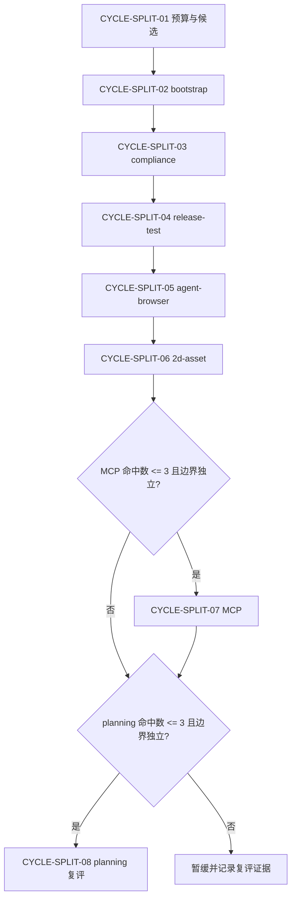

# 需求与实施计划全量顺序实施方案：Skill 体积治理与拆分

结论：先冻结统一预算与候选，再按单 skill 垂直切片逐个完成“实现 -> 真实测试 -> 审查 -> 验收”；影响：避免多个 skill 同时拆分造成规则映射和触发验证相互污染；范围：P0/P1 候选的总顺序、通用测试入口和条件性复评；非范围：本表不替代单个实施总览和周期文档，也不代表真实 skill 已修改；变化：后续执行从一个候选 skill 完整闭环后才进入下一个，并统一复用五类入口；完成标准：当前入口始终唯一、可回指、不可跨期跳过；术语说明：全量顺序是多个实施周期的总调度表，fixture 是当前测试时间戳目录内的离线样本；验证状态：统计报告、候选矩阵和当前周期通用测试入口均已完成闭环，skill 资产实施仍未开始。

## 文档定位与维护状态

图片资产决策：`N/A + 原因 + 证据`：本表只表达跨候选顺序、依赖和阻断关系，使用 Mermaid 和表格即可，不需要 UI、截图或视觉对比。

| 项目 | 内容 |
|---|---|
| 来源集合 | `SRC-SKILL-SPLIT-20260716` |
| 上游需求 | `doc/2-需求/2026-07-16_114619_Skill体积治理与拆分.md` |
| 上游验收 | `doc/7-验收/2026-07-16_114619_Skill体积治理与拆分_验收标准.md` |
| 单来源实施总览 | `doc/3-实施/2026-07-16_114619_Skill体积治理与拆分_实施总览.md` |
| 当前状态 | `in_progress`；当前入口为 `CYCLE-SPLIT-01 / TASK-SPLIT-01-03`，不构成真实 skill 资产实施授权 |

## 来源对象清单与回指关系

| 顺序 | 来源/候选 | 上游规则 | 计划入口 | 状态 |
|---:|---|---|---|---|
| 0 | 预算与候选冻结 | `DEC-SKILL-SIZE-BUDGET-20260716`、`DEC-SKILL-SPLIT-BINARY-20260716`、`REQ-SKILL-SIZE-001`、`REQ-SKILL-SPLIT-001` | `[CYCLE-SPLIT-01](2026-07-16_114619_Skill体积治理与拆分_实施周期01_预算与候选冻结.md)` | in_progress |
| 1 | `project-agents-bootstrap` | `REQ-SKILL-SPLIT-001`、`REQ-SKILL-SPLIT-003` | `[CYCLE-SPLIT-02](2026-07-16_114619_Skill体积治理与拆分_实施周期02_规则文件与项目记忆自举.md)` | planned |
| 2 | `skill-compliance-gate-rules` | `REQ-SKILL-SPLIT-001`、`REQ-SKILL-SPLIT-005` | `[CYCLE-SPLIT-03](2026-07-16_114619_Skill体积治理与拆分_实施周期03_技能合规与代码收口.md)` | planned |
| 3 | `project-release-test-rules` | `REQ-SKILL-SPLIT-001`、`REQ-SKILL-SPLIT-004` | `[CYCLE-SPLIT-04](2026-07-16_114619_Skill体积治理与拆分_实施周期04_接口基线与上线测试执行.md)` | planned |
| 4 | `agent-browser` | `REQ-SKILL-SPLIT-001`、`REQ-SKILL-SPLIT-004` | `[CYCLE-SPLIT-05](2026-07-16_114619_Skill体积治理与拆分_实施周期05_浏览器会话与高级验证.md)` | planned |
| 5 | `2d-asset-design` | `REQ-SKILL-SPLIT-001`、`REQ-SKILL-SPLIT-004` | `[CYCLE-SPLIT-06](2026-07-16_114619_Skill体积治理与拆分_实施周期06_2D素材设计与生产交接.md)` | planned |
| 6 | `mcp-installation-rules` | `REQ-SKILL-SPLIT-001` | 条件入口 `[CYCLE-SPLIT-07](2026-07-16_114619_Skill体积治理与拆分_实施周期07_MCP工具路由复评.md)` | gated |
| 7 | `implementation-planning-rules` | `REQ-SKILL-SPLIT-001`、`REQ-SKILL-SPLIT-002` | 复评入口 `[CYCLE-SPLIT-08](2026-07-16_114619_Skill体积治理与拆分_实施周期08_实施规划职责复评.md)` | gated |

## 周期文档索引

| 周期 | 文档 | 当前职责 |
|---|---|---|
| `CYCLE-SPLIT-01` | `[预算与候选冻结](2026-07-16_114619_Skill体积治理与拆分_实施周期01_预算与候选冻结.md)` | 建立体积预算和进入/暂缓门槛 |
| `CYCLE-SPLIT-02` | `[规则文件与项目记忆自举](2026-07-16_114619_Skill体积治理与拆分_实施周期02_规则文件与项目记忆自举.md)` | 二分规则文件自举与项目记忆编排 |
| `CYCLE-SPLIT-03` | `[技能合规与代码收口](2026-07-16_114619_Skill体积治理与拆分_实施周期03_技能合规与代码收口.md)` | 二分 skill 链完整性与最终代码收口 |
| `CYCLE-SPLIT-04` | `[接口基线与上线测试执行](2026-07-16_114619_Skill体积治理与拆分_实施周期04_接口基线与上线测试执行.md)` | 二分接口基线与 release-test engine 执行 |
| `CYCLE-SPLIT-05` | `[浏览器会话与高级验证](2026-07-16_114619_Skill体积治理与拆分_实施周期05_浏览器会话与高级验证.md)` | 二分会话自动化与 HAR/diff/trace 等高级验证 |
| `CYCLE-SPLIT-06` | `[2D素材设计与生产交接](2026-07-16_114619_Skill体积治理与拆分_实施周期06_2D素材设计与生产交接.md)` | 二分设计闸门与生产交付 |
| `CYCLE-SPLIT-07` | `[MCP工具路由复评](2026-07-16_114619_Skill体积治理与拆分_实施周期07_MCP工具路由复评.md)` | 只判断是否满足独立拆分条件 |
| `CYCLE-SPLIT-08` | `[实施规划职责复评](2026-07-16_114619_Skill体积治理与拆分_实施周期08_实施规划职责复评.md)` | 只判断 planning 与暂缓项的拆/不拆结论 |

## 全量执行顺序

| 总序号 | 周期 | 单一目标 | 前置依赖 | 收口条件 |
|---:|---|---|---|---|
| 1 | `CYCLE-SPLIT-01` | 冻结预算、评分和候选清单 | 当前需求/验收草案 | 预算脚本、候选矩阵、暂缓项证据通过 |
| 2 | `CYCLE-SPLIT-02` | 拆分 `project-agents-bootstrap` | CYCLE-01 | 映射 100%、fixture 双跑、引用清理通过 |
| 3 | `CYCLE-SPLIT-03` | 拆分 `skill-compliance-gate-rules` | CYCLE-02 | 唯一 PASS/FAIL owner、触发验证通过 |
| 4 | `CYCLE-SPLIT-04` | 拆分 `project-release-test-rules` | CYCLE-03 | baseline/执行边界与 engine 归属通过 |
| 5 | `CYCLE-SPLIT-05` | 拆分 `agent-browser` | CYCLE-04 | session/advanced 场景触发与资源迁移通过 |
| 6 | `CYCLE-SPLIT-06` | 拆分 `2d-asset-design` | CYCLE-05 | design/production 前后依赖与资产验收通过 |
| 7 | `CYCLE-SPLIT-07` | 复评 `mcp-installation-rules` | CYCLE-06 | 平均命中不超过 3，配置 owner 唯一 |
| 8 | `CYCLE-SPLIT-08` | 复评 `implementation-planning-rules` 与暂缓项 | CYCLE-07 | 形成拆/不拆决议，不自动进入实施 |

## 当前执行入口与下一步

- 当前执行入口：`CYCLE-SPLIT-01 / TASK-SPLIT-01-03`。
- 当前只做：完成正式 84 个 skill、扩展种子 27 个的候选矩阵后，建立并验证五类通用拆分测试入口；本轮不进入真实 skill 资产修改或删除。
- 当前矩阵入口：`doc/5-tests/2026-07-17_155229/skill-split-validation/mapping/candidate-matrix.yaml`；`TEST-SPLIT-002` 只代表四份文档 profile 与矩阵断言，不代表后续 skill 资产映射测试。
- 当前通用入口：`validate_skill_split.py` 和 `run_trigger_cases.ps1`；报告/矩阵必须位于仓库根目录，fixture 必须位于当前测试时间戳目录。
- 不得跳到：任何真实 `SKILL.md` 修改、旧 skill 删除、字典刷新和 Git 历史写入；测试任务目录只能按当前日期和 ASCII 镜像规则创建。

## 依赖、进入、收口与阻断

| ID | 规则 | 处理 |
|---|---|---|
| `BOUND-SKILL-001` | 一个周期只承载一个 skill 或一个全局预算目标 | 发现混合目标立即拆周期 |
| `BOUND-SKILL-002` | 一个 `TASK-*` 默认不超过 5 个文件 | 超过时继续拆或给出不可拆证据 |
| `GAP-SKILL-006` | 触发测试工具不可用 | 保留旧 skill，状态为 blocked，不宣称通过 |
| `ROLLBACK-SKILL-001` | 覆盖率或触发测试失败 | 恢复旧 skill 冻结基线，回到映射阶段 |

## 总顺序流程图

图形目的：固定多候选 skill 的周期先后和条件入口。关联 ID：`CYCLE-SPLIT-01` 至 `CYCLE-SPLIT-08`。

## 计划执行变更同步

- `CHG-SPLIT-20260717-001`：全量顺序方案由“等待授权”切换为 `CYCLE-SPLIT-01 / TASK-SPLIT-01-01` 执行中；其余周期仍按依赖保持 planned/gated。
- `CHG-SPLIT-20260717-002`：所有测试脚本、报告、mapping、fixture 的计划路径迁移到 `doc/5-tests/2026-07-17_155229/skill-split-validation/`；中文说明只保留在 `doc/5-tests/2026-07-17_155229/技能拆分验证/README.md`。
- `CHG-SPLIT-20260717-003`：当前入口推进到 `CYCLE-SPLIT-01 / TASK-SPLIT-01-02`；矩阵补齐候选顺序、旧/新路径、决策 ID 和当前矩阵/后续实施测试分层；候选矩阵与四份文档均完成后才允许进入 `TASK-SPLIT-01-03`。
- `CHG-SPLIT-20260717-004`：当前入口推进到 `CYCLE-SPLIT-01 / TASK-SPLIT-01-03`；新增五类通用模式、PowerShell `-CasesRoot` 转发、路径边界和 pre/post-delete fixture 断言；完成本周期前不得进入 CYCLE-SPLIT-02。
- 追踪影响：只更新测试资产路径、当前状态和执行边界；`SRC -> DEC -> REQ -> AC -> CYCLE -> TASK -> TEST -> EVIDENCE` 稳定 ID 不变。
- `CHG-SPLIT-20260721-001`：全量顺序方案收口。`CYCLE-SPLIT-02`~`06` 五个正式候选（`project-agents-bootstrap`、`skill-compliance-gate-rules`、`project-release-test-rules`、`agent-browser`、`2d-asset-design`）均已完成拆分实现、路由切换、用户授权真实删除、共享物理资源迁移（`bootstrap_agents.sh`、`release_test_engine/`）与回归测试；`CYCLE-SPLIT-07`/`08` 复评结论均为 `no_split`。详见实施总览 `CHG-SPLIT-20260721-001` 与各周期实施文档。

## 自审结论

- 覆盖度：已回指需求、验收、总览、周期和候选入口。
- 顺序：当前周期未收口前禁止进入下一周期。
- 阻断：任何规则丢失、触发漂移、资源悬空或删除前检查缺失均阻断。
- 授权：用户已明确授权当前周期测试入口；授权范围不包含真实 skill 资产修改、删除、字典刷新或 Git 历史写入。

## 执行附录

- 所有执行命令、local 环境、样本、清理和回滚详见单来源实施总览及对应周期文档。

## 追踪附录

- `SRC-SKILL-SPLIT-20260716 -> REQ-SKILL-SPLIT-20260716 -> AC-SKILL-SPLIT-20260716 -> CYCLE-SPLIT-* -> TASK-SPLIT-* -> TEST-SPLIT-* -> EVIDENCE-*`。
