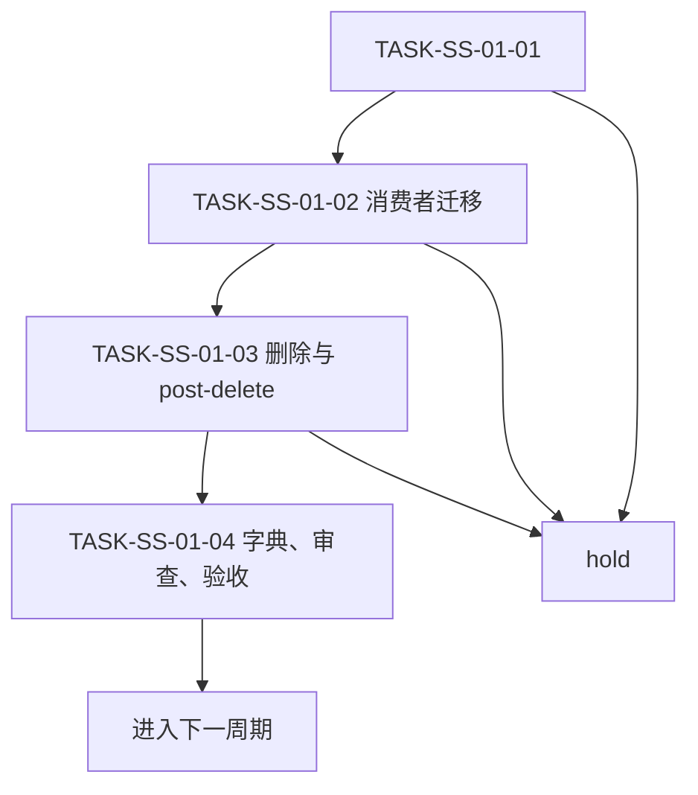

# 六域 Skill 结构精简与自动触发保持实施周期 01：基线与迁移契约

结论：本周期只处理“基线与迁移契约”，当前任务闭环后才允许推进；影响：当前域入口、消费者和后续自动路由会受影响，保护语义保持不变；范围：冻结候选、保护语义、消费者、物理资产、哈希、回滚和验证器；非范围：不处理未列入本周期的候选，不写 Git 历史，不改无关工作树；变化：建立迁移清单与验证基线；完成标准：候选映射、基线哈希、消费者清单和验证器全部通过，且本周期候选都有回滚证据；术语说明：最小任务是可在限定文件集内独立完成实现、真实测试、审查和验收的工作单元；验证状态：用户已授权实施，本周期按全量顺序进入时执行。

## 当前周期目标、边界与进入条件

图片资产决策：N/A + 原因：本任务不涉及图片生成、编辑或引用；证据：本文文档信息、范围和执行附录均声明无图片资产。

| 项目 | 内容 |
| --- | --- |
| 周期 ID | `CYCLE-SS-01` |
| 当前周期目标 | 冻结候选、保护语义、消费者、物理资产、哈希、回滚和验证器。 |
| 进入条件 | 前序周期通过；需求与验收冻结；`.codex/config.toml` 持续排除。 |
| 非范围 | 其他周期、历史归档、Git 历史和外部服务。 |
| 当前优先闭环 | `TASK-SS-01-02`：冻结资产索引、消费者索引和触发 fixtures。 |
| unresolved_decisions | 无 P0/P1；owner 或 trigger 不明即 hold。 |

## 当前代码/文档基线

| 文件/符号 | 当前职责 | 本周期动作 | 兼容要求 |
| --- | --- | --- | --- |
| `doc/2-需求/2026-07-21_221037_六域Skill结构精简与自动触发保持.md` | 冻结需求。 | 只读回指。 | 不改变 ID。 |
| `doc/7-验收/2026-07-21_221037_六域Skill结构精简与自动触发保持_验收标准.md` | 验收口径。 | 只读回指。 | 不降低 PASS/FAIL。 |
| `doc/5-tests/2026-07-21_221037/six-domain-skill-streamlining/mapping/domain-streamlining-manifest.yaml` | 候选机器事实。 | 已创建并通过 baseline。 | 字段完整、UTF-8。 |
| `doc/5-tests/2026-07-21_221037/six-domain-skill-streamlining/inventory/` 与 `fixtures/` | 资产、消费者和触发基线。 | 已创建并通过 baseline。 | 不修改真实 Skill。 |
| `PROJECT_CURRENT.md` | 当前状态。 | 周期收口后覆盖更新。 | 不超过 51,200B。 |

## 周期内最小任务执行顺序

| 顺序 | TASK | 文件/符号 | 实现 | 真实测试 | 审查 | 验收 |
| --- | --- | --- | --- | --- | --- | --- |
| 1 | `TASK-SS-01-01` | `domain-streamlining-manifest.yaml` | 建立 36 条候选和 11 条退役映射。 | `TEST-SS-001` baseline。 | owner、边界、保护语义。 | `AC-SS-001`。 |
| 2 | `TASK-SS-01-02` | `inventory/`、`fixtures/` | 冻结资产、消费者和 72 条触发样本。 | hash、路径和 schema 断言。 | 排除历史归档和 `.codex/config.toml`。 | `AC-SS-002`。 |
| 3 | `TASK-SS-01-03` | `validate_domain_streamlining.py`、PowerShell wrapper | 实现 baseline、trigger、pre-delete、post-delete 验证器。 | Python 编译、正向和负向退出码。 | 仓库边界、无删除副作用。 | `AC-SS-005`。 |
| 4 | `TASK-SS-01-04` | 测试 README、evidence、周期文档 | 完成测试、审查和任务验收。 | test profile、文档 profile、`git diff --check`。 | 只收口本周期。 | `AC-SS-001`。 |

## 文件/符号操作契约

1. 修改前读取 source、target owner、active consumers 和 manifest。
2. description 或 `##` 标题变化必须登记字典再生。
3. agents、references、scripts、templates 必须逐项登记最终物理 owner。
4. 单个 TASK 的 write_set 只覆盖一个主入口、有限 references、mapping/fixture 和必要消费者；超出即继续拆分。
5. 新增文本统一 UTF-8，写入后回读、哈希和 diff 检查。

## 最小任务闭环

| TASK | 完成条件 | 停止条件 | 回滚 |
| --- | --- | --- | --- |
| `TASK-SS-01-01` | manifest 完整，36 个候选、11 个退役候选、目标 owner、保护语义和回滚字段通过。 | source/target/trigger 不明确。 | 删除本任务新增 manifest，恢复周期文档基线。 |
| `TASK-SS-01-02` | 资产索引、消费者索引、72 条 fixtures 和路径边界通过。 | 资产哈希漂移、消费者缺失或路径越界。 | 删除当前 inventory/fixtures，重新从冻结提交生成。 |
| `TASK-SS-01-03` | validator 编译、baseline 正向和负向命令通过；不执行删除。 | 语法错误、误接受越界路径或副作用。 | 删除当前测试入口，恢复测试任务基线。 |
| `TASK-SS-01-04` | test profile、周期文档 gate、审查、验收通过。 | 任一 gate 失败。 | 修复后从失败入口重入。 |

## 当前周期验证矩阵

| TEST | 命令与样本 | 断言 | 失败预期 |
| --- | --- | --- | --- |
| `TEST-SS-001` | `python -X utf8 doc/5-tests/2026-07-21_221037/six-domain-skill-streamlining/validate_domain_streamlining.py --repo-root F:\luode-skills --manifest doc/5-tests/2026-07-21_221037/six-domain-skill-streamlining/mapping/domain-streamlining-manifest.yaml --phase baseline` | 36 个候选、11 个退役候选、资产和消费者基线完整。 | 缺 owner、hash、rollback 或数量不符时非零退出。 |
| `TEST-SS-01-PYCOMPILE` | `python -X utf8 -m py_compile doc/5-tests/2026-07-21_221037/six-domain-skill-streamlining/validate_domain_streamlining.py` | 验证器可编译。 | 语法错误时非零退出。 |
| `TEST-SS-01-PS` | `pwsh -NoProfile -File doc/5-tests/2026-07-21_221037/six-domain-skill-streamlining/run_domain_trigger_cases.ps1 -Phase baseline` | wrapper 转发成功。 | validator 失败时 wrapper 非零退出。 |
| `TEST-SS-01-NEGATIVE` | manifest 越界和非法 phase。 | 仓库外路径与非法参数被拒绝。 | 误接受越界路径或非法参数。 |
| `TEST-SS-01-POST` | 后续迁移完成后使用 `--phase post-delete`。 | 删除后无断链。 | 当前周期不提前执行。 |

图形目的：说明本周期最小任务只能串行闭环；关联 `CYCLE-SS-01`。

图形目的：用于说明本任务流程；关联 ID：REQ-SS-001。

## 真实测试与断言

- 环境：`F:\luode-skills` local 仓库，不连接外部服务。
- 样本：当前周期 manifest 条目、source、target、active consumers 和 fixtures。
- 通过标准：基线字段完整、资产和消费者索引与磁盘一致、验证器正向通过、越界和非法参数负向拒绝；post-delete 只在后续退役周期执行。
- 失败预期：P0 字段、hash、consumer、语义或资源缺失时命令非零退出。
- 清理：失败时删除当前任务临时 report，保留 manifest 与阻断证据；按 rollback locator 恢复源资产。

## 周期阻断、停止与回滚

| 条目 | 内容 |
| --- | --- |
| 停止条件 | 当前任务测试、审查、验收失败；owner 不明；范围污染；触发无法等价。 |
| 回滚 | 只回滚当前候选目录、引用和生成资产；不回滚已闭环周期。 |
| 恢复后重入点 | 从失败 TASK 的 baseline 或 pre-delete 重新进入。 |
| 最大推进边界 | 当前周期只完成迁移前基线与验证入口；不修改真实 Skill、不删除旧目录、不刷新字典。 |

## 周期追踪矩阵

| 来源 | REQ/RULE | AC | TASK | TEST |
| --- | --- | --- | --- | --- |
| `SRC-SKILL-STREAMLINE-20260721-001` | `REQ-SS-001`~`017`,`RULE-SS-001`~`008` | `AC-SS-001`、`AC-SS-002`、`AC-SS-005` | `TASK-SS-01-01`~`TASK-SS-01-04` | `TEST-SS-001`、`TEST-SS-01-PYCOMPILE`、`TEST-SS-01-PS`、`TEST-SS-01-NEGATIVE`。 |

## 自审结论

- 文件/符号、真实测试、完成条件、停止条件、回滚和最大推进边界均已明确。
- `TASK-SS-01-01` 至 `TASK-SS-01-04` 已完成实现、真实测试、审查和验收；周期 01 仍只完成基线，未进入真实 Skill 迁移。

## 执行附录

- 本周期测试根目录：`doc/5-tests/2026-07-21_221037/`；中文说明目录与 ASCII 真实资产目录已固定。
- 图片资产：N/A + 原因：没有图片生成、编辑或引用。

## 追踪附录

- manifest 是 source、target、hash、consumer、trigger、保护语义和 rollback 的机器事实。
