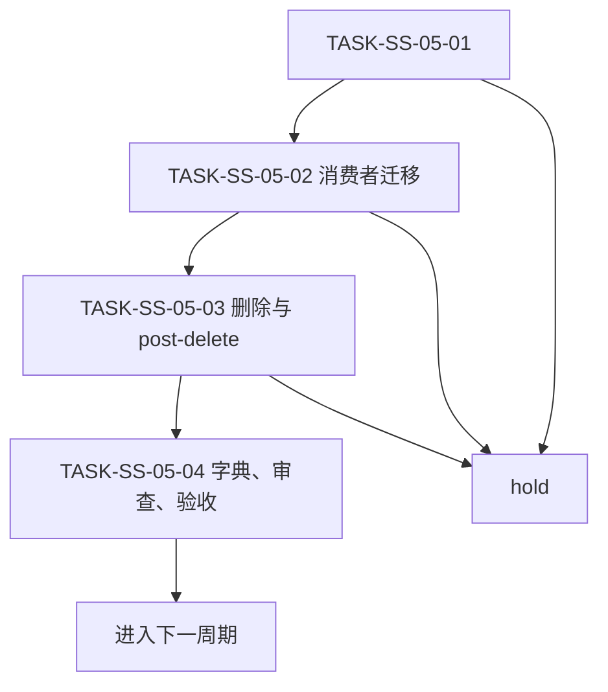

# 六域 Skill 结构精简与自动触发保持实施周期 05：审查与验收域去重

结论：本周期只处理“审查与验收域去重”，当前任务闭环后才允许推进；影响：当前域入口、消费者和后续自动路由会受影响，保护语义保持不变；范围：下沉审查和验收的重复证据细则，保留阶段入口；非范围：不处理未列入本周期的候选，不写 Git 历史，不改无关工作树；变化：建立审查和验收证据共享契约；完成标准：审查与验收触发、保护语义和引用验证全部通过，且本周期候选都有回滚证据；术语说明：最小任务是可在限定文件集内独立完成实现、真实测试、审查和验收的工作单元；验证状态：用户已授权实施，本周期按全量顺序进入时执行。

## 当前周期目标、边界与进入条件

图片资产决策：N/A + 原因：本任务不涉及图片生成、编辑或引用；证据：本文文档信息、范围和执行附录均声明无图片资产。

| 项目 | 内容 |
| --- | --- |
| 周期 ID | `CYCLE-SS-05` |
| 当前周期目标 | 下沉审查和验收的重复证据细则，保留阶段入口。 |
| 进入条件 | 前序周期通过；需求与验收冻结；`.codex/config.toml` 持续排除。 |
| 非范围 | 其他周期、历史归档、Git 历史和外部服务。 |
| 当前优先闭环 | `TASK-SS-05-01`：建立 review evidence contract。 |
| unresolved_decisions | 无 P0/P1；owner 或 trigger 不明即 hold。 |

## 当前代码/文档基线

| 文件/符号 | 当前职责 | 本周期动作 | 兼容要求 |
| --- | --- | --- | --- |
| `doc/2-需求/2026-07-21_221037_六域Skill结构精简与自动触发保持.md` | 冻结需求。 | 只读回指。 | 不改变 ID。 |
| `doc/7-验收/2026-07-21_221037_六域Skill结构精简与自动触发保持_验收标准.md` | 验收口径。 | 只读回指。 | 不降低 PASS/FAIL。 |
| `domain-streamlining-manifest.yaml` | 候选机器事实。 | 创建或更新当前周期条目。 | 字段完整、UTF-8。 |
| 当前周期目标 Skill / references | 自动触发与细则。 | 在冻结 write_set 内迁移。 | 保留 trigger_contract。 |
| `PROJECT_CURRENT.md` | 当前状态。 | 周期收口后覆盖更新。 | 不超过 51,200B。 |

## 周期内最小任务执行顺序

| 顺序 | TASK | 文件/符号 | 实现 | 真实测试 | 审查 | 验收 |
| --- | --- | --- | --- | --- | --- | --- |
| 1 | `TASK-SS-05-01` | manifest + 当前 owner | 建立 review evidence contract。 | `TEST-SS-010` baseline/positive。 | owner 与边界。 | `AC-SS-010`。 |
| 2 | `TASK-SS-05-02` | 当前 consumers | 迁移活跃引用。 | consumer scan、negative。 | 排除历史归档。 | 对应 AC。 |
| 3 | `TASK-SS-05-03` | source assets | 迁移共享资产、删除旧目录。 | pre/post-delete。 | owner、hash、rollback。 | 对应 AC。 |
| 4 | `TASK-SS-05-04` | 字典、文档、记忆 | 当前周期收口。 | 字典、profile、UTF-8。 | 当前改动审查。 | 周期验收。 |

## 文件/符号操作契约

1. 修改前读取 source、target owner、active consumers 和 manifest。
2. description 或 `##` 标题变化必须登记字典再生。
3. agents、references、scripts、templates 必须逐项登记最终物理 owner。
4. 单个 TASK 的 write_set 只覆盖一个主入口、有限 references、mapping/fixture 和必要消费者；超出即继续拆分。
5. 新增文本统一 UTF-8，写入后回读、哈希和 diff 检查。

## 最小任务闭环

| TASK | 完成条件 | 停止条件 | 回滚 |
| --- | --- | --- | --- |
| `TASK-SS-05-01` | manifest 完整，目标 owner 可读，TEST-SS-010 通过。 | source/target/trigger 不明确。 | 删除本任务新资产，恢复基线。 |
| `TASK-SS-05-02` | 活跃 consumers 已迁移，negative 通过。 | 非归档残留旧引用。 | 还原消费者引用。 |
| `TASK-SS-05-03` | post-delete 和资源校验通过。 | 断链、哈希不符或多入口。 | 恢复源目录和消费者。 |
| `TASK-SS-05-04` | 字典、文档 gate、审查、验收通过。 | 任一 gate 失败。 | 修复后从失败入口重入。 |

## 当前周期验证矩阵

| TEST | 命令与样本 | 断言 | 失败预期 |
| --- | --- | --- | --- |
| `TEST-SS-010` | `python -X utf8 ...validate_domain_streamlining.py --phase baseline` | 候选字段和基线完整。 | 缺 owner/hash/rollback 非零退出。 |
| `TEST-SS-05-TRIGGER` | `pwsh ...run_domain_trigger_cases.ps1 -Phase pre-delete` | 正例唯一命中。 | 多入口或旧入口失败。 |
| `TEST-SS-05-NEGATIVE` | 同脚本负例。 | 不相关请求不进入当前 route。 | 误命中失败。 |
| `TEST-SS-05-POST` | `--phase post-delete` | 删除后无断链。 | consumer、asset 或 dictionary 残留失败。 |

图形目的：说明本周期最小任务只能串行闭环；关联 `CYCLE-SS-05`。

图形目的：用于说明本任务流程；关联 ID：REQ-SS-001。

## 真实测试与断言

- 环境：`F:\luode-skills` local 仓库，不连接外部服务。
- 样本：当前周期 manifest 条目、source、target、active consumers 和 fixtures。
- 通过标准：正例唯一命中、负例不误命中、保护语义可定位、无活跃旧引用、post-delete 无断链。
- 失败预期：P0 字段、hash、consumer、语义或资源缺失时命令非零退出。
- 清理：失败时删除当前任务临时 report，保留 manifest 与阻断证据；按 rollback locator 恢复源资产。

## 周期阻断、停止与回滚

| 条目 | 内容 |
| --- | --- |
| 停止条件 | 当前任务测试、审查、验收失败；owner 不明；范围污染；触发无法等价。 |
| 回滚 | 只回滚当前候选目录、引用和生成资产；不回滚已闭环周期。 |
| 恢复后重入点 | 从失败 TASK 的 baseline 或 pre-delete 重新进入。 |
| 最大推进边界 | 当前周期只完成冻结候选；未完成四项闭环不进入下一 TASK。 |

## 周期追踪矩阵

| 来源 | REQ/RULE | AC | TASK | TEST |
| --- | --- | --- | --- | --- |
| `SRC-SKILL-STREAMLINE-20260721-001` | `REQ-SS-001`~`017`,`RULE-SS-001`~`008` | `AC-SS-010` | `TASK-SS-05-01`~`TASK-SS-05-04` | `TEST-SS-010`、trigger、post。 |

## 自审结论

- 文件/符号、真实测试、完成条件、停止条件、回滚和最大推进边界均已明确。
- 本周期四个最小任务已完成实现、真实测试、审查和验收；reference_refactor 保留 owner，不以未执行的删除动作伪造收敛。

## 执行附录

- `<timestamp>` 在执行时替换为新的 `doc/5-tests/` 任务根目录。
- 图片资产：N/A + 原因：没有图片生成、编辑或引用。

## 追踪附录

- manifest 是 source、target、hash、consumer、trigger、保护语义和 rollback 的机器事实。
