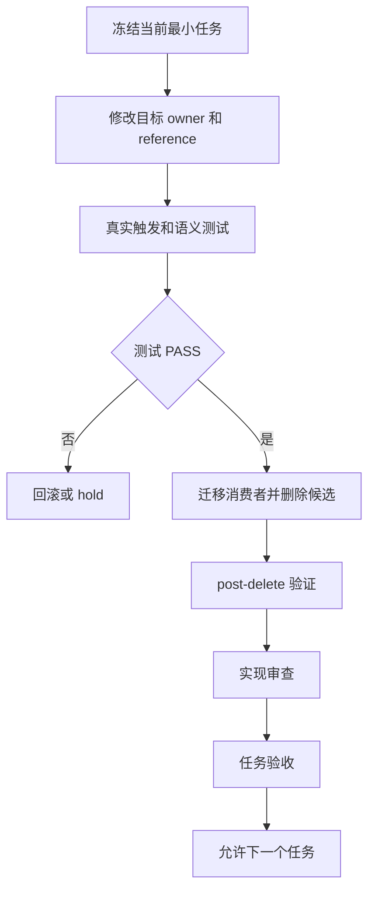
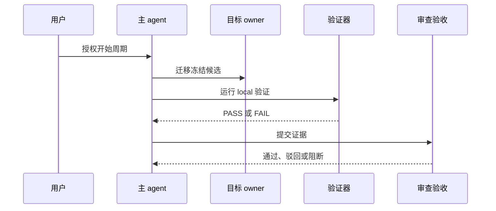

# 六域 Skill 结构精简与自动触发保持实施总览

结论：以主入口、条件路由和验证后真实删除完成六域技能精简；影响：影响六域自动路由、公共规则、测试资产、字典、项目说明和项目记忆；范围：36 个技能、11 个拟退役目录和全部活跃消费者；非范围：不改业务代码、外部服务、版本历史或 `.codex/config.toml`；变化：需求、测试和 Bug 域执行入口合并，实施、审查、验收通过参考文件去重；完成标准：六个周期全部闭环，全部适用验收项通过且没有范围污染；术语说明：文件和符号指技能名称、触发描述、条件路由和迁移清单字段；验证状态：用户已授权实施，当前进入周期 01。


## 当前计划最终方案简要说明

图片资产决策：N/A + 原因：本任务不涉及图片生成、编辑或引用；证据：本文文档信息、范围和执行附录均声明无图片资产。

所有候选统一由 `domain-streamlining-manifest.yaml` 管理。需求、测试和 Bug 域退役明确冗余入口；实施、审查和验收域保留生命周期入口，只去除重复正文。

## 基本信息

| 字段 | 内容 |
| --- | --- |
| 来源 | `SRC-SKILL-STREAMLINE-20260721-001` |
| 基线提交 | `548fe02a42b6572b75330fc8b8827b62a4218b5f` |
| 当前优先闭环 | `TASK-SS-01-01`：冻结 manifest 和保护语义。 |
| unresolved_decisions | 无 P0/P1；vault 注册是外部阻断。 |
| 图片资产 | N/A + 原因：没有图片资产。 |

## 实施周期总览

| 周期 | 目标 | 拟退役数 | 主要验证 |
| --- | --- | ---: | --- |
| `CYCLE-SS-01` | 基线、映射、fixtures、validator。 | 0 | manifest、hash、consumer、route-matrix。 |
| `CYCLE-SS-02` | 需求域。 | 2 | intake 发现/缺口路由。 |
| `CYCLE-SS-03` | 实施与测试域。 | 4 | Plan Mode、测试资产和专项测试负例。 |
| `CYCLE-SS-04` | Bug 域。 | 5 | 发现、缺口、断言、日志、断点。 |
| `CYCLE-SS-05` | 审查与验收域。 | 0 | 阶段边界与 evidence contract。 |
| `CYCLE-SS-06` | 全链路收口。 | 0 | post-delete、字典、文档、最终验收。 |

## 阶段计划

| 阶段 | 主入口 | 变化 |
| --- | --- | --- |
| 需求 | `requirement-intake-rules` | 吸收 discovery 和 gap。 |
| 实施 | `implementation-planning-rules` | 拆 references，不拆新入口。 |
| 测试 | `test-strategy-rules` | 吸收测试资产治理。 |
| Bug | `bug-intake-rules` | 吸收发现、缺口和运行时诊断。 |
| 审查 | 三个既有入口 | 下沉检查细则。 |
| 验收 | 两个既有入口 | 下沉共同证据契约。 |

## 最小任务清单

| TASK | 周期 | 文件/符号 | 真实测试 | 完成条件 | 停止条件 |
| --- | --- | --- | --- | --- | --- |
| `TASK-SS-01-01` | 01 | manifest、保护语义。 | `TEST-SS-001`。 | mapping 完整。 | owner 不明。 |
| `TASK-SS-01-02` | 01 | fixtures、validator。 | `TEST-SS-002`~`005`。 | 正负用例可运行。 | 无可判定样本。 |
| `TASK-SS-02-*` | 02 | requirement intake routes。 | `TEST-SS-006`。 | 2 个入口退役。 | trigger 漂移。 |
| `TASK-SS-03-*` | 03 | planning/test strategy refs。 | `TEST-SS-007`,`008`。 | 4 个入口退役。 | 专项能力丢失。 |
| `TASK-SS-04-*` | 04 | bug intake routes。 | `TEST-SS-009`。 | 5 个入口退役。 | 清理规则丢失。 |
| `TASK-SS-05-*` | 05 | review/acceptance refs。 | `TEST-SS-010`,`011`。 | 阶段边界通过。 | 相互替代。 |
| `TASK-SS-06-*` | 06 | dictionary/docs/memory。 | `TEST-SS-012`。 | 全链路通过。 | 任一 gate 失败。 |

## 现状与落点

```text
F:\luode-skills
├── requirement-intake-rules/          # 需求发现和缺口 routes
├── implementation-planning-rules/     # Plan Mode 主入口与新 references
├── test-strategy-rules/               # 测试资产治理 route
├── bug-intake-rules/                  # Bug 发现、缺口、诊断 routes
├── implementation-review-rules/       # 审查细则 references
├── acceptance-criteria-rules/         # 验收证据契约
└── doc/2-需求 doc/3-实施 doc/5-tests doc/7-验收
```

## 方案选择

| 方案 | 结论 | 原因 |
| --- | --- | --- |
| 只删重复段落 | 不足 | 不能消除重复自动触发入口。 |
| 每域合成巨型 Skill | 驳回 | 会损害可读性和生命周期边界。 |
| 单主入口 + 条件路由 + references | 选定 | 保留触发、可验证和真实退役。 |

## 实施步骤

1. 冻结 manifest、route-matrix、保护语义、consumer、hash 与 rollback。
2. 按周期迁移一个冻结候选组，先改目标 owner 和 references。
3. 更新活跃消费者，运行 pre-delete、negative 和 semantic 测试。
4. 删除当前候选，运行 post-delete、字典与资源完整性检查。
5. 完成当前周期审查和验收，再进入下一周期。

## 真实测试安排

| TEST | 样本 | 通过标准 |
| --- | --- | --- |
| `TEST-SS-001` | 全部候选。 | P0 字段和 baseline 完整。 |
| `TEST-SS-002` | 原触发短语。 | 目标唯一命中。 |
| `TEST-SS-003` | `RULE-SS-*`。 | canonical locator 存在。 |
| `TEST-SS-004` | 活跃路径。 | 无旧引用。 |
| `TEST-SS-005` | 删除后资产。 | 无断链。 |
| `TEST-SS-006`~`011` | 各域 fixture。 | 对应 AC PASS。 |
| `TEST-SS-012` | 字典与文档。 | 生成与 profile 通过。 |

图形目的：说明一个最小任务的四项闭环；关联 `RULE-SS-006`。

图形目的：用于说明本任务流程；关联 ID：REQ-SS-001。



图形目的：说明用户、owner、验证器和审查验收的时序；关联 `TASK-SS-01-01`。

图形目的：用于说明本任务流程；关联 ID：REQ-SS-001。



## 风险与阻断项

| 风险 | 停止条件 | 回滚 |
| --- | --- | --- |
| 触发漂移 | 正例不唯一命中。 | 恢复源 Skill 和 consumer。 |
| 保护语义丢失 | `RULE-SS-*` 无 locator。 | 恢复原规则并补映射。 |
| 资源断链 | post-delete 缺脚本/reference/template。 | 按 hash 恢复。 |
| 无关 diff | `.codex/config.toml` 被改动。 | 立即停止并排除。 |

## 自审结论

- 已列出文件/符号、真实测试、完成、停止、回滚和最大推进边界。
- 最大推进边界：每次只处理一个冻结候选组；无当前轮 Git 授权不提交。

## 执行附录

- 真实命令和 fixture 路径由各周期文档记录。

## 追踪附录

- `SRC -> DEC -> REQ/RULE -> AC -> CYCLE -> TASK -> TEST` 在需求、验收、本文和 manifest 中双向维护。
