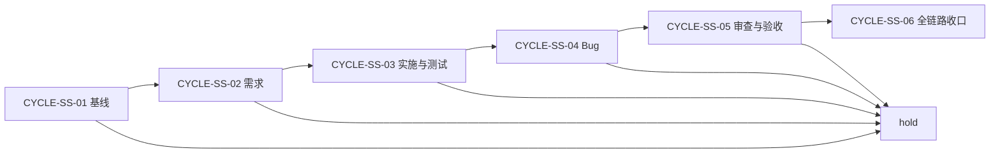

# 六域 Skill 结构精简与自动触发保持需求与实施计划全量顺序实施方案

结论：本总表定义六域精简的唯一执行顺序；影响：实施、审查和验收人员用它确定当前唯一可推进任务；范围：需求、验收、总览、六个周期、测试、审查和最终验收；非范围：不代替单周期的文件、命令和回滚细则；变化：先冻结基线，再按域闭环，最后完成全链路收口；完成标准：前一周期未通过时不得进入后续周期；术语说明：全量顺序指跨周期的唯一总调度表；验证状态：用户已授权实施，当前进入周期 01。

## 文档信息

图片资产决策：N/A + 原因：本任务不涉及图片生成、编辑或引用；证据：本文文档信息、范围和执行附录均声明无图片资产。

| 字段 | 内容 |
| --- | --- |
| 来源对象 | `SRC-SKILL-STREAMLINE-20260721-001` |
| 基线提交 | `548fe02a42b6572b75330fc8b8827b62a4218b5f` |
| 当前执行入口 | `CYCLE-SS-01 / TASK-SS-01-01`。 |
| 状态 | planned。 |
| 图片资产 | N/A + 原因：无图片资产。 |

## 来源对象清单与回指关系

| 顺序 | 文档 | ID | 状态 |
| --- | --- | --- | --- |
| 1 | `doc/2-需求/2026-07-21_221037_六域Skill结构精简与自动触发保持.md` | `SRC-SKILL-STREAMLINE-20260721-001` | frozen |
| 2 | `doc/7-验收/2026-07-21_221037_六域Skill结构精简与自动触发保持_验收标准.md` | `AC-SS-001`~`012` | frozen |
| 3 | 本文档 | `MASTER-SS-20260721-001` | planned |
| 4 | 实施总览 | `PLAN-SS-20260721-001` | planned |
| 5 | 六份实施周期 | `CYCLE-SS-01`~`06` | planned |

## 全量执行顺序

| 序号 | 周期 | 进入条件 | 收口条件 | 阻断动作 |
| --- | --- | --- | --- | --- |
| 1 | `CYCLE-SS-01` 基线与迁移契约 | 需求与验收冻结。 | manifest、fixture、hash、consumer、rollback、validator 通过。 | hold 未明候选。 |
| 2 | `CYCLE-SS-02` 需求域 | 周期 01 PASS。 | 2 个旧入口退役。 | 恢复当前候选。 |
| 3 | `CYCLE-SS-03` 实施与测试域 | 周期 02 PASS。 | planning 去重，4 个测试入口退役。 | 保留单入口和专项能力。 |
| 4 | `CYCLE-SS-04` Bug 域 | 周期 03 PASS。 | 5 个 Bug 入口退役。 | 源目录 hold。 |
| 5 | `CYCLE-SS-05` 审查与验收域 | 周期 04 PASS。 | 重复正文下沉，阶段边界通过。 | 回滚 reference。 |
| 6 | `CYCLE-SS-06` 全链路收口 | 02~05 PASS。 | 扫描、字典、文档、审查、验收通过。 | 停在失败周期。 |

图形目的：展示唯一顺序和阻断回流；关联 `CYCLE-SS-01` 至 `CYCLE-SS-06`。

图形目的：用于说明本任务流程；关联 ID：REQ-SS-001。

## 当前执行入口与下一步

- 当前入口：`TASK-SS-01-01`。
- 进入授权：用户当前轮明确发出“开始实施”或等价授权。
- 最大推进边界：没有该授权前，只维护本计划文档，不修改 Skill 资产。

## 依赖、进入、收口与阻断

| 类型 | 内容 |
| --- | --- |
| 依赖 | Python、PowerShell、本地 Git 工作树、工程文档 gate、字典生成器。 |
| 外部阻断 | Obsidian vault 未注册；只影响 vault 沉淀。 |
| 工作树阻断 | `.codex/config.toml` 无关改动必须隔离。 |
| 收口 | 每周期实现、测试、审查、验收全部通过。 |

## 自审结论

- 该顺序覆盖需求、验收、实施、测试、审查和最终验收。
- unresolved_decisions：无 P0/P1；vault 注册恢复后再进行沉淀。

## 执行附录

- 具体命令以周期文档为准。

## 追踪附录

- `REQ-SS-* -> AC-SS-* -> CYCLE-SS-* -> TASK-SS-* -> TEST-SS-*` 由总览和 manifest 维护。
