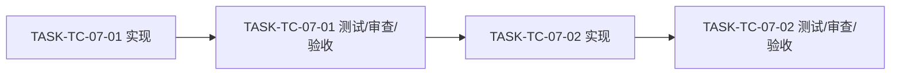
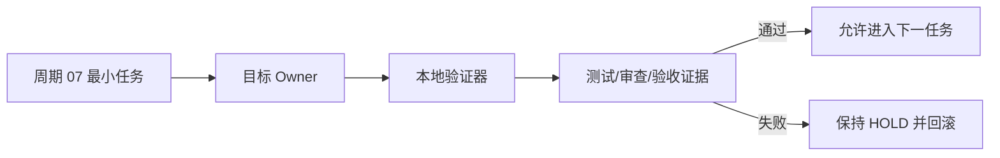

# 总控层 Skill 精简合并与单向路由实施周期07：消费者迁移、删除与收口

结论：本周期负责清零消费者、删除旧入口、字典、审查与验收；影响：只影响当前周期冻结的候选和证据；范围：当前周期的两个最小任务及其写集；非范围：其它周期候选、业务域和 Git 历史写入；变化：按冻结写集逐任务完成实现、真实测试、审查和验收；完成标准：post-delete valid=true；术语说明：周期闭环是实现、真实测试、审查和验收全部完成；验证状态：实施中。

## 当前周期目标、边界与进入条件

图片资产决策：N/A + 原因：本周期只修改 Markdown Skill、引用文件或本地验证资产；证据：周期目标与真实测试均无图片输入、生成或交付。

| 字段 | 内容 |
| --- | --- |
| 周期 | `CYCLE-TC-07` |
| 目标 | 清零消费者、删除旧入口、字典、审查与验收。 |
| 进入条件 | 上一周期通过；周期01为用户实施授权和计划冻结 |
| 收口条件 | post-delete valid=true |
| 范围外 | N/A + 原因：不处理业务域、外部服务和 Git 提交 |

## 当前代码/文档基线

- 基线提交：`76ee419d59396d919fea04ed55ea373ddeb8cb26`。
- manifest：`MANIFEST-TC-20260722`。
- 当前修改必须以磁盘最新内容为准，发现上下文漂移先重同步。

## 文件/符号操作契约

| 契约项 | 冻结要求 | 失败处理 |
| --- | --- | --- |
| 写集 | 只允许修改 manifest 为周期 `07` 冻结的文件/符号 | 超出写集立即停止并回滚当前候选 |
| Owner | 每条迁移规则只能有一个目标 Owner，旧入口仅作冻结对照 | 出现双 Owner 时保持 `HOLD` |
| 编码与保护 | UTF-8 写入，不覆盖用户非受管内容 | 回读失败或内容漂移时恢复基线 |

## 任务依赖图

图形目的：说明周期 07 的两个最小任务必须按实现、测试、审查和验收顺序串行闭环。

关联 ID：`CYCLE-TC-07`、`TASK-TC-07-01`、`TASK-TC-07-02`。

图形目的：说明周期 07 的任务、目标 Owner、验证器和证据归档之间的领域匹配关系。

关联 ID：`CYCLE-TC-07`、`TEST-CYCLE-TC-07-POS`、`TEST-CYCLE-TC-07-NEG`、`TEST-CYCLE-TC-07-REAL`。

## 周期内最小任务执行顺序

| 顺序 | TASK | 文件/符号 | 实现 | 真实测试 | 完成条件 |
| ---: | --- | --- | --- | --- | --- |
| 1 | `TASK-TC-07-01` | manifest 指定写集 | 清零消费者、删除旧入口、字典、审查与验收。 | quick validate/专项 validator | 当前任务证据 PASS |
| 2 | `TASK-TC-07-02` | 消费者或配套 reference | 完成当前周期剩余闭环 | 正负/边界/失败样本 | post-delete valid=true |

## 最小任务闭环

每个任务严格执行：实现 → 真实测试 → 当前任务审查 → 当前任务验收。任一步失败即停止，不允许推进下一任务。文件/符号不得超出 manifest write_set；必须记录输入样本、断言、失败预期、清理和回滚。

## 当前周期验证矩阵

| TEST | 样本 | 断言 | 失败预期 | 清理 |
| --- | --- | --- | --- | --- |
| `TEST-CYCLE-TC-07-POS` | 正向自动触发 | 命中目标 Owner | 漏命中则 FAIL | 恢复候选基线 |
| `TEST-CYCLE-TC-07-NEG` | 邻域与负向样本 | 不命中错误入口 | 抢触发则 FAIL | 恢复 description |
| `TEST-CYCLE-TC-07-REAL` | local 真实文件/生命周期 | post-delete valid=true | 证据不足则 HOLD | 删除临时测试产物 |

## 周期阻断、停止与回滚

- 停止条件：保护语义缺失、触发失败、消费者残留、资产无 Owner、真实测试失败。
- 回滚：`ROLLBACK-CYCLE-TC-07` 按 manifest baseline commit 和 source_root 恢复当前候选。
- 最大推进边界：只完成本周期任务，不提前删除后续候选，不提交 Git。

## 自审结论

当前周期包含文件/符号、真实测试、停止条件和回滚；N/A + 原因：无外部系统、数据库、图片或 production 连接；证据：当前周期验证矩阵只使用 local 文件和本地验证器。
