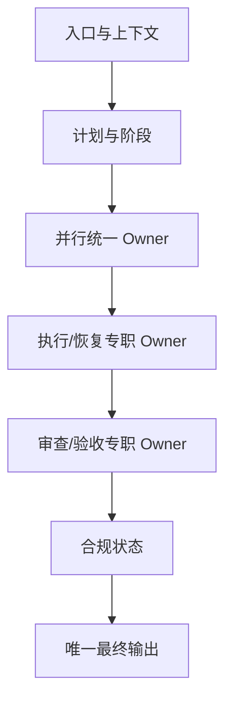
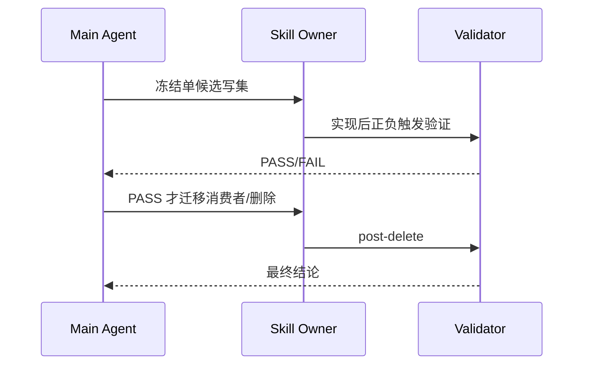

# 总控层 Skill 精简合并与单向路由实施总览

结论：以两个真实合并、一个触发冲突修复和多组引用化构成总控层最小闭环；影响：总控 Skill 数量目标由 75 降至 73，但失败候选不得强删；范围：18 个候选和所有活跃消费者；非范围：业务域和 Git 历史写入；变化：形成单向路由与唯一事实 Owner；完成标准：七周期、三阶段 validator、审查和验收全部通过；术语说明：Owner 指某条规则唯一且权威的归属方；真实测试指实际运行触发、生命周期和幂等样本，不以静态阅读代替；验证状态：baseline 已通过。

## 当前计划最终方案简要说明

图片资产决策：N/A + 原因：本实施总览只规划 Markdown Skill、引用文件和本地验证资产；证据：现状落点和测试安排均无图片输入输出。

保留唯一 hit 入口、唯一计划入口和专职审查/验收/Git/恢复 Owner；合并 parallel/subagent 与两个 bootstrap；其余只做 references 化。

## Agent 对当前问题的理解

| 项目 | 内容 |
| --- | --- |
| 问题/目标 | 删除总控重复，同时保持自动触发和用户习惯 |
| 本轮范围 | 18 个候选、2 个退役入口、消费者、字典和证据 |
| 非范围 | 业务域、外部服务、Git commit/push |
| 当前优先闭环 | 基线与映射 → 独立切片 → 删除收口 |
| unresolved_decisions | `[]` |

## 现状与落点

```text
parallel-task-dispatch-rules/
  SKILL.md
  references/  # 吸收委派矩阵、启动、并发、回退
  scripts/generate_subagent_plan.py
project-rule-file-bootstrap-rules/
  SKILL.md      # rule-bootstrap + memory-bootstrap
  references/项目记忆模板/
context-compression-rules/
  references/context-recovery-contract.md
reasoning-summary-structure-rules/
  references/conditional-sections-rules.md
```

## 实施边界图

图形目的：说明总控层实施边界内各类 Owner 的单向依赖，避免入口、执行、审查和输出职责逆向竞争。

关联 ID：`REQ-TC-001` 至 `REQ-TC-004`、`CYCLE-TC-02` 至 `CYCLE-TC-07`。



图形目的：说明单个合并候选必须先冻结写集，再实施、验证、迁移消费者，最后才允许删除旧入口。

关联 ID：`DEC-TC-002`、`DEC-TC-003`、`TASK-TC-03-02`、`TASK-TC-04-01`、`TEST-TC-POSTDELETE`。



## 实施周期总览

| 周期 | 目标 | 主要输出 |
| --- | --- | --- |
| `CYCLE-TC-01` | 基线冻结 | manifest/inventory/fixtures/validator |
| `CYCLE-TC-02` | 入口减重 | hit/team references |
| `CYCLE-TC-03` | 上下文与自举 | context contract/bootstrap merge |
| `CYCLE-TC-04` | 并行统一 | parallel Owner 与旧入口删除候选 |
| `CYCLE-TC-05` | 自治/Git/恢复 | 内部 references |
| `CYCLE-TC-06` | 收口输出 | 唯一 output owner |
| `CYCLE-TC-07` | 消费者和删除 | 字典、审查、验收 |

## 阶段计划

1. 冻结 HEAD 树 hash 与规则 ID。
2. 按互斥写集实施，不允许两个线程修改同一文件。
3. 每个切片执行 quick validate、trigger 和 diff check。
4. 只有通过候选才迁移消费者和删除旧目录。
5. 统一生成字典、工程文档和最终证据。

## 最小任务清单

| TASK | 文件/符号 | 实现 | 真实测试 | 完成条件 |
| --- | --- | --- | --- | --- |
| `TASK-TC-01-01` | manifest/inventory | 冻结18候选 | baseline | valid=true |
| `TASK-TC-02-01` | hit/team | 引用化 | TR-TC-001~004 | 无触发漂移 |
| `TASK-TC-03-01` | context | 条件 recent | TR-TC-005~006 | 无无条件联动 |
| `TASK-TC-03-02` | bootstrap | 双路由 | 四类幂等样本 | 无覆盖 |
| `TASK-TC-04-01` | parallel | 单状态机 | 串行/并行/关闭 | 计数一致 |
| `TASK-TC-05-01` | autonomous/git | references | 结束/Git当前轮 | 协议保持 |
| `TASK-TC-06-01` | review/finalization | 唯一输出引用 | completed/limited/blocked | 无双 Owner |
| `TASK-TC-07-01` | consumers/delete | 删除2入口 | post-delete | valid=true |

## 真实测试安排

| TEST | 命令/入口 | 样本 | 通过标准 |
| --- | --- | --- | --- |
| `TEST-TC-BASELINE` | validator `--phase baseline` | 18候选 | valid=true |
| `TEST-TC-TRIGGER` | validator `--phase trigger` | 16正负场景 | valid=true |
| `TEST-TC-POSTDELETE` | validator `--phase post-delete` | 2退役入口 | valid=true |
| `TEST-TC-QUICK` | quick_validate.py | 修改 Skill | 全部有效 |
| `TEST-TC-DICT` | generate_dictionary.py | 当前仓库 | total=73, missing=0 |

## 风险与阻断项

- 规则丢失、触发漂移、授权弱化、消费者残留、资产无 Owner 均阻断当前候选。
- Obsidian `VAULT_NOT_REGISTERED` 只阻断知识库沉淀。
- 不允许用 build/lint 或静态搜索替代触发、生命周期和幂等测试。

## 任务完成、停止与最大推进边界

- 完成：所有 AC、validator、字典、审查和验收通过。
- 停止：出现 P0/P1 或任一候选门禁失败。
- 回滚：按 manifest baseline commit/source_root 恢复当前候选。
- 最大推进边界：只修改总控 Skill、消费者、字典和本任务文档；不提交 Git。

## 追踪矩阵

| SRC/DEC | REQ/AC | CYCLE/TASK | TEST |
| --- | --- | --- | --- |
| `SRC-CONTROL-PLANE-20260722-001`,`DEC-TC-002` | `REQ-TC-001`,`AC-TC-001` | `CYCLE-TC-04`,`TASK-TC-04-01` | `TEST-TC-TRIGGER`,`TEST-TC-POSTDELETE` |
| `DEC-TC-003` | `REQ-TC-002`,`AC-TC-002` | `CYCLE-TC-03`,`TASK-TC-03-02` | `TEST-TC-BOOTSTRAP` |
| `DEC-TC-004` | `REQ-TC-003`,`AC-TC-003` | `CYCLE-TC-03`,`TASK-TC-03-01` | `TEST-TC-CONTEXT` |
| `DEC-TC-005` | `REQ-TC-004`,`AC-TC-004` | `CYCLE-TC-06`,`TASK-TC-06-01` | `TEST-TC-OUTPUT` |

## 自审结论

计划已定义文件/符号、真实测试、完成、停止、回滚和最大推进边界；N/A + 原因：无数据库、网络、图片和生产服务；证据：真实测试安排只使用 local 仓库与本地 Python 验证器。
