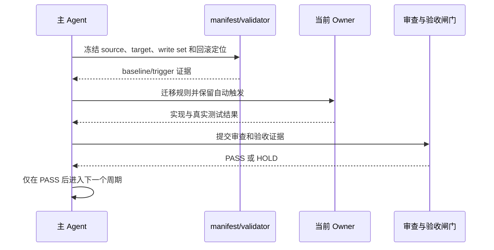

# 总控层 Skill 精简合并与单向路由全量顺序实施方案

结论：按七个周期顺序实施，每个周期内逐任务完成实现、真实测试、审查和验收；影响：该顺序决定旧入口何时可以删除；范围：一个来源需求、一个验收标准、一个实施总览和七个实施周期；非范围：不穿插业务域改造和 Git 提交；变化：所有候选使用同一 manifest 和 validator；完成标准：周期 01 至 07 均闭环；术语说明：全量顺序是项目级执行入口；验证状态：周期 01 baseline 已通过，后续进行中。

## 1. 当前计划最终方案简要说明

- 推荐方案一句话结论：按冻结证据、减重路由、统一 Owner、收口删除的顺序推进总控层 Skill 精简。
- 主落点 / 主路径：以 `skill-hit-check-rules` 作为每轮入口，以专职 Owner 和条件路由承接并行、自举、恢复、审查与最终输出。
- 为什么先走这条路线：先固定触发、授权、停止、安全和回滚语义，才能在删除竞争入口后证明没有触发空洞或规则丢失。

## 2. Agent 对当前问题的理解

- 问题：总控层存在重复触发判断、重复输出协议、并行与子代理职责重叠，以及项目规则与记忆自举的竞争入口。
- 目标：保留自动触发和用户习惯，把共享规则下沉到唯一 Owner，并让触发、执行、恢复、审查和验收形成单向链路。
- 本轮范围：总控层 Skill、references、agents、scripts、消费者、字典、验证器和本任务文档。
- 非范围：需求、Bug、业务测试和产品代码；不恢复已删除竞争入口。
- 当前优先闭环：先完成基线、触发契约和迁移映射，再进行高风险合并与旧入口删除。
- 关键假设 / 待确认点：项目级授权允许在写集不冲突且环境支持时并行；Obsidian 未注册只阻断知识沉淀，不阻断 local 仓库验证。

## 2.1 决策维度覆盖表

| 维度 | 状态 | 结论 / 依据 |
| --- | --- | --- |
| 架构 / 技术路线 | 已确定 | 单向路由；`skill-hit-check-rules` 保持唯一每轮入口。 |
| 代码落点（目录 / 包 / 文件） | 已确定 | 只改总控层 Skill 目录、references、agents、scripts 和消费者。 |
| 实现方式 | 已确定 | 先引用化，后合并；大 Skill 只拆内部 references，不新增竞争入口。 |
| 命名 | 已确定 | 保留当前 Owner 名称，退役名称只留历史和迁移证据。 |
| 注释 | 已确定 | 新增脚本注释使用中文并遵循既有注释闸门。 |
| 日志 | 已确定 | 每个提交域独立追加 README 改动日志。 |
| 错误处理 / 异常 | 已确定 | 真实失败进入 `execution-failure-learning-rules`，不可伪报成功。 |
| 数据模型 / 表 / 字段 | N/A | 原因：本轮不修改数据库；证据：实施范围仅包含总控层 Skill、消费者和本地验证器。 |
| 接口契约 | 已确定 | Skill description、aliases、references 和状态证据是本轮公共接口。 |
| 依赖与库 | 已确定 | 使用仓库现有 Python、Git Bash 和验证脚本。 |
| 测试策略 / 样本 | 已确定 | baseline、trigger、负向竞争、生命周期、post-delete 和 Quick Validate。 |

## 2.2 待用户选择清单

- 无（所有真实不确定决策点已由用户选定；剩余机器阻断按 `HOLD` 处理）。

## 3. 实施周期总览

- 总周期说明：七个周期严格串行；每个最小任务完成实现、真实测试、审查和验收后才进入下一个任务。
- 本次计划拆分的子任务周期数：7。
- 周期拆分原则：按触发入口、上下文自举、并行委派、自治恢复、收口输出和删除回滚边界拆分。
- 周期排序说明：第一期冻结事实，第二至六期迁移 Owner，第七期才允许删除旧入口和最终收口。
- 周期 1：基线、映射与冻结；任务 `TASK-TC-01-01`、`TASK-TC-01-02`；先建立 manifest、hash、fixtures 和回滚定位。
- 周期 2：入口与阶段路由减重；任务 `TASK-TC-02-01`、`TASK-TC-02-02`；只收敛入口，不删除高风险 Owner。
- 周期 3：上下文恢复与项目自举；任务 `TASK-TC-03-01`、`TASK-TC-03-02`；区分压缩恢复与新会话预热。
- 周期 4：并行与子代理统一；任务 `TASK-TC-04-01`、`TASK-TC-04-02`；统一真实启动、回收和串行回退状态机。
- 周期 5：执行、恢复和自治减重；任务 `TASK-TC-05-01`、`TASK-TC-05-02`；保留失败学习、运行时恢复和用户手改重同步边界。
- 周期 6：收口、证据和最终输出去重；任务 `TASK-TC-06-01`、`TASK-TC-06-02`；最终输出只由唯一 Owner 渲染。
- 周期 7：消费者迁移、删除与收口；任务 `TASK-TC-07-01`、`TASK-TC-07-02`；只有所有正向、负向和生命周期测试通过才删除。

### 周期依赖图

图形目的：说明七个实施周期的先后依赖，防止跳过基线直接删除入口。

关联 ID：`CYCLE-TC-01` 至 `CYCLE-TC-07`。


### 周期执行时序图

图形目的：说明每个周期必须经过实现、真实测试、审查和验收后才能进入下一周期。

关联 ID：`CYCLE-TC-01` 至 `CYCLE-TC-07`、`TASK-TC-*`。



## 4. 阶段计划

- 阶段 1：事实冻结；目标是生成可回滚的基线、映射和触发样本；输入为当前 Skill 树和工作树；输出为 manifest、hash、fixtures；验证门槛为 baseline PASS。
- 阶段 2：Owner 迁移；目标是把重复规则改为引用并完成两个高风险合并；输入为冻结映射；输出为唯一 Owner、references 和迁移消费者；验证门槛为 Quick Validate、trigger 和负向竞争 PASS。
- 阶段 3：删除与放行；目标是清零活跃旧消费者并完成最终字典、审查和验收；输入为全部迁移结果；输出为 post-delete 证据和回滚资产；验证门槛为 P0/P1 为零。

## 5. 最小任务清单

| 任务 | 周期内顺序 | 只做这一件事 | 真实测试入口 | 审查 / 验收 | 完成条件 | 停止条件 |
| --- | ---: | --- | --- | --- | --- | --- |
| `TASK-TC-01-01` | 1 | 冻结 inventory、manifest 和保护语义 | baseline validator | 映射审查 / baseline AC | 每条规则有 source→target | 缺目标落点 |
| `TASK-TC-01-02` | 2 | 建立触发 fixtures 与回滚定位 | trigger fixture validator | 触发审查 / fixture AC | 正向、负向、边界样本齐全 | 负向误命中 |
| `TASK-TC-02-01` | 1 | 精简每轮入口 | Quick Validate + trigger | 入口审查 / trigger AC | 唯一首入口保留 | 首条字段丢失 |
| `TASK-TC-04-01` | 1 | 合并并行与子代理状态机 | lifecycle validator | 并行审查 / 生命周期 AC | 真实启动和关闭证据齐全 | 写集冲突或无回收证据 |
| `TASK-TC-07-02` | 2 | 删除已通过门禁的旧入口 | post-delete validator | 最终改动审查 / 最终验收 | 活跃消费者为零 | 触发空洞或孤立资产 |

每个任务的实现产出、真实测试、审查点、验收点、完成条件、停止条件和回滚定位由对应周期文档和测试证据补齐；预计触达文件数默认不超过约 5 个，超出时继续拆分。

## 6. 现状与落点

- 涉及目录：`skill-hit-check-rules/`、`parallel-task-dispatch-rules/`、`project-rule-file-bootstrap-rules/`、`autonomous-execution-rules/`、`implementation-review-rules/`、`reasoning-summary-structure-rules/` 及相邻消费者。
- 涉及文件 / 模块：各 Owner 的 `SKILL.md`、`references/`、`agents/`、`scripts/`、活跃消费者、字典和总控专项 validator。
- 复用点：现有 `project-rule-file-bootstrap-rules/scripts/bootstrap_agents.sh`、Quick Validate、字典生成器和控制面 validator。
- 需要新增的内容：仅在测试资产域新增 manifest、fixtures 和 evidence，不恢复退役 Skill 目录。

```text
F:/luode-skills/
├── skill-hit-check-rules/              # 每轮唯一首入口
├── parallel-task-dispatch-rules/      # 并行与子代理统一 Owner
├── project-rule-file-bootstrap-rules/  # rule-bootstrap/memory-bootstrap Owner
├── autonomous-execution-rules/        # 自治执行 references
├── implementation-review-rules/       # 实现审查 references
├── reasoning-summary-structure-rules/ # 最终输出唯一渲染 Owner
├── doc/5-tests/                        # 总控 manifest、fixtures、validator、evidence
└── skill-dictionary/                   # 生成式字典
```

文件/符号落点、真实命令和每周期 write set 以对应周期文档为准；本轮不新增数据库、API 或产品代码。

## 7. 方案选择

- 方案 A：全面合并为一个总控 Skill。缺点是生命周期、授权和失败恢复边界混在一起，触发竞争风险高。
- 方案 B：保留阶段 Owner，引用化公共规则，只合并并行/子代理和规则/记忆自举两组候选。
- 推荐方案与原因：选择方案 B，因为它降低重复读取成本，同时保留不同阶段的自动触发和唯一事实 Owner。

## 8. 实施步骤

1. 冻结 `CYCLE-TC-01` 的规则映射、触发样本、hash 和回滚入口。
2. 在 `CYCLE-TC-02` 至 `CYCLE-TC-06` 中按 Owner 迁移并逐任务完成真实测试、审查和验收。
3. 在 `CYCLE-TC-07` 清零活跃消费者、重生成字典并执行 post-delete。

## 9. 真实测试安排

- 真实测试总表：Quick Validate、控制面 validator 的 baseline/trigger/post-delete、bootstrap 临时目录验证、字典生成、`git diff --check`。
- 免测任务及理由：纯历史说明和不改变运行结果的排版仅做 UTF-8 与 diff 检查；Skill、脚本和触发条件变更均不得免测。
- 总体真实测试依赖环境：local 仓库、Python 3、Git Bash；不连接 test/prod 数据库、缓存、消息队列或外部业务服务。
- 总体通过标准：所有受影响 Skill Quick Validate PASS，正向/负向/边界/生命周期样本 PASS，字典 `planned_missing=0`，无孤立资产和冲突标记。
- 真实测试：`$env:PYTHONUTF8='1'; python -B doc/5-tests/2026-07-22_223221/control-plane-streamlining/validate_control_plane_streamlining.py --phase baseline`，随后执行 `trigger` 和 `post-delete`。

## 10. 图形化执行路径

流程图、周期依赖图和时序图见本节及上文；图形只表达流程和顺序，规则字段、命令和证据仍以正文及执行附录为准。

## 11. 风险与阻断项

- 风险：远端或旧文档重新引入退役 Skill 名称。处理：扫描活跃消费者，历史文档允许保留。
- 风险：多个 Owner 同时声明同一公共规则。处理：建立唯一 Owner 映射，重复内容改为引用。
- 风险：并行任务没有真实启动或关闭证据。处理：保持 `HOLD` 并回退串行。
- 任务停止 / 结束条件总表：自动触发、用户停止、安全、授权、回滚、字典或机器验证任一失败，停止当前候选；全部周期 PASS 且无 P0/P1 后结束。

## 13. 自审结论

- 覆盖度检查：SRC、REQ、RULE、AC、CYCLE、TASK、TEST、EVIDENCE 均有落点。
- 实施周期检查：七周期顺序固定，未通过不得跨周期。
- 最小任务闭环检查：每个任务必须实现、真实测试、审查、验收。
- 阶段单一目标检查：事实冻结、Owner 迁移、删除放行三阶段边界清晰。
- 可执行性检查：命令、样本、失败预期、回滚和停止条件进入周期文档与测试资产。
- 用户确认状态：本计划已获实施方向确认；Git 历史写入仍以当前轮显式授权为准。

## 文档定位与维护状态

图片资产决策：N/A + 原因：本方案仅编排 Markdown Skill 规则和本地验证步骤；证据：来源需求和七个实施周期均无图片交付。

| 字段 | 内容 |
| --- | --- |
| 来源 | `REQ-TC-20260722` |
| 验收 | `AC-TC-20260722` |
| 总览 | `IMPL-TC-20260722` |
| 当前入口 | `CYCLE-TC-01` |

## 来源对象清单与回指关系

| 来源 | 需求 | 验收 | 实施 |
| --- | --- | --- | --- |
| `SRC-CONTROL-PLANE-20260722-001` | `REQ-TC-20260722` | `AC-TC-20260722` | `IMPL-TC-20260722` |

## 全量执行顺序

图形目的：说明七个实施周期必须遵循的先后依赖，确保先冻结证据、再迁移规则、最后删除旧入口。

关联 ID：`CYCLE-TC-01` 至 `CYCLE-TC-07`、`REQ-TC-20260722`、`AC-TC-20260722`。


| 顺序 | 周期 | 主要任务 | 进入条件 | 收口条件 |
| ---: | --- | --- | --- | --- |
| 1 | `CYCLE-TC-01` | manifest、inventory、fixtures、validator | 用户授权 | baseline 通过 |
| 2 | `CYCLE-TC-02` | hit/team 减重 | 周期01通过 | trigger 局部通过 |
| 3 | `CYCLE-TC-03` | context 与 bootstrap | 周期02通过 | context/bootstrap 通过 |
| 4 | `CYCLE-TC-04` | parallel/subagent 合并 | 冻结写集 | 生命周期证据通过 |
| 5 | `CYCLE-TC-05` | autonomous/Git/恢复减重 | Owner 边界稳定 | quick validate 通过 |
| 6 | `CYCLE-TC-06` | review/finalization/output 引用化 | 测试前 Owner 不变 | 无双输出 Owner |
| 7 | `CYCLE-TC-07` | 消费者、删除、字典、总验收 | trigger 全部通过 | post-delete 通过 |

## 当前执行入口与下一步

当前从 `CYCLE-TC-01` 进入；每个任务最大推进到自己的测试、审查、验收，不得跨任务积累未验证修改。

## 依赖、进入、收口与阻断

| 依赖 | 处理 |
| --- | --- |
| 用户当前实施授权 | 已满足 |
| Git 历史写入授权 | 未提供，不执行 |
| Obsidian vault | 阻断沉淀，不阻断 local 实施 |
| 任一机器门禁失败 | 当前候选 `HOLD` |

## 自审结论

- 全量顺序覆盖 `REQ -> AC -> CYCLE -> TASK -> TEST -> EVIDENCE`。
- 所有删除均位于最后周期，不会先删后补证据。
- N/A + 原因：无数据库、HTTP、图片和生产环境依赖；证据：依赖表只列出 local 文件、Git 授权边界和本地机器门禁。

## 全量证据映射

`EVIDENCE-TC-CHAIN-01`：本表汇总总控层七个周期、十四个最小任务的实现、真实测试、审查和验收证据锚点；具体命令、样本、日志和结论分别落在对应周期文档、`doc/5-tests/`、`doc/6-审查/` 和 `doc/7-验收/`。

| 任务 | 实现证据 | 真实测试证据 | 审查证据 | 验收证据 |
| --- | --- | --- | --- | --- |
| `TASK-TC-01-01` | `EVD-TASK-TC-01-01-IMPL-01` | `EVD-TASK-TC-01-01-TEST-01` | `EVD-TASK-TC-01-01-REVIEW-01` | `EVD-TASK-TC-01-01-ACCEPT-01` |
| `TASK-TC-01-02` | `EVD-TASK-TC-01-02-IMPL-01` | `EVD-TASK-TC-01-02-TEST-01` | `EVD-TASK-TC-01-02-REVIEW-01` | `EVD-TASK-TC-01-02-ACCEPT-01` |
| `TASK-TC-02-01` | `EVD-TASK-TC-02-01-IMPL-01` | `EVD-TASK-TC-02-01-TEST-01` | `EVD-TASK-TC-02-01-REVIEW-01` | `EVD-TASK-TC-02-01-ACCEPT-01` |
| `TASK-TC-02-02` | `EVD-TASK-TC-02-02-IMPL-01` | `EVD-TASK-TC-02-02-TEST-01` | `EVD-TASK-TC-02-02-REVIEW-01` | `EVD-TASK-TC-02-02-ACCEPT-01` |
| `TASK-TC-03-01` | `EVD-TASK-TC-03-01-IMPL-01` | `EVD-TASK-TC-03-01-TEST-01` | `EVD-TASK-TC-03-01-REVIEW-01` | `EVD-TASK-TC-03-01-ACCEPT-01` |
| `TASK-TC-03-02` | `EVD-TASK-TC-03-02-IMPL-01` | `EVD-TASK-TC-03-02-TEST-01` | `EVD-TASK-TC-03-02-REVIEW-01` | `EVD-TASK-TC-03-02-ACCEPT-01` |
| `TASK-TC-04-01` | `EVD-TASK-TC-04-01-IMPL-01` | `EVD-TASK-TC-04-01-TEST-01` | `EVD-TASK-TC-04-01-REVIEW-01` | `EVD-TASK-TC-04-01-ACCEPT-01` |
| `TASK-TC-04-02` | `EVD-TASK-TC-04-02-IMPL-01` | `EVD-TASK-TC-04-02-TEST-01` | `EVD-TASK-TC-04-02-REVIEW-01` | `EVD-TASK-TC-04-02-ACCEPT-01` |
| `TASK-TC-05-01` | `EVD-TASK-TC-05-01-IMPL-01` | `EVD-TASK-TC-05-01-TEST-01` | `EVD-TASK-TC-05-01-REVIEW-01` | `EVD-TASK-TC-05-01-ACCEPT-01` |
| `TASK-TC-05-02` | `EVD-TASK-TC-05-02-IMPL-01` | `EVD-TASK-TC-05-02-TEST-01` | `EVD-TASK-TC-05-02-REVIEW-01` | `EVD-TASK-TC-05-02-ACCEPT-01` |
| `TASK-TC-06-01` | `EVD-TASK-TC-06-01-IMPL-01` | `EVD-TASK-TC-06-01-TEST-01` | `EVD-TASK-TC-06-01-REVIEW-01` | `EVD-TASK-TC-06-01-ACCEPT-01` |
| `TASK-TC-06-02` | `EVD-TASK-TC-06-02-IMPL-01` | `EVD-TASK-TC-06-02-TEST-01` | `EVD-TASK-TC-06-02-REVIEW-01` | `EVD-TASK-TC-06-02-ACCEPT-01` |
| `TASK-TC-07-01` | `EVD-TASK-TC-07-01-IMPL-01` | `EVD-TASK-TC-07-01-TEST-01` | `EVD-TASK-TC-07-01-REVIEW-01` | `EVD-TASK-TC-07-01-ACCEPT-01` |
| `TASK-TC-07-02` | `EVD-TASK-TC-07-02-IMPL-01` | `EVD-TASK-TC-07-02-TEST-01` | `EVD-TASK-TC-07-02-REVIEW-01` | `EVD-TASK-TC-07-02-ACCEPT-01` |

## 最大推进边界

- 仅处理总控层 Skill、其 references、agents、scripts、活跃消费者、字典、验证器和本任务文档。
- 不恢复已删除竞争入口，不扩散修改需求、Bug、业务测试或产品代码。
- 未获得当前轮 Git 写历史授权时，不执行 commit、push、merge 或 rebase。

## 执行附录

- local 环境、周期内命令、样本、预期失败、清理、回滚、目录树、文件/符号定位和测试记录由 `doc/3-实施/` 周期文档与 `doc/5-tests/` evidence 维护。

## 追踪附录

- `SRC-CONTROL-PLANE-20260722-001 -> REQ-TC-20260722 -> AC-TC-20260722 -> CYCLE-TC-* -> TASK-TC-* -> TEST-TC-* -> EVD-*`。
