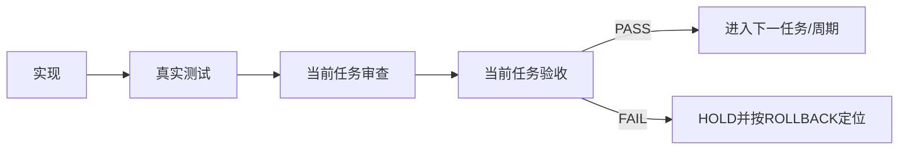

# 需求域实施周期 04：三个专项 Skill 引用化

结论：只在本周期目标范围内完成一个可验收闭环；影响：逐周期降低旧路由和重复规则风险；范围：本周期任务与其测试证据；非范围：后续周期、其他业务域和 Git 历史；变化：先实现再真实测试、审查、验收；完成标准：本周期所有 TASK 对应 TEST/REVIEW/ACCEPT PASS；术语说明：本周期失败即 HOLD 并保留回滚定位；验证状态：实施中。

## 当前周期目标、边界与进入条件

- 周期：`CYCLE-REQ-04`。
- 目标：三个专项 Skill 引用化。
- 进入条件：上一周期（或基线冻结）已记录 PASS。
- 收口条件：本周期两个 TASK 均完成“实现 -> 真实测试 -> 审查 -> 验收”。
- 图片资产决策：N/A + 原因：本周期只处理文本规则和本地验证器；证据：无图片交付。

## 当前代码/文档基线

- 基线提交：`76ee419d59396d919fea04ed55ea373ddeb8cb26`。
- 当前工作树存在其他未提交改动；以当前磁盘内容为准，禁止 reset/checkout 覆盖。
- 本周期证据目录：`doc/5-tests/2026-07-22_231500/requirement-domain-streamlining/`。

## 文件/符号操作契约

| 项目 | 约束 | 失败处理 |
| --- | --- | --- |
| 文件/符号 | 只修改本周期 write set | 超出立即停止 |
| Owner | 每条规则只有一个事实 Owner | 双 Owner 则 HOLD |
| 编码 | UTF-8、保留用户非受管内容 | 回读失败则回滚当前候选 |
| 授权 | 无当前轮 Git 授权，不执行历史写入 | 保持未提交 |

图形目的：说明本周期实现、测试、审查、验收和回滚的闭环。

关联 ID：`CYCLE-REQ-04`、`TASK-REQ-04-01`、`TASK-REQ-04-02`。

## 周期内最小任务执行顺序

| 顺序 | TASK | 文件/符号 | 真实测试 | 完成条件 |
| ---: | --- | --- | --- | --- |
| 1 | `TASK-REQ-04-01` | 周期 write set 第一批 | 对应专项 validator/Quick Validate | TEST/REVIEW/ACCEPT PASS |
| 2 | `TASK-REQ-04-02` | 周期 write set 第二批 | 对应专项 validator/字典/差异检查 | TEST/REVIEW/ACCEPT PASS |

任务内容：

- TASK-REQ-04-01 boundary 引用化并保留 BOUND Owner。
- TASK-REQ-04-02 splitting/change 引用化并归位实施职责。

## 最小任务闭环

每个任务必须记录输入样本、预期断言、失败预期、清理动作、回滚定位和停止条件。静态检查、人工阅读或计划启动不替代真实测试；失败不得自动推进下一任务。

## 当前周期验证矩阵

| TEST ID | 命令/样本 | 正向断言 | 负向断言 | 证据 |
| --- | --- | --- | --- | --- |
| `TEST-REQ-04-01` | `python -B doc/5-tests/2026-07-22_231500/requirement-domain-streamlining/validate_requirement_domain_streamlining.py --phase baseline` | 当前阶段 valid=true | 非法 write set/缺失资产失败 | `evidence/cycle-04-01.json` |
| `TEST-REQ-04-02` | 对修改 Skill 运行 `quick_validate.py` 与 `git diff --check` | 退出码 0 | 路径不存在/旧活跃入口残留失败 | `evidence/cycle-04-02.json` |

## 周期阻断、停止与回滚

- 停止条件：自动触发、规则落点、reference、消费者、UTF-8、字典或 P0/P1 失败。
- 回滚：只恢复本周期候选，使用 `ROLLBACK-REQ-04` 指向 baseline commit、冻结 SHA 和路径清单；不回滚已独立通过周期。
- 最大推进边界：只处理本周期 write set，禁止扩散到其他业务域。

## 周期追踪矩阵

| CYCLE | TASK | REQ/RULE | AC | TEST | REVIEW | ACCEPT |
| --- | --- | --- | --- | --- | --- | --- |
| `CYCLE-REQ-04` | `TASK-REQ-04-01` | `REQ-REQ-0004` | `AC-REQ-0004` | `TEST-REQ-04-01` | `REVIEW-REQ-04-01` | `ACCEPT-REQ-04-01` |
| `CYCLE-REQ-04` | `TASK-REQ-04-02` | `REQ-REQ-0004` | `AC-REQ-0004` | `TEST-REQ-04-02` | `REVIEW-REQ-04-02` | `ACCEPT-REQ-04-02` |

## 自审结论

本周期文档明确了进入、范围、文件/符号、真实测试、停止、回滚和逐任务闭环；最终 PASS 以实际 evidence 为准。
