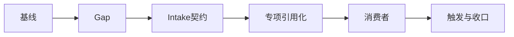
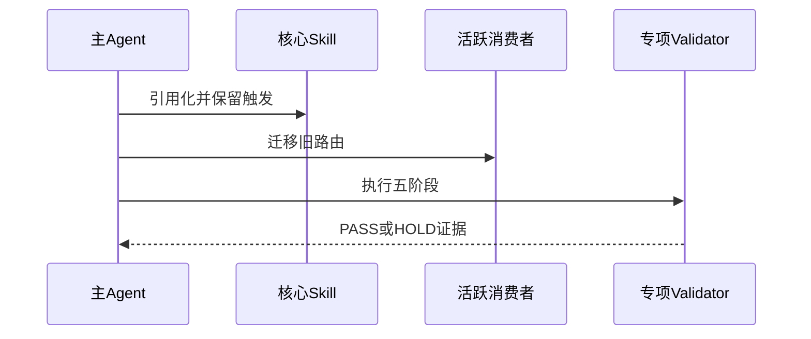

# 需求域 Skill 精简实施总览

结论：采用四 Owner 保留、两内部路由、引用化减重和旧消费者清零；影响：减小重复规则和误触发；范围：六周期及其最小任务；非范围：物理合并四个顶层 Skill、Bug/测试/审查业务规则和 Git；变化：职责回到唯一 reference Owner；完成标准：每个任务实现、真实测试、审查、验收后再推进；术语说明：HOLD 表示本候选未通过门禁，不代表全局回滚；验证状态：实施中。

## Agent 对当前问题的理解

- `unresolved_decisions: []`；用户已确认完整实施计划。
- 图片资产决策：N/A + 原因：本任务只处理 Markdown、YAML、Python 和 Skill 资产；证据：范围、落点和真实测试均无图片输入或交付。

问题不是规则太多本身，而是同一规则在多个 Owner、迁移快照和旧消费者中重复出现；目标是“简化但不删除”，并让自动触发继续生效。

## 当前计划最终方案简要说明

保留 `requirement-intake-rules`、`requirement-boundary-rules`、`requirement-splitting-rules`、`requirement-change-rules` 四个顶层 Owner；将 discovery/gap 作为 intake 内部条件路由；把公共契约和专项字段下沉到 reference；所有旧入口只在历史和回滚证据中保留。

## 实施周期总览

| CYCLE | 目标 | 主要文件/符号 | TEST |
| --- | --- | --- | --- |
| `CYCLE-REQ-01` | 基线与 validator | `doc/5-tests/...` | `TEST-REQ-BASELINE-001` |
| `CYCLE-REQ-02` | Gap 唯一资产 | `gap-routing*` | `TEST-REQ-REFERENCE-001` |
| `CYCLE-REQ-03` | Intake 契约 | `requirement-intake-rules/SKILL.md` | `TEST-REQ-TRIGGER-001` |
| `CYCLE-REQ-04` | 专项引用化 | boundary/splitting/change | `TEST-REQ-NEIGHBOR-001` |
| `CYCLE-REQ-05` | 消费者迁移 | README/PROJECT/相邻 references | `TEST-REQ-CONSUMER-001` |
| `CYCLE-REQ-06` | 全链路收口 | 字典/证据/审查 | `TEST-REQ-FINAL-001` |

## 阶段计划

- 先创建测试证据，不先删除。
- 核心 Skill 修改后逐个 Quick Validate。
- 共享消费者由主 Agent 串行复核，避免覆盖总控层既有未提交改动。
- 五阶段 validator 全部 PASS 后才允许候选放行。

## 最小任务清单

| TASK | 文件/符号 | 真实测试 | 回滚 |
| --- | --- | --- | --- |
| `TASK-REQ-01-01` | manifest/inventory/fixtures | baseline | `ROLLBACK-REQ-01` |
| `TASK-REQ-02-01` | gap references | reference | `ROLLBACK-REQ-02` |
| `TASK-REQ-03-01` | intake description/contract | trigger | `ROLLBACK-REQ-03` |
| `TASK-REQ-04-01` | boundary/splitting/change | quick validate | `ROLLBACK-REQ-04` |
| `TASK-REQ-05-01` | active consumers | consumer | `ROLLBACK-REQ-05` |
| `TASK-REQ-06-01` | fixtures/dictionary/final evidence | post-cleanup | `ROLLBACK-REQ-06` |

## 现状与落点

- `requirement-intake-rules/SKILL.md`：唯一新需求接入入口与需求主文档 Owner。
- `requirement-intake-rules/references/requirement-domain-shared-contract.md`：公共路由和下游阻断契约。
- `requirement-intake-rules/references/gap-routing.md`：唯一 Gap 运行正文。
- 四个需求 Skill 的 `SKILL.md`、`agents/openai.yaml` 和既有 references：职责根与专项字段。
- `doc/5-tests/2026-07-22_231500/requirement-domain-streamlining/`：manifest、fixtures、validator、evidence。

## 真实测试安排

本地 Python 命令、Quick Validate、字典生成、validator 五阶段和 `git diff --check` 均为真实测试入口；静态阅读不视为功能可用。每个任务记录样本、断言、失败预期、清理、回滚和退出码。

## 依赖与授权矩阵

| 依赖 | 用途 | 状态 |
| --- | --- | --- |
| `quick_validate.py` | Skill 结构验证 | 必须通过 |
| 专项 validator | 触发、消费者、reference、收口 | 必须通过 |
| 字典生成器 | Skill 总数和 planned_missing | 必须通过 |

## 审查与验收矩阵

| 阶段 | 负责人 | 通过标准 |
| --- | --- | --- |
| 当前任务审查 | 主 Agent | P0/P1=0 |
| 当前任务验收 | 主 Agent | 对应 AC PASS |
| 最终验收 | final-acceptance-rules | 全部证据闭环 |

## 风险与阻断项

触发竞争失败、旧消费者残留、reference 不存在、规则落点缺失、字典 planned_missing 非零、总控层未提交改动被覆盖或 P0/P1 未清零时立即 HOLD。

## 任务完成、停止与最大推进边界

完成条件：六周期任务闭环、五阶段 validator、Quick Validate、字典、严格文档 profile、当前改动审查和最终验收均 PASS。停止条件：任一保护语义、自动触发、授权、local、停止、回滚或输出规则被弱化。最大推进边界：只处理四个需求 Skill、必要相邻消费者、测试资产、字典和本任务工程文档；不提交 Git。

## 自审结论

实施总览已将 Owner、周期、任务、文件/符号、TEST、REVIEW、ACCEPT、停止和回滚建立关联；最终是否放行依赖真实命令结果。

图形目的：展示需求域六周期从冻结到最终收口的实施边界。

关联 ID：`CYCLE-REQ-01` 至 `CYCLE-REQ-06`。

图形目的：展示主 Agent、核心 Skill、消费者与验证器的实施交互。

关联 ID：`TASK-REQ-01-01`、`TASK-REQ-06-02`、`TEST-REQ-FINAL-001`。

