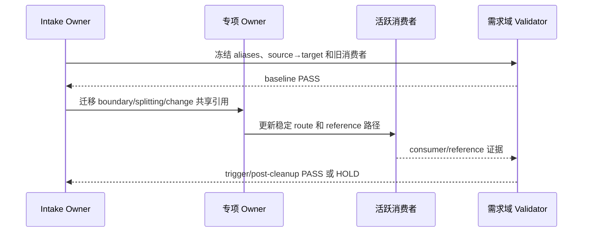
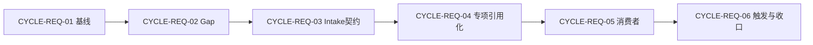

# 需求域全量顺序实施方案

结论：按基线、Gap、主入口、专项 Skill、消费者、触发与收口顺序实施；影响：每个候选可独立验证和回滚；范围：六个需求域实施周期；非范围：其他业务域和 Git 历史；变化：以需求域专项 validator 作为阶段证据；完成标准：六周期逐任务闭环；术语说明：周期是可独立验收的大进度，任务是约五文件以内的最小写集；验证状态：实施中。

## 1. 当前计划最终方案简要说明

- 推荐方案一句话结论：保留四个需求域 Owner，只把旧 discovery/gap 入口收口到 intake 的条件路由。
- 主落点 / 主路径：`requirement-intake-rules` 负责接入、`initial-discovery` 和 `gap-routing`，boundary、splitting、change 继续按专项信号自动触发。
- 为什么先走这条路线：需求生命周期和触发信号不同，全面合并会吞掉专项自动触发；先清理旧消费者才能安全引用化。

## 2. Agent 对当前问题的理解

- 问题：旧 `requirement-discovery-rules` / `requirement-gap-rules` 路由残留，Gap 运行正文和 references 重复，四个需求 Skill 公共规则分散。
- 目标：保留自动触发和所有用户习惯，将需求主文档、边界、切片、变更和验收前置职责分别归位。
- 本轮范围：四个需求域 Skill、acceptance/artifact/test 相邻消费者、专项 validator、字典和需求域文档。
- 非范围：不合并四个需求顶层 Skill，不恢复退役入口，不修改 Bug、测试、审查和最终验收业务规则。
- 当前优先闭环：先让旧 gap/discovery 活跃消费者清零，再删除迁移快照并统一 references 路径。
- 关键假设 / 待确认点：需求域专项 validator 作为迁移阶段证据；不适用 Obsidian 不改变 local 文件验证。

## 2.1 决策维度覆盖表

| 维度 | 状态 | 结论 / 依据 |
| --- | --- | --- |
| 架构 / 技术路线 | 已确定 | 四个顶层 Owner 保持独立，共享契约归 intake reference。 |
| 代码落点（目录 / 包 / 文件） | 已确定 | 需求 Skill `SKILL.md`、references、相邻消费者和专项 validator。 |
| 实现方式 | 已确定 | 旧入口只做条件路由迁移，不恢复目录。 |
| 命名 | 已确定 | 当前 Owner 名称稳定，退役名称仅保留历史和回滚证据。 |
| 注释 | N/A | 原因：本轮主要为 Markdown、YAML 和验证器资产；证据：代码注释沿用现有 Owner。 |
| 日志 | 已确定 | README 按需求域提交域追加日志。 |
| 错误处理 / 异常 | 已确定 | validator 失败保持 `HOLD`，不以口头结论替代。 |
| 数据模型 / 表 / 字段 | N/A | 原因：不修改数据库；证据：实施范围仅包含需求域 Skill、消费者和本地验证器。 |
| 接口契约 | 已确定 | 自动触发 aliases、内部 route、reference 路径和稳定 ID。 |
| 依赖与库 | 已确定 | 使用 Python validator、Quick Validate 和字典生成器。 |
| 测试策略 / 样本 | 已确定 | baseline、trigger、consumer、reference、post-cleanup 和邻域竞争样本。 |

## 2.2 待用户选择清单

- 无（四个需求 Owner 的保留与路由归位已确定；机器验证失败仍按候选 `HOLD`）。

## 3. 实施周期总览

- 总周期说明：六个周期串行推进，每个周期内按最小写集完成实现、真实测试、审查和验收。
- 本次计划拆分的子任务周期数：6。
- 周期拆分原则：按旧路由资产、主入口契约、专项 Owner、消费者迁移和最终触发收口拆分。
- 周期排序说明：第一期只冻结事实；第二期才能清理 Gap；第六期最后删除运行资产并完成字典与验收。
- 周期 1：基线、映射与验证器修正；建立旧消费者 inventory、manifest、fixtures 和真实扫描 validator。
- 周期 2：Gap 路由和退役资产收口；建立唯一 Gap 正文、修复直接 references 路径并删除迁移快照。
- 周期 3：主入口和共享契约减重；修正 intake 触发口径，建立共享需求域 contract。
- 周期 4：三个专项 Skill 引用化；boundary、splitting、change 只保留自己的生命周期职责。
- 周期 5：活跃消费者迁移；分批迁移需求、验收、存储、并行、总控和测试消费者。
- 周期 6：自动触发、邻域竞争和最终收口；执行自然语言 fixtures、字典、审查和最终验收。

### 周期执行时序图

图形目的：说明需求域每个周期必须经过实现、真实测试、审查和验收后才能向后推进。

关联 ID：`CYCLE-REQ-01` 至 `CYCLE-REQ-06`、`TASK-REQ-*`。



## 4. 阶段计划

- 阶段 1：事实和路由冻结；只建立 inventory、mapping、fixtures、validator；验证门槛是 baseline PASS。
- 阶段 2：运行资产唯一化；只处理 Gap 正文、references 和旧消费者；验证门槛是 consumer/reference PASS。
- 阶段 3：职责和触发收口；只处理共享契约、专项 Owner、邻域竞争和字典；验证门槛是 trigger/post-cleanup PASS。

## 5. 最小任务清单

| 任务 | 周期内顺序 | 本任务只做这一件事 | 真实测试 | 审查 / 验收 | 停止条件 |
| --- | ---: | --- | --- | --- | --- |
| `TASK-REQ-01-01` | 1 | 冻结需求域事实基线 | baseline validator | 映射审查 / baseline AC | 旧消费者清单不完整 |
| `TASK-REQ-02-01` | 1 | 建立唯一 Gap 运行资产 | reference validator | 路径审查 / Gap AC | 正文重复或路径缺失 |
| `TASK-REQ-03-01` | 1 | 修复 intake 自动触发口径 | trigger fixtures | 入口审查 / route AC | 专项触发被吞并 |
| `TASK-REQ-05-01` | 1 | 迁移需求与验收消费者 | consumer validator | 迁移审查 / consumer AC | 旧名称仍为活跃引用 |
| `TASK-REQ-06-02` | 1 | 清零旧入口并收口字典 | post-cleanup validator | 当前改动审查 / 最终验收 | 触发空洞或孤立资产 |

每个最小任务必须补齐文件/符号、真实命令、样本、通过标准、审查点、验收点、回滚定位和预计写集；默认不超过约 5 个文件。

## 6. 现状与落点

- 涉及目录：`requirement-intake-rules/`、`requirement-boundary-rules/`、`requirement-splitting-rules/`、`requirement-change-rules/` 和必要相邻消费者。
- 涉及文件 / 模块：四个 `SKILL.md`、Gap references、需求域共享 contract、acceptance/artifact/test 路由文件、validator、fixtures 和字典。
- 复用点：现有 intake 内部 `initial-discovery` / `gap-routing`、artifact storage Owner 和需求域专项 validator。

```text
F:/luode-skills/
├── requirement-intake-rules/       # 新需求接入、discovery、gap 唯一路由
│   ├── SKILL.md
│   └── references/                 # 共享需求域契约和 Gap 支持文件
├── requirement-boundary-rules/    # 范围、归属、兼容性 Owner
├── requirement-splitting-rules/    # 切片、依赖和优先闭环 Owner
├── requirement-change-rules/       # 变更失效、回流和重规划 Owner
├── doc/5-tests/2026-07-22_231500/  # manifest、fixtures、validator、evidence
└── skill-dictionary/               # 生成式字典
```

文件/符号落点由周期任务冻结；不新增需求顶层 Skill、不恢复旧入口。

## 7. 方案选择

- 方案 A：四个需求 Skill 全面合并。缺点是生命周期和专项触发相互吞并。
- 方案 B：保留四个 Owner，公共规则引用化，旧 discovery/gap 只作为 intake 内部条件路由。
- 推荐方案与原因：选择方案 B，既降低重复，又保持自动触发边界和用户习惯。

## 8. 实施步骤

1. 先完成 `CYCLE-REQ-01` 的 inventory、mapping、fixtures 和 validator。
2. 再按 `CYCLE-REQ-02` 至 `CYCLE-REQ-05` 清理 Gap、建立 contract 并迁移消费者。
3. 最后执行 `CYCLE-REQ-06` 的自然语言、负向竞争、字典、审查和最终验收。

## 9. 真实测试安排

- 真实测试总表：需求域 validator 五阶段、四个 Skill Quick Validate、自然语言触发 fixtures、旧消费者扫描、reference 路径解析和字典生成。
- 免测任务及理由：纯历史说明只做 UTF-8 和链接检查；触发、路由、references 和 Skill 资产均必须真实验证。
- 真实测试依赖环境：local 仓库、Python 3、Git Bash；禁止连接 test/prod 服务。
- 总体通过标准：`requirement-gap-rules` 和 `requirement-discovery-rules` 活跃消费者为零，Gap 正文唯一，所有 references 可解析，`planned_missing=0`。
- 真实测试命令：`python -B doc/5-tests/2026-07-22_231500/requirement-domain-streamlining/validate_requirement_domain_streamlining.py --phase baseline|trigger|consumer|reference|post-cleanup`。

## 10. 图形化执行路径

流程图和时序图表达需求域从 intake 到专项 Owner、消费者迁移和最终收口的顺序；稳定 ID、命令和证据仍以周期文档及执行附录为准。

## 11. 风险与阻断项

- 风险：旧名称仍出现在活跃消费者；处理：逐文件扫描，历史和 manifest 证据允许保留。
- 风险：共享 contract 形成新的竞争 Owner；处理：只由 intake contract 定义公共路由，专项字段留在专职 references。
- 风险：专项 Skill 被 intake 吞并；处理：邻域竞争测试失败即 `HOLD`。
- 任务停止 / 结束条件总表：任一自动触发、负向边界、reference、字典或机器验证失败，停止当前候选；五阶段全部 PASS 且无 P0/P1 后结束。

## 13. 自审结论

- 覆盖度检查：需求来源、决策、规则、验收、周期、任务、测试和证据均有映射。
- 实施周期检查：六周期依赖明确，旧入口删除位于最后周期。
- 最小任务闭环检查：每个任务逐个实现、真实测试、审查、验收。
- 可执行性检查：路径、命令、样本、失败预期、回滚和最大推进边界明确。
- 用户确认状态：需求域保留四个顶层 Owner，不恢复两个退役入口。

## 文档信息

| 字段 | 内容 |
| --- | --- |
| 基线提交 | `76ee419d59396d919fea04ed55ea373ddeb8cb26` |
| 当前状态 | 实施中 |
| Git 授权 | 当前轮未授权历史写入 |

## 来源对象清单与回指关系

| 对象 | 类型 | 回指关系 | 当前状态 |
| --- | --- | --- | --- |
| 需求域精简需求 | requirement | `REQ-REQ-DOMAIN-20260722` | 已落盘 |
| 前置验收标准 | acceptance | `AC-REQ-DOMAIN-20260722` | 已落盘 |
| 实施总览 | implementation_overview | `PLAN-REQ-OVERVIEW-20260722` | 已落盘 |
| 周期文档 | implementation_cycle | `CYCLE-REQ-01` 至 `CYCLE-REQ-06` | 已落盘 |

图片资产决策：N/A + 原因：只维护文本规则和验证器。

| 来源对象 | 文档 | 回指 |
| --- | --- | --- |
| `REQ-REQ-DOMAIN-20260722` | 需求文档 | `SRC-REQ-DOMAIN-20260722-001` |
| `AC-REQ-DOMAIN-20260722` | 前置验收标准 | `REQ-REQ-DOMAIN-20260722` |
| `PLAN-REQ-DOMAIN-20260722` | 本文 | `CYCLE-REQ-*` |

## 全量执行顺序

1. `CYCLE-REQ-01`：冻结 baseline、mapping、inventory、fixtures 和 validator。
2. `CYCLE-REQ-02`：建立 Gap 唯一运行资产，删除迁移快照。
3. `CYCLE-REQ-03`：修复 intake 触发口径并建立共享契约。
4. `CYCLE-REQ-04`：引用化 boundary、splitting、change。
5. `CYCLE-REQ-05`：按不超过约 5 个文件迁移活跃消费者。
6. `CYCLE-REQ-06`：执行自然语言触发、邻域竞争、字典、审查和最终收口。

图形目的：说明六个需求域周期的依赖关系和单向推进边界。

关联 ID：`CYCLE-REQ-01` 至 `CYCLE-REQ-06`。



## 依赖、进入、收口与阻断

- 每周期进入条件是上一周期 TEST/REVIEW/ACCEPT PASS。
- 任何失败只回滚当前候选，已通过候选不回滚。
- 旧入口物理删除前必须有消费者、reference、触发、字典和回滚证据。
- 用户明确停止、Git 未授权、local 证据缺失或 Obsidian 阻断不得被自动扩散。

## 当前执行入口与下一步

当前执行入口是 `doc/5-tests/2026-07-22_231500/requirement-domain-streamlining/validate_requirement_domain_streamlining.py`；实际 Skill 修改已完成，必须先运行 baseline/trigger/consumer/reference/post-cleanup，再进行当前改动审查和最终验收。

## 自审结论

当前计划结构满足单主入口、条件路由、独立 Owner、逐任务闭环和最大推进边界；实际放行以机器验证与审查证据为准。

## 全量追踪状态

| 当前入口 | 阻断 | 下一证据 |
| --- | --- | --- |
| 专项 validator 五阶段 | 任一阶段 valid=false | Quick Validate、字典、审查与最终验收 |

## 全量证据映射

`EVIDENCE-REQ-DOMAIN-CHAIN-01`：本表汇总需求域六个周期、十二个最小任务的实现、真实测试、审查和验收证据锚点；具体命令、样本、日志和结论分别落在对应周期文档、`doc/5-tests/`、`doc/6-审查/` 和 `doc/7-验收/`。

| 任务 | 实现证据 | 真实测试证据 | 审查证据 | 验收证据 |
| --- | --- | --- | --- | --- |
| `TASK-REQ-01-01` | `EVD-TASK-REQ-01-01-IMPL-01` | `EVD-TASK-REQ-01-01-TEST-01` | `EVD-TASK-REQ-01-01-REVIEW-01` | `EVD-TASK-REQ-01-01-ACCEPT-01` |
| `TASK-REQ-01-02` | `EVD-TASK-REQ-01-02-IMPL-01` | `EVD-TASK-REQ-01-02-TEST-01` | `EVD-TASK-REQ-01-02-REVIEW-01` | `EVD-TASK-REQ-01-02-ACCEPT-01` |
| `TASK-REQ-02-01` | `EVD-TASK-REQ-02-01-IMPL-01` | `EVD-TASK-REQ-02-01-TEST-01` | `EVD-TASK-REQ-02-01-REVIEW-01` | `EVD-TASK-REQ-02-01-ACCEPT-01` |
| `TASK-REQ-02-02` | `EVD-TASK-REQ-02-02-IMPL-01` | `EVD-TASK-REQ-02-02-TEST-01` | `EVD-TASK-REQ-02-02-REVIEW-01` | `EVD-TASK-REQ-02-02-ACCEPT-01` |
| `TASK-REQ-03-01` | `EVD-TASK-REQ-03-01-IMPL-01` | `EVD-TASK-REQ-03-01-TEST-01` | `EVD-TASK-REQ-03-01-REVIEW-01` | `EVD-TASK-REQ-03-01-ACCEPT-01` |
| `TASK-REQ-03-02` | `EVD-TASK-REQ-03-02-IMPL-01` | `EVD-TASK-REQ-03-02-TEST-01` | `EVD-TASK-REQ-03-02-REVIEW-01` | `EVD-TASK-REQ-03-02-ACCEPT-01` |
| `TASK-REQ-04-01` | `EVD-TASK-REQ-04-01-IMPL-01` | `EVD-TASK-REQ-04-01-TEST-01` | `EVD-TASK-REQ-04-01-REVIEW-01` | `EVD-TASK-REQ-04-01-ACCEPT-01` |
| `TASK-REQ-04-02` | `EVD-TASK-REQ-04-02-IMPL-01` | `EVD-TASK-REQ-04-02-TEST-01` | `EVD-TASK-REQ-04-02-REVIEW-01` | `EVD-TASK-REQ-04-02-ACCEPT-01` |
| `TASK-REQ-05-01` | `EVD-TASK-REQ-05-01-IMPL-01` | `EVD-TASK-REQ-05-01-TEST-01` | `EVD-TASK-REQ-05-01-REVIEW-01` | `EVD-TASK-REQ-05-01-ACCEPT-01` |
| `TASK-REQ-05-02` | `EVD-TASK-REQ-05-02-IMPL-01` | `EVD-TASK-REQ-05-02-TEST-01` | `EVD-TASK-REQ-05-02-REVIEW-01` | `EVD-TASK-REQ-05-02-ACCEPT-01` |
| `TASK-REQ-06-01` | `EVD-TASK-REQ-06-01-IMPL-01` | `EVD-TASK-REQ-06-01-TEST-01` | `EVD-TASK-REQ-06-01-REVIEW-01` | `EVD-TASK-REQ-06-01-ACCEPT-01` |
| `TASK-REQ-06-02` | `EVD-TASK-REQ-06-02-IMPL-01` | `EVD-TASK-REQ-06-02-TEST-01` | `EVD-TASK-REQ-06-02-REVIEW-01` | `EVD-TASK-REQ-06-02-ACCEPT-01` |

## 最大推进边界

- 仅处理四个需求域 Skill、必要相邻消费者、测试资产、字典和本任务工程文档。
- 不恢复 `requirement-discovery-rules` 或 `requirement-gap-rules`，不扩散修改 Bug、测试、审查或最终验收业务规则。
- 未获得当前轮 Git 写历史授权时，不执行 commit、push、merge 或 rebase。

## 执行附录

- local 命令、样本、清理、回滚、文件/符号落点和测试记录由需求域周期文档及专项 evidence 维护。

## 追踪附录

- `SRC-REQ-DOMAIN-20260722-001 -> REQ-REQ-DOMAIN-20260722 -> AC-REQ-DOMAIN-20260722 -> CYCLE-REQ-* -> TASK-REQ-* -> TEST-REQ-* -> EVD-*`。

