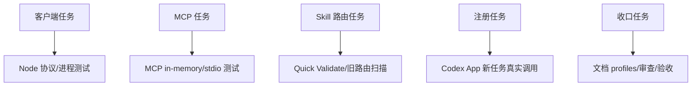

# 模型无关的会话重命名工具实施周期01：MCP 工具闭环

结论：本周期按 App Server 客户端、MCP schema、Skill 路由、正式注册和真实任务五个最小任务串行闭环；影响：只影响当前任务重命名能力和规则资产；范围：约定文件、全局工具注册与一次性测试任务；非范围：其他宿主、内部存储和 Git 历史；变化：统一 MCP 成为主路径；完成标准：十六项自动化、真实 Windows 进程树、正式注册、新任务成功改名、App 回读、文档校验和审查全部通过；术语说明：最小任务闭环是实现、真实测试、审查和验收依次完成；验证状态：周期已完成。

## 当前周期目标、边界与进入条件

图片资产决策：N/A + 原因：本周期只修改代码、规则、配置和文档；证据：写集没有图片资产。

| 字段 | 内容 |
| --- | --- |
| 周期 | `CYCLE-TR-01` |
| 目标 | 在 Codex App 完成模型无关的当前任务改名闭环 |
| 进入条件 | 用户确认正式计划；App Server 提供 `thread/name/set`；MCP 请求含当前任务元数据 |
| 收口条件 | AC-TR-001 至 AC-TR-009 判定完成且无 P0/P1 |
| 范围外 | 其他宿主、数据库直写、UI 模拟、Git commit/push |

## 当前代码/文档基线

- 基线提交：`76ee419d59396d919fea04ed55ea373ddeb8cb26`。
- 现有 `thread-title-rules` 是唯一自动触发 Owner。
- 当前工作树包含其他未提交改动，所有文件按最新磁盘内容增量修改，不 reset/checkout。
- 全部连接和测试仅使用 local 配置与本机 Codex App。

## 文件/符号操作契约

| 契约项 | 冻结要求 | 失败处理 |
| --- | --- | --- |
| Skill | 只增强 `thread-title-rules`，不新增竞争入口 | 删除新增竞争 Skill |
| MCP 输入 | 只允许 `title` | schema 测试失败即停止 |
| threadId | 仅宿主可信元数据 | 缺失/冲突返回 `THREAD_CONTEXT_MISSING` |
| App Server | 只用正式 JSON-RPC 方法 | 方法拒绝则返回稳定错误码 |
| 清理 | 成功、失败、超时均等待进程退出；Windows 终止树 | 遗留进程阻断 |
| 配置 | 只用 `codex mcp add` 增加 `thread_session` | 不手改覆盖其他配置 |

## 任务依赖图

图形目的：说明周期内五个最小任务的严格依赖和逐任务闭环。

关联 ID：`TASK-TR-01` 至 `TASK-TR-05`。


图形目的：说明每个任务与其领域 Owner、验证入口和证据的匹配关系。

关联 ID：`TEST-TR-APP`、`TEST-TR-MCP`、`TEST-TR-REAL`、`TEST-TR-DOCS`。



## 周期内最小任务执行顺序

| 顺序 | TASK | 文件/符号 | 实现 | 真实测试 | 完成条件 |
| ---: | --- | --- | --- | --- | --- |
| 1 | `TASK-TR-01` | `app-server-client.mjs`、对应测试 | JSON-RPC、超时、错误、跨平台树回收 | fake 协议 + Windows 真实后代进程 | 所有路径无遗留进程 |
| 2 | `TASK-TR-02` | `index.mjs`、rename 测试 | tool/schema/metadata/result | in-memory 与 stdio MCP | 只公开 `title`，错误码稳定 |
| 3 | `TASK-TR-03` | `SKILL.md`、prompt、规则消费者 | MCP 优先与保护语义 | Quick Validate、活动旧路由扫描 | 无竞争入口或旧原生优先路由 |
| 4 | `TASK-TR-04` | `thread_session` 注册、测试任务 | 正式 CLI 注册与真实调用 | `RENAMED`、`read_thread`、归档 | App 立即显示并持久回读 |
| 5 | `TASK-TR-05` | 四份文档、字典、项目状态 | 追踪与收口 | profiles、audit、UTF-8、diff check | 合规和最终验收 PASS |

## 最小任务闭环

每个任务都执行“实现 → 真实测试 → 当前任务审查 → 当前任务验收”。任务 01 未证明真实 Windows 子进程树退出时不得推进；任务 02 schema 存在 `threadId` 时不得推进；任务 03 保护语义或活动旧路由未清零时不得推进；任务 04 只能使用新持久化任务，失败不得直写数据库；任务 05 任一 profile 或 P0/P1 失败不得收口。

## 当前周期验证矩阵

| TEST | 样本 | 断言 | 失败预期 | 清理 |
| --- | --- | --- | --- | --- |
| `TEST-TR-APP-POS` | initialize + thread/name/set 成功响应 | 返回成功并自然退出 | 缺结果则拒绝 | 关闭 stdin |
| `TEST-TR-APP-NEG` | 错误、非法 JSON、异常退出、CLI 缺失 | 稳定错误码 | 原始响应不得泄露 | 等待/终止进程 |
| `TEST-TR-APP-TIMEOUT` | fake 与真实 Windows 进程树 | `TIMEOUT` 且后代 PID 不存活 | 遗留即 FAIL | `taskkill /t /f` 兜底 |
| `TEST-TR-MCP-POS` | 合法 title + 一致宿主元数据 | `RENAMED` | 不得调用其他 threadId | 关闭 MCP transport |
| `TEST-TR-MCP-NEG` | 空标题、25 字、缺失/冲突/猜测字段 | 稳定失败码 | 任何猜测即 FAIL | 无持久化写入 |
| `TEST-TR-REAL` | 新任务“模型无关会话重命名终验” | 工具发现、`RENAMED`、App 回读一致 | 不回退原生 | 归档测试任务 |
| `TEST-TR-ROUTE` | MCP 成功/失败、用户禁止、标题准确 | 成功停止、失败最多回退一次、保护跳过 | 双调用或弱化即 FAIL | 恢复规则文本 |
| `TEST-TR-DOCS` | 四个工程文档 | 对应 strict profile 通过 | 缺追踪/边界即 FAIL | 修正文档 |

## 精确 local 命令

```powershell
npm test --prefix F:\luode-skills\thread-title-rules\mcp
node --test F:\luode-skills\thread-title-rules\mcp\test\app-server-client.test.mjs
$env:PYTHONUTF8='1'; python -X utf8 -B F:\luode-skills\.system\skill-creator\scripts\quick_validate.py F:\luode-skills\thread-title-rules
codex mcp get thread_session
$env:PYTHONUTF8='1'; python -X utf8 F:\luode-skills\skill-dictionary\generate_dictionary.py
git diff --check
```

## 周期阻断、停止与回滚

- 停止条件：正式方法缺失、当前任务元数据不可靠、真实 Windows 进程树未退出、Codex App 回读不一致、P0/P1 或机器校验失败。
- 回滚：执行 `ROLLBACK-TR-01`，移除 `thread_session` 注册和新增 MCP 资源，恢复原生兼容路由；禁止直写内部任务存储。
- 清理：归档一次性测试任务，删除测试生成的临时进程树目录，确认无遗留 PID。

## 任务完成、停止与最大推进边界

- 完成：工具注册 enabled；自动化 15/15；真实 Windows 树退出；新持久化任务返回 `RENAMED` 且 App 回读一致；测试任务归档；profiles、Quick Validate、audit、字典和审查通过。
- 停止：正式方法缺失、宿主元数据不可靠、UI 不更新、进程树遗留、P0/P1 或机器验证失败。
- 回滚：`codex mcp remove thread_session`，移除新增 MCP 资源，恢复 Skill 原生兼容路由；不触碰内部任务存储。
- 最大推进边界：只完成 Codex App 第一版，不实现其他宿主，不连接非 local 环境，不提交 Git。

## 任务级证据与追踪

| TASK | REQ/AC | TEST | EVIDENCE |
| --- | --- | --- | --- |
| `TASK-TR-01` | `REQ-TR-003`,`REQ-TR-005`,`AC-TR-006` | `TEST-TR-APP-*` | 8 项客户端测试含真实 Windows 树 |
| `TASK-TR-02` | `REQ-TR-001`,`REQ-TR-002`,`AC-TR-001`,`AC-TR-003`,`AC-TR-004`,`AC-TR-005` | `TEST-TR-MCP-*` | 7 项 MCP/schema/metadata 测试 |
| `TASK-TR-03` | `REQ-TR-004`,`AC-TR-007`,`AC-TR-009` | `TEST-TR-ROUTE` | Skill、prompt、根规则和旧路由扫描 |
| `TASK-TR-04` | `AC-TR-002`,`AC-TR-008` | `TEST-TR-REAL` | `RENAMED`、App 回读、测试任务归档 |
| `TASK-TR-05` | 全部 | `TEST-TR-DOCS` | 四个 profile、字典、audit、最终复审 |

`EVIDENCE-TR-CYCLE-01`：本节汇总周期 01 五个最小任务的实现、真实测试、审查和验收证据锚点，保证每个任务都能独立回指到收口证据。

| 任务 | 实现证据 | 真实测试证据 | 审查证据 | 验收证据 |
| --- | --- | --- | --- | --- |
| `TASK-TR-01` | `EVD-TASK-TR-01-IMPL-01` | `EVD-TASK-TR-01-TEST-01` | `EVD-TASK-TR-01-REVIEW-01` | `EVD-TASK-TR-01-ACCEPT-01` |
| `TASK-TR-02` | `EVD-TASK-TR-02-IMPL-01` | `EVD-TASK-TR-02-TEST-01` | `EVD-TASK-TR-02-REVIEW-01` | `EVD-TASK-TR-02-ACCEPT-01` |
| `TASK-TR-03` | `EVD-TASK-TR-03-IMPL-01` | `EVD-TASK-TR-03-TEST-01` | `EVD-TASK-TR-03-REVIEW-01` | `EVD-TASK-TR-03-ACCEPT-01` |
| `TASK-TR-04` | `EVD-TASK-TR-04-IMPL-01` | `EVD-TASK-TR-04-TEST-01` | `EVD-TASK-TR-04-REVIEW-01` | `EVD-TASK-TR-04-ACCEPT-01` |
| `TASK-TR-05` | `EVD-TASK-TR-05-IMPL-01` | `EVD-TASK-TR-05-TEST-01` | `EVD-TASK-TR-05-REVIEW-01` | `EVD-TASK-TR-05-ACCEPT-01` |

## 自审结论

周期逐任务定义了文件/符号、真实测试入口、样本、断言、失败预期、清理、回滚、完成、停止和最大推进边界；N/A + 原因：无数据库、生产服务和图片；证据：命令和验证矩阵均限定 local。
