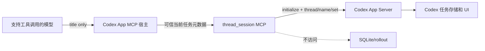
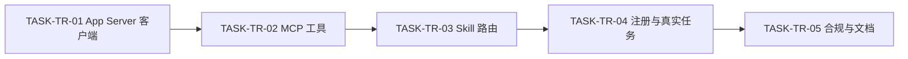
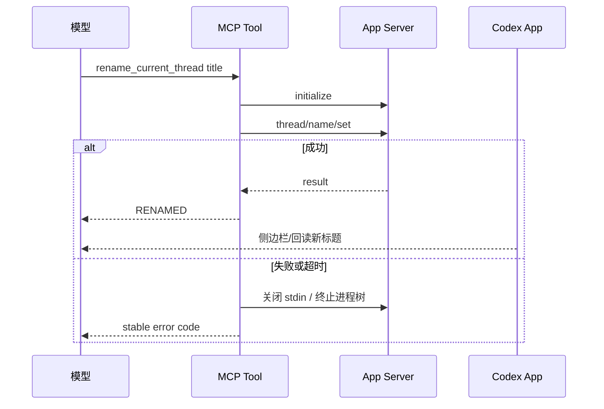

# 模型无关的会话重命名工具实施总览

结论：在 `thread-title-rules` 内新增一个 stdio MCP Server，模型只调用 `rename_current_thread({title})`，工具再通过 Codex App Server 修改当前任务；影响：统一不同支持工具调用模型的改名入口；范围：客户端、MCP、Skill 路由、注册、测试和文档；非范围：其他宿主和无工具调用模型；变化：原生工具降为兼容回退；完成标准：自动化、真实任务、复审、文档 profile 和字典全部通过；术语说明：适配器是把宿主当前任务映射到统一工具的实现层；验证状态：Codex App 端到端已完成。

## 当前计划最终方案简要说明

图片资产决策：N/A + 原因：本实施只产生代码、配置、文档和测试；证据：现状落点无图片目录。

保留唯一 Skill Owner，将宿主差异封装在本地 MCP 后面。使用官方 App Server 方法而非内部存储；Windows 清理完整进程树；真实工具能力而非模型名称决定执行或跳过。

## Agent 对当前问题的理解

| 项目 | 内容 |
| --- | --- |
| 问题/目标 | 原生 `set_thread_title` 可能不向所有模型暴露，需要稳定统一工具 |
| 本轮范围 | 当前任务识别、标题校验、App Server、MCP、路由、注册、真实测试 |
| 非范围 | 任意任务改名、数据库直写、UI 模拟、其他宿主适配 |
| 当前优先闭环 | 新持久化任务只走 MCP 并由 Codex App 立即回读 |
| 关键假设 | Codex CLI 与 Desktop 共享任务存储；宿主注入当前 threadId |
| unresolved_decisions | `[]` |

## 现状与落点

```text
thread-title-rules/
├─ SKILL.md
├─ agents/openai.yaml
├─ references/rename-tool-contract.md
└─ mcp/
   ├─ package.json
   ├─ package-lock.json
   ├─ index.mjs
   ├─ app-server-client.mjs
   └─ test/
      ├─ rename-tool.test.mjs
      └─ app-server-client.test.mjs
```

全局注册落点为 `C:\Users\luode\.codex\config.toml` 的 `mcp_servers.thread_session`，通过 `codex mcp add` 正式维护，不手工覆盖其他配置。

## 实施边界图

图形目的：说明模型、Codex App 宿主、本地 MCP 和独立 App Server 的职责边界。

关联 ID：`DEC-TR-001` 至 `DEC-TR-005`、`REQ-TR-001` 至 `REQ-TR-005`。



图形目的：说明周期依赖从协议客户端到工具、规则、真实验证和资产收口。

关联 ID：`CYCLE-TR-01`、`TASK-TR-01` 至 `TASK-TR-05`。



图形目的：说明端到端调用、失败路由和进程回收必须在同一垂直切片闭环。

关联 ID：`AC-TR-002`、`AC-TR-006`、`AC-TR-007`。



## 实施周期总览

| 周期 | 目标 | 主要输出 |
| --- | --- | --- |
| `CYCLE-TR-01` | MCP 工具闭环 | App Server 客户端、MCP、Skill 路由、正式注册、真实验证和收口证据 |

## 阶段计划

1. 实现最小 JSON-RPC 客户端、超时、错误映射和跨平台回收。
2. 注册严格 schema 的 MCP 工具并只从宿主元数据取当前任务。
3. 迁移 Skill、规则文件和活动消费者，清除原生优先旧路由。
4. 用正式 CLI 注册 MCP，创建新持久化任务执行真实改名并回读。
5. 补齐真实 Windows 进程树测试、字典、工程文档、合规、审查与验收。

## 最小任务清单

| TASK | 文件/符号 | 实现 | 真实测试 | 完成条件 |
| --- | --- | --- | --- | --- |
| `TASK-TR-01` | `app-server-client.mjs` | 初始化、请求解析、超时、进程树回收 | 协议、异常、模拟与真实 Windows 树 | 无遗留进程，稳定错误码 |
| `TASK-TR-02` | `index.mjs`、rename 测试 | 严格 schema、元数据解析、公开结果 | MCP in-memory/stdio | 只公开一个工具且只含 title |
| `TASK-TR-03` | Skill、prompt、规则消费者 | MCP 优先、回退一次、跳过保护 | 旧路由扫描、Quick Validate | 无活动旧原生优先入口 |
| `TASK-TR-04` | Codex 全局 MCP 与持久化任务 | 正式注册并真实调用 | 新任务 `RENAMED` + App 回读 | 标题立即一致、测试任务归档 |
| `TASK-TR-05` | 文档、字典、项目状态 | 资产收口 | profiles、audit、diff check | 合规 PASS、无 P0/P1 |

## 真实测试安排

| TEST | 命令/入口 | 样本/数据来源 | 通过标准 |
| --- | --- | --- | --- |
| `TEST-TR-APP` | `node --test test/app-server-client.test.mjs` | fake child + Windows 真实子进程树 | 8 项通过，进程实际退出 |
| `TEST-TR-MCP` | `npm test --prefix thread-title-rules/mcp` | 合成可信/缺失/冲突元数据 | 15/15 通过 |
| `TEST-TR-REAL` | Codex App 新持久化任务 | 宿主真实 `_meta` | `RENAMED` 且 App 回读一致 |
| `TEST-TR-QUICK` | Skill quick validate | 当前 Skill 资产 | valid |
| `TEST-TR-DOCS` | engineering docs 四个 profile | 本任务四份文档 | 全部 valid |
| `TEST-TR-DICT` | dictionary generator | 当前 73 个 Skill | missing=0 |

## 风险与阻断项

- 当前任务元数据不可靠、App Server 方法缺失、UI 无即时更新、真实进程树未退出、依赖审计或文档 profile 失败时停止。
- 回滚仅移除 `thread_session` 注册和新增 MCP 资源，恢复原 Skill 的原生兼容路径；禁止直写数据库或 UI 模拟。
- `_meta` 只在 Codex App 宿主边界内可信，禁止把本地 Server 暴露为网络或多用户授权服务。
- 最大推进边界：只实现 Codex App 适配器，不提交 Git，不扩展其他宿主。

## 任务完成、停止与最大推进边界

- 任务完成：自动化、正式注册、真实任务、文档、字典、审查和验收全部达到本计划标准。
- 停止条件：出现上述任一风险与阻断项，立即停止并按回滚边界恢复。
- 最大推进边界：仅 Codex App 第一版，不实现其他宿主，不执行 Git 历史写入。

## 追踪矩阵

| SRC/DEC | REQ/AC | CYCLE/TASK | 文件/符号 | TEST/EVIDENCE |
| --- | --- | --- | --- | --- |
| `SRC-THREAD-RENAME-20260722-001`,`DEC-TR-003`,`DEC-TR-005` | `REQ-TR-003`,`REQ-TR-005`,`AC-TR-006` | `CYCLE-TR-01`,`TASK-TR-01` | `app-server-client.mjs` | `TEST-TR-APP` |
| `DEC-TR-002`,`DEC-TR-004` | `REQ-TR-001`,`REQ-TR-002`,`AC-TR-001`,`AC-TR-003`,`AC-TR-004` | `TASK-TR-02` | `index.mjs` | `TEST-TR-MCP` |
| `DEC-TR-001` | `REQ-TR-004`,`AC-TR-007`,`AC-TR-009` | `TASK-TR-03` | Skill 与规则消费者 | `TEST-TR-QUICK`、扫描证据 |
| `SRC-THREAD-RENAME-20260722-002` | `AC-TR-002`,`AC-TR-008` | `TASK-TR-04` | 全局 MCP + 新任务 | `TEST-TR-REAL` |

## 全量证据映射

`EVIDENCE-TR-CHAIN-01`：本总览汇总周期 `CYCLE-TR-01` 下五个最小任务的实现、真实测试、审查和验收证据锚点；具体命令、样本、日志和结论落在周期文档、`doc/5-tests/`、`doc/6-审查/` 和 `doc/7-验收/`。

| 任务 | 实现证据 | 真实测试证据 | 审查证据 | 验收证据 |
| --- | --- | --- | --- | --- |
| `TASK-TR-01` | `EVD-TASK-TR-01-IMPL-01` | `EVD-TASK-TR-01-TEST-01` | `EVD-TASK-TR-01-REVIEW-01` | `EVD-TASK-TR-01-ACCEPT-01` |
| `TASK-TR-02` | `EVD-TASK-TR-02-IMPL-01` | `EVD-TASK-TR-02-TEST-01` | `EVD-TASK-TR-02-REVIEW-01` | `EVD-TASK-TR-02-ACCEPT-01` |
| `TASK-TR-03` | `EVD-TASK-TR-03-IMPL-01` | `EVD-TASK-TR-03-TEST-01` | `EVD-TASK-TR-03-REVIEW-01` | `EVD-TASK-TR-03-ACCEPT-01` |
| `TASK-TR-04` | `EVD-TASK-TR-04-IMPL-01` | `EVD-TASK-TR-04-TEST-01` | `EVD-TASK-TR-04-REVIEW-01` | `EVD-TASK-TR-04-ACCEPT-01` |
| `TASK-TR-05` | `EVD-TASK-TR-05-IMPL-01` | `EVD-TASK-TR-05-TEST-01` | `EVD-TASK-TR-05-REVIEW-01` | `EVD-TASK-TR-05-ACCEPT-01` |

## 自审结论

计划已冻结文件/符号、真实测试、样本来源、完成、停止、回滚和最大推进边界；N/A + 原因：无数据库、生产网络和图片；证据：全部测试入口均为 local 仓库、进程或 Codex App。
