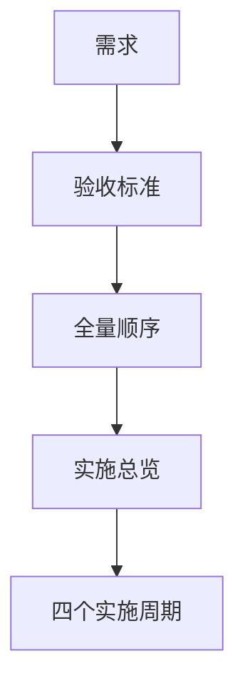

# Codex Desktop 任务悬浮窗断点恢复实施周期 01

结论：本周期已冻结需求、验收和恢复契约；影响：后续实现模型不再决定恢复时机、schema 或安全边界；范围：八份工程文档及校验；非范围：创建 Skill 或修改代码；变化：四周期和九任务形成双向追踪；完成标准：全部文档 profile 通过；术语说明：契约冻结表示 P0/P1 决策已清零；验证状态：已通过文档门禁、阶段审查和阶段验收。

## 当前代码/文档基线

| 项目 | 基线 |
|---|---|
| Git 基线 | `76ee419d5939` |
| 工作树 | 存在用户未提交改动，禁止覆盖回退 |
| 当前实现 | 没有任务投影专责 Skill |
| 图片资产决策 | N/A。原因：纯文档周期；证据：只使用 Mermaid。 |

图片资产决策：N/A。原因：纯文档周期；证据：只使用 Mermaid。

## 当前周期目标、边界与进入条件

- 周期 ID：`CYCLE-RTP-01`。
- 目标：完成 `TASK-RTP-01`，冻结所有恢复契约。
- 进入条件：用户已明确要求实施完整计划。
- 收口条件：8 份文档 profile 通过，内部链接可解析，`unresolved_decisions` 为零。

## 周期内最小任务执行顺序

图形目的：说明本周期唯一任务及其依赖；关联 ID：`TASK-RTP-01`。

图形目的：说明文档领域匹配；关联 ID：`TASK-RTP-01`、`TEST-RTP-006`。

| 任务 | 前置 | 动作 | 下一依赖 |
|---|---|---|---|
| `TASK-RTP-01` | 用户授权和范围冻结 | 创建并校验需求、验收、总览、全量顺序、四个周期 | `TASK-RTP-02` |

## 最小任务闭环

| 阶段 | 要求 | 状态 | 证据 |
|---|---|---|---|
| 实现 | 8 份文档真实落盘 | completed | `EVD-TASK-RTP-01-IMPL` |
| 真实测试 | 对应 profile 各执行一次 | completed | `EVD-TASK-RTP-01-TEST` |
| 审查 | 链接、术语、周期和任务一致 | completed | `EVD-TASK-RTP-01-REVIEW` |
| 验收 | 无未决 P0/P1，机器校验通过 | completed | `EVD-TASK-RTP-01-ACCEPT` |

## 文件/符号操作契约

| 文件 | 操作 | 保护边界 | 完成判据 |
|---|---|---|---|
| `doc/2-需求/...md` | 新增 | 不修改历史需求 | requirement profile 通过 |
| `doc/7-验收/..._验收标准.md` | 新增 | 不生成最终验收结论 | acceptance profile 通过 |
| `doc/3-实施/..._实施总览.md` | 新增 | 不进入代码实现 | overview profile 通过 |
| `doc/3-实施/..._实施周期*.md` | 新增 | 四周期任务唯一归属 | cycle profile 通过 |

## 当前周期验证矩阵

| 测试 | 命令 | 预期 | 失败处理 |
|---|---|---|---|
| `TEST-RTP-006` | `python -X utf8 ...validate_engineering_docs.py --profile <profile> --doc <path> --root .` | `status=PASS`、错误数 0 | 修正文档后重新执行 |
| 链接检查 | 校验器内部链接检查 | 所有相对链接可解析 | 停止进入周期 02 |
| Mermaid 静态检查 | 校验器图形计数 | 类型和数量满足 profile | 修正图形块 |
| 严格追踪 | 本周期结束暂不执行 | N/A。原因：真实任务证据尚未形成；证据：严格模式要求四类任务证据。 | 周期 04 执行 |

## 周期阻断、停止与回滚

- 停止条件：出现未决 P0/P1、恢复时机变化、文档链接失效或 profile 不通过。
- 回滚 `ROLLBACK-RTP-001`：删除本任务新建的 8 份文档；不修改或删除历史文档。
- 最大推进边界：本周期不创建 Skill、不修改代码、不刷新字典。

## 周期追踪矩阵

| 周期 | 任务 | 验收 | 测试 | 文件/符号 |
|---|---|---|---|---|
| `CYCLE-RTP-01` | `TASK-RTP-01` | `AC-RTP-001` 至 `AC-RTP-005` | `TEST-RTP-006` | 8 份工程文档 |

## 自审结论

- 当前周期只有一个最小任务，职责单一。
- 真实测试入口、停止条件、回滚和最大推进边界均已明确。
- 严格模式延期到真实证据形成后执行，不伪造证据。
