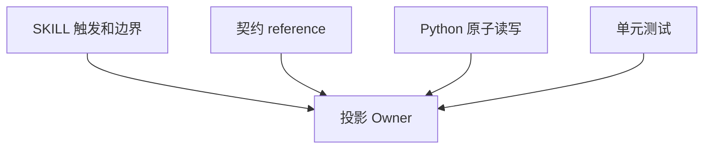

# Codex Desktop 任务悬浮窗断点恢复实施周期 02

结论：本周期已建立唯一任务投影 Owner 和确定性脚本；影响：投影 schema、指纹、原子写入和 payload 有单一事实源；范围：新 Skill 的五个文件；非范围：接入现有相邻 Skill；变化：合法状态可可靠读写，非法状态不破坏用户文件；完成标准：核心规则和单元测试通过；术语说明：payload 是交给 `update_plan` 的步骤数据；验证状态：17 项单元测试、quick validate、阶段审查和阶段验收通过。

## 当前代码/文档基线

| 项目 | 基线 |
|---|---|
| 前置周期 | `CYCLE-RTP-01` 必须通过 |
| 当前 Owner | 不存在 |
| 脚本依赖 | Python 标准库 |
| 图片资产决策 | N/A。原因：规则和脚本能力；证据：无视觉产物。 |

图片资产决策：N/A。原因：规则和脚本能力；证据：无视觉产物。

## 当前周期目标、边界与进入条件

- 周期 ID：`CYCLE-RTP-02`。
- 目标：完成 `TASK-RTP-02` 和 `TASK-RTP-03`。
- 进入条件：8 份工程文档 profile 通过。
- 收口条件：新 Skill quick validate、脚本测试和职责审查通过。

## 周期内最小任务执行顺序

图形目的：说明两个任务的依赖；关联 ID：`TASK-RTP-02`、`TASK-RTP-03`。

图形目的：说明领域职责匹配；关联 ID：`REQ-RTP-001`、`REQ-RTP-004`、`REQ-RTP-005`。

| 任务 | 前置 | 动作 | 下一依赖 |
|---|---|---|---|
| `TASK-RTP-02` | 周期 01 通过 | 创建 SKILL、agent 元数据和契约 reference | `TASK-RTP-03` |
| `TASK-RTP-03` | 核心规则稳定 | 实现脚本和测试 | `TASK-RTP-04` |

## 最小任务闭环

| 任务 | 实现 | 真实测试 | 审查 | 验收 | 状态与证据 |
|---|---|---|---|---|---|
| `TASK-RTP-02` | 3 个规则资产 | quick validate 与四类触发 prompt | Owner 不竞争 | Skill 可发现且职责单一 | completed；`EVD-TASK-RTP-02-IMPL`、`EVD-TASK-RTP-02-TEST`、`EVD-TASK-RTP-02-REVIEW`、`EVD-TASK-RTP-02-ACCEPT` |
| `TASK-RTP-03` | 脚本和单元测试 | `python -B ...test_task_plan_projection.py` | 原子性和用户内容保护 | 合法输出、非法拒绝 | completed；`EVD-TASK-RTP-03-IMPL`、`EVD-TASK-RTP-03-TEST`、`EVD-TASK-RTP-03-REVIEW`、`EVD-TASK-RTP-03-ACCEPT` |

## 文件/符号操作契约

| 文件 | 文件/符号 | 操作 | 保护边界 |
|---|---|---|---|
| `task-plan-rehydration-rules/SKILL.md` | 触发、流程、停止标准 | 新增 | 不接管执行授权 |
| `references/task-plan-projection-contract.md` | schema 和重建契约 | 新增 | 不保存敏感内容 |
| `scripts/task_plan_projection.py` | read/upsert/validate/payload | 新增 | 最终大小闸门和原子替换 |
| `tests/test_task_plan_projection.py` | 正负样本 | 新增 | 只写临时目录 |

## 当前周期验证矩阵

| 测试 | 样本 | 断言 | 失败预期 |
|---|---|---|---|
| `TEST-RTP-001` | 活动、完成、两个进行中、未知状态、损坏 JSON | 合法输出稳定 payload | 非法命令非零 |
| `TEST-RTP-004` | 全部完成 | 写入 `inactive` | 不生成恢复 payload |
| `TEST-RTP-005` | 超长、敏感字段、重复区块 | 原文件哈希不变 | 明确错误码 |
| quick validate | 新 Skill 目录 | 结构和元数据通过 | 阻断周期收口 |

## 周期阻断、停止与回滚

- 停止条件：脚本可能覆盖非托管正文、最终文件超限仍写入、敏感字段可绕过或 Owner 职责竞争。
- 回滚 `ROLLBACK-RTP-002`：删除新 Skill 目录；不修改相邻 Skill。
- 最大推进边界：本周期不接入项目记忆和恢复链路。

## 周期追踪矩阵

| 周期 | 任务 | 验收 | 测试 | 文件/符号 |
|---|---|---|---|---|
| `CYCLE-RTP-02` | `TASK-RTP-02` | `AC-RTP-002/005` | quick validate | SKILL、agent、reference |
| `CYCLE-RTP-02` | `TASK-RTP-03` | `AC-RTP-001/004/005` | `TEST-RTP-001/004/005` | Python 脚本和测试 |

## 自审结论

- 两个任务按规则与确定性实现垂直拆分，文件写集不冲突。
- 每个任务均有真实测试、审查、验收和停止边界。
- `unresolved_decisions` 为零。
