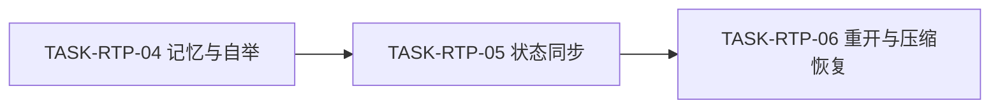
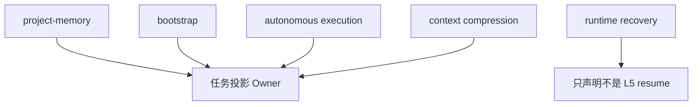

# Codex Desktop 任务悬浮窗断点恢复实施周期 03

结论：本周期已把任务投影接入项目记忆、自举、状态迁移和恢复路径；影响：新项目有失活槽位，执行和恢复共享同一投影；范围：五个相邻 Owner 及必要 reference；非范围：改变现有执行许可枚举或 L5 恢复等级；变化：每次迁移先持久化再刷新 UI，首次继续回合先重建再进入领域动作；完成标准：临时项目、新进程和中断负向测试通过；术语说明：失活槽位是不会触发 UI 重建的空投影；验证状态：自举幂等、跨进程恢复、阶段审查和阶段验收通过。

## 当前代码/文档基线

| 项目 | 基线 |
|---|---|
| 前置周期 | `CYCLE-RTP-02` 必须通过 |
| 相邻 Skill | 多数已有用户未提交重构，必须增量编辑 |
| 执行许可 | 保留现有 `confirmed/unknown/revoked` 语义 |
| 图片资产决策 | N/A。原因：规则链路接入；证据：无视觉资产。 |

图片资产决策：N/A。原因：规则链路接入；证据：无视觉资产。

## 当前周期目标、边界与进入条件

- 周期 ID：`CYCLE-RTP-03`。
- 目标：完成 `TASK-RTP-04`、`TASK-RTP-05`、`TASK-RTP-06`。
- 进入条件：投影脚本和新 Skill 单元测试通过。
- 收口条件：新项目自举、状态迁移、新进程恢复和中断保护测试通过。

## 周期内最小任务执行顺序

图形目的：说明三个任务的依赖；关联 ID：`TASK-RTP-04` 至 `TASK-RTP-06`。

图形目的：说明相邻领域匹配；关联 ID：`REQ-RTP-001` 至 `REQ-RTP-005`。

| 任务 | 前置 | 动作 | 下一依赖 |
|---|---|---|---|
| `TASK-RTP-04` | 新 Skill 稳定 | 接入项目记忆和自举模板 | `TASK-RTP-05` |
| `TASK-RTP-05` | 投影槽位可用 | 接入状态迁移保存顺序 | `TASK-RTP-06` |
| `TASK-RTP-06` | 状态同步稳定 | 接入首次继续和压缩恢复 | `TASK-RTP-07` |

## 最小任务闭环

| 任务 | 实现 | 真实测试 | 审查 | 验收 | 状态与证据 |
|---|---|---|---|---|---|
| `TASK-RTP-04` | 记忆保护和失活模板 | 四类临时目录 | 不覆盖非受管正文 | 重复运行幂等 | completed；`EVD-TASK-RTP-04-IMPL`、`EVD-TASK-RTP-04-TEST`、`EVD-TASK-RTP-04-REVIEW`、`EVD-TASK-RTP-04-ACCEPT` |
| `TASK-RTP-05` | 迁移先写盘后工具 | 三态迁移集成测试 | 证据与状态一致 | 崩溃点可恢复 | completed；`EVD-TASK-RTP-05-IMPL`、`EVD-TASK-RTP-05-TEST`、`EVD-TASK-RTP-05-REVIEW`、`EVD-TASK-RTP-05-ACCEPT` |
| `TASK-RTP-06` | 首次继续和压缩恢复 | 新进程、过期、完成、中断 | UI 不等于授权 | 有效重建、无效停止 | completed；`EVD-TASK-RTP-06-IMPL`、`EVD-TASK-RTP-06-TEST`、`EVD-TASK-RTP-06-REVIEW`、`EVD-TASK-RTP-06-ACCEPT` |

## 文件/符号操作契约

| 文件 | 文件/符号 | 操作 | 保护边界 |
|---|---|---|---|
| `project-memory-rules/SKILL.md` | 覆盖维护保护 | 增量修改 | 原样保留托管区，不计算指纹 |
| `project-rule-file-bootstrap-rules` | `PROJECT_CURRENT_TEMPLATE` | 增量修改 | 既有文件不重写 |
| `autonomous-execution-rules` | continuation | 增量修改 | 不恢复执行许可 |
| `context-compression-rules` | recovery contract | 增量修改 | 只在压缩路径调用 |
| `agent-runtime-recovery-rules/SKILL.md` | L5 边界 | 最小修改 | 不接管投影 schema |

## 当前周期验证矩阵

| 测试 | 样本 | 断言 | 失败预期 |
|---|---|---|---|
| `TEST-RTP-002` | 新进程加载活动、过期、完成投影 | 仅有效活动投影生成 payload | 无效不调用工具 |
| `TEST-RTP-003` | 进行中未知写操作 | 先核验并暂停 | 不重放写操作 |
| 自举幂等 | 缺失、无投影、合法、损坏文件 | 不覆盖用户正文 | 损坏状态明确停止 |
| 相邻 quick validate | 五个受影响 Skill | 全部通过 | 任一失败阻断周期收口 |

## 周期阻断、停止与回滚

- 停止条件：无法确认投影与计划同源、状态同步与真实证据冲突、模板重写既有正文或恢复路径越过授权。
- 回滚 `ROLLBACK-RTP-003`：移除相邻 Skill 中对新 Owner 的引用并恢复模板失活槽位；不删除用户正文和历史记录。
- 最大推进边界：不统一相邻 Skill 的既有许可枚举，不修改 Desktop 产品代码。

## 周期追踪矩阵

| 周期 | 任务 | 验收 | 测试 | 文件/符号 |
|---|---|---|---|---|
| `CYCLE-RTP-03` | `TASK-RTP-04` | `AC-RTP-001/005` | 自举幂等测试 | memory/bootstrap |
| `CYCLE-RTP-03` | `TASK-RTP-05` | `AC-RTP-001/003` | `TEST-RTP-003` | autonomous continuation |
| `CYCLE-RTP-03` | `TASK-RTP-06` | `AC-RTP-002/003/004/005` | `TEST-RTP-002/003` | context/runtime recovery |

## 自审结论

- 三个任务按初始化、迁移、恢复形成垂直闭环。
- 相邻 Owner 只触发或保护，不复制投影 schema。
- 所有写操作限定为当前 local 工作区和临时目录。
