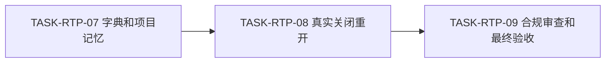
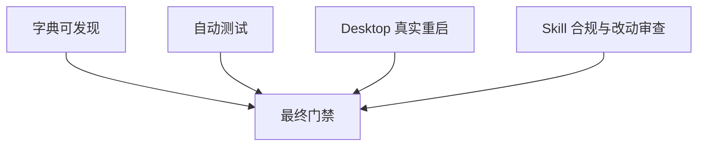

# Codex Desktop 任务悬浮窗断点恢复实施周期 04

结论：本周期已完成字典和项目记忆，正在等待真实 Desktop 重启；影响：本地能力已可验证，宿主回合恢复仍需人工动作；范围：生成资产、审查、验收和状态收口；非范围：Git 提交和产品发布；变化：新 Skill 已可发现，活动投影已保存九步状态；完成标准：严格追踪、Skill 合规和真实重启全部通过；术语说明：正式放行表示本地规则和真实宿主验收均通过；验证状态：任务七通过，任务八进行中，最终放行受限。

## 当前代码/文档基线

| 项目 | 基线 |
|---|---|
| 前置周期 | `CYCLE-RTP-03` 必须通过 |
| 字典 | 尚未包含新 Skill |
| 真实宿主证据 | 尚未执行关闭重开 |
| 图片资产决策 | N/A。原因：最终证据为测试报告和宿主核对；证据：无视觉资产生产要求。 |

图片资产决策：N/A。原因：最终证据为测试报告和宿主核对；证据：无视觉资产生产要求。

## 当前周期目标、边界与进入条件

- 周期 ID：`CYCLE-RTP-04`。
- 目标：完成 `TASK-RTP-07`、`TASK-RTP-08`、`TASK-RTP-09`。
- 进入条件：所有本地功能和集成测试通过。
- 收口条件：字典、严格追踪、Skill 合规、项目总审查和真实 Desktop 重启验收通过。

## 周期内最小任务执行顺序

图形目的：说明最终三个任务的依赖；关联 ID：`TASK-RTP-07` 至 `TASK-RTP-09`。

图形目的：说明最终放行领域匹配；关联 ID：`AC-RTP-001` 至 `AC-RTP-005`。

| 任务 | 前置 | 动作 | 下一依赖 |
|---|---|---|---|
| `TASK-RTP-07` | 周期 03 通过 | 刷新根规则、字典和项目记忆 | `TASK-RTP-08` |
| `TASK-RTP-08` | 活动投影可用 | 关闭、重开、首次继续、核验中断点 | `TASK-RTP-09` |
| `TASK-RTP-09` | 真实重启通过 | 合规、审查、严格追踪和最终验收 | 无 |

## 最小任务闭环

| 任务 | 实现 | 真实测试 | 审查 | 验收 | 状态与证据 |
|---|---|---|---|---|---|
| `TASK-RTP-07` | 字典和四件套更新 | 生成器、quick validate、diff check | 无关改动保护 | 新 Skill 可发现 | completed；`EVD-TASK-RTP-07-IMPL`、`EVD-TASK-RTP-07-TEST`、`EVD-TASK-RTP-07-REVIEW`、`EVD-TASK-RTP-07-ACCEPT` |
| `TASK-RTP-08` | 真实宿主恢复 | Desktop 关闭重开 | 中断写操作保护 | UI 状态一致 | in_progress；关闭前投影已保存，证据将在真实关闭重开后形成 |
| `TASK-RTP-09` | 审查和验收记录 | 严格追踪和全量回归 | 三项 Skill 合规 PASS | 正式放行 | pending；依赖 `TASK-RTP-08` |

## 文件/符号操作契约

| 文件 | 文件/符号 | 操作 | 保护边界 |
|---|---|---|---|
| `skill-dictionary/data.js`、`字典.md` | 生成资产 | 生成器更新 | 不手工覆盖无关内容 |
| `PROJECT_CURRENT.md` | 当前状态和投影 | 覆盖正文并受管 upsert | 总大小不超过 51,200 字节 |
| `PROJECT_MEMORY.md`、`PROJECT_HISTORY.md` | 稳定决策和历史事件 | 增量更新 | 不写当前流水到长期记忆 |
| `doc/6-审查`、`doc/7-验收` | 审查和最终验收 | 新增或更新 | 结论基于真实证据 |

## 当前周期验证矩阵

| 测试 | 入口 | 断言 | 失败预期 |
|---|---|---|---|
| `TEST-RTP-007` | 字典生成、quick validate、`git diff --check` | 全部通过，无乱码 | 阻断放行 |
| `TEST-RTP-008` | Desktop 关闭重开 | 首次继续回合恢复相同步骤和状态 | 保持受限验收 |
| 严格追踪 | validator `--strict` | 当前来源九个任务四类证据齐全 | 任一孤立 ID 阻断 |
| 合规审计 | execution compliance、evolution、audit | 三项 PASS | 不得最终收口 |

## 周期阻断、停止与回滚

- 停止条件：用户尚未执行关闭重开、悬浮窗未恢复、进行中步骤被误重放、字典生成覆盖无关改动或合规门禁失败。
- 回滚 `ROLLBACK-RTP-004`：删除新 Skill 和受管引用，移除任务投影托管区；保留用户正文和历史任务记录。
- 最大推进边界：不执行 Git commit、push、rebase，不宣称“仅打开应用即可恢复”。

## 周期追踪矩阵

| 周期 | 任务 | 验收 | 测试 | 文件/符号 |
|---|---|---|---|---|
| `CYCLE-RTP-04` | `TASK-RTP-07` | `AC-RTP-001/005` | `TEST-RTP-007` | 字典和项目四件套 |
| `CYCLE-RTP-04` | `TASK-RTP-08` | `AC-RTP-002/003/004` | `TEST-RTP-008` | Codex Desktop 当前任务 |
| `CYCLE-RTP-04` | `TASK-RTP-09` | 全部 | 严格追踪和合规审计 | 审查与验收文档 |

## 自审结论

- 最终放行依赖真实宿主证据，不用模拟进程重启替代。
- Git 写历史不在授权范围内。
- `unresolved_decisions` 为零；唯一人工动作是关闭并重开 Desktop。
