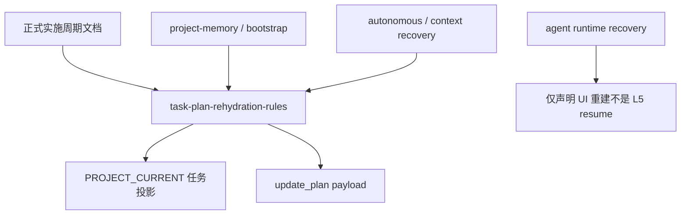
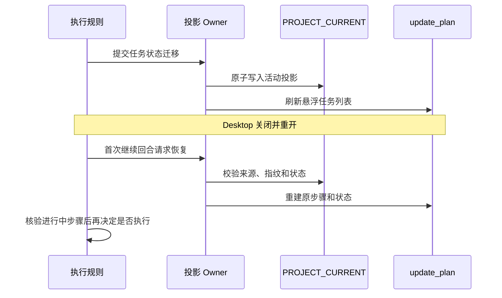

# Codex Desktop 任务悬浮窗断点恢复实施总览

结论：新增单一任务投影 Owner，并让项目状态、执行和恢复规则围绕它协作；影响：任务悬浮窗可在关闭 Desktop 后的首次继续回合恢复；范围：Skill、脚本、测试、工程文档和项目四件套；非范围：Desktop 产品代码和无新回合自动恢复；变化：状态迁移先持久化再刷新 UI，恢复时先校验再重建；完成标准：九个最小任务逐个完成真实测试、审查和验收；术语说明：Owner 是唯一拥有某项状态和规则解释权的 Skill；验证状态：任务一至任务七完成，任务八等待真实 Desktop 重启。

## 当前计划最终方案简要说明

新增 `task-plan-rehydration-rules` 作为任务投影保存、校验和重建的唯一 Owner。正式实施周期文档仍是真实计划源，`PROJECT_CURRENT.md` 只保存当前周期运行状态；重开后由首次继续回合调用 `update_plan`。

## Agent 对当前问题的理解

| 项目 | 内容 |
|---|---|
| 问题 | Desktop 关闭后悬浮任务列表消失，执行者失去阶段可见性 |
| 本轮范围 | 持久化、恢复、状态同步、中断保护、测试和验收 |
| 非范围 | 修改宿主 UI、启动钩子、自动重放未知写操作 |
| 当前优先闭环 | 首次继续回合自动重建悬浮任务列表 |
| 图片资产决策 | N/A。原因：没有视觉资产交付；证据：状态与交互由 Mermaid 表达。 |

图片资产决策：N/A。原因：没有视觉资产交付；证据：状态与交互由 Mermaid 表达。

## 实施周期总览

| 周期 | 目标 | 任务 | 产出 |
|---|---|---|---|
| `CYCLE-RTP-01` | 冻结需求和恢复契约 | `TASK-RTP-01` | 8 份工程文档 |
| `CYCLE-RTP-02` | 建立任务投影 Owner | `TASK-RTP-02/03` | 新 Skill、脚本、测试 |
| `CYCLE-RTP-03` | 接入启动、执行和恢复 | `TASK-RTP-04/05/06` | 五个相邻 Owner 增量修改 |
| `CYCLE-RTP-04` | 字典、重启和最终放行 | `TASK-RTP-07/08/09` | 字典、审查、验收证据 |

## 阶段计划

图形目的：说明本需求边界和受影响组件；关联 ID：`REQ-RTP-001` 至 `REQ-RTP-005`。



图形目的：说明四周期依赖；关联 ID：`CYCLE-RTP-01` 至 `CYCLE-RTP-04`。


## 实施时序图

图形目的：说明端到端保存和恢复顺序；关联 ID：`TASK-RTP-05`、`TASK-RTP-06`、`TASK-RTP-08`。



## 最小任务清单

| 任务 | 目标 | 文件/符号主落点 | 真实测试 |
|---|---|---|---|
| `TASK-RTP-01` | 文档冻结 | `doc/2-需求`、`doc/3-实施`、`doc/7-验收` | profile 校验 |
| `TASK-RTP-02` | 新 Skill 核心规则 | `task-plan-rehydration-rules/SKILL.md` | quick validate 与触发检查 |
| `TASK-RTP-03` | 投影脚本 | `task_plan_projection.py` | `test_task_plan_projection.py` |
| `TASK-RTP-04` | 记忆与自举 | project memory/bootstrap | 临时目录幂等测试 |
| `TASK-RTP-05` | 状态同步 | autonomous continuation | 状态迁移集成测试 |
| `TASK-RTP-06` | 重开与压缩恢复 | context/runtime recovery | 新进程负向测试 |
| `TASK-RTP-07` | 字典和记忆 | dictionary/root docs | 生成器和 diff check |
| `TASK-RTP-08` | Desktop 真实重启 | 当前任务 | 人工关闭重开验收 |
| `TASK-RTP-09` | 合规和最终放行 | review/acceptance | 合规审计和严格追踪 |

## 最小任务追踪矩阵

| 任务 | 需求 | 验收 | 测试 | 回滚 |
|---|---|---|---|---|
| `TASK-RTP-01` | 全部 | 文档门禁 | `TEST-RTP-006` | `ROLLBACK-RTP-001` |
| `TASK-RTP-02/03` | `REQ-RTP-001/004/005` | `AC-RTP-001/004/005` | `TEST-RTP-001/004/005` | `ROLLBACK-RTP-002` |
| `TASK-RTP-04/05/06` | `REQ-RTP-001/002/003` | `AC-RTP-001/002/003` | `TEST-RTP-002/003` | `ROLLBACK-RTP-003` |
| `TASK-RTP-07/08/09` | 全部 | 全部 | `TEST-RTP-007/008` | `ROLLBACK-RTP-004` |

## 现状与落点

```text
task-plan-rehydration-rules/
├── SKILL.md
├── agents/openai.yaml
├── references/task-plan-projection-contract.md
├── scripts/task_plan_projection.py
└── tests/test_task_plan_projection.py
```

相邻落点：`project-memory-rules`、`project-rule-file-bootstrap-rules`、`autonomous-execution-rules`、`context-compression-rules`、`agent-runtime-recovery-rules`。所有修改基于当前磁盘内容增量完成，不覆盖既有未提交改动。

## 真实测试安排

| 测试 ID | 入口 | 样本 | 通过标准 |
|---|---|---|---|
| `TEST-RTP-001` | 新脚本单元测试 | 合法、完成、损坏、过期、超限、敏感字段 | 合法稳定输出，非法不改原文件 |
| `TEST-RTP-002` | 新进程集成测试 | 活动投影、工具 payload、inactive | 恢复状态与磁盘一致 |
| `TEST-RTP-003` | 中断保护测试 | 未知幂等写操作 | 只核验，不自动重放 |
| `TEST-RTP-006` | 工程文档 profile | 8 份文档 | 每个 profile 无错误 |
| `TEST-RTP-007` | quick validate、字典、diff check | 所有受影响 Skill | 全部通过且无乱码 |
| `TEST-RTP-008` | Desktop 真实关闭重开 | 3 步活动计划 | 首次继续回合恢复 UI |

## 风险与阻断项

- 工作树已有大量未提交改动；处理：每次编辑前核验 scoped diff，只做精确补丁。
- `PROJECT_CURRENT.md` 覆盖式维护可能删除托管区；处理：明确原样保留契约并用脚本窄范围更新。
- 严格追踪校验器当前硬编码旧来源；处理：改为按目标文档共同 `source_ids` 选域并补回归测试。
- 真实 Desktop 关闭重开需要用户操作；处理：本地契约完成后停在受限验收，重开后继续 `TASK-RTP-08`。

## 任务完成、停止与最大推进边界

- 完成：九个任务各自完成实现、真实测试、审查和验收，且真实重启通过。
- 停止：用户内容保护、来源指纹、状态安全、工具能力或 Desktop 重启门禁失败。
- 最大推进边界：仅修改 Skills 仓库和本任务文档、测试、项目四件套；不执行 Git commit、push、rebase；不修改 Desktop 产品代码。

## 自审结论

- 方案有单一 Owner，职责边界不与相邻 Skill 竞争。
- 代码任务均有真实测试入口，`unresolved_decisions` 为零。
- 每个周期和任务有明确进入、完成、停止、回滚和最大推进边界。
