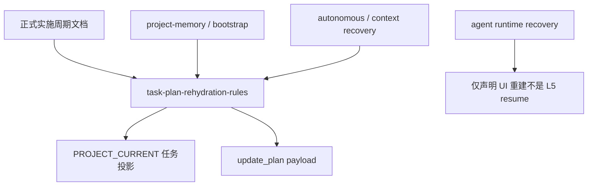
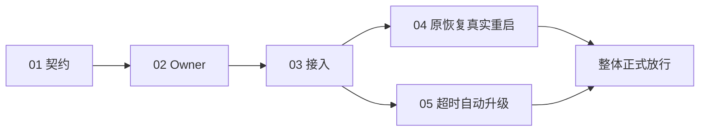
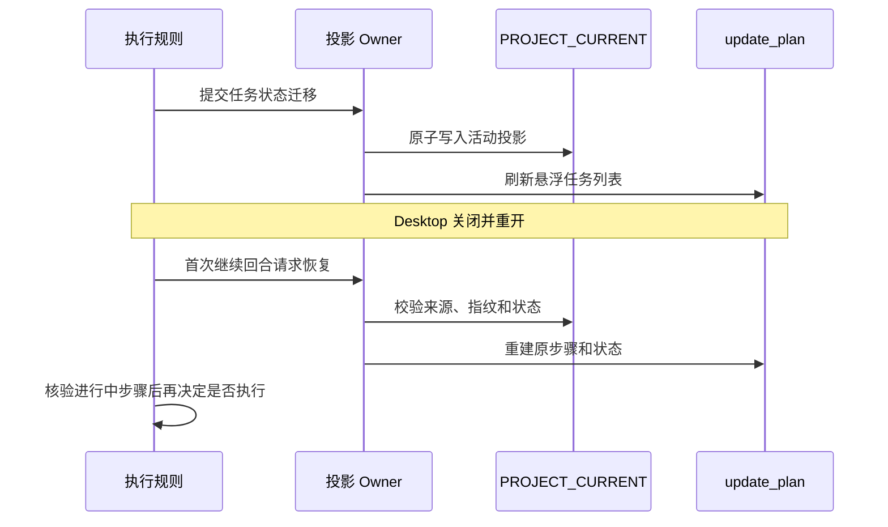
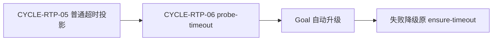

# Codex Desktop 任务悬浮窗断点恢复实施总览

结论：保留既有任务投影恢复方案，并为没有活动悬浮窗但执行超时的任务增加第五实施周期；影响：简单任务执行较久后也能获得可见、可恢复的进度列表；范围：需求与验收文档、任务投影 Skill、相邻执行规则、`ensure-timeout` CLI、测试、字典和项目四件套；非范围：Desktop 产品代码、后台定时器、投影 schema 迁移和 Git 历史写入；变化：主动执行时间严格超过 600 秒时，当前会话按精确优先、固定三步兜底的规则补建悬浮窗；完成标准：十三个最小任务均按各自适用门禁闭环，第四周期的真实重启与第五周期的超时回归都通过后才正式放行；术语说明：本地实施分支是可以独立完成代码和自动测试、但不能替代另一分支人工验收的实施路径；验证状态：任务一至任务七和任务十已完成，任务八和任务九仍在第四周期等待真实宿主证据，第五周期下一执行点是任务十一。

## 当前计划最终方案简要说明

继续由 `task-plan-rehydration-rules` 独占任务投影 schema、原子写入和 payload。第五周期只增加执行上下文计时规则和 `ensure-timeout` 可验证入口：严格超过 600 秒且当前会话没有活动 projection 时复用既有 `synthesize` 生成 exact 或 fallback，不新增后台监控、schema 字段或计时持久化。

## Agent 对当前问题的理解

| 项目 | 内容 |
|---|---|
| 问题 | Desktop 关闭后悬浮任务列表消失，执行者失去阶段可见性 |
| 本轮范围 | 持久化、恢复、状态同步、中断保护、测试和验收 |
| 非范围 | 修改宿主 UI、启动钩子、自动重放未知写操作 |
| 当前优先闭环 | `CYCLE-RTP-05/TASK-RTP-11`：接入超时规则和相邻执行路由 |
| 关键假设 / 待确认点 | `unresolved_decisions` 为零；首次真实执行动作、暂停扣除、严格阈值和精确/兜底路线均由 `CHG-RTP-001` 冻结。 |
| 图片资产决策 | N/A。原因：没有视觉资产交付；证据：状态与交互由 Mermaid 表达。 |

图片资产决策：N/A。原因：没有视觉资产交付；证据：状态与交互由 Mermaid 表达。

## 实施周期总览

| 周期 | 目标 | 任务 | 产出 |
|---|---|---|---|
| `CYCLE-RTP-01` | 冻结需求和恢复契约 | `TASK-RTP-01` | 8 份工程文档 |
| `CYCLE-RTP-02` | 建立任务投影 Owner | `TASK-RTP-02/03` | 新 Skill、脚本、测试 |
| `CYCLE-RTP-03` | 接入启动、执行和恢复 | `TASK-RTP-04/05/06` | 五个相邻 Owner 增量修改 |
| `CYCLE-RTP-04` | 原恢复能力的字典、真实重启和最终放行 | `TASK-RTP-07/08/09` | 任务七已完成；任务八、九仍 `in_progress/pending`，等待真实 Desktop 证据 |
| `CYCLE-RTP-05` | `CHG-RTP-001` 超时自动升级本地闭环 | `TASK-RTP-10/11/12/13` | 文档、规则、CLI、46 项既有回归加新增超时测试、字典与合规证据 |

## 阶段计划

图形目的：说明本需求边界和受影响组件；关联 ID：`REQ-RTP-001` 至 `REQ-RTP-005`。


```mermaid
flowchart TD
    A["正式实施周期文档"] --> B["task-plan-rehydration-rules"]
    B --> C["PROJECT_CURRENT 任务投影"]
    B --> D["update_plan payload"]
    E["project-memory / bootstrap"] --> B
    F["autonomous / context recovery"] --> B
    G["agent runtime recovery"] --> H["仅声明 UI 重建不是 L5 resume"]
```

图形目的：说明原恢复验收与新增超时实施分支的依赖和最终汇合；关联 ID：`CYCLE-RTP-01` 至 `CYCLE-RTP-05`、`CHG-RTP-001`。


```mermaid
flowchart LR
    C1["01 契约"] --> C2["02 Owner"] --> C3["03 接入"]
    C3 --> C4["04 原恢复真实重启"]
    C3 --> C5["05 超时自动升级"]
    C4 --> G["整体正式放行"]
    C5 --> G
```

边界说明：`CYCLE-RTP-05` 是 `CHG-RTP-001` 授权后的独立本地实施分支，允许在 `CYCLE-RTP-01..03` 的投影基础能力已完成后实施；它不把仍在进行中的 `TASK-RTP-08/09` 标为完成，也不能替代 `CYCLE-RTP-04` 的真实 Desktop 重启门禁。整体正式放行必须同时取得两条分支证据。

## 实施时序图

图形目的：说明端到端保存和恢复顺序；关联 ID：`TASK-RTP-05`、`TASK-RTP-06`、`TASK-RTP-08`。


```mermaid
sequenceDiagram
    participant E as 执行规则
    participant R as 投影 Owner
    participant P as PROJECT_CURRENT
    participant U as update_plan
    E->>R: 提交任务状态迁移
    R->>P: 原子写入活动投影
    R->>U: 刷新悬浮任务列表
    Note over E,U: Desktop 关闭并重开
    E->>R: 首次继续回合请求恢复
    R->>P: 校验来源、指纹和状态
    R->>U: 重建原步骤和状态
    E->>E: 核验进行中步骤后再决定是否执行
```

## 最小任务清单

| 任务 | 目标 | 文件/符号主落点 | 真实测试 |
|---|---|---|---|
| `TASK-RTP-01` | 文档冻结 | `doc/2-需求`、`doc/3-实施`、`doc/7-验收` | profile 校验 |
| `TASK-RTP-02` | 新 Skill 核心规则 | `task-plan-rehydration-rules/SKILL.md` | quick validate 与触发检查 |
| `TASK-RTP-03` | 投影脚本 | `task_plan_projection.py` | `test_task_plan_projection.py` |
| `TASK-RTP-04` | 记忆与自举 | project memory/bootstrap | 临时目录幂等测试 |
| `TASK-RTP-05` | 状态同步 | autonomous continuation | 状态迁移集成测试 |
| `TASK-RTP-06` | 重开与压缩恢复 | context/runtime recovery | 新进程负向测试 |
| `TASK-RTP-07` | 字典和记忆 | dictionary/root docs | 生成器和 diff check |
| `TASK-RTP-08` | Desktop 真实重启 | 当前任务 | 人工关闭重开验收 |
| `TASK-RTP-09` | 合规和最终放行 | review/acceptance | 合规审计和严格追踪 |
| `TASK-RTP-10` | 冻结超时需求、验收和实施文档 | 三份既有文档与新增周期 05 文档 | 四类工程文档 profile 与 Mermaid 解析 |
| `TASK-RTP-11` | 接入超时规则和相邻执行路由 | `task-plan-rehydration-rules`、`autonomous-execution-rules` | quick validate 与规则正反例检查 |
| `TASK-RTP-12` | 增加 `ensure-timeout` CLI | `task_plan_projection.py` 的计时校验、超时编排和 CLI 分发 | `TEST-RTP-009/010/011` |
| `TASK-RTP-13` | 补齐回归、字典、项目状态和合规收口 | 测试文件、字典生成资产、项目四件套与审查证据 | 现有 46 项回归加新增超时测试、生成器、diff check 与合规审计 |

## 最小任务追踪矩阵

| 任务 | 需求 | 验收 | 测试 | 回滚 |
|---|---|---|---|---|
| `TASK-RTP-01` | 全部 | 文档门禁 | `TEST-RTP-006` | `ROLLBACK-RTP-001` |
| `TASK-RTP-02/03` | `REQ-RTP-001/004/005` | `AC-RTP-001/004/005` | `TEST-RTP-001/004/005` | `ROLLBACK-RTP-002` |
| `TASK-RTP-04/05/06` | `REQ-RTP-001/002/003` | `AC-RTP-001/002/003` | `TEST-RTP-002/003` | `ROLLBACK-RTP-003` |
| `TASK-RTP-07/08/09` | 全部 | 全部 | `TEST-RTP-007/008` | `ROLLBACK-RTP-004` |
| `TASK-RTP-10` | `REQ-RTP-006/007` | `AC-RTP-006..009` | 四类 profile 与 Mermaid 解析 | `ROLLBACK-RTP-005` |
| `TASK-RTP-11` | `REQ-RTP-006/007` | `AC-RTP-008/009` | `TEST-RTP-011/012` | `ROLLBACK-RTP-005` |
| `TASK-RTP-12` | `REQ-RTP-006/007` | `AC-RTP-006/007/008` | `TEST-RTP-009/010/011` | `ROLLBACK-RTP-005` |
| `TASK-RTP-13` | `REQ-RTP-006/007` | `AC-RTP-006..009` | `TEST-RTP-009..012` | `ROLLBACK-RTP-005` |

## 现状与落点

```text
task-plan-rehydration-rules/
├── SKILL.md
├── agents/openai.yaml
├── references/task-plan-projection-contract.md
├── scripts/task_plan_projection.py
└── tests/test_task_plan_projection.py
```

第五周期代码落点：

```text
task-plan-rehydration-rules/
├── SKILL.md                                      # 超时触发、检查点和停止条件
├── agents/openai.yaml                           # 可发现的超时触发提示
├── references/task-plan-projection-contract.md  # ensure-timeout 输入、输出和不变式
├── scripts/task_plan_projection.py              # 时间校验、超时编排与 CLI 分发
└── tests/test_task_plan_projection.py            # 阈值、exact/fallback、失败保护和回归

autonomous-execution-rules/
└── references/continuation-and-pause.md          # 主动执行计时和检查点接入
```

相邻落点：`project-memory-rules`、`project-rule-file-bootstrap-rules`、`autonomous-execution-rules`、`context-compression-rules`、`agent-runtime-recovery-rules`。所有修改基于当前磁盘内容增量完成，不覆盖既有未提交改动。

## 真实测试安排

| 测试 ID | 入口 | 样本 | 通过标准 |
|---|---|---|---|
| `TEST-RTP-001` | 新脚本单元测试 | 合法、完成、损坏、过期、超限、敏感字段 | 合法稳定输出，非法不改原文件 |
| `TEST-RTP-002` | 新进程集成测试 | 活动投影、工具 payload、inactive | 恢复状态与磁盘一致 |
| `TEST-RTP-003` | 中断保护测试 | 未知幂等写操作 | 只核验，不自动重放 |
| `TEST-RTP-006` | 工程文档 profile | 8 份文档 | 每个 profile 无错误 |
| `TEST-RTP-007` | quick validate、字典、diff check | 所有受影响 Skill | 全部通过且无乱码 |
| `TEST-RTP-008` | Desktop 真实关闭重开 | 3 步活动计划 | 首次继续回合恢复 UI |
| `TEST-RTP-009` | `ensure-timeout` 时间边界单元测试 | 599/600/601 秒、901-301 秒暂停扣除、UTC 与非法时间 | 599/600 和扣除后 600 为 `not_due`；601 为到期；非法输入不写文件 |
| `TEST-RTP-010` | 超时 exact/fallback 持久化集成测试 | 唯一正式来源、来源冲突、两会话 registry | exact 优先、fallback 固定三步；只写当前会话；payload 与落盘内容一致 |
| `TEST-RTP-011` | 不重复和原文件保护测试 | 已有活动 projection、完成任务、Plan Mode、许可非 confirmed、损坏 registry | 不重复创建；非法输入非零；原文件字节保持不变 |
| `TEST-RTP-012` | 规则、兼容和全量回归 | 当前 46 项既有测试、超时规则文本、v1-v3 与 v4 样本 | 既有 46 项全部继续通过；无 schema/计时字段漂移；Skill 与字典校验通过 |

第五周期所有行为测试使用 local 工作区和临时目录，不连接数据库、缓存、消息队列、HTTP/RPC 上游或外部服务。每个测试失败都停止当前最小任务，清理临时 fixture 后从对应任务重新进入；`build`、静态检查和人工阅读不替代 `TEST-RTP-009..012`。

## 风险与阻断项

- 工作树已有大量未提交改动；处理：每次编辑前核验 scoped diff，只做精确补丁。
- `PROJECT_CURRENT.md` 覆盖式维护可能删除托管区；处理：明确原样保留契约并用脚本窄范围更新。
- 严格追踪校验器当前硬编码旧来源；处理：改为按目标文档共同 `source_ids` 选域并补回归测试。
- 真实 Desktop 关闭重开需要用户操作；处理：本地契约完成后停在受限验收，重开后继续 `TASK-RTP-08`。
- `CYCLE-RTP-04` 尚未闭环而新增变更已经授权；处理：第五周期仅依赖已完成的 `CYCLE-RTP-01..03` 本地基础，作为独立分支推进，最终放行图明确要求第四、第五周期汇合，禁止把任务八、九伪报完成。
- 超时计时无法跨回合可靠持久化且不能后台唤醒；处理：只在当前执行上下文维护起点和暂停秒数，在工具返回、阶段进度和回合结束前检查；上下文丢失时停止升级而不猜测。
- exact 证据不足可能错投任务；处理：唯一正式来源和明确步骤提示同时成立才 exact，否则固定 fallback，并按 `session_id` 隔离。

## 任务完成、停止与最大推进边界

- 完成：十三个任务按各自周期完成实现、真实测试、审查和验收；`CYCLE-RTP-04` 的真实重启与 `CYCLE-RTP-05` 的超时自动测试和合规证据均通过。
- 停止：用户内容保护、时间准确性、来源指纹、会话隔离、状态安全、工具能力、46 项既有回归或 Desktop 重启门禁失败。
- 最大推进边界：第五周期只修改计划列明的 Skill、相邻执行路由、脚本、测试、字典、项目四件套和本任务研发文档；不新增后台服务、schema 字段或计时持久化，不执行 Git commit、push、rebase，不修改 Desktop 产品代码。

## 自审结论

- 方案有单一 Owner，职责边界不与相邻 Skill 竞争。
- 代码任务均有真实测试入口，`unresolved_decisions` 为零。
- 每个周期和任务有明确进入、完成、停止、回滚和最大推进边界。
- 第五周期没有覆盖第四周期未完成状态；两条分支的正式放行条件保持可追踪。
- `REQ-RTP-006/007 -> AC-RTP-006..009 -> CYCLE-RTP-05 -> TASK-RTP-10..13 -> TEST-RTP-009..012` 覆盖完整，现有 46 项回归基线已写入测试入口。

**CYCLE-RTP-06 增量实施总览**

当前计划最终方案简要说明：在 Cycle 05 普通超时投影之上新增只读 `probe-timeout`，优先由主 Agent 创建或复用 Goal，失败时调用原 `ensure-timeout`。Agent 对当前问题的理解：这是宿主编排升级，不是 Python 直接调用 Goal，也不改变 v4 schema。

| 周期 | 范围 | 最小任务 | 真实测试 | 最大推进边界 |
|---|---|---|---|---|
| `CYCLE-RTP-06` | `SLICE-RTP-005` 自动 Goal 与失败降级 | `TASK-RTP-14..21` | `TEST-RTP-013..018`、61+ 回归、Desktop | 不改 Desktop、不提交 Git |

阶段计划为需求/周期冻结 → 只读探测 → Goal 编排 → 授权/记忆 → 字典/回归 → Desktop 验收。文件/符号落点以 Cycle 06 文档为唯一执行契约；风险与阻断项包括 Goal 工具不可用、结果不明确、敏感内容落盘、Plan Mode 越界和其它会话投影覆盖。

图形目的：说明普通超时投影到 Goal 优先路由的依赖；关联 ID：`CYCLE-RTP-05/06`、`TASK-RTP-16/17`。


```mermaid
flowchart LR
    A["CYCLE-RTP-05 普通超时投影"] --> B["CYCLE-RTP-06 probe-timeout"]
    B --> C["Goal 自动升级"]
    C --> D["失败降级原 ensure-timeout"]
```

追踪矩阵：`SRC-RTP-005/CHG-RTP-001 → DEC-RTP-007..009 → REQ-RTP-008/009 → AC-RTP-010..013 → CYCLE-RTP-06 → TASK-RTP-14..21 → TEST-RTP-013..018`。任务完成、停止与最大推进边界均以 Cycle 06 文档为准。
