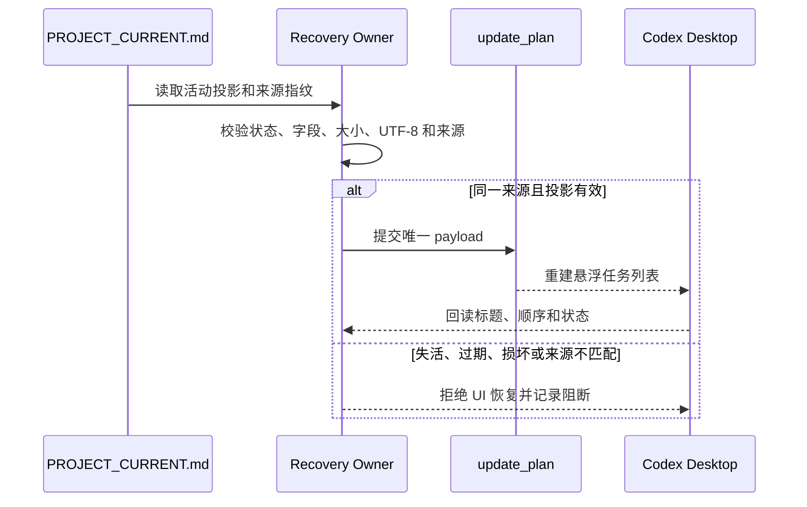
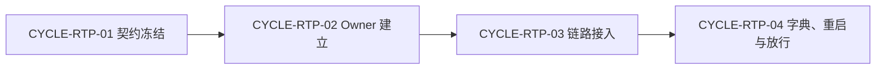

# Codex Desktop 任务悬浮窗断点恢复全量顺序实施方案

结论：按契约冻结、Owner 建立、链路接入、真实验收四个周期顺序实施；影响：为当前需求建立唯一可追踪执行入口；范围：八份工程文档、Skill 和测试资产；非范围：并行修改同一文件或跳过单任务闭环；变化：每个任务完成后立即记录实现、测试、审查和验收；完成标准：九个任务按顺序闭环且没有孤立追踪项；术语说明：全量顺序是当前来源对象从需求到验收的唯一执行排序；验证状态：前三周期和任务七已完成，任务八等待 Desktop 真实关闭重开。

## 1. 当前计划最终方案简要说明

- 推荐方案一句话结论：以 `task-plan-rehydration-rules` 作为任务投影唯一 Owner，按四周期逐任务恢复 Codex Desktop 的悬浮任务列表。
- 主落点 / 主路径：`PROJECT_CURRENT.md` 托管区 -> payload 生成器 -> `update_plan` -> Desktop 真实关闭重开回读。
- 为什么先走这条路线：先冻结来源指纹、字段白名单和原子更新，才能避免恢复错误任务或把 UI 恢复误当成执行授权。

## 2. Agent 对当前问题的理解

- 问题：任务投影需要跨新会话、上下文恢复和 Desktop 重开保持可验证的任务状态，同时不能覆盖用户手改内容。
- 目标：持久化当前目标、步骤、状态和来源指纹，在同一来源对象确认后重建 UI 计划。
- 本轮范围：需求、实施文档、`task-plan-rehydration-rules`、相邻触发规则、投影脚本、测试和恢复证据。
- 非范围：不修改 Codex Desktop 产品代码，不恢复执行授权，不连接外部业务服务。
- 当前优先闭环：任务八执行真实 Desktop 关闭重开，任务九再做严格追踪、审查和最终验收。
- 关键假设 / 待确认点：任务投影当前仍为 `active`；真实 Desktop 重启尚未完成，不能提前宣称 PASS。

## 2.1 决策维度覆盖表

| 维度 | 状态 | 结论 / 依据 |
| --- | --- | --- |
| 架构 / 技术路线 | 已确定 | 使用 Markdown 托管区、Python payload 脚本和 `update_plan`。 |
| 代码落点（目录 / 包 / 文件） | 已确定 | `task-plan-rehydration-rules/`、`PROJECT_CURRENT.md`、触发入口和测试。 |
| 实现方式 | 已确定 | 白名单字段、来源指纹、原子替换、失效投影拒绝恢复。 |
| 命名 | 已确定 | `TASK-RTP-*`、`CYCLE-RTP-*`、`TEST-RTP-*` 稳定 ID。 |
| 注释 | 已确定 | Python 和 Markdown 注释使用中文并记录参数/返回。 |
| 日志 | 已确定 | README 记录任务协作工具和测试提交域。 |
| 错误处理 / 异常 | 已确定 | 非法 JSON、非 UTF-8、敏感字段、来源冲突和超限均拒绝。 |
| 数据模型 / 表 / 字段 | N/A | 原因：不修改数据库；证据：投影是本地 Markdown 结构且范围仅限 Skills 仓库。 |
| 接口契约 | 已确定 | `update_plan` payload、MCP/Skill 路由和托管区标记。 |
| 依赖与库 | 已确定 | Python 3、Codex Desktop 本地能力和 Node 测试。 |
| 测试策略 / 样本 | 已确定 | 单元测试、MCP 测试、临时目录幂等测试和真实 Desktop 重启。 |

## 2.2 待用户选择清单

- 无（实现路线已确定）；Desktop 真实关闭重开仍是执行前提，不以模型推断代替。

## 3. 实施周期总览

- 总周期说明：四个周期串行推进，九个任务按周期内顺序逐一闭环。
- 本次计划拆分的子任务周期数：4。
- 周期拆分原则：先冻结契约，再建立 Owner，随后接入启动/恢复链路，最后做字典、真实重启和放行。
- 周期 1：需求与恢复契约冻结；完成 `TASK-RTP-01`，固定字段、边界和证据。
- 周期 2：任务投影 Owner 建立；完成 `TASK-RTP-02`、`TASK-RTP-03`，建立脚本、托管区和原子更新。
- 周期 3：启动执行与恢复链路接入；完成 `TASK-RTP-04`、`TASK-RTP-05`、`TASK-RTP-06`，接入新会话、压缩恢复和继续消息。
- 周期 4：字典、真实重启与最终放行；完成 `TASK-RTP-07`、`TASK-RTP-08`、`TASK-RTP-09`；任务八仍等待用户完成真实 Desktop 关闭重开。

### 周期执行时序图

图形目的：说明继续类消息命中后，任务投影如何经来源校验再决定是否调用 `update_plan`。

关联 ID：`CYCLE-RTP-01` 至 `CYCLE-RTP-04`、`TASK-RTP-08`、`TASK-RTP-09`。



## 4. 阶段计划

- 阶段 1：契约冻结；只确定字段、状态、来源、大小和安全边界；验证门槛为需求/实施文档 profile 通过。
- 阶段 2：Owner 和链路接入；只修改本地 Skill、脚本和触发引用；验证门槛为 20 个投影单元测试、MCP 测试和 Quick Validate 通过。
- 阶段 3：真实放行；只执行字典、严格追踪、Desktop 真实关闭重开、审查和验收；验证门槛为任务八/九无未决阻断。

## 5. 最小任务清单

| 任务 | 周期内顺序 | 本任务只做这一件事 | 真实测试 | 审查 / 验收 | 停止条件 |
| --- | ---: | --- | --- | --- | --- |
| `TASK-RTP-01` | 1 | 冻结恢复契约和字段白名单 | 文档 validator | 契约审查 / AC-RTP-001 | 字段或来源未决 |
| `TASK-RTP-02` | 1 | 建立投影 Owner 和托管区 | 投影 CLI 测试 | Owner 审查 / AC-RTP-002 | 托管区损坏 |
| `TASK-RTP-03` | 2 | 实现原子读写和指纹校验 | `test_task_plan_projection.py` | 脚本审查 / AC-RTP-003 | 超限或敏感字段接受 |
| `TASK-RTP-08` | 1 | 执行 Desktop 真实关闭重开 | Codex Desktop 实机回读 | 重启审查 / AC-RTP-004 | Desktop 无法重开或回读不一致 |
| `TASK-RTP-09` | 2 | 完成严格追踪和最终放行 | strict validator | 最终改动审查 / 最终验收 | 任务八未通过 |

每个任务必须记录实现产出、文件/符号、真实测试入口和依赖、样本、通过标准、审查点、验收点、完成/停止条件及回滚；预计触达文件数按周期控制。

## 6. 现状与落点

- 涉及目录：`task-plan-rehydration-rules/`、`PROJECT_CURRENT.md`、`skill-hit-check-rules/`、`project-rule-file-bootstrap-rules/`、`doc/5-tests/2026-07-23_020202/`。
- 涉及文件 / 模块：`SKILL.md`、`references/task-plan-projection-contract.md`、`scripts/task_plan_projection.py`、测试文件、任务投影托管区和继续路由。
- 复用点：现有 `update_plan` 工具、项目四件套、UTF-8/51,200 字节规则和最终总结 Owner。

```text
F:/luode-skills/
├── task-plan-rehydration-rules/
│   ├── SKILL.md                         # 任务投影唯一 Owner
│   ├── references/
│   │   └── task-plan-projection-contract.md # 字段、状态和来源契约
│   ├── scripts/
│   │   └── task_plan_projection.py      # payload、校验和原子更新
│   └── tests/
│       └── test_task_plan_projection.py # 本地真实单元测试
├── PROJECT_CURRENT.md                   # 活动投影托管区
└── doc/5-tests/2026-07-23_020202/       # Desktop 真实验收证据
```

文件/符号落点已由 `task-plan-rehydration-rules` Owner 冻结；不修改 Desktop 产品代码。

## 7. 方案选择

- 方案 A：只依赖 Desktop UI 自己保存任务。缺点是无法验证来源、字段和用户手改保护。
- 方案 B：项目 Markdown 托管区加 payload 生成器，再由 Agent 真实调用 `update_plan`。
- 推荐方案与原因：选择方案 B，可在跨会话恢复前校验身份和安全边界，并保留 UI 重建不恢复执行授权的语义。

## 8. 实施步骤

1. 完成 `CYCLE-RTP-01` 的契约冻结和文档验证。
2. 完成 `CYCLE-RTP-02`、`CYCLE-RTP-03` 的 Owner、脚本、触发和测试接入。
3. 完成 `CYCLE-RTP-04` 的字典、真实 Desktop 重启、严格追踪、审查和验收。

## 9. 真实测试安排

- 真实测试总表：投影单元测试 20/20、线程标题 MCP 16/16、临时目录幂等/非受管内容/UTF-8、Quick Validate、字典生成和 Desktop 真实关闭重开。
- 免测任务及理由：纯 Markdown 结构调整只运行文档 validator；脚本、Skill、MCP 和恢复链路均必须真实测试。
- 真实测试依赖环境：local 文件系统、Python 3、Node.js 和本机 Codex Desktop；不连接 test/prod 服务。
- 总体通过标准：payload 字段白名单和来源校验通过，测试无失败，`planned_missing=0`，任务八真实回读与关闭前状态一致。
- 真实测试命令：`python -B task-plan-rehydration-rules/tests/test_task_plan_projection.py`、`npm test --prefix thread-title-rules/mcp`；Desktop 关闭重开由用户实机执行并保存证据。

## 10. 图形化执行路径

流程图见原有全量执行顺序，时序图见本节；图形不替代任务投影字段、测试命令和 Desktop 实机证据。

## 11. 风险与阻断项

- 风险：来源不匹配导致错误恢复；处理：拒绝调用 `update_plan` 并记录明确阻断。
- 风险：项目四件套被覆盖；处理：只更新唯一托管区，非受管内容保护并做回读。
- 风险：真实 Desktop 重启尚未完成；处理：保持任务八未完成，不伪报最终验收 PASS。
- 任务停止 / 结束条件总表：字段、大小、编码、状态、来源、测试、Desktop 回读任一失败即停止；任务八和九全部通过后结束。

## 13. 自审结论

- 覆盖度检查：SRC、REQ、AC、CYCLE、TASK、TEST、EVIDENCE 已建立映射。
- 实施周期检查：四周期和九任务顺序明确，任务八未完成状态保留。
- 最小任务闭环检查：每个任务均要求实现、真实测试、审查和验收。
- 可执行性检查：脚本入口、样本、失败预期、清理和回滚已进入 Owner contract 与测试资产。
- 用户确认状态：恢复链路已实现并通过已有自动化验证；Desktop 真实关闭重开仍待实机完成。

## 文档信息

| 项目 | 内容 |
|---|---|
| 需求 | [需求文档](../2-需求/2026-07-23_012302_CodexDesktop任务悬浮窗断点恢复.md) |
| 验收 | [验收标准](../7-验收/2026-07-23_012302_CodexDesktop任务悬浮窗断点恢复_验收标准.md) |
| 实施总览 | [实施总览](2026-07-23_012302_CodexDesktop任务悬浮窗断点恢复_实施总览.md) |
| 图片资产决策 | N/A。原因：实施关系使用 Mermaid；证据：没有 UI 设计或位图交付。 |

图片资产决策：N/A。原因：实施关系使用 Mermaid；证据：没有 UI 设计或位图交付。

## 来源对象清单与回指关系

| 来源对象 | 状态 | 下游承接 |
|---|---|---|
| `REQDOC-RTP-001` | confirmed | `ACDOC-RTP-001`、`PLAN-RTP-001` |
| `ACDOC-RTP-001` | confirmed | `CYCLE-RTP-01` 至 `CYCLE-RTP-04` |
| `PLAN-RTP-001` | in_progress | `TASK-RTP-01` 至 `TASK-RTP-09` |

## 全量执行顺序

图形目的：说明四个实施周期和九个任务的全量顺序；关联 ID：`CYCLE-RTP-01` 至 `CYCLE-RTP-04`。



| 顺序 | 周期 | 最小任务 | 状态 |
|---|---|---|---|
| 1 | `CYCLE-RTP-01` | `TASK-RTP-01` | completed |
| 2 | `CYCLE-RTP-02` | `TASK-RTP-02`、`TASK-RTP-03` | completed |
| 3 | `CYCLE-RTP-03` | `TASK-RTP-04`、`TASK-RTP-05`、`TASK-RTP-06` | completed |
| 4 | `CYCLE-RTP-04` | `TASK-RTP-07`、`TASK-RTP-08`、`TASK-RTP-09` | in_progress |

## 需求到周期追踪矩阵

| 需求 | 验收 | 周期 | 任务 | 真实测试 |
|---|---|---|---|---|
| `REQ-RTP-001` | `AC-RTP-001` | `CYCLE-RTP-02/03` | `TASK-RTP-03/04/05` | `TEST-RTP-001` |
| `REQ-RTP-002` | `AC-RTP-002` | `CYCLE-RTP-03/04` | `TASK-RTP-06/08` | `TEST-RTP-002` |
| `REQ-RTP-003` | `AC-RTP-003` | `CYCLE-RTP-03/04` | `TASK-RTP-05/06/08` | `TEST-RTP-003` |
| `REQ-RTP-004` | `AC-RTP-004` | `CYCLE-RTP-02/03` | `TASK-RTP-03/06` | `TEST-RTP-004` |
| `REQ-RTP-005` | `AC-RTP-005` | `CYCLE-RTP-02/03` | `TASK-RTP-03/06` | `TEST-RTP-005` |

## 依赖、进入、收口与阻断

| 周期 | 进入条件 | 收口条件 | 阻断 |
|---|---|---|---|
| 01 | 用户已授权实施 | 8 份文档 profile 通过 | 未决 P0/P1 或追踪断裂 |
| 02 | 周期 01 通过 | 新 Skill 和脚本测试通过 | 用户正文可能被覆盖 |
| 03 | 周期 02 通过 | 五个相邻 Owner 接入测试通过 | 投影与真实状态不一致 |
| 04 | 周期 03 通过 | 字典、审查、真实重启和验收通过 | Desktop 重启动作尚未完成 |

## 当前执行入口与下一步

- 当前入口：`TASK-RTP-08`，执行 Desktop 真实关闭重开和首次继续恢复验收。
- 下一任务：`TASK-RTP-09`，在真实重启通过后完成合规审查、严格追踪和最终验收。
- 最大推进边界：仅修改本 Skills 仓库，不执行 Git 写历史动作，不修改 Desktop 产品代码。

## 自审结论

- 全量顺序覆盖四个周期和九个任务，任务归属唯一。
- `unresolved_decisions` 为零，所有阻断均有明确停止边界。
- 初始阶段不运行严格证据门禁；真实证据形成后再执行严格校验。

## 全量证据映射

`EVIDENCE-RTP-CHAIN-01`：`TASK-RTP-01` 至 `TASK-RTP-07` 的证据已在周期文档中落盘；`TASK-RTP-08` 与 `TASK-RTP-09` 仍处于当前总表追踪范围，待真实 Desktop 重启与最终放行完成后闭环。

| 任务 | 实现证据 | 真实测试证据 | 审查证据 | 验收证据 |
| --- | --- | --- | --- | --- |
| `TASK-RTP-08` | `EVD-TASK-RTP-08-IMPL-01` | `EVD-TASK-RTP-08-TEST-01` | `EVD-TASK-RTP-08-REVIEW-01` | `EVD-TASK-RTP-08-ACCEPT-01` |
| `TASK-RTP-09` | `EVD-TASK-RTP-09-IMPL-01` | `EVD-TASK-RTP-09-TEST-01` | `EVD-TASK-RTP-09-REVIEW-01` | `EVD-TASK-RTP-09-ACCEPT-01` |

## 执行附录

- local 命令、样本、清理、回滚、文件/符号定位和测试记录由 `doc/5-tests/2026-07-23_020202/` 与 Owner references 维护。

## 追踪附录

- `SRC-RTP-001 -> REQ-RTP-* -> AC-RTP-* -> CYCLE-RTP-* -> TASK-RTP-* -> TEST-RTP-* -> EVD-*`。
