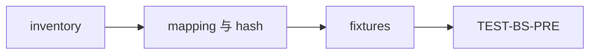
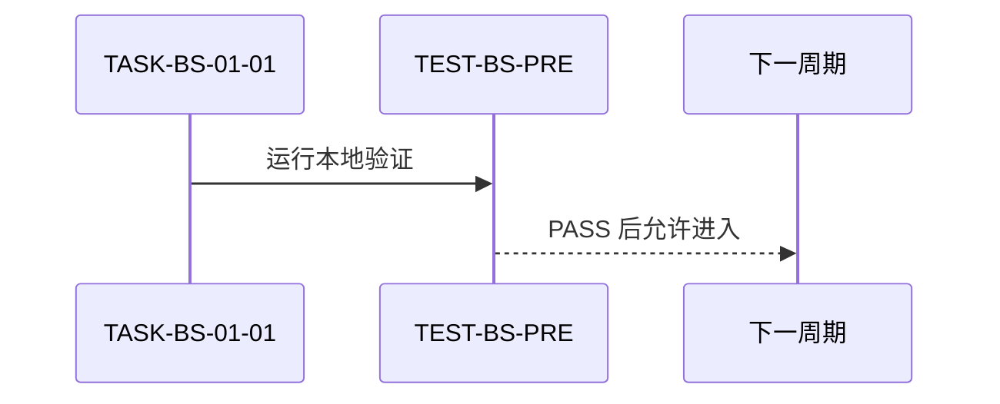

# CYCLE-BS-01 基线与迁移契约

结论：建立独立基线以保护后续迁移和删除。影响：后续操作只能按 inventory 和 mapping 执行。范围：专项测试资产与基线证据。非范围：不修改旧 Skill 或历史测试。变化：新增哈希、夹具和验证器。完成标准：pre-delete 通过并可定位回滚。术语说明：基线是删除前可复验的资产快照。验证状态：已通过本地专项验证。

## 当前周期目标、边界与进入条件

目标是完成 `TASK-BS-01-01`；进入条件为 `REQ-BS-003` 和 `AC-BS-003` 已冻结。只允许写入本轮专项测试目录，历史周期与源 Skill 均为禁止范围。

## 当前代码/文档基线

| 项目 | 基线 |
| --- | --- |
| 源资产 | 五项旧入口资产及其 SHA-256。 |
| 消费者 | 活跃消费者与历史例外分别登记。 |
| 文件/符号 | `inventory.json`、`trigger-fixtures.json`、验证器。 |
| 图片资产决策 | N/A + 原因：只有文本和结构化夹具；证据：无图片引用。 |

## 周期内最小任务执行顺序

| 顺序 | 任务 | 动作 | 完成条件 |
| --- | --- | --- | --- |
| 1 | `TASK-BS-01-01` | 记录 mapping、哈希、fixture 和 rollback locator。 | `TEST-BS-PRE` 通过。 |

图形目的：说明基线必须先于迁移完成。关联 ID：`CYCLE-BS-01`、`TASK-BS-01-01`。

## 文件/符号操作契约

| 文件/符号 | 操作 | 禁止项 | 回滚 |
| --- | --- | --- | --- |
| `inventory.json` | 记录源、目标、哈希和消费者。 | 不修改历史 inventory。 | 删除本轮条目并重建。 |
| `trigger-fixtures.json` | 冻结正负路由样本。 | 不访问非 local 服务。 | 用冻结样本重跑。 |
| 验证器 | 断言 pre-delete 边界。 | 不删除任何源资产。 | 停止后续周期。 |

## 最小任务闭环

| 任务 | 实现 | 真实测试 | 审查 | 验收 |
| --- | --- | --- | --- | --- |
| `TASK-BS-01-01` | inventory、fixture 和验证器。 | `TEST-BS-PRE`。 | 检查映射与哈希。 | `AC-BS-003`。 |

## 当前周期验证矩阵

| 测试 | 样本 | 断言 | 失败预期 |
| --- | --- | --- | --- |
| `TEST-BS-PRE` | 本地 inventory。 | 源存在、哈希、mapping、消费者和 YAML 一致。 | 任一缺失即非零退出。 |
| `TEST-BS-TRIGGER` | 本地 fixture。 | 生命周期选择器不串线。 | 错误 route 即停止。 |

图形目的：说明测试结果决定是否允许迁移。关联 ID：`TEST-BS-PRE`、`AC-BS-003`。

## 周期阻断、停止与回滚

停止条件：哈希、mapping、消费者或 YAML 任一断言失败即停止。回滚：只删除本轮测试资产或按已冻结 mapping 重建，不修改历史周期。最大推进边界：不得进入旧目录删除。

## 自审结论

| 项目 | 结论 | 证据 |
| --- | --- | --- |
| 任务颗粒度 | 通过。 | 单一最小任务。 |
| local 边界 | 通过。 | 仅本地文件夹具。 |
| 回滚 | 通过。 | inventory 的定位器。 |

## 周期追踪矩阵

图片资产决策：N/A + 原因：本周期只有文本、哈希和结构化夹具；证据：正文没有图片引用，专项验证器也没有图像输入或输出。

| 需求 | 验收 | 任务 | 文件/符号 | 真实测试 |
| --- | --- | --- | --- | --- |
| `REQ-BS-003` | `AC-BS-003` | `TASK-BS-01-01` | inventory、fixture、验证器 | `TEST-BS-PRE` |
