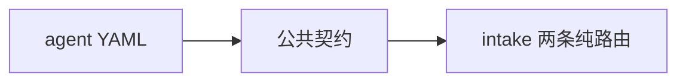
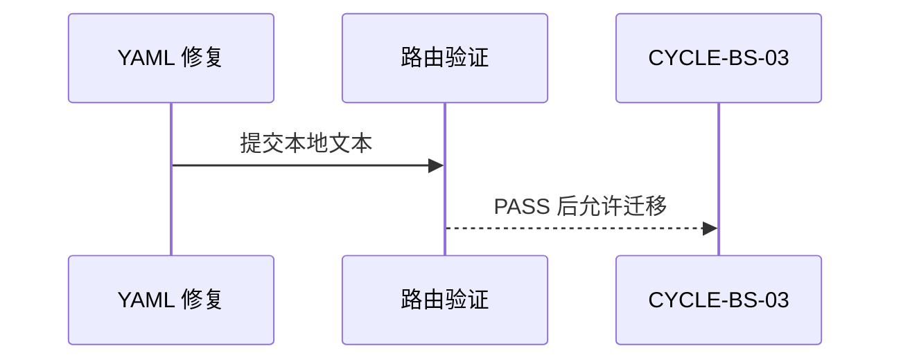

# CYCLE-BS-02 保留入口契约与 YAML 修复

结论：修复三个保留入口的 YAML，并将公共红线收敛到 intake reference。影响：保留入口可被解析器稳定读取，路由职责更清晰。范围：YAML 与 intake references。非范围：不移动复现、根因和验证入口。变化：新增共享契约和索引。完成标准：YAML 可解析且 route fixture 通过。术语说明：公共契约是各入口共同遵守的边界。验证状态：已完成本地验证。

## 当前周期目标、边界与进入条件

当前周期先修复保留 YAML，再引用化 intake 资料；进入条件为基线验证通过，收口条件为 `TEST-BS-TRIGGER` 通过。停止条件：任一 YAML 解析失败或生命周期入口串线。

## 当前代码/文档基线

| 项目 | 基线 |
| --- | --- |
| 文件/符号 | 三份 `agents/openai.yaml` 与 intake 两份路由文档。 |
| 允许范围 | `bug-reproduction-rules`、`bug-root-cause-rules`、`bug-fix-proposal-rules` 和 intake references。 |
| 禁止范围 | 不移动 reproduction、root-cause、validation 的细则。 |
| 图片资产决策 | N/A + 原因：文本与 YAML 调整；证据：没有图片引用或视觉输出。 |

## 周期内最小任务执行顺序

| 顺序 | 任务 | 动作 | 完成条件 |
| --- | --- | --- | --- |
| 1 | `TASK-BS-02-01` | 修复三份保留 YAML。 | PyYAML 解析通过。 |
| 2 | `TASK-BS-02-02` | 收敛公共契约与 intake 索引。 | route fixture 通过。 |

图形目的：说明 YAML 修复必须先于公共契约收敛。关联 ID：`CYCLE-BS-02`、`TASK-BS-02-01`、`TASK-BS-02-02`。

## TASK-BS-02-01

目标：将 reproduction、root-cause、fix-proposal 的 `agents/openai.yaml` 恢复为嵌套有效 YAML；允许只改这三文件。测试：使用 local Python/PyYAML 逐个 `safe_load` 并断言 interface 三字段。停止：任一解析失败不进入下一任务。回滚：恢复本任务前文件内容。

## TASK-BS-02-02

目标：新增 `bug-lifecycle-common-contract.md` 和 `reference-index.md`，让 `discovery-and-gap.md`、`runtime-diagnostics.md` 只承担路由与特有规则。测试：专项 validator 断言 local、只读、可清理、根因修复和阶段边界均仍可定位。禁止：不移动 reproduction/root-cause/validation references。

## 文件/符号操作契约

| 文件/符号 | 操作 | 回滚 |
| --- | --- | --- |
| 三份 `openai.yaml` | 恢复 `interface` 嵌套 mapping。 | 恢复本任务前的有效字段值。 |
| `bug-lifecycle-common-contract.md` | 承接公共 local、只读、清理和根因边界。 | 删除本轮新增 reference。 |
| `reference-index.md` | 建立 intake 细则索引。 | 回到原有 reference 路径。 |

## 最小任务闭环

| 任务 | 实现 | 真实测试 | 审查 | 验收 |
| --- | --- | --- | --- | --- |
| `TASK-BS-02-01` | YAML 嵌套修复。 | PyYAML `safe_load`。 | 字段与 owner 检查。 | `AC-BS-006`。 |
| `TASK-BS-02-02` | 公共契约和索引。 | `TEST-BS-TRIGGER`。 | 路由边界检查。 | `AC-BS-005`。 |

## 当前周期验证矩阵

| 测试 | 断言 | 失败预期 |
| --- | --- | --- |
| YAML 解析 | 三份保留 YAML 均包含有效 `interface`。 | 解析失败即停止。 |
| `TEST-BS-TRIGGER` | intake、复现、根因、修复、验证各自命中。 | 错误 route 即回滚。 |

图形目的：说明验证通过后才允许进入风险路由迁移。关联 ID：`TEST-BS-TRIGGER`、`CYCLE-BS-03`。

## 周期阻断、停止与回滚

停止条件：YAML 解析失败、公共条款缺失或任何 fixture 命中错误入口。回滚：恢复本周期修改的 YAML 和 reference，不影响其余生命周期 Skill。最大推进边界：不开始删除旧风险目录。

## 自审结论

| 项目 | 结论 | 依据 |
| --- | --- | --- |
| 入口保留 | 通过。 | 仅修复格式和引用层。 |
| 公共边界 | 通过。 | 共享契约不吞并特有细则。 |
| 真实测试 | 通过。 | YAML 解析与 fixture 均已执行。 |

## 周期追踪矩阵

图片资产决策：N/A + 原因：本周期仅处理文本和 YAML；证据：正文与测试均无图片资产。

| 需求 | 验收 | 任务 | 文件/符号 | 真实测试 |
| --- | --- | --- | --- | --- |
| `REQ-BS-005`、`REQ-BS-006` | `AC-BS-005`、`AC-BS-006` | `TASK-BS-02-01`、`TASK-BS-02-02` | YAML、intake references | `TEST-BS-TRIGGER` |
