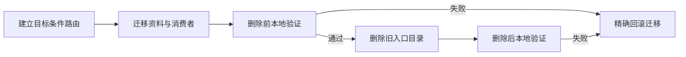
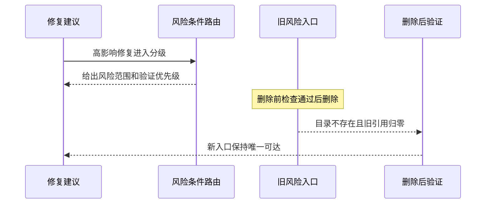

# CYCLE-BS-03 风险路由迁移与旧入口删除

结论：将独立风险入口并入修复建议入口的条件路由，并在迁移证明完整后删除旧入口。影响：高影响修复在提出方案时就会完成回归风险分级，使用者不再面对两个竞争入口。范围：风险资料、目标入口、活跃消费者和旧目录删除。非范围：不合并信息接入、复现、根因定位或关闭验证入口。变化：新增目标路由、迁入三份风险资料并移除重复目录。完成标准：新路由唯一可达、消费者无旧引用、旧目录不存在且本地验证通过。术语说明：条件路由是同一入口内按影响范围分流的子流程。验证状态：迁移与删除分别由删除前和删除后本地检查覆盖，最终收口待后续周期汇总。

## 当前周期目标、边界与进入条件

本周期的目标是完成 `CYCLE-BS-03` 的风险路由迁移与旧入口删除，使公共方法、共享模块、接口、数据库、缓存、兼容性或异常语义等高影响修复只进入 `bug-fix-proposal-rules#regression-risk`。进入条件是 `CYCLE-BS-01` 的资产清单和删除前检查已证明迁移材料、哈希和活跃消费者完整；收口条件是 `TEST-BS-POST` 证明旧目录和活跃旧引用均为零。停止条件：任何迁移资产缺失、消费者仍指向旧入口、路由串入复现/根因/验证入口，或删除后检查失败。最大推进边界：只迁移并删除重复风险入口，不扩展到其余五个 Bug 生命周期入口，不增加兼容壳、别名或历史目录改写。

## 当前代码/文档基线

| 项目 | 当前基线 | 本周期约束 |
| --- | --- | --- |
| 目标入口 | `bug-fix-proposal-rules/SKILL.md#regression-risk` 是唯一风险入口。 | 只在修复方案已定位且影响面较高时进入。 |
| 源入口 | `bug-regression-risk-rules/` 曾存放独立选择器、提示词和三份资料。 | 删除前必须完成清单、哈希和消费者检查。 |
| 保留入口 | intake、reproduction、root-cause、validation 各自保留独立职责。 | 不移动、不重命名、不被风险路由抢占。 |
| 活跃消费者 | README、编码 skill、团队路由、并行映射均应引用新入口。 | 不保留旧选择器、别名或兼容壳。 |
| 图片资产决策 | N/A + 原因：本周期只迁移文本资料和 YAML 路由；证据：专项夹具与交付范围均无图片输入或视觉产物。 | 不创建图片清单或图片文件。 |

## 周期内最小任务执行顺序

| 顺序 | 最小任务 | 前置条件 | 产出 | 完成条件 |
| --- | --- | --- | --- | --- |
| 1 | `TASK-BS-03-01` | 删除前检查已通过。 | 目标条件路由、三份迁入资料、目标 agent 和四类活跃消费者。 | 高影响修复唯一命中新路由，局部修复和相邻生命周期入口不误命中。 |
| 2 | `TASK-BS-03-02` | `TASK-BS-03-01` 的迁移完整性已验证。 | 删除完整的 `bug-regression-risk-rules/` 目录。 | 删除后检查确认旧目录不存在、活跃旧引用归零。 |

图形目的：说明目标路由、删除前验证和物理删除的先后依赖，避免在迁移不完整时丢失资料。关联 ID：`CYCLE-BS-03`、`TASK-BS-03-01`、`TASK-BS-03-02`、`TEST-BS-PRE`、`TEST-BS-POST`。



## 文件/符号操作契约

| 文件/符号 | 操作 | 不可变边界 | 回滚方式 |
| --- | --- | --- | --- |
| `bug-fix-proposal-rules/SKILL.md#regression-risk` | 增加高影响修复的条件路由和唯一入口说明。 | 不吞并复现、根因或验证流程。 | 恢复迁移前文本并保留原有修复建议主体。 |
| `bug-fix-proposal-rules/references/regression-risk.md` | 建立资料索引。 | 仅索引风险资料，不复制生命周期公共契约。 | 删除新增索引并恢复旧目录中的索引关系。 |
| `bug-fix-proposal-rules/references/regression-risk/` | 迁入风险维度、示例、分级与范围三份资料。 | 内容、文件名和基线哈希必须保持一致。 | 按 inventory 的 source-target mapping 精确放回。 |
| `bug-fix-proposal-rules/agents/openai.yaml` | 将 agent 提示词指向目标条件路由。 | YAML 必须保持嵌套有效且不保留旧 selector。 | 恢复本任务前有效 YAML 字段值。 |
| README、编码 skill、团队路由、并行映射 | 迁移活跃链接到新入口。 | 仅更新活跃消费者，不改冻结历史周期。 | 将各消费者链接精确改回迁移前目标。 |
| `bug-regression-risk-rules/` | 仅在删除前检查通过后删除全部旧资产。 | 不保留同名壳、别名或空目录。 | 依据 inventory 和哈希精确恢复五项源资产。 |

## 最小任务闭环

| 任务 | 实现 | 真实测试 | 审查 | 验收 |
| --- | --- | --- | --- | --- |
| `TASK-BS-03-01` | 建立 `regression-risk` 路由，迁入三份资料，更新目标 agent 与活跃消费者。 | `TEST-BS-TRIGGER` 使用本地夹具断言高影响修复命中新路由，局部修复与其他生命周期入口不误路由；`TEST-BS-PRE` 核验迁移完整性。 | 检查文件/符号边界、唯一选择器和 YAML 结构。 | `AC-BS-001`、`AC-BS-002`、`AC-BS-003`。 |
| `TASK-BS-03-02` | 删除 `bug-regression-risk-rules/` 的 Skill、agent 和三份资料。 | `TEST-BS-POST` 断言旧目录不存在、旧选择器不可达、活跃旧引用归零。 | 检查无兼容壳、无别名、无错误删除相邻入口。 | `AC-BS-004`。 |

## 当前周期验证矩阵

| 测试 ID | local 入口与样本 | 断言 | 失败预期与停止条件 | 清理/回滚 |
| --- | --- | --- | --- | --- |
| `TEST-BS-TRIGGER` | `trigger-fixtures.json` 由专项验证器读取。 | 高影响修复进入 `regression-risk`；局部修复与验证、复现、根因场景仍进入各自唯一入口。 | 任一 fixture 路由错误即停止，不删除旧目录。 | 回退错误路由文本或消费者链接。 |
| `TEST-BS-PRE` | `validate_bug_domain_streamlining.py --phase pre-delete`，仅在旧目录仍存在的删除前阶段执行。 | inventory、mapping、三份资料哈希、消费者和 YAML 均符合删除前契约。 | 任一资产、哈希或消费者缺失即停止删除。 | 依据 inventory 精确恢复迁移资产。 |
| `TEST-BS-POST` | `validate_bug_domain_streamlining.py --phase post-delete`，在当前删除后树执行。 | 旧目录与活跃旧引用均为零，新入口和三份资料可达。 | 旧目录残留、旧引用残留或新入口缺失即停止收口。 | 恢复缺失迁移资产，或精确恢复旧目录后重新验证。 |

本地验证命令只读取仓库文本与 fixture，不连接数据库、缓存、消息队列或外部服务：

```bash
PYTHONUTF8=1 /mnt/c/Windows/py.exe -3 -B doc/5-tests/2026-07-24_234623/bug-domain-streamlining/validate_bug_domain_streamlining.py --repo-root F:/luode-skills --phase pre-delete
PYTHONUTF8=1 /mnt/c/Windows/py.exe -3 -B doc/5-tests/2026-07-24_234623/bug-domain-streamlining/validate_bug_domain_streamlining.py --repo-root F:/luode-skills --phase post-delete
```

图形目的：说明高影响修复进入风险分级、相邻生命周期入口保持独立，以及删除后检查的闭环。关联 ID：`TASK-BS-03-01`、`TASK-BS-03-02`、`AC-BS-001`、`AC-BS-004`、`TEST-BS-TRIGGER`、`TEST-BS-POST`。



## 周期阻断、停止与回滚

停止条件：`TEST-BS-PRE` 未通过时不得删除旧目录；`TEST-BS-POST` 未通过时不得宣称迁移完成；任一活跃消费者残留旧引用、任一资料哈希不符、YAML 无法解析、或相邻生命周期入口被风险路由误抢占时立即停止。回滚：先停止后续周期推进，再按 `inventory.json` 的 source-target mapping 和基线哈希精确恢复对应资料、agent 或旧目录；回滚只影响本周期迁移资产，不改冻结历史周期、不重构其他 Bug Skill。恢复后重入点：重新执行 `TEST-BS-PRE`，通过后才允许再次删除，再执行 `TEST-BS-POST` 形成同一闭环。

## 自审结论

| 检查项 | 结论 | 依据 |
| --- | --- | --- |
| 唯一入口 | 通过。 | 高影响修复只进入 `bug-fix-proposal-rules#regression-risk`，不保留旧选择器。 |
| 文件/符号边界 | 通过。 | 仅涉及目标路由、三份风险资料、目标 agent、活跃消费者和旧目录。 |
| 生命周期边界 | 通过。 | intake、reproduction、root-cause、validation 均不合并。 |
| 真实测试设计 | 通过。 | fixture、删除前检查和删除后检查分别覆盖正向、负向与删除结果。 |
| 最大推进边界 | 通过。 | 不新增兼容壳，不迁移冻结历史，不进入最终验收周期。 |

## 周期追踪矩阵

| 来源/决策 | 需求/规则 | 验收 | 周期/任务 | 文件/符号 | 真实测试 | 证据 |
| --- | --- | --- | --- | --- | --- | --- |
| `SRC-BUG-STREAMLINE-20260724-001`、`DEC-BS-001` | `REQ-BS-001` | `AC-BS-001` | `CYCLE-BS-03` / `TASK-BS-03-01` | `bug-fix-proposal-rules/SKILL.md#regression-risk` | `TEST-BS-TRIGGER` | 高影响 fixture 唯一命中新路由。 |
| `DEC-BS-002` | `REQ-BS-002`、`REQ-BS-003` | `AC-BS-002`、`AC-BS-003` | `TASK-BS-03-01` | 风险资料、agent、四类活跃消费者 | `TEST-BS-PRE` | 清单、哈希、YAML 与消费者断言。 |
| `DEC-BS-003` | `REQ-BS-004` | `AC-BS-004` | `TASK-BS-03-02` | `bug-regression-risk-rules/` | `TEST-BS-POST` | 旧目录不存在且活跃旧引用归零。 |
| `DEC-BS-004`、`DEC-BS-005` | `REQ-BS-005`、`REQ-BS-006` | `AC-BS-005`、`AC-BS-006` | 相邻周期与 `CYCLE-BS-04` | 保留入口、审查与验收记录 | `TEST-BS-TRIGGER`、审查证据 | 生命周期边界与最终证据由后续周期复核。 |

图片资产决策：N/A + 原因：本周期仅处理文本、YAML 和本地验证夹具；证据：正文、专项验证器和交付范围均无图片资产。
