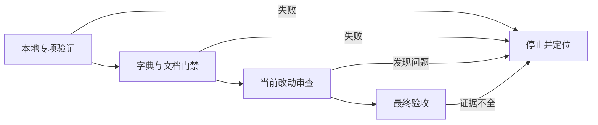
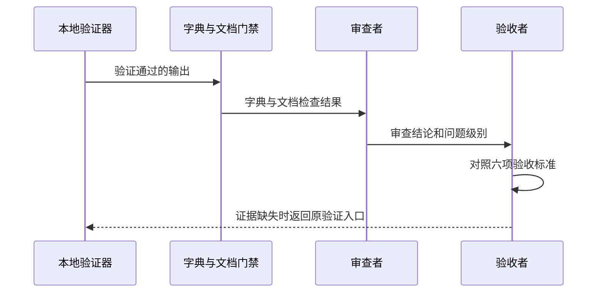

# CYCLE-BS-04 全链路验证审查与验收

结论：本周期用同一套本地检查把合并结果、文档、审查和最终验收连成闭环。影响：后续使用者可以确认风险入口已并入修复建议，且其余 Bug 生命周期入口没有被误改。范围：专项验证、字典刷新、工程文档门禁、当前改动审查与最终验收。非范围：不再改动 Bug Skill 的业务规则或恢复旧入口。变化：补齐每项验收标准的测试、审查和验收证据。完成标准：所有本地检查通过，审查和最终验收均可追溯。术语说明：专项验证器是只读取本地文件并按固定夹具核对路由和删除结果的程序。验证状态：本周期的验证入口和判定标准已冻结，实际执行证据以执行附录、审查记录和最终验收记录为准。

## 当前计划最终方案的简要说明

以专项验证器为主证据，先确认入口路由和删除结果，再刷新字典并通过工程文档门禁，最后完成当前改动审查和最终验收。这样可以避免把“文件已改”误当成“风险入口合并已经安全交付”。

## 当前周期目标、边界与进入条件

当前周期目标是完成 `TASK-BS-04-01` 的验证、审查和验收闭环，使 `AC-BS-001` 至 `AC-BS-006` 均有一条可重复的本地证据链。进入条件是前序周期已完成目标风险路由、活跃消费者迁移和旧目录删除；收口条件是所有验证命令、工程文档门禁、审查结论和最终验收记录均已通过。停止条件是专项验证、字典生成、YAML 解析、文档门禁或差异检查任一失败；失败时禁止宣称本周期完成。

| 边界 | 本周期处理 | 明确不处理 | 判定依据 |
| --- | --- | --- | --- |
| 验证 | 运行 intake、post-delete、文档和差异检查。 | 不连接 test、staging、pre 或 production 环境。 | `RULE-BS-001`。 |
| 审查 | 落盘实现审查与当前改动总审查。 | 不重新设计五个保留生命周期入口。 | `AC-BS-005`、`AC-BS-006`。 |
| 验收 | 逐项确认六项 AC 的可追溯证据。 | 不以人工口头说明替代机器验证。 | `AC-BS-001` 至 `AC-BS-006`。 |
| 推进 | 完成本周期收口文件。 | 不在本周期新增兼容壳、别名或旧选择器。 | `DEC-BS-001`、`DEC-BS-004`。 |

## 当前代码/文档基线

| 基线项 | 当前约束 | 本周期使用方式 | 证据定位 |
| --- | --- | --- | --- |
| 风险入口 | 唯一入口是 `bug-fix-proposal-rules#regression-risk`。 | 专项 fixture 验证高影响修复可达。 | `TEST-BS-POST`。 |
| 旧入口 | `bug-regression-risk-rules/` 已删除。 | post-delete 阶段断言目录、选择器和活跃消费者均不存在。 | `TEST-BS-POST`。 |
| 保留入口 | intake、复现、根因、修复建议、验证仍各自负责原生命周期阶段。 | intake-contract 阶段断言边界。 | `TEST-BS-INTAKE`。 |
| 文档资产 | 需求、实施、验收、测试、审查文件须能相互回指。 | 对本轮新增或修改文档运行工程文档门禁。 | `TEST-BS-DOCS`。 |
| 图片资产 | N/A + 原因：本周期仅处理文本、YAML、验证器和 Mermaid；证据：任务没有视觉交付物，正文没有位图引用。 | 不创建图片资产或清单。 | 本文及专项测试目录。 |

## 周期内最小任务执行顺序

| 顺序 | 任务 | 前置条件 | 精确动作 | 完成条件 | 停止条件 |
| --- | --- | --- | --- | --- | --- |
| 1 | `TASK-BS-04-01` | 前序迁移和删除已完成。 | 执行本地专项验证、字典刷新、工程文档门禁和差异检查。 | 所有命令按各自断言通过。 | 任一命令失败。 |
| 2 | `TASK-BS-04-01` | 第 1 步全部通过。 | 形成实现审查和当前改动总审查证据。 | 审查无 P0/P1。 | 发现残留、串线或不可回滚改动。 |
| 3 | `TASK-BS-04-01` | 审查通过。 | 对六项 AC 形成最终验收记录。 | 每项 AC 均有测试、审查、验收映射。 | 任一 AC 无可复核证据。 |

图形目的：说明本周期必须按“本地验证、审查、验收”顺序收口，避免跳过前置检查。关联 ID：`CYCLE-BS-04`、`TASK-BS-04-01`、`TEST-BS-INTAKE`、`TEST-BS-POST`。

## 文件/符号操作契约

| 文件/符号 | 本周期操作 | 不变量 | 回滚定位 |
| --- | --- | --- | --- |
| `doc/5-tests/2026-07-24_234623/bug-domain-streamlining/validate_bug_domain_streamlining.py` | 只执行，不改写验证器逻辑。 | intake-contract 和 post-delete 的断言保持固定。 | 无需回滚验证器源文件；原因：本周期没有写入该文件；证据：本周期写集仅限审查、验收和本文档。 |
| `skill-dictionary/generate_dictionary.py` | 执行后检查字典资产反映唯一风险入口。 | 不恢复旧 Skill 名称或选择器。 | 重新按生成器的当前源数据生成。 |
| `artifact-delivery-gate-rules/scripts/validate_engineering_docs.py` | 对对应 profile 运行并记录结果。 | 文档必须保持 UTF-8、YAML 有效、图形可解析。 | 修正被门禁指出的目标文档后同输入复验。 |
| `doc/6-审查/`、`doc/7-验收/` | 新增本周期审查与验收记录。 | 记录必须引用真实测试和 AC。 | 仅删除本周期新增记录并保留原有历史。 |
| `TASK-BS-04-01` | 只收口证据链。 | 不改 Bug 生命周期职责、目录删除结论或消费者映射。 | 回到失败命令对应的前序周期结论重新验证。 |

## 最小任务闭环

| 任务 | 实现 | 真实测试 | 审查 | 验收 | 完成证据 |
| --- | --- | --- | --- | --- | --- |
| `TASK-BS-04-01` | 执行专项验证、字典生成、文档门禁和差异检查；生成审查与验收记录。 | 本地 Python 执行 `intake-contract`、`post-delete` 和工程文档 profile；生成器与 `git diff --check` 不报错。 | 检查入口唯一性、消费者归零、YAML 语义、文档追踪和无关改动。 | 六项 AC 均从测试映射至结论。 | `EVIDENCE-BS-04-TEST`、`EVIDENCE-BS-04-REVIEW`、`EVIDENCE-BS-04-ACCEPT`。 |

## 当前周期验证矩阵

| 测试 ID | local 命令与样本 | 核心断言 | 失败预期 | 通过标准 |
| --- | --- | --- | --- | --- |
| `TEST-BS-INTAKE` | `py.exe -3 -B validate_bug_domain_streamlining.py --repo-root F:/luode-skills --phase intake-contract`；使用内置 intake fixtures。 | 信息缺口与运行时诊断仍进入 intake 的两个条件路由，其他生命周期入口不串线。 | route 丢失、职责交叉或契约缺失时失败。 | 输出 `PASS phase=intake-contract`。 |
| `TEST-BS-POST` | `py.exe -3 -B validate_bug_domain_streamlining.py --repo-root F:/luode-skills --phase post-delete`；使用内置删除后 fixtures。 | 新风险路由可达，旧目录、旧选择器和活跃消费者为零。 | 旧资产残留、迁移资料 hash 不符或消费者未迁移时失败。 | 输出 `PASS phase=post-delete`。 |
| `TEST-BS-DOCS` | `py.exe -3 -B artifact-delivery-gate-rules/scripts/validate_engineering_docs.py --profile <目标 profile> --doc <目标文档> --root F:/luode-skills`。 | 每份本轮文档满足 YAML、白话摘要、图形、表格、追踪和图片决策契约。 | 缺章节、坏 YAML、坏图或失效追踪时失败。 | 每个 profile 返回 `PASS`。 |
| `TEST-BS-DICT` | `py.exe -3 -B skill-dictionary/generate_dictionary.py`。 | 字典不再登记 `bug-regression-risk-rules`，目标 route 保持可检索。 | 旧 Skill 名称仍出现或生成失败时停止。 | 生成脚本成功且输出可读。 |
| `TEST-BS-DIFF` | `git diff --check`。 | 本轮变更没有尾随空白或冲突标记。 | 输出错误行时停止审查与验收。 | 退出码为 0。 |

图形目的：说明不同角色如何基于同一份本地证据决定审查与验收，避免用单一人工判断替代测试。关联 ID：`TEST-BS-INTAKE`、`TEST-BS-POST`、`EVIDENCE-BS-04-REVIEW`、`EVIDENCE-BS-04-ACCEPT`。

## 周期阻断、停止与回滚

| 风险或阻断 | 发现入口 | 停止与处理 | 回滚 | 最大推进边界 |
| --- | --- | --- | --- | --- |
| 路由或消费者不符合预期 | `TEST-BS-INTAKE` 或 `TEST-BS-POST`。 | 停止审查和验收，定位到前序迁移结论。 | 按专项 inventory 的 mapping 与 hash 精确恢复受影响文本资产。 | 不创建兼容壳，不重新命名保留入口。 |
| YAML、字典或文档门禁失败 | `TEST-BS-DOCS` 或 `TEST-BS-DICT`。 | 只修正失败项后以同一命令复验。 | 恢复该失败项在本周期前的内容；不覆盖用户改动。 | 不将局部通过写成整体完成。 |
| 差异检查或审查发现 P0/P1 | `TEST-BS-DIFF` 或审查记录。 | 停止最终验收，生成 `BLK-*` 收口并记录重入测试。 | 回到引入问题的最小任务，撤销仅本任务新增的错误改动。 | 不提交、不推送、不扩大范围。 |
| 某项 AC 证据缺失 | 最终验收矩阵。 | 标记待重验并回到对应 TEST 或审查步骤。 | 不适用；补齐真实证据而非伪造结论。 | 不宣布正式放行。 |

回滚顺序固定为：先停止当前验证，再保留失败输出，随后仅恢复与失败直接对应的本周期文件，最后使用原命令和原断言复验。最大推进边界是本周期的文档、审查和验收收口；不触发新的 Skill 合并、代码重构、外部服务调用或 Git 历史写入。

## 自审结论

| 检查项 | 结论 | 依据 |
| --- | --- | --- |
| 验证顺序 | 通过。 | 专项验证、字典和文档门禁先于审查和验收。 |
| 生命周期边界 | 通过。 | 验证只证明路由和删除结果，不改变保留入口职责。 |
| local 安全边界 | 通过。 | 命令只读取 `F:/luode-skills` 本地文件，不建立外部连接。 |
| 回滚与停止 | 通过。 | 每类失败都有停止条件、回滚定位和原命令重入点。 |
| 决策完整性 | 通过。 | unresolved_decisions：无；入口、删除、测试和验收顺序均已冻结。 |

## 执行附录

### 本周期命令、样本与清理

执行时使用本地仓库根目录 `F:/luode-skills`，专项验证器只读取内置 JSON fixture 和当前工作树，不连接数据库、缓存、消息队列或 HTTP 上游。每条命令完成后保留退出码与摘要；本周期不写入测试数据，因此无需数据清理。若出现失败，保留最小脱敏输出，按“周期阻断、停止与回滚”章节处理后，以相同命令复验。

图片资产决策：N/A + 原因：本周期仅处理文本、YAML、验证器和 Mermaid；证据：正文与测试均无位图输入、输出或引用。

## 追踪附录

### 周期追踪矩阵

| 上游需求或规则 | 验收 | 周期与任务 | 文件/符号 | 真实测试 | 证据 |
| --- | --- | --- | --- | --- | --- |
| `REQ-BS-001`、`REQ-BS-002` | `AC-BS-001`、`AC-BS-002` | `CYCLE-BS-04`、`TASK-BS-04-01` | `bug-fix-proposal-rules#regression-risk` | `TEST-BS-POST`、`TEST-BS-DICT` | `EVIDENCE-BS-04-TEST`。 |
| `REQ-BS-003`、`REQ-BS-004` | `AC-BS-003`、`AC-BS-004` | `CYCLE-BS-04`、`TASK-BS-04-01` | 旧目录、活跃消费者、专项 inventory。 | `TEST-BS-POST`、`TEST-BS-DIFF` | `EVIDENCE-BS-04-TEST`、`EVIDENCE-BS-04-REVIEW`。 |
| `REQ-BS-005` | `AC-BS-005` | `CYCLE-BS-04`、`TASK-BS-04-01` | intake 两条条件路由与共享契约。 | `TEST-BS-INTAKE` | `EVIDENCE-BS-04-TEST`、`EVIDENCE-BS-04-ACCEPT`。 |
| `REQ-BS-006`、`RULE-BS-001`、`RULE-BS-002` | `AC-BS-006` | `CYCLE-BS-04`、`TASK-BS-04-01` | 验证入口、审查记录和最终验收记录。 | `TEST-BS-DOCS`、`TEST-BS-DIFF` | `EVIDENCE-BS-04-REVIEW`、`EVIDENCE-BS-04-ACCEPT`。 |

### 任务完成、停止与交接

`TASK-BS-04-01` 的完成条件是上述五类本地验证、审查和最终验收均有 PASS 或无 P0/P1 的真实记录；停止条件是任一命令、审查或 AC 缺失证据；交接点是失败的 TEST ID、对应文件/符号、失败摘要和原命令。`ROLLBACK-BS-04-01` 的唯一动作是停止扩大范围、仅回退失败直接关联的本周期改动、用原命令复验，不修改历史周期文档或未授权的用户改动。
