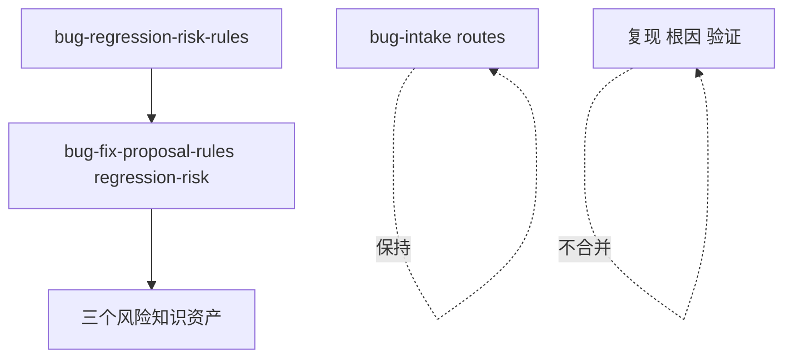
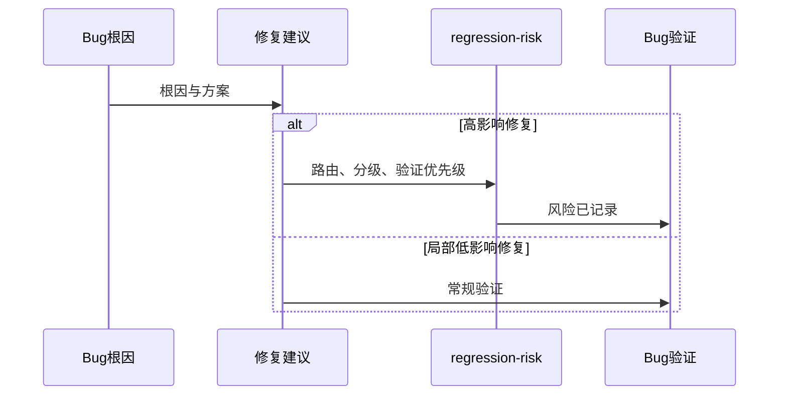
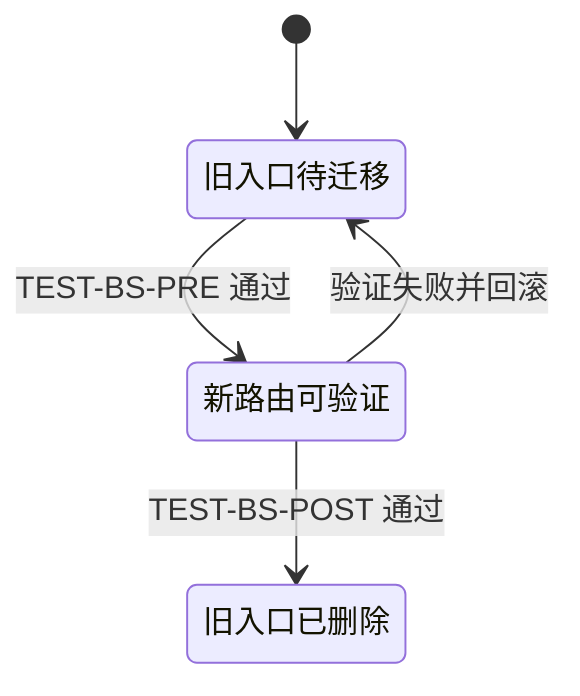

# Bug 域回归风险入口合并实施总览

结论：回归风险并入修复建议入口并删除重复入口。影响：高影响修复会在同一流程内完成风险评估。范围：Bug Skill、消费者、验证器、字典和文档。非范围：复现、根因和关闭验证入口不合并。变化：新增风险条件路由并迁移三份资料。完成标准：新入口可达、旧入口不存在且相邻入口保持独立。术语说明：条件路由是同一入口内按风险条件进入的子流程。验证状态：专项验证完成，待本轮审查和最终验收复核。

## 当前计划最终方案简要说明

将回归风险作为修复建议的条件路由，而不是保留一个与修复决策竞争的独立 Skill。主落点是 `bug-fix-proposal-rules`；删除只在专项验证器的 pre-delete 阶段通过后发生。

## Agent 对当前问题的理解

现有独立风险入口和修复建议中已有的影响范围、风险点、回归影响及验证安排重叠。当前优先闭环是先证明迁移完整，再完成删除、审查和验收；unresolved_decisions：无，入口、保留边界和删除策略均已冻结。

## 实施周期总览

Bug 生命周期已有五个职责明确的入口；独立风险入口与“修复方案中的影响范围、风险点、回归影响和验证方式”重叠。本轮仅合并这一入口，其他五个入口不移动、不重命名、不改变公开选择器。

图形目的：说明资产移动与禁止跨界。关联 ID：`DEC-BS-001`、`DEC-BS-002`、`DEC-BS-003`、`DEC-BS-004`、`DEC-BS-005`。



## 阶段计划

| 阶段 | 目的 | 进入条件 | 结束条件 |
| --- | --- | --- | --- |
| 基线 | 固定 mapping、哈希与夹具。 | 需求和验收稳定。 | pre-delete 可重复通过。 |
| 保留入口 | 规范 YAML 与 intake 契约。 | 基线通过。 | YAML 和路由 fixture 通过。 |
| 迁移删除 | 创建 route、迁移消费者、删除旧目录。 | pre-delete 通过。 | post-delete 通过。 |
| 收口 | 刷新字典、文档、审查与验收。 | 删除完成。 | 全部 AC 有证据。 |

## 现状与落点

```text
bug-fix-proposal-rules/
├── SKILL.md                         # 新增 regression-risk 条件路由
├── agents/openai.yaml               # 有效 YAML 与 route prompt
└── references/
    ├── regression-risk.md           # 路由索引
    └── regression-risk/             # 迁入三份风险知识资产
bug-intake-rules/references/
├── bug-lifecycle-common-contract.md # 共享生命周期契约
├── reference-index.md               # intake 索引
├── discovery-and-gap.md             # 纯路由化
└── runtime-diagnostics.md           # 纯路由化
doc/5-tests/2026-07-24_234623/bug-domain-streamlining/
├── inventory.json
├── trigger-fixtures.json
└── validate_bug_domain_streamlining.py
```

## 最小任务清单

| CYCLE | TASK | 允许文件 | 真实测试 | 完成/停止条件 |
| --- | --- | --- | --- | --- |
| `CYCLE-BS-01` | `TASK-BS-01-01` | 本轮 `doc/5-tests` 专项目录。 | `py_compile` + `--phase pre-delete`。 | inventory/mapping/fixture/validator 一致；失败即不删除。 |
| `CYCLE-BS-02` | `TASK-BS-02-01` | 4 个保留 agent YAML、intake references。 | PyYAML 解析与语义断言。 | YAML 正确、公共契约唯一；失败即回退本任务。 |
| `CYCLE-BS-03` | `TASK-BS-03-01` | 目标 Skill、三个 references、四个活跃消费者、源目录。 | pre-delete、post-delete、路由 fixture。 | 删除后无活跃旧引用；失败按 inventory 回滚。 |
| `CYCLE-BS-04` | `TASK-BS-04-01` | 字典、审查、验收、项目状态。 | 字典生成、专项 validator、文档 validator、diff check。 | 所有 AC 有证据；失败不放行。 |

图形目的：说明从修复决策到验证的端到端分流。关联 ID：`REQ-BS-001`、`REQ-BS-006`。



图形目的：说明删除前后的入口状态只允许从“待删除”变为“已删除”。关联 ID：`TASK-BS-03-02`、`AC-BS-004`。



## 真实测试安排

| 测试 | 样本与入口 | 断言 | 失败预期 |
| --- | --- | --- | --- |
| `TEST-BS-TRIGGER` | 本地 `trigger-fixtures.json`。 | 每类场景命中唯一入口。 | 错误命中即停止迁移。 |
| `TEST-BS-PRE` | 专项验证器 pre-delete。 | mapping、哈希、消费者、YAML 全部通过。 | 不允许删除旧目录。 |
| `TEST-BS-POST` | 专项验证器 post-delete。 | 旧目录和活跃旧引用均为零。 | 进入精确回滚。 |

## 风险与阻断项

| 风险 | 防护 | 停止条件 | 回滚 |
| --- | --- | --- | --- |
| 错删或漏迁移 | inventory + pre-delete。 | 哈希或消费者断言失败。 | 按 mapping 精确恢复。 |
| 生命周期串线 | 正负 route fixtures。 | 复现、根因或验证入口被吞并。 | 回退错误文案。 |
| 文档失配 | profile 与字典生成。 | 任一机器门禁失败。 | 回到 `TASK-BS-04-01`。 |

## 任务完成、停止与最大推进边界

最大推进边界：本轮只完成 `REQ-BS-*` 对应资产；不得顺带重构其它 Skill、历史归档或 Git 历史。停止条件：任何最小任务缺少实现、真实测试、审查或验收证据，或出现 P0/P1、旧入口残留、YAML 解析失败时立即停止。回滚：只按 inventory 的 source-target mapping 恢复本轮移走的资产。

## 自审结论

| 项目 | 结论 | 依据 |
| --- | --- | --- |
| 文件/符号边界 | 通过。 | 新 route、intake 参考资料、YAML 与消费者边界明确。 |
| 最小任务闭环 | 通过。 | 每个 `TASK-BS-*` 固定实现、真实测试、审查、验收四类证据。 |
| 兼容策略 | 通过。 | 按用户决定不保留兼容壳。 |

图片资产决策：N/A + 原因：关系由 Mermaid 精确表达；证据：无 UI、截图或视觉产物。

## 追踪矩阵

| 需求 | 验收 | 周期/任务 | 文件/符号 | 测试 |
| --- | --- | --- | --- | --- |
| `REQ-BS-001`、`REQ-BS-002` | `AC-BS-001`、`AC-BS-002` | `CYCLE-BS-03` / `TASK-BS-03-01` | `bug-fix-proposal-rules/SKILL.md#regression-risk` | `TEST-BS-TRIGGER` |
| `REQ-BS-003`、`REQ-BS-004` | `AC-BS-003`、`AC-BS-004` | `CYCLE-BS-01`、`CYCLE-BS-03` | inventory、旧目录、消费者 | `TEST-BS-PRE`、`TEST-BS-POST` |
| `REQ-BS-005`、`REQ-BS-006` | `AC-BS-005`、`AC-BS-006` | `CYCLE-BS-02`、`CYCLE-BS-04` | intake、YAML、字典 | `TEST-BS-TRIGGER`、审查证据 |
