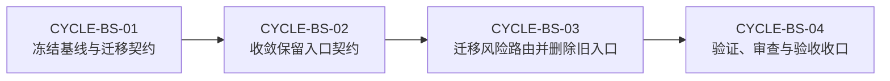

# Bug 域回归风险入口合并全量顺序实施方案

结论：以修复建议入口承接回归风险并删除重复入口。影响：高影响修复会在同一流程内完成风险分级与验证安排。范围：Bug Skill、活跃消费者、字典、验证器和工程文档。非范围：不合并复现、根因与关闭验证入口。变化：先冻结迁移契约，再迁移风险资料并删除旧目录。完成标准：新入口可达、旧入口不存在、相邻生命周期不串线且验收均通过。术语说明：条件路由是在同一入口中按风险条件进入的子流程。验证状态：专项验证已通过，等待本次文档、审查与最终验收收口。

## 文档信息

本方案是该来源对象的全量顺序调度表，只排列需求、验收、实施周期和最小任务的执行次序；具体文件改动和测试断言以各周期文档为唯一事实来源。

| 项目 | 冻结内容 |
| --- | --- |
| 来源对象 | `SRC-BUG-STREAMLINE-20260724-001`，用户确认合并回归风险入口。 |
| 当前优先闭环 | `CYCLE-BS-04`：复验、审查、字典与验收收口。 |
| 执行基线 | `76ee419d59396d919fea04ed55ea373ddeb8cb26`；共享工作树中的无关改动不纳入本方案。 |
| 图片资产决策 | N/A + 原因：任务只包含文本路由、YAML、脚本和 Mermaid；证据：验收夹具不依赖图像输入或输出。 |

## 来源对象清单与回指关系

| 来源/文档 | 作用 | 进入条件 | 回指关系 |
| --- | --- | --- | --- |
| `REQ-BS-20260724` | 冻结入口、删除和保留边界。 | 所有决策已确认。 | 每项 `REQ-BS-*` 映射到验收与周期。 |
| `AC-BS-20260724` | 定义六项可验证结果。 | 对应周期的真实测试完成。 | 每项 `AC-BS-*` 映射到 `CYCLE-BS-*` 与 `TEST-BS-*`。 |
| 本文档 | 排列全量执行顺序。 | 来源与验收标准稳定。 | 回指四个周期的最小任务。 |
| 四份周期文档 | 固化文件、符号、测试、回滚与收口。 | 前一周期闭环通过。 | 回写专项测试、审查与验收证据。 |

## 当前执行入口与下一步

当前执行入口是 `CYCLE-BS-04`。前 3 个周期已经完成各自的实现、真实测试、审查和验收闭环；本周期只允许复核专项验证、工程文档、字典、当前改动审查和最终验收，不得扩展合并范围或重新引入兼容壳。

## 全量执行顺序

| 顺序 | 周期 | 最小任务 | 本周期产出 | 进入条件 | 收口条件 |
| --- | --- | --- | --- | --- | --- |
| 1 | `CYCLE-BS-01` | `TASK-BS-01-01` | inventory、source-target mapping、fixtures、专项验证器。 | 需求和验收已冻结。 | `TEST-BS-PRE` 证明基线、保护语义和回滚定位器可用。 |
| 2 | `CYCLE-BS-02` | `TASK-BS-02-01`、`TASK-BS-02-02` | 保留入口 YAML 修复、intake 公共契约和 reference 索引。 | 周期 01 已闭环。 | YAML 解析与 `TEST-BS-TRIGGER` 均通过。 |
| 3 | `CYCLE-BS-03` | `TASK-BS-03-01`、`TASK-BS-03-02` | 新 `regression-risk` route、三份迁移资料、消费者迁移和旧目录删除。 | 周期 02 已闭环。 | `TEST-BS-PRE` 与 `TEST-BS-POST` 证明迁移和删除均正确。 |
| 4 | `CYCLE-BS-04` | `TASK-BS-04-01` | 字典刷新、工程文档、审查和最终验收。 | 周期 03 已闭环。 | `AC-BS-001` 至 `AC-BS-006` 全部可追溯并放行。 |

图形目的：说明全量顺序中每个周期只能在前一周期闭环后开始。关联 ID：`CYCLE-BS-01`、`CYCLE-BS-02`、`CYCLE-BS-03`、`CYCLE-BS-04`。

## 依赖、进入、收口与阻断

| 依赖或风险 | 控制方式 | 停止条件 | 回滚或重入点 |
| --- | --- | --- | --- |
| 旧入口删除 | 先通过 mapping、哈希和 pre-delete 检查。 | source-target mapping、消费者归零或 YAML 解析任一失败。 | 保持旧目录，回到 `TASK-BS-03-01` 修正迁移。 |
| 生命周期边界 | 使用正负 fixture 覆盖 intake、复现、根因、修复建议、验证和普通回归。 | 任一 fixture 命中错误入口。 | 回到对应 route 文案或索引，不改变其他入口。 |
| 文档与字典 | 文档 profile、字典生成与 diff 检查必须通过。 | 机器校验、链接或字典生成失败。 | 回到 `TASK-BS-04-01` 补齐后用同一输入复验。 |
| local 环境 | 只运行本地文件验证，不连接 test、staging 或生产服务。 | 验证要求使用非 local 连接。 | 停止该验证并改用本地 fixture。 |

阻断：任一周期的最小任务缺少“实现、真实测试、审查、验收”四类证据，或出现未解决的 P0/P1、失效链接、旧入口残留、YAML 无法解析时，停止全量顺序推进；不以口头说明替代机器证据。

## 自审结论

| 自审项 | 结论 | 依据 |
| --- | --- | --- |
| 生命周期拆分 | 通过。 | 修复建议承担风险评估；复现、根因、验证仍各自独立。 |
| 删除安全性 | 通过，受 pre/post-delete 双阶段保护。 | inventory、mapping、哈希、消费者和旧目录断言。 |
| 执行颗粒度 | 通过。 | 每个周期含不超过两个最小任务，并明确真实测试与回滚。 |
| 未决决策 | 无。 | 入口、兼容壳、保留边界和 local 验证均已冻结。 |

## 执行附录

- 图片资产决策：N/A + 原因：本任务仅包含文本路由、YAML、脚本和 Mermaid；证据：专项夹具没有图像输入或输出，正文也没有图片引用。
- 真实测试入口：`doc/5-tests/2026-07-24_234623/bug-domain-streamlining/validate_bug_domain_streamlining.py`；样本来源为同目录 `trigger-fixtures.json`；通过标准是 `intake-contract`、`pre-delete` 和 `post-delete` 分别返回 PASS。
- 文件/符号落点：`bug-fix-proposal-rules/SKILL.md#条件路由：regression-risk`、`bug-intake-rules/references/`、各 YAML `interface` mapping、活跃消费者和字典产物。
- 回滚：删除前只使用 inventory 中的 source-target mapping 和哈希精确恢复；不得恢复历史目录的其他资产，也不得创建兼容壳。
- 停止条件：任何阶段未满足收口条件即停止，并从上表给出的任务重入点恢复。

## 追踪附录

| 来源 | 需求/规则 | 验收 | 周期/任务 | 文件/符号 | 测试/证据 |
| --- | --- | --- | --- | --- | --- |
| `SRC-BUG-STREAMLINE-20260724-001` | `REQ-BS-001`、`REQ-BS-002` | `AC-BS-001`、`AC-BS-002` | `CYCLE-BS-03` / `TASK-BS-03-01` | `bug-fix-proposal-rules/SKILL.md#regression-risk` | `TEST-BS-TRIGGER`、`TEST-BS-PRE` |
| `SRC-BUG-STREAMLINE-20260724-001` | `REQ-BS-003`、`REQ-BS-004` | `AC-BS-003`、`AC-BS-004` | `CYCLE-BS-01`、`CYCLE-BS-03` / `TASK-BS-01-01`、`TASK-BS-03-02` | inventory、活跃消费者、旧目录 | `TEST-BS-PRE`、`TEST-BS-POST` |
| `SRC-BUG-STREAMLINE-20260724-001` | `REQ-BS-005`、`REQ-BS-006`、`RULE-BS-001`、`RULE-BS-002` | `AC-BS-005`、`AC-BS-006` | `CYCLE-BS-02`、`CYCLE-BS-04` / `TASK-BS-02-02`、`TASK-BS-04-01` | intake references、YAML、字典 | `TEST-BS-TRIGGER`、审查与验收证据 |
