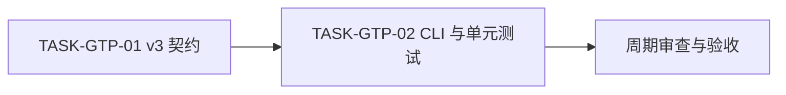
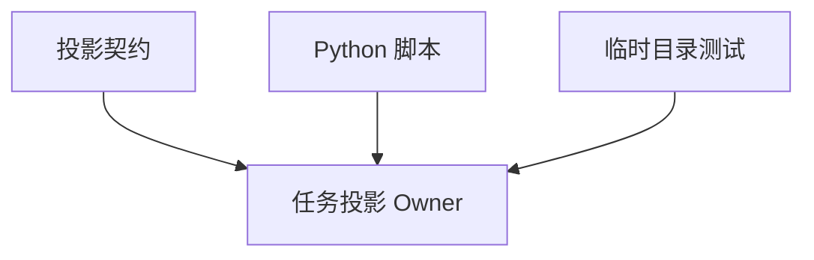

# Goal 模式任务悬浮窗进度可视化实施周期 01：投影契约与脚本

结论：本周期只完成既定闭环；影响：为下一周期提供可验证输入；范围：文档规定文件；非范围：产品界面；变化：按最小任务实现和测试；完成标准：本周期真实测试、审查、验收通过；术语说明：无。验证状态：待执行。

## 目标、进入条件和任务顺序

- 进入条件：`REQDOC-GTP-001`、`ACDOC-GTP-001`、`PLAN-GTP-001` 和 `IMPL-GTP-001` 均已落盘。
- 最大推进边界：只改 `task-plan-rehydration-rules` 的 contract、脚本和测试；不修改 Goal 路由。

图形目的：说明本周期最小任务依赖；关联 ID：`TASK-GTP-01`、`TASK-GTP-02`。

图形目的：说明领域匹配；关联 ID：`REQ-GTP-001/002/005`。

| 任务 | 实现 | 真实测试 | 审查与验收 | 停止条件 |
|---|---|---|---|---|
| `TASK-GTP-01` | 定义 v3 `goal` origin、`goal_default`、三步常量、v2 升级和字段拒绝 | 合法/非法 projection 验证 | 检查不含目标原文、schema 兼容 | 旧投影无法读取或出现原文入口 |
| `TASK-GTP-02` | 实现 goal create/restore/complete/blocked CLI 和 payload | `python -B task-plan-rehydration-rules/tests/test_task_plan_projection.py` | 哈希不变、原子写入、三态唯一 | 任一失败不进入周期 02 |

## 文件、测试、回滚与追踪

| 文件/符号 | 操作 | 断言 |
|---|---|---|
| `references/task-plan-projection-contract.md` | 扩展版本和 Goal 数据约束 | 仅静态默认文案可入库 |
| `scripts/task_plan_projection.py` | 新增/扩展 Goal 入口 | 先持久化后输出 payload |
| `tests/test_task_plan_projection.py` | 正负样本 | 默认、恢复、完成、阻断、v2 兼容 |

- 清理：测试仅使用 `TemporaryDirectory`；失败后自动删除样本。
- 回滚：还原本周期三文件中本来源对象的增量；保留用户既有改动。
- 追踪：`REQ-GTP-001/002/005 -> AC-GTP-001/004/005 -> TASK-GTP-01/02 -> TEST-GTP-001/002/005/006`。

## 当前代码/文档基线

| 项目 | 基线 |
|---|---|
| 来源需求 | `REQDOC-GTP-001` |
| 前置周期 | 见 `PLAN-GTP-001` |
| 图片资产决策 | N/A。原因：规则/脚本改动；证据：不新增图像资产。 |

## 周期内最小任务执行顺序

图形目的：说明本周期任务与验证依赖；关联 ID：`CYCLE-GTP`。

## 最小任务闭环

| 任务 | 实现 | 真实测试 | 审查 | 验收 |
|---|---|---|---|---|
| 当前周期任务 | 文档既定文件/符号 | local 命令与临时样本 | diff、职责边界 | 对应 `AC-GTP-*` |

## 文件/符号操作契约

| 文件/符号 | 操作 | 保护边界 |
|---|---|---|
| 当前周期指定文件 | 最小增量修改 | 不覆盖用户未提交改动 |

## 当前周期验证矩阵

| 测试 | 样本 | 断言 | 失败预期 |
|---|---|---|---|
| local 回归 | 临时文件与合法/非法输入 | 输出、哈希、状态 | 非法输入失败 |
| Skill 校验 | 受影响 Skill | 元数据和结构 | 失败即阻断 |

## 周期阻断、停止与回滚

- 停止条件：本周期任一真实测试、隐私、兼容或边界断言失败。
- 回滚：仅撤销当前周期文件/符号的本来源对象增量，保留用户工作树。
- 最大推进边界：本周期完成前不进入下一周期。

## 周期追踪矩阵

| 周期 | 任务 | 验收 | 测试 | 文件/符号 |
|---|---|---|---|---|
| 当前周期 | `TASK-GTP-*` | `AC-GTP-*` | `TEST-GTP-*` | 当前周期落点 |

结论：本周期只完成既定闭环；影响：为下一周期提供可验证输入；范围：文档规定文件；非范围：产品 UI；变化：按最小任务实现和测试；完成标准：本周期真实测试、审查、验收通过；术语说明：周期闭环包含实现、测试、审查和验收；验证状态：待执行。

已声明停止条件、回滚、文件/符号和真实测试；本周期必须完成闭环才可推进。

## 当前周期目标、边界与进入条件
- 当前周期目标：完成既定 `TASK-GTP-*`。
- 进入条件：前置文档与前置周期通过。
- 边界：不触及 Desktop 产品代码。

## 进入条件与收口条件
- 进入：前置任务四类证据齐全。
- 收口：本周期 local 测试、审查和对应 `AC-GTP-*` 通过。

图片资产决策：N/A。原因：规则和脚本不新增图片；证据：无资源目录改动。

## 自审结论
停止条件、回滚、文件/符号和真实测试均已声明。
