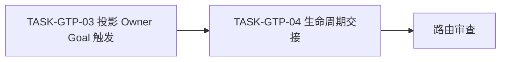
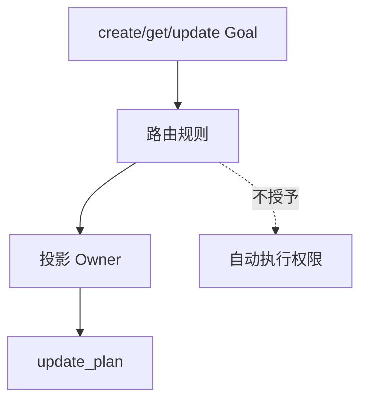
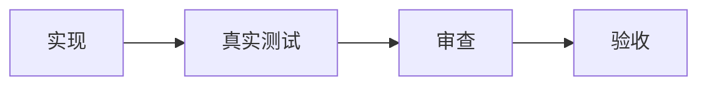

# Goal 模式任务悬浮窗进度可视化实施周期 02：Goal 路由与恢复

结论：本周期只完成既定闭环；影响：为下一周期提供可验证输入；范围：文档规定文件；非范围：产品界面；变化：按最小任务实现和测试；完成标准：本周期真实测试、审查、验收通过；术语说明：无。验证状态：待执行。

## 目标、进入条件和任务顺序

- 进入条件：`CYCLE-GTP-01` 的所有测试、审查和验收通过。
- 最大推进边界：只改两个 Skill 与其测试/元数据；不运行真实 Desktop 重开。

图形目的：说明路由任务依赖；关联 ID：`TASK-GTP-03`、`TASK-GTP-04`。

图形目的：说明领域边界；关联 ID：`REQ-GTP-003/004/005`。

| 任务 | 实现 | 真实测试 | 审查与验收 | 停止条件 |
|---|---|---|---|---|
| `TASK-GTP-03` | 在投影 Owner 规定 Goal 创建成功后、重开执行回合和终态的调用顺序 | 文档路由契约断言、quick validate | 不覆盖来源不一致的普通投影；Plan Mode 退出 | 存在先 UI 后落盘或错误恢复 |
| `TASK-GTP-04` | 在自主执行规则转交 Goal 生命周期，不把 UI 变成执行授权 | Goal create/get/update 规则断言 | 完成失活、阻断无进行中、不得自动重放 | 阻断后自动继续或 Plan Mode 调 UI |

## 文件、测试、回滚与追踪

| 文件/符号 | 操作 | 断言 |
|---|---|---|
| `task-plan-rehydration-rules/SKILL.md` | 增加 Goal 触发和停止表 | 主会话唯一调用 `update_plan` |
| `autonomous-execution-rules/SKILL.md` | 增加 Goal 生命周期交接 | 投影不改变执行授权 |
| 对应测试/agents 元数据 | 覆盖触发和描述 | quick validate 通过 |

- local 命令：`python -B .system/skill-creator/scripts/quick_validate.py task-plan-rehydration-rules` 和对应 autonomous Skill。
- 回滚：撤销本周期规则文字及测试增量，不触及周期 01 的已验证脚本。
- 追踪：`REQ-GTP-003/004/005 -> AC-GTP-002/003/004 -> TASK-GTP-03/04 -> TEST-GTP-003/004/005`。

## 当前代码/文档基线

| 项目 | 基线 |
|---|---|
| 来源需求 | `REQDOC-GTP-001` |
| 前置周期 | 见 `PLAN-GTP-001` |
| 图片资产决策 | N/A。原因：规则/脚本改动；证据：不新增图像资产。 |

## 周期内最小任务执行顺序

图形目的：说明本周期任务与验证依赖；关联 ID：`CYCLE-GTP`。

## 最小任务闭环

| 任务 | 实现 | 真实测试 | 审查 | 验收 |
|---|---|---|---|---|
| 当前周期任务 | 文档既定文件/符号 | local 命令与临时样本 | diff、职责边界 | 对应 `AC-GTP-*` |

## 文件/符号操作契约

| 文件/符号 | 操作 | 保护边界 |
|---|---|---|
| 当前周期指定文件 | 最小增量修改 | 不覆盖用户未提交改动 |

## 当前周期验证矩阵

| 测试 | 样本 | 断言 | 失败预期 |
|---|---|---|---|
| local 回归 | 临时文件与合法/非法输入 | 输出、哈希、状态 | 非法输入失败 |
| Skill 校验 | 受影响 Skill | 元数据和结构 | 失败即阻断 |

## 周期阻断、停止与回滚

- 停止条件：本周期任一真实测试、隐私、兼容或边界断言失败。
- 回滚：仅撤销当前周期文件/符号的本来源对象增量，保留用户工作树。
- 最大推进边界：本周期完成前不进入下一周期。

## 周期追踪矩阵

| 周期 | 任务 | 验收 | 测试 | 文件/符号 |
|---|---|---|---|---|
| 当前周期 | `TASK-GTP-*` | `AC-GTP-*` | `TEST-GTP-*` | 当前周期落点 |

结论：本周期只完成既定闭环；影响：为下一周期提供可验证输入；范围：文档规定文件；非范围：产品 UI；变化：按最小任务实现和测试；完成标准：本周期真实测试、审查、验收通过；术语说明：周期闭环包含实现、测试、审查和验收；验证状态：待执行。

已声明停止条件、回滚、文件/符号和真实测试；本周期必须完成闭环才可推进。

## 当前周期目标、边界与进入条件
- 当前周期目标：完成既定 `TASK-GTP-*`。
- 进入条件：前置文档与前置周期通过。
- 边界：不触及 Desktop 产品代码。

## 进入条件与收口条件
- 进入：前置任务四类证据齐全。
- 收口：本周期 local 测试、审查和对应 `AC-GTP-*` 通过。

图片资产决策：N/A。原因：规则和脚本不新增图片；证据：无资源目录改动。

## 自审结论
停止条件、回滚、文件/符号和真实测试均已声明。
