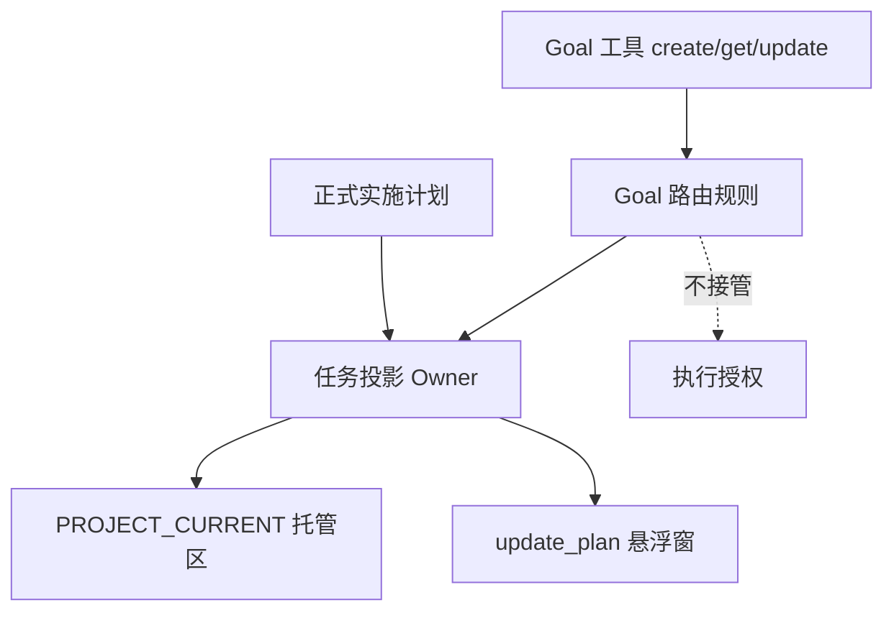

# Goal 模式任务悬浮窗进度可视化实施总览

结论：复用任务投影显示 Goal 进度；影响：用户可见当前与下一步；范围：规则、脚本、测试；非范围：产品 UI；变化：新增无原文三步投影；完成标准：自动和 Desktop 验收通过；术语说明：投影是悬浮窗运行时副本；验证状态：当前待周期一验证。

## 问题理解与范围

- 目标：让活动 Goal 在已有悬浮窗显示当前、已完成和下一步骤。
- 本轮范围：`task-plan-rehydration-rules`、`autonomous-execution-rules`、测试、字典及项目记忆。
- 非范围：Codex Desktop UI、数据库、多个并发 Goal 或 Plan Mode 的 UI 更新。
- 假设：同一主会话只有一个活动 Goal；可验证的工具成功才触发下一状态。

图形目的：说明职责边界；关联 ID：`REQ-GTP-001` 至 `REQ-GTP-005`。



图形目的：说明周期依赖；关联 ID：`CYCLE-GTP-01` 至 `CYCLE-GTP-03`。


图形目的：说明端到端状态；关联 ID：`AC-GTP-001` 至 `AC-GTP-004`。


| 文件/符号 | 变更 | 保护边界 |
|---|---|---|
| `task-plan-rehydration-rules/references/task-plan-projection-contract.md` | 定义 v3 Goal 投影与 v2 升级 | 禁止目标原文和敏感字段 |
| `task-plan-rehydration-rules/scripts/task_plan_projection.py` | 新增 Goal 创建/恢复/终态 CLI | 原子写入、旧投影兼容 |
| `task-plan-rehydration-rules/tests/test_task_plan_projection.py` | 新增正负、兼容与终态回归 | 临时目录、无网络 |
| `task-plan-rehydration-rules/SKILL.md` | Goal 触发、恢复、Plan Mode 和终态规则 | 不接管执行授权 |
| `autonomous-execution-rules/SKILL.md` | Goal 生命周期转交投影 Owner | 不把投影作为自动继续许可 |

## 周期、验证与停止

- 周期和任务以 `PLAN-GTP-001` 为唯一顺序；每项完成后运行 `python -B task-plan-rehydration-rules/tests/test_task_plan_projection.py`、对应 quick validate，再审查其 diff。
- CYCLE-GTP-03 额外运行字典刷新和 `git diff --check`；本机 Desktop 验收失败时，只报告本地契约通过的受限结论。
- 回滚：只回退本来源对象新增的规则、脚本和测试增量；不覆盖用户已有工作树改动。

## 当前计划最终方案简要说明

默认三步只作为活动 Goal 的无原文安全投影；正式最小任务出现后取代它。所有 UI 刷新均由投影 Owner 在默认执行回合、持久化成功之后完成。

## Agent 对当前问题的理解

Goal 模式需要进度可见性，但不应让 Goal 原文、执行授权或 Plan Mode 与任务悬浮窗混在一起。本实现复用单一 Owner 和现有 UI 工具。

## 实施周期总览

| 周期 | 输入 | 输出 | 完成条件 |
|---|---|---|---|
| `CYCLE-GTP-01` | 需求、验收 | v3 契约和脚本 | 单元测试通过 |
| `CYCLE-GTP-02` | 周期 01 | Goal 路由 | quick validate 通过 |
| `CYCLE-GTP-03` | 周期 02 | 验证和验收 | 自动与人工证据完整 |

## 阶段计划

| 阶段 | 动作 | 停止条件 |
|---|---|---|
| 契约 | 实现默认/恢复/终态 | v2 兼容失败或隐私泄漏 |
| 路由 | 接入 create/get/update Goal | Plan Mode 刷新 UI |
| 验证 | 自动测试和 Desktop 核验 | 任一断言失败 |

## 最小任务清单

| 任务 | 文件/符号 | 真实测试 | 完成条件 |
|---|---|---|---|
| `TASK-GTP-01/02` | contract、script、test | Python 临时目录回归 | goal/v2/负样本通过 |
| `TASK-GTP-03/04` | 两个 Skill | 路由断言与 quick validate | Owner 和授权边界正确 |
| `TASK-GTP-05` | 字典和证据 | 全量门禁、Desktop | 交付证据完整 |

## 现状与落点

```text
task-plan-rehydration-rules/
  references/task-plan-projection-contract.md
  scripts/task_plan_projection.py
  tests/test_task_plan_projection.py
  SKILL.md
autonomous-execution-rules/SKILL.md
```

## 真实测试安排

| 测试 ID | 命令/环境 | 样本 | 通过标准 |
|---|---|---|---|
| `TEST-GTP-001..006` | local Python | 临时 `PROJECT_CURRENT.md` | 全部断言成功、无网络 |
| `TEST-GTP-007` | 本机 Desktop | 创建/恢复/终态 Goal | UI 与 payload 一致 |

## 风险与阻断项

| 风险 | 处理 |
|---|---|
| Goal 工具不可用 | 不写成功结论、不推进 UI |
| Desktop 无法人工核验 | 自动测试可通过，但最终标记受限 |

## 任务完成、停止与最大推进边界

- 完成：每个任务实现、真实测试、审查和验收四类 `EVD-GTP-*` 证据齐全。
- 停止：隐私、兼容、原子写入、Plan Mode 边界任一破坏。
- 最大推进边界：不改 Codex Desktop 产品代码。

结论：复用任务投影显示 Goal 进度；影响：用户可见当前与下一步；范围：规则、脚本、测试；非范围：产品 UI；变化：新增无原文三步投影；完成标准：自动和 Desktop 验收通过；术语说明：投影是悬浮窗运行时副本；验证状态：当前待周期一验证。

本总览包含三张流程图、四类任务和真实测试；`unresolved_decisions` 为零，文件/符号落点已锁定。

## 当前计划最终方案简要说明
Goal 没有正式任务时使用安全三步；正式最小任务出现后替换它，UI 只在默认执行回合更新。

## Agent 对当前问题的理解
Goal 需要可见进度，但不得保存原文、改变执行授权或在 Plan Mode 刷新 UI。

## 实施周期总览
| 周期 | 输入 | 输出 | 完成条件 |
|---|---|---|---|
| `CYCLE-GTP-01` | 需求验收 | 契约脚本 | 单元测试 |
| `CYCLE-GTP-02` | 周期一 | Goal 路由 | quick validate |
| `CYCLE-GTP-03` | 周期二 | 验证验收 | Desktop 证据 |

## 阶段计划
| 阶段 | 动作 | 停止条件 |
|---|---|---|
| 契约 | 默认、恢复、终态 | 兼容或隐私失败 |
| 路由 | create/get/update Goal | Plan Mode 刷 UI |
| 验证 | 自动和人工核验 | 任一断言失败 |

## 最小任务清单
| 任务 | 文件/符号 | 真实测试 | 完成条件 |
|---|---|---|---|
| `TASK-GTP-01/02` | contract、script、test | Python 回归 | goal/v2/负样本通过 |
| `TASK-GTP-03/04` | 两个 Skill | 路由与 quick validate | 边界正确 |
| `TASK-GTP-05` | 字典和证据 | 全量与 Desktop | 证据完整 |

## 现状与落点
`task-plan-rehydration-rules` 的 contract、script、test、SKILL 与 `autonomous-execution-rules/SKILL.md`。

## 真实测试安排
| 测试 ID | 环境 | 样本 | 通过标准 |
|---|---|---|---|
| `TEST-GTP-001..006` | local Python | 临时文件 | 所有断言成功 |
| `TEST-GTP-007` | 本机 Desktop | 创建/恢复/终态 Goal | UI 与 payload 一致 |

## 风险与阻断项
| 风险 | 处理 |
|---|---|
| 工具不可用 | 不刷新 UI |
| 无人工证据 | 受限结论 |

## 任务完成、停止与最大推进边界
完成：`EVD-GTP-*` 四类证据齐全；停止：隐私、兼容、原子性或 Plan Mode 边界失败；最大推进边界：不改产品代码。

## 自审结论
`unresolved_decisions` 为零，文件/符号与真实测试均已锁定。

图片资产决策：N/A。原因：仅调用现有 UI；证据：无新增资源。
