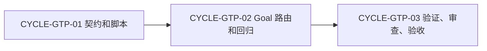

# Goal 模式任务悬浮窗进度可视化需求与实施计划全量顺序实施方案

结论：按契约、路由、验证三周期交付；影响：Goal 可显示进度；范围：规则、脚本、测试；非范围：产品 UI；变化：新增默认三步和恢复；完成标准：自动与人工验收通过；术语说明：安全三步是不含目标原文的默认任务；验证状态：当前执行周期一。

## Agent 对问题的理解

- 问题与目标：Goal 模式缺少用户可见的进度、上一步和下一步，需要复用现有悬浮窗而不是重写 UI。
- 本轮范围：Goal 默认三步、正式计划替换、恢复、终态、兼容和测试。
- 非范围：产品代码、多 Goal 并行 UI、保存目标原文、Plan Mode 刷新悬浮窗。
- 当前优先闭环：`CYCLE-GTP-01` 的 schema 与脚本，随后才允许路由接入。
- 关键假设：Goal 工具在成功创建、状态查询和终态更新时提供可验证结果；否则停在工具边界。

## 顺序、依赖与边界

图形目的：说明必须串行放行的实施顺序；关联 ID：`CYCLE-GTP-01` 至 `CYCLE-GTP-03`。

| 周期 | 目标 | 前置 | 完成条件 | 停止条件 | 最大推进边界 |
|---|---|---|---|---|---|
| `CYCLE-GTP-01` | 支持 Goal 专属投影和 v2 兼容 | 需求、验收已冻结 | 单元测试和契约审查通过 | 原文泄漏、v2 破坏、原子性失效 | 不改相邻路由 |
| `CYCLE-GTP-02` | 接入创建、恢复、终态规则 | 周期 01 通过 | 路由断言和 Skill 校验通过 | Plan Mode 刷 UI、无活动 Goal 误恢复 | 不执行真实 Desktop 重开 |
| `CYCLE-GTP-03` | 全链路验证与受限/正式验收 | 周期 02 通过 | 自动测试、字典、审查和 Desktop 证据 | 任一自动或人工断言失败 | 不提交 Git、不改产品代码 |

## 最小任务与真实测试

| 任务 | 周期 | 实现 | 真实测试 | 审查与验收 |
|---|---|---|---|---|
| `TASK-GTP-01` | 01 | v3 Goal 投影 contract 与迁移 | Goal 默认/负样本/v2 读写单元测试 | 无原文、原文件保护 |
| `TASK-GTP-02` | 01 | `goal` CLI、payload 与终态状态迁移 | 临时文件写读、哈希与 payload 断言 | 原子写入和状态唯一性 |
| `TASK-GTP-03` | 02 | `task-plan-rehydration-rules` Goal 触发和停止边界 | 文档路由契约断言与 quick validate | Owner 不竞争 |
| `TASK-GTP-04` | 02 | `autonomous-execution-rules` Goal 生命周期接入 | create/get/update Goal 的规则断言 | 不恢复执行权 |
| `TASK-GTP-05` | 03 | 字典、四件套、测试/审查/验收记录 | 全量指定测试和本机 Desktop | 交付证据完整 |

## 追踪

`SRC-GTP-001 -> REQ-GTP-001..005 -> AC-GTP-001..005 -> CYCLE-GTP-01..03 -> TASK-GTP-01..05 -> TEST-GTP-001..006`。每个任务只在自身实现、真实测试、审查和验收均通过后推进下一任务。

## 全量执行顺序

| 顺序 | 输入 | 输出 | 进入条件 | 收口条件 |
|---|---|---|---|---|
| 1 | 需求与验收 | `CYCLE-GTP-01` | 文档 profile 通过 | 契约、脚本、单元测试通过 |
| 2 | 周期 01 | `CYCLE-GTP-02` | v3 兼容已验证 | 路由和 Skill 校验通过 |
| 3 | 周期 02 | `CYCLE-GTP-03` | 路由已冻结 | 全链路证据和 Desktop 验收完成 |

## 文档信息

| 项目 | 内容 |
|---|---|
| 来源对象 | `REQDOC-GTP-001`、`ACDOC-GTP-001` |
| 当前执行入口 | `CYCLE-GTP-01` |
| 阻断 | Obsidian 未注册不阻断本地实现；Desktop 人工验收未完成时仅受限放行 |

结论：按契约、路由、验证三周期交付；影响：Goal 可显示进度；范围：规则、脚本、测试；非范围：产品 UI；变化：新增默认三步和恢复；完成标准：自动与人工验收通过；术语说明：安全三步是不含目标原文的默认任务；验证状态：当前执行周期一。

- 全量顺序固定为契约脚本、路由恢复、验证验收；任何周期失败不得跳过。
- 任务与验收均有唯一来源和停止边界，未留下待决决策。

## 当前计划最终方案简要说明
在既有任务投影 Owner 中新增 Goal 专属默认三步，并由创建、恢复和终态路由调用。

## 来源对象清单
| 来源 | 文档 |
|---|---|
| 用户目标 | `SRC-GTP-001` |
| 需求 | `REQDOC-GTP-001` |
| 验收 | `ACDOC-GTP-001` |

## 当前执行入口
从 `CYCLE-GTP-01` 的投影契约与脚本开始。

## 依赖与阻断
依赖本机 Goal 工具与现有 `update_plan`；Desktop 人工验收缺失时只允许受限结论。

## 全量执行顺序
| 顺序 | 输入 | 输出 | 完成条件 |
|---|---|---|---|
| 1 | 需求与验收 | `CYCLE-GTP-01` | 脚本测试通过 |
| 2 | 周期 01 | `CYCLE-GTP-02` | 路由校验通过 |
| 3 | 周期 02 | `CYCLE-GTP-03` | 自动与人工验收通过 |

## 自审结论
全量顺序、依赖和阻断已冻结；任何周期失败不得跳过。

图片资产决策：N/A。原因：复用已有 UI；证据：无资源文件改动。
