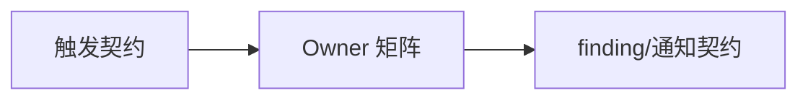
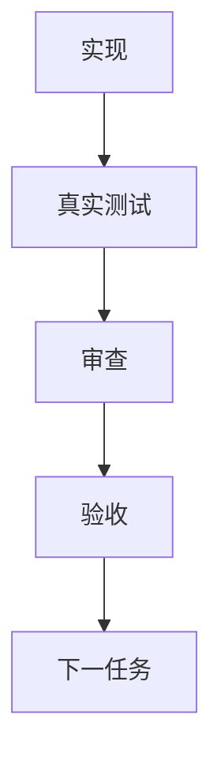

# 持续代码质量监督 Skill 实施周期 01：矩阵与契约

结论：本周期冻结监督 Skill 的触发条件、完整 Owner 路由、排除边界、finding 字段和状态接口；影响：后续实现只按已冻结契约落盘；范围：规则文档与 Skill 入口；非范围：状态脚本和字典；变化：把口头引用矩阵落为可读取的文件契约；完成标准：三项最小任务逐项完成实现、真实测试、审查和验收；术语说明：finding 是带 Owner 和证据的静态质量问题记录；验证状态：待实现。

## 当前周期目标、边界与进入条件

- 目标：让普通模型可以按矩阵执行静态代码质量监督，不复制 Owner 正文。
- 进入条件：需求文档和验收标准已冻结。
- 本周期范围：`SKILL.md`、`agents/openai.yaml`、`references/` 三份文件。
- 范围外：定时调度、代码修改、测试执行、Git 和真实 Desktop。

变化：把口头引用矩阵落为可读取的文件契约；完成标准：三项最小任务逐项完成实现、真实测试、审查和验收；图片资产决策：N/A。原因：本周期不新增视觉资产；证据：矩阵表和契约字段可直接验证规则边界。

## 当前代码/文档基线

当前仓库已存在编码基线和代码位点 Skill，且 `编码skill.md` 规定同一改动可命中多个 Owner；本周期只新增引用矩阵，不改既有 Owner。

图形目的：表示本周期从触发契约到 finding 契约的依赖；关联 ID：`TASK-CCQS-01A` 至 `TASK-CCQS-01C`。

## 文件与符号操作契约

本周期文件/符号落点只允许在下表范围内新增。

| 文件 | 操作 | 约束 |
|---|---|---|
| `continuous-code-quality-supervisor-rules/SKILL.md` | 新建 | 只写职责、触发、执行顺序和边界 |
| `.../references/owner-routing-matrix.md` | 新建 | 完整允许和排除列表，不复制正文 |
| `.../references/lifecycle-and-trigger-contract.md` | 新建 | 双条件、周期扫描和状态边界 |
| `.../references/finding-notification-contract.md` | 新建 | finding/通知字段和去重规则 |

## 周期内最小任务执行顺序

| 顺序 | 任务 | 依赖 | 收口 |
|---|---|---|---|
| 1 | `TASK-CCQS-01A` 写触发与生命周期 | 需求 | 矩阵输入输出明确 |
| 2 | `TASK-CCQS-01B` 写 Owner 允许/排除矩阵 | 01A | 全部 Owner 可追踪 |
| 3 | `TASK-CCQS-01C` 写 finding/通知契约 | 01B | 字段、去重和 limited 明确 |

## 最小任务闭环

- `TASK-CCQS-01A`：实现文档 -> 运行 Markdown/链接校验 -> 只读审查触发边界 -> 验收双条件。
- `TASK-CCQS-01B`：实现矩阵 -> 运行 Owner 名称覆盖检查 -> 审查排除列表 -> 验收 API/数据库/语言专项样例。
- `TASK-CCQS-01C`：实现通知契约 -> 运行字段完整性检查 -> 审查敏感字段 -> 验收 limited 和去重字段。

## 当前周期验证矩阵

| 测试 | 入口 | 断言 | 失败预期 |
|---|---|---|---|
| `TEST-CCQS-01A` | 文档 profile | 双条件、非目标和停止条件存在 | 缺失章节即失败 |
| `TEST-CCQS-01B` | 文本矩阵检查 | 允许/排除名称和条件均存在 | 任一遗漏即失败 |
| `TEST-CCQS-01C` | finding 契约检查 | Owner、证据、位置、级别、指纹字段齐全 | 敏感字段或自由规范即失败 |

## 回滚与停止条件

- 回滚：只移除本周期新增的四个 Skill 文档文件，不触碰其他会话改动。
- 停止：Owner 名称与仓库不一致、排除列表出现允许项、文档 profile 失败或规则正文被复制。
- 最大推进边界：本周期不实现 Python 状态脚本。

## 周期追踪矩阵

| 任务 | 实现 | 测试 | 审查 | 验收 |
|---|---|---|---|---|
| `TASK-CCQS-01A` | `EVD-CCQS-01A-I` | `EVD-CCQS-01A-T` | `EVD-CCQS-01A-R` | `EVD-CCQS-01A-A` |
| `TASK-CCQS-01B` | `EVD-CCQS-01B-I` | `EVD-CCQS-01B-T` | `EVD-CCQS-01B-R` | `EVD-CCQS-01B-A` |
| `TASK-CCQS-01C` | `EVD-CCQS-01C-I` | `EVD-CCQS-01C-T` | `EVD-CCQS-01C-R` | `EVD-CCQS-01C-A` |

图形目的：表示本周期逐任务闭环后才允许进入下一项；关联 ID：`TEST-CCQS-01A` 至 `TEST-CCQS-01C`。

## 自审结论

当前结论：待实现后复核。`N/A`：本周期不运行测试程序，原因是只冻结契约；证据：下一周期提供 local Python 单元测试。
