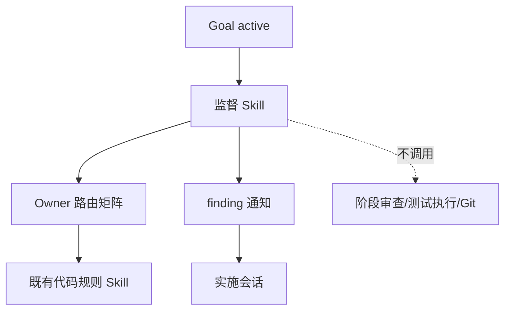
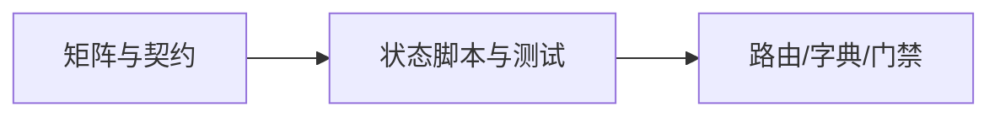
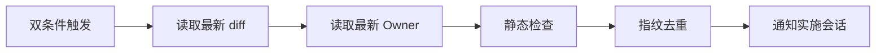

# 持续代码质量监督 Skill 实施总览

结论：新增规则编排 Skill、完整 Owner 矩阵、通知契约和标准库状态脚本；影响：Goal 监督会话可独立运行并向实施会话报告问题；范围：Skill 资产、状态、测试、文档和字典；非范围：宿主 UI、业务代码、测试执行和 Git；变化：从口头引用矩阵落为可验证资产；完成标准：三个周期逐项闭环；术语说明：Owner 是实际规则 Skill，监督 Skill 只编排和记录；验证状态：实施中。

## 当前计划最终方案简要说明

监督 Skill 只保存 Owner 链接、触发信号、优先级和调用顺序，实际规则始终从最新 Owner 文件读取。状态脚本只管理本地脱敏元数据和 finding 去重，主会话负责每 30 秒左右重新调用扫描并通知实施会话。

## Agent 对当前问题的理解

- 问题：Goal 模式缺少长期的代码质量观察器，且既有规则分散，容易漏引用或错误调用阶段 Skill。
- 本轮范围：新增 Skill 目录、文档、状态脚本、测试和字典。
- 非范围：自动修改代码、执行测试、生成 Swagger 产物、修改 Goal 产品 UI、提交 Git。
- 当前优先闭环：先冻结矩阵和 finding 字段，再实现状态生命周期，最后验证负向边界。
- 关键假设：监督会话由 Goal 宿主按周期唤醒；本脚本不伪造定时器、Goal 状态或通知成功。

## 文档信息

图片资产决策：N/A。原因：本轮只新增规则、脚本和测试，不新增视觉资产；证据：边界图、依赖图和端到端图足以表达执行链路。

## 边界图

图形目的：说明监督 Skill 与既有 Owner、实施会话和阶段流程的边界；关联 ID：`REQ-CCQS-001`、`REQ-CCQS-002`。



## 周期依赖图

图形目的：说明垂直切片的进入和收口顺序；关联 ID：`CYCLE-CCQS-01` 至 `CYCLE-CCQS-03`。



## 端到端图

图形目的：说明一次扫描如何从触发走到 finding 和通知；关联 ID：`TEST-CCQS-001` 至 `TEST-CCQS-005`。



## 实施周期总览

| 周期 | 输入 | 输出 | 收口条件 |
|---|---|---|---|
| `CYCLE-CCQS-01` | 需求与矩阵 | Skill 主文件和三份 references | 允许/排除/条件完整 |
| `CYCLE-CCQS-02` | 路由契约 | 状态脚本和单元测试 | 生命周期、敏感字段、去重通过 |
| `CYCLE-CCQS-03` | 全部资产 | 字典和门禁证据 | quick validate、文档、审查和验收通过 |

## 阶段计划

| 阶段 | 动作 | 真实测试 | 停止条件 |
|---|---|---|---|
| 契约 | 写矩阵、生命周期、通知字段 | 文档 profile | Owner 列表不完整 |
| 状态 | 实现 CLI 和原子状态写入 | Python 单元测试 | 敏感字段或状态损坏 |
| 收口 | 刷新字典并跑全部门禁 | quick validate、测试、diff 检查 | 任一负向断言失败 |

## 最小任务清单

| 任务 | 文件/符号 | 真实测试 | 完成条件 |
|---|---|---|---|
| `TASK-CCQS-01` | `SKILL.md`、`agents/openai.yaml`、三个 references | 文档审计和文本矩阵断言 | 完整允许/排除/条件路由 |
| `TASK-CCQS-02` | `scripts/supervisor_state.py` | 状态 CLI 临时目录测试 | start/register/scan/status/stop 通过 |
| `TASK-CCQS-03` | `tests/test_supervisor_state.py` | `python -B` 单元测试 | 正负和去重场景全通过 |
| `TASK-CCQS-04` | 字典和门禁证据 | quick validate、文档校验 | 结果可回读且不误改其他文件 |

## 现状与落点

```text
continuous-code-quality-supervisor-rules/
  SKILL.md
  agents/openai.yaml
  references/lifecycle-and-trigger-contract.md
  references/owner-routing-matrix.md
  references/finding-notification-contract.md
  scripts/supervisor_state.py
  tests/test_supervisor_state.py
```

## 真实测试安排

| 测试 ID | 命令/环境 | 样本 | 通过标准 |
|---|---|---|---|
| `TEST-CCQS-001` | local Python | Goal 双条件 | 触发条件准确 |
| `TEST-CCQS-002` | local Python | 基础/API/数据/语言文件名 | Owner 路由准确 |
| `TEST-CCQS-003` | local Python | 排除 Skill 名称 | 排除项零命中 |
| `TEST-CCQS-004` | local Python | 重复 finding 和缺失 Owner | 去重和 limited 正确 |
| `TEST-CCQS-005` | local Python | 敏感字段、损坏状态、stop | 安全边界不被绕过 |

## 风险与阻断项

| 风险 | 处理 |
|---|---|
| 规则 Skill 更新 | 每次扫描重新读取文件，不缓存正文 |
| 状态目录不可写 | 返回失败，不伪造 active 或通知成功 |
| Owner 冲突 | 按矩阵优先级排序，无法裁决则 limited |
| Goal 状态不明 | 监督任务不启动 |

## 任务完成、停止与最大推进边界

- 完成：每个最小任务完成实现、真实测试、审查、验收后才进入下一任务；全部 ID 证据齐全。
- 停止：任一 P0 需求未覆盖、排除项误触发、敏感字段进入状态、文档校验失败或测试失败。
- 最大推进边界：本轮只新增上述 Skill 目录和必要文档/字典结果，禁止提交 Git。

## 自审结论

当前结论：待实现后复核。`N/A`：真实 Goal 宿主和 Desktop UI 不在本仓库能力范围内，使用 local 状态与路由契约替代验证。
