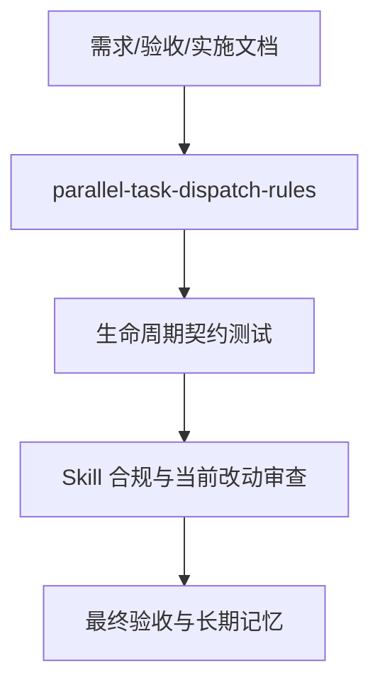

# 子 Agent 遗留实例终局清理实施周期 01：生命周期规则与验证

结论：本周期按四个最小任务串行完成子 Agent 终局清理闭环；影响：每个任务都必须先实现、真实测试、审查和验收后才能进入下一个；范围：已冻结的文档、Skill 资产、契约测试、交付证据和记忆；非范围：Desktop 产品代码、其他会话、Git 历史和活动任务投影；变化：建立进入前预检、批次回收、终局扫描和复查对账；完成标准：本周期验证矩阵全部通过，未关闭实例已如实告警；术语说明：周期闭环是每个最小任务独立完成四类证据；验证状态：当前执行第一个最小任务。

## 当前周期目标、边界与进入条件

- 周期目标：实施 REQ-SAC-001..007 和 AC-SAC-001..006。
- 进入条件：需求、验收标准和实施总览没有未解 P0/P1。
- 周期边界：只修改本来源对象列出的规则、测试、文档、字典和记忆资产。
- 收口条件：四个最小任务按顺序获得实现、真实测试、审查和验收证据。

## 当前代码/文档基线

| 项目 | 基线 |
| --- | --- |
| Git 基线 | ca50d02 |
| 规则基线 | 现有 Skill 只要求已知实例完成后即时关闭，缺少双扫描与关闭后复查 |
| 平台基线 | 可枚举和中断 Agent，未暴露真实关闭工具 |
| 工作树保护 | 存在大量用户改动；只处理冻结目标文件 |
| 图片资产决策 | N/A。原因：本周期不产生视觉资产；证据：状态契约由 Mermaid 表达。 |

## 周期内最小任务执行顺序

图形目的：说明任务顺序和每任务四类证据门禁；关联 ID：TASK-SAC-01..04。

## 领域匹配图

图形目的：说明文档、生命周期规则、测试与交付门禁的 Owner 分工；关联 ID：CYCLE-SAC-01。

## 最小任务闭环

| 任务 | 实现 | 真实测试 | 审查 | 验收 |
| --- | --- | --- | --- | --- |
| TASK-SAC-01 | 创建四份来源对象文档 | 四类 profile 与 Mermaid 解析 | 字段、链接、ID 和白话摘要自审 | 需求、验收和实施链可双向定位 |
| TASK-SAC-02 | 更新主 Skill、lifecycle reference、提示词与契约测试 | TEST-SAC-001..004 | 双扫描、作用域和真实关闭判定 | AC-SAC-001..004 通过 |
| TASK-SAC-03 | 更新 blockers、schema、模板与混合终态测试 | TEST-SAC-005..007 | 下一批门禁、幂等和告警 | AC-SAC-005/006 通过 |
| TASK-SAC-04 | 刷新字典、记忆、审查与验收 | TEST-SAC-008、字典、UTF-8、diff check | 合规门禁和当前改动总审查 | 最终验收明确平台残余限制 |

## 文件/符号操作契约

| 任务 | 文件/符号 | 操作 | 保护边界 |
| --- | --- | --- | --- |
| TASK-SAC-01 | 冻结时间戳的需求、验收、总览、周期文档 | 新增 | 不修改其他来源文档 |
| TASK-SAC-02 | parallel-task-dispatch-rules/SKILL.md、references/subagent-lifecycle-and-reconciliation.md、agents/openai.yaml、tests/test_subagent_lifecycle_contract.py | 修改/新增 | 不新增竞争 Skill |
| TASK-SAC-03 | references/blockers-and-fallbacks.md、references/launch-plan-schema.md、references/subagent-task-templates.md、契约测试和测试 README | 修改/新增 | 兼容旧字段和现有启动计划 |
| TASK-SAC-04 | skill-dictionary/data.js、字典.md、PROJECT_MEMORY.md、审查和最终验收 | 生成/增量更新/新增 | 不修改 PROJECT_CURRENT.md |

## 当前周期验证矩阵

| 测试 ID | 命令/入口 | 样本 | 断言 | 失败预期 |
| --- | --- | --- | --- | --- |
| TEST-SAC-001 | 生命周期 unittest | 仍需与不再需要实例 | 保留集和回收集正确 | 根 Agent 或仍需实例被关闭时失败 |
| TEST-SAC-002 | 生命周期 unittest | running 与 terminal | 停止、关闭、复查顺序正确 | 跳步或反序时失败 |
| TEST-SAC-003 | 生命周期 unittest | interrupt 成功 | 关闭数不增加 | 中断被计作关闭时失败 |
| TEST-SAC-004 | 生命周期 unittest | close 成功/失败加复查 | 只计双重成功实例 | 工具失败或复查活跃被计入时失败 |
| TEST-SAC-005 | 生命周期 unittest | 未关闭数大于零 | 下一批被禁止 | 仍允许启动时失败 |
| TEST-SAC-006 | 生命周期 unittest | 重复扫描 | 台账和数量幂等 | 二次计数时失败 |
| TEST-SAC-007 | 生命周期 unittest | 无关闭工具 | 关闭数为 0、告警非空 | 伪报关闭或告警缺失时失败 |
| TEST-SAC-008 | 当前会话真实扫描 | 真实 Agent 列表 | 实例、数量与告警一致 | 无法限定当前会话时停止 |

## 真实测试与断言

- 主入口：python -X utf8 parallel-task-dispatch-rules/tests/test_subagent_lifecycle_contract.py。
- 回归入口：python -X utf8 validate_control_plane_streamlining.py --phase trigger；执行前先确认脚本真实路径。
- 依赖环境：local Python 3，只使用标准库，无网络、数据库或外部服务。
- 样本来源：测试内存 fixture 和当前会话真实 Agent 列表。
- 清理：测试不创建子 Agent；临时文件由 TemporaryDirectory 自动删除。
- 通过标准：所有断言通过，现有总控无回归，真实扫描不伪报关闭。

## 周期阻断、停止与回滚

- 停止条件：任一文档 profile、契约测试、总控回归、Skill 合规或当前改动审查失败。
- 阻断条件：必须修改 Desktop 产品代码、无法将 Agent 列表限定到当前会话，或目标文件冲突无法安全合并。
- 回滚：仅撤销 REQ-SUBAGENT-CLEANUP-20260725-001 相关新增与增量修改，不覆盖用户改动。
- 最大推进边界：本周期及其最终验收；不执行 Git 提交或推送。

## 周期追踪矩阵

| 周期 | 任务 | 验收 | 测试 | 文件/符号 | 证据 |
| --- | --- | --- | --- | --- | --- |
| CYCLE-SAC-01 | TASK-SAC-01 | 文档门禁 | 四类 profile | 四份来源文档 | EVD-SAC-001 |
| CYCLE-SAC-01 | TASK-SAC-02 | AC-SAC-001..004 | TEST-SAC-001..004 | SKILL.md、lifecycle reference、prompt、test | EVD-SAC-002 |
| CYCLE-SAC-01 | TASK-SAC-03 | AC-SAC-005/006 | TEST-SAC-005..007 | blockers、schema、templates、test、README | EVD-SAC-003 |
| CYCLE-SAC-01 | TASK-SAC-04 | 交付与最终验收 | TEST-SAC-008 与收口门禁 | 字典、记忆、审查、验收 | EVD-SAC-004 |

## 任务证据台账

| 任务 | 实现证据 | 测试证据 | 审查证据 | 验收证据 |
| --- | --- | --- | --- | --- |
| TASK-SAC-01 | EVD-TASK-SAC-01-IMPL-01 | EVD-TASK-SAC-01-TEST-01 | EVD-TASK-SAC-01-REVIEW-01 | EVD-TASK-SAC-01-ACCEPT-01 |
| TASK-SAC-02 | EVD-TASK-SAC-02-IMPL-01 | EVD-TASK-SAC-02-TEST-01 | EVD-TASK-SAC-02-REVIEW-01 | EVD-TASK-SAC-02-ACCEPT-01 |
| TASK-SAC-03 | EVD-TASK-SAC-03-IMPL-01 | EVD-TASK-SAC-03-TEST-01 | EVD-TASK-SAC-03-REVIEW-01 | EVD-TASK-SAC-03-ACCEPT-01 |
| TASK-SAC-04 | EVD-TASK-SAC-04-IMPL-01 | EVD-TASK-SAC-04-TEST-01 | EVD-TASK-SAC-04-REVIEW-01 | EVD-TASK-SAC-04-ACCEPT-01 |

## 自审结论

unresolved_decisions 为零；停止条件、回滚、文件/符号、真实测试、失败预期和最大推进边界已冻结。

图片资产决策：N/A。原因：本周期不新增图片；证据：实施关系由两张 Mermaid 图表达。
