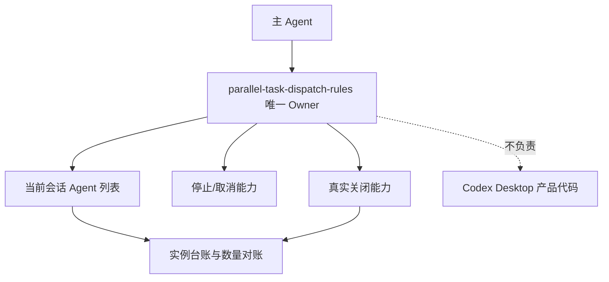
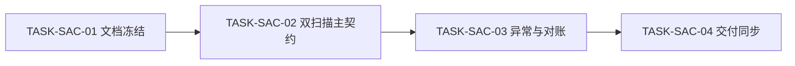
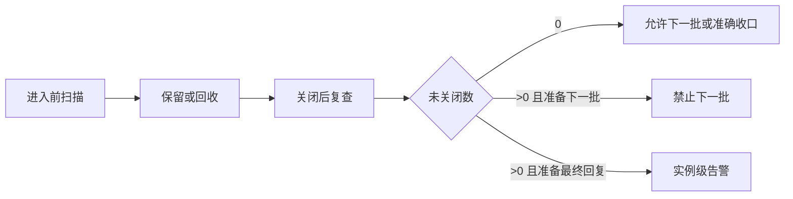

# 子 Agent 遗留实例终局清理实施总览

结论：在现有并行调度 Skill 内完成三段生命周期，不新增竞争 Owner；影响：主 Agent 能在调度前、批次间和最终收口前识别遗留实例；范围：规则、参考契约、提示词、测试、字典、工程文档和项目记忆；非范围：Desktop 产品代码、其他会话、Git 提交和活动任务投影；变化：增加双扫描、回收门禁、真实关闭复查和实例级对账；完成标准：四个最小任务依次通过实现、真实测试、审查和验收；术语说明：回收门禁是未关闭实例存在时禁止启动下一批；验证状态：当前进入周期 01；图片资产决策：N/A。原因：本实施只调整规则、文档和测试；证据：职责、依赖与端到端关系均由三张 Mermaid 图完整表达。

## 当前计划最终方案简要说明

由 parallel-task-dispatch-rules 继续作为唯一 Owner，将进入前预检、批次回收和最终扫描收口到一份生命周期契约。平台无真实关闭能力时记录准确告警，不伪造关闭成功。

## Agent 对当前问题的理解

- 问题/目标：子 Agent 可能已终态但仍留在当前会话，现有规则缺少双扫描与关闭后复查。
- 本轮范围：实施 REQ-SAC-001..007，完成文档、规则、测试、审查和验收。
- 非范围：修改 Desktop、强行关闭其他会话、新增固定超时或修改 PROJECT_CURRENT.md。
- 当前优先闭环：先完成来源文档门禁，再修改规则与契约测试。
- 关键假设/待确认点：unresolved_decisions 为零；当前平台无真实关闭工具已冻结为受限能力基线。

## 责任边界图

图形目的：说明唯一 Owner 与平台工具、子 Agent 实例的责任边界；关联 ID：DEC-SAC-001、RULE-SAC-001。



## 实施周期总览

图形目的：说明四个最小任务必须串行闭环；关联 ID：CYCLE-SAC-01、TASK-SAC-01..04。



| 周期 | 期次定位 | 周期目标 | 进入条件 | 收口条件 |
| --- | --- | --- | --- | --- |
| CYCLE-SAC-01 | 第一期，也是本需求唯一实施周期 | 完成生命周期规则、测试、审查与验收 | 需求与验收标准已冻结 | 四个任务按顺序获得四类证据 |

## 端到端图

图形目的：说明从进入预检到最终告警的端到端状态；关联 ID：REQ-SAC-001..007、AC-SAC-001..006。



## 阶段计划

| 阶段 | 动作 | 产出 | 停止条件 |
| --- | --- | --- | --- |
| 文档冻结 | 创建需求、验收、总览、周期 | 四份通过 profile 的文档 | 任一 profile 失败 |
| 主契约 | 更新 Skill、生命周期 reference、提示词和契约测试 | 双扫描与真实关闭口径 | 正反契约失败 |
| 异常对账 | 更新 blockers、schema、模板和混合终态测试 | 可重算台账与告警 | 数量恒等式失败 |
| 交付同步 | 刷新字典、记忆、审查和验收 | 完整交付证据 | Skill 合规或总审查失败 |

## 最小任务清单

| 任务 | 文件/符号 | 真实测试 | 完成条件 |
| --- | --- | --- | --- |
| TASK-SAC-01 | 需求、验收、总览、周期文档 | 四类工程文档 profile | 四份文档全部通过 |
| TASK-SAC-02 | SKILL.md、生命周期 reference、openai.yaml、契约测试 | Python unittest | 双扫描和真实关闭判定有正负断言 |
| TASK-SAC-03 | blockers、schema、模板、扩展测试、测试证据 | unittest 与现有总控回归 | 混合终态、无关闭能力和幂等对账通过 |
| TASK-SAC-04 | 字典、PROJECT_MEMORY.md、审查、最终验收及证据 | 字典、UTF-8、git diff --check | Skill 合规 PASS，当前改动无 P0/P1 |

## 现状与落点

```text
parallel-task-dispatch-rules/
  SKILL.md
  agents/openai.yaml
  references/subagent-lifecycle-and-reconciliation.md
  references/blockers-and-fallbacks.md
  references/launch-plan-schema.md
  references/subagent-task-templates.md
  tests/test_subagent_lifecycle_contract.py
doc/2-需求/2026-07-25_142508_子Agent遗留实例终局清理.md
doc/3-实施/2026-07-25_142508_子Agent遗留实例终局清理_实施总览.md
doc/3-实施/2026-07-25_142508_子Agent遗留实例终局清理_实施周期01_生命周期规则与验证.md
doc/5-tests/2026-07-25_142508/子Agent遗留实例清理/README.md
doc/6-审查/2026-07-25_142508_子Agent遗留实例终局清理_当前改动审查.md
doc/7-验收/2026-07-25_142508_子Agent遗留实例终局清理_验收标准.md
doc/7-验收/2026-07-25_142508_子Agent遗留实例终局清理_最终验收.md
```

## 真实测试安排

| 测试 ID | 命令/环境 | 样本/数据来源 | 通过标准 |
| --- | --- | --- | --- |
| TEST-SAC-001..006 | python -X utf8 parallel-task-dispatch-rules/tests/test_subagent_lifecycle_contract.py / local Python | 标准库构造的实例台账与平台能力集合 | 保留、关闭、中断非关闭、告警、批次门禁和幂等断言通过 |
| TEST-SAC-007 | python -X utf8 validate_control_plane_streamlining.py --phase trigger / local Python | 现有总控 fixture | 触发契约无回归 |
| TEST-SAC-008 | 当前会话 Agent 列表 | 平台真实枚举结果 | 无关闭工具时关闭数为 0、未关闭数非零且告警具体 |

## 风险与阻断项

| 风险/阻断 | 处理 | 是否阻断主体完成 |
| --- | --- | --- |
| 平台无真实关闭工具 | 准确记录未关闭数和告警 | 否，但禁止声称全部已关闭 |
| 工具无法限定当前会话 | 停止清理与实施 | 是 |
| 目标文件存在无法合并的用户改动 | 保留用户内容并停止 | 是 |

## 任务完成、停止与最大推进边界

- 完成条件：双扫描规则、异常回收、数量口径、测试、审查、验收、字典和记忆全部完成；未关闭实例已准确告警。
- 停止条件：必须修改 Desktop 产品代码、列表无法限定当前会话、文件冲突无法安全合并或必需门禁失败。
- 最大推进边界：最多完成 CYCLE-SAC-01 及验收；不提交 Git，不推送，不关闭其他会话或根 Agent。
- 回滚：仅撤销本来源对象新增或修改的目标增量，不触碰用户既有改动和活动任务投影。

## 追踪矩阵

| 来源 | 决策 | 需求/验收 | 周期/任务 | 文件/符号 | 测试/证据 |
| --- | --- | --- | --- | --- | --- |
| SRC-SAC-001 | DEC-SAC-001/002 | REQ-SAC-001/002、AC-SAC-001/002 | CYCLE-SAC-01、TASK-SAC-01/02 | 文档、SKILL.md、lifecycle reference | TEST-SAC-001/002、EVD-SAC-001 |
| SRC-SAC-002 | DEC-SAC-003 | REQ-SAC-003/004、AC-SAC-003/004 | TASK-SAC-02/03 | openai.yaml、blockers、schema、templates、test | TEST-SAC-003..006、EVD-SAC-002 |
| SRC-SAC-003 | DEC-SAC-003 | REQ-SAC-005..007、AC-SAC-005/006 | TASK-SAC-03/04 | 字典、记忆、审查、验收 | TEST-SAC-007/008、EVD-SAC-003 |

## 自审结论

unresolved_decisions 为零；来源、决策、需求、验收、周期、任务、文件/符号、真实测试和证据已双向追踪；图片资产决策为 N/A，原因和证据完整。
