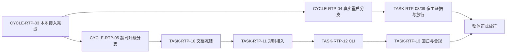
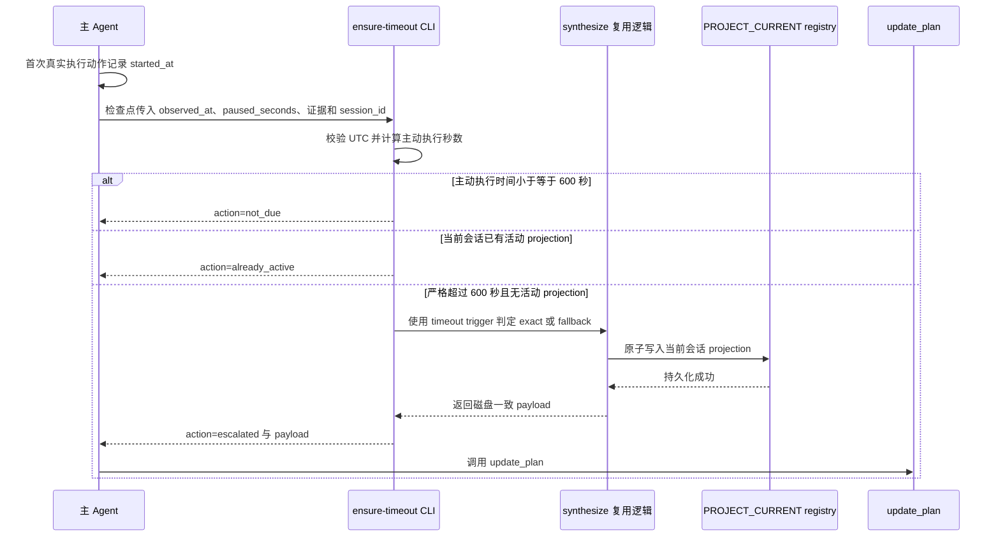

# Codex Desktop 任务悬浮窗断点恢复实施周期 05

结论：为无活动悬浮窗且执行超时的任务增加一次安全、可验证的自动升级；影响：开始时被判定为简单但实际执行超过十分钟的 Codex Desktop 任务；范围：需求与验收追踪、任务投影规则、相邻执行路由、`ensure-timeout` CLI、测试、字典和项目状态；非范围：后台定时器、Desktop 产品代码、投影 schema 迁移、计时持久化和 Git 历史写入；变化：主动执行时间严格超过 600 秒后，当前会话按精确优先、固定三步兜底的顺序补建悬浮任务列表；完成标准：四个最小任务逐个完成实现、真实测试、审查和验收，且既有 46 项回归与新增超时测试全部通过；术语说明：检查点是 Agent 能再次运行规则的工具返回、阶段进度或回合结束前时刻，不是后台定时唤醒；验证状态：四个最小任务、57 项回归、两份审查、最终验收和严格工程文档门禁均已通过。

## 当前代码/文档基线

| 项目 | 已核实基线 |
|---|---|
| Git 基线 | `ca50d02`；本周期只在当前未提交工作树上做增量修改，不覆盖其它任务改动 |
| 投影格式 | v4 多会话 registry 已存在；v1-v3 只读兼容已由既有测试覆盖 |
| 补建能力 | `synthesize_projection` 已提供唯一来源 `exact` 与固定三步 `fallback` |
| 原子写入 | `_write_text_atomic`、`upsert_projection` 已负责严格 UTF-8、大小门禁、文件锁和原子替换 |
| CLI 基线 | `main` 已有 `validate/write/payload/synthesize/deactivate/migrate/goal` 子命令；本周期只新增 `ensure-timeout` |
| 测试基线 | `task-plan-rehydration-rules/tests/test_task_plan_projection.py` 现有 46 项测试必须全部保留并通过 |
| 前序状态 | `CYCLE-RTP-01..03` 的本地投影能力已完成；`CYCLE-RTP-04/TASK-RTP-08/09` 仍在等待真实 Desktop 重启和最终放行 |
| 图片资产决策 | N/A。原因：本周期交付物是规则、CLI 和测试行为；证据：流程、依赖与交互可由 Mermaid 和测试矩阵完整表达。 |

图片资产决策：N/A。原因：没有 UI 原型、截图对比或视觉资产交付；证据：`REQ-RTP-006/007` 只改变规则和脚本行为，Mermaid 与 local 测试已覆盖可视关系。

## 当前周期目标、边界与进入条件

- 周期 ID / 期次定位：`CYCLE-RTP-05` / 第五期，`CHG-RTP-001` 的独立本地实施分支。
- 当前周期只做这一件事：让当前会话在没有活动 projection 且主动执行时间严格超过 600 秒时安全创建悬浮任务列表。
- 对应需求与规则：`REQ-RTP-006/007`、`RULE-RTP-007..010`。
- 对应验收：`AC-RTP-006..009`。
- 对应实施总览：[PLAN-RTP-001](./2026-07-23_012302_CodexDesktop任务悬浮窗断点恢复_实施总览.md)。
- 本周期不做：不修改 Desktop 产品，不增加后台唤醒，不修改 registry/projection schema，不持久化计时，不处理 Git 提交或推送。
- 关键假设 / 待确认点：`unresolved_decisions` 为零；时间起点、暂停扣除、严格阈值、exact/fallback 和失败保护已由需求与验收文档冻结。
- 与第四周期关系：第五周期可以依赖已完成的第一至第三周期本地能力独立实施，但不能把第四周期的任务八、九标成完成；整体正式放行必须等待第四、第五周期同时收口。

## 进入条件与收口条件

| 类型 | 条件 | 证据/入口 | 状态 |
|---|---|---|---|
| 进入 | `CHG-RTP-001` 已获当前用户实施授权，`REQ-RTP-006/007` 和 `AC-RTP-006..009` 无 P0/P1 未决 | 本周期 `source_ids`、需求变更记录和验收明细 | 已满足 |
| 进入 | v4 registry、`synthesize_projection`、原子写入与 46 项回归基线可读取 | `task_plan_projection.py`、`test_task_plan_projection.py` | 已满足 |
| 收口 | `TASK-RTP-10..13` 按顺序逐个完成实现、真实测试、审查、验收 | 最小任务闭环与验证矩阵 | 已满足 |
| 收口 | `TEST-RTP-009..012`、工程文档 profile、Mermaid 解析、quick validate、字典生成和 `git diff --check` 全部通过 | 执行附录中的精确命令 | 已满足 |
| 整体放行 | 本周期收口且 `CYCLE-RTP-04/TASK-RTP-08/09` 取得真实 Desktop 证据 | 实施总览的双分支汇合门禁 | 未满足，不阻断本周期本地实施 |

图形目的：说明第五周期只依赖已完成的本地基础，同时不能替代第四周期真实宿主验收；关联 ID：`CYCLE-RTP-03`、`CYCLE-RTP-04`、`CYCLE-RTP-05`、`TASK-RTP-08/09/10..13`。



异常与边界覆盖：任一分支未闭环时都不得宣称整体正式放行；第五周期失败只回滚本次超时增量，不删除既有恢复投影能力。

## 周期内最小任务执行顺序

| 顺序 | 任务 ID | 唯一目标 | 前置依赖 | 允许文件 | 禁止触碰区 | 状态 |
|---:|---|---|---|---|---|---|
| 1 | `TASK-RTP-10` | 冻结超时需求、验收、总览和周期追踪 | `CHG-RTP-001` | 本任务四份研发文档 | 代码、字典、项目四件套 | completed |
| 2 | `TASK-RTP-11` | 让唯一 Owner 与相邻执行路由表达一致的超时规则 | `TASK-RTP-10` 四项闭环 | 两个 Skill 下共四个规则文件 | 脚本、测试、其它 Skill | completed |
| 3 | `TASK-RTP-12` | 实现可验证且无 schema 漂移的 `ensure-timeout` CLI | `TASK-RTP-11` 四项闭环 | `task_plan_projection.py` | 测试、字典、项目记忆 | completed |
| 4 | `TASK-RTP-13` | 补齐测试、生成资产、项目状态和合规证据 | `TASK-RTP-12` 四项闭环 | 测试、两份字典资产、`PROJECT_CURRENT.md`、`PROJECT_MEMORY.md` | Desktop 产品、Git 历史、其它项目文件 | completed |

执行顺序固定为 `TASK-RTP-10 -> TASK-RTP-11 -> TASK-RTP-12 -> TASK-RTP-13`。当前任务未完成实现、真实测试、审查和验收前，不得进入下一任务。

## 文件/符号操作契约

| 任务 | 文件路径 | 文件/符号 | 操作 | 修改后职责 | 兼容与保护要求 |
|---|---|---|---|---|---|
| `TASK-RTP-10` | `doc/2-需求/2026-07-23_012302_CodexDesktop任务悬浮窗断点恢复.md` | `CHG/REQ/RULE/SLICE/追踪` 章节 | 增量修改 | 冻结超时需求、边界和失效传播 | 保留原需求和 `CYCLE-RTP-01..04` 历史 |
| `TASK-RTP-10` | `doc/7-验收/2026-07-23_012302_CodexDesktop任务悬浮窗断点恢复_验收标准.md` | `AC-RTP-006..009` | 增量修改 | 提供二值化超时验收口径 | 不提前写最终放行结论 |
| `TASK-RTP-10` | `doc/3-实施/2026-07-23_012302_CodexDesktop任务悬浮窗断点恢复_实施总览.md` | 周期、任务、测试和双分支门禁 | 增量修改 | 索引第五周期且保留第四周期真实状态 | 不伪报 `TASK-RTP-08/09` 完成 |
| `TASK-RTP-10` | 当前周期文档 | `CYCLE-RTP-05` 全文 | 新增 | 为普通模型提供零决策执行入口 | profile 与 Mermaid 必须通过 |
| `TASK-RTP-11` | `task-plan-rehydration-rules/SKILL.md` | description、自动触发、超时升级、入口和停止条件 | 增量修改 | 成为 10 分钟升级唯一 Owner | 不改变恢复授权与 Goal 语义 |
| `TASK-RTP-11` | `task-plan-rehydration-rules/references/task-plan-projection-contract.md` | `ensure-timeout` 契约 | 增量修改 | 固定输入、动作、输出和不变式 | 不新增 v4 字段 |
| `TASK-RTP-11` | `task-plan-rehydration-rules/agents/openai.yaml` | 触发提示 | 增量修改 | 让默认执行回合识别超时升级 | 不把 Plan Mode 变成执行回合 |
| `TASK-RTP-11` | `autonomous-execution-rules/references/continuation-and-pause.md` | 最小任务与周期节奏 | 增量修改 | 在可执行检查点调用超时 Owner | 不扩大自动执行授权 |
| `TASK-RTP-12` | `task-plan-rehydration-rules/scripts/task_plan_projection.py` | UTC 时间解析、主动秒数计算、`ensure_timeout_projection`、`_normalize_context`、`main` | 增量修改 | 返回 `not_due/already_active/escalated` 并复用 synthesize | 原子写入、会话隔离、v1-v4 兼容与敏感字段规则不变 |
| `TASK-RTP-13` | `task-plan-rehydration-rules/tests/test_task_plan_projection.py` | 超时单元、集成、负向和路由回归 | 增量修改 | 覆盖 `TEST-RTP-009..012` | 现有 46 项测试全部保留 |
| `TASK-RTP-13` | `skill-dictionary/data.js`、`字典.md` | 生成资产 | 生成器更新 | 展示更新后的触发说明 | 禁止手工覆盖生成内容 |
| `TASK-RTP-13` | `PROJECT_CURRENT.md`、`PROJECT_MEMORY.md` | 当前状态、稳定决策和受管 projection | 受管增量更新 | 记录任务状态和稳定规则 | 不写敏感值，不把计时事实写入长期状态 |

代码落点目录树：

```text
task-plan-rehydration-rules/
├── SKILL.md                                      # 超时触发与执行边界
├── agents/openai.yaml                           # Agent 触发提示
├── references/task-plan-projection-contract.md  # ensure-timeout 契约
├── scripts/task_plan_projection.py              # 时间校验、编排与 CLI
└── tests/test_task_plan_projection.py            # 超时与兼容回归

autonomous-execution-rules/
└── references/continuation-and-pause.md          # 可执行检查点接入
```

## 最小任务闭环

### `TASK-RTP-10`：冻结文档与双向追踪

| 字段 | 冻结内容 |
|---|---|
| 唯一目标 | 让 `SRC-RTP-004 -> CHG/DEC -> REQ/RULE -> AC -> CYCLE -> TASK -> TEST -> EVIDENCE` 在四份文档中可双向追踪 |
| 输入条件 | 用户已确认超时规则；三份既有文档和模板可读；当前写集无其它线程冲突 |
| 实现产出 | 三份既有文档增量修改与本周期新文档 |
| 真实测试 | 纯文档任务无需运行行为测试；理由：不改变可执行结果；必须运行四类 profile 和 Mermaid 真解析 |
| 审查点 | ID 无孤立或重复；第四周期状态未被伪改；八字段摘要、N/A 证据、图文术语和链接一致 |
| 验收点 | `REQ-RTP-006/007`、`AC-RTP-006..009`、`CYCLE-RTP-05`、`TASK-RTP-10..13`、`TEST-RTP-009..012` 均可定位且互相回指 |
| 完成条件 | 四类 profile 退出码为 0，Mermaid 全部解析，UTF-8 回读与 scoped diff 无乱码和越界文件 |
| 停止条件 | 校验失败、失效链接、未决 P0/P1、写集冲突或第四周期状态无法保真 |
| 最大推进边界 | 完成本任务文档后停止写文档；不修改规则、脚本、测试、字典或项目四件套 |

### `TASK-RTP-11`：接入超时规则

| 字段 | 冻结内容 |
|---|---|
| 唯一目标 | 在唯一 Owner 和相邻执行节奏中统一表达 10 分钟升级规则 |
| 输入条件 | `TASK-RTP-10` 四项闭环通过；当前磁盘规则重新读取 |
| 实现产出 | 四个允许文件的触发、计时、检查点、精确/兜底、工具失败和边界说明 |
| 真实测试 | `quick_validate.py task-plan-rehydration-rules` 加规则文本正反例测试；local Python 3，无外部服务 |
| 审查点 | 只由任务投影 Skill 拥有 schema 和 CLI；相邻 Skill 仅负责检查点路由；Plan Mode、执行许可和 Goal 语义不变 |
| 验收点 | `AC-RTP-008/009`：任务完成、Plan Mode、许可非 confirmed、已有活动 projection 均不触发；无后台唤醒承诺 |
| 完成条件 | 规则校验和正反例通过，四个文件 diff 只包含超时增量 |
| 停止条件 | Owner 竞争、执行授权扩大、schema 描述漂移或触发条件不能机械判定 |
| 最大推进边界 | 不修改 Python 脚本、测试、字典和项目四件套 |

### `TASK-RTP-12`：实现 `ensure-timeout` CLI

| 字段 | 冻结内容 |
|---|---|
| 唯一目标 | 提供可注入时间、可复现阈值并在到期时原子补建当前会话投影的 CLI |
| 输入条件 | `TASK-RTP-11` 四项闭环通过；现有 `_normalize_context`、`synthesize_projection`、`upsert_projection` 和 `build_update_plan_payload` 可复用 |
| 实现产出 | UTC 时间校验、主动执行秒数计算、`ensure_timeout_projection` 编排、`timeout` trigger 和 `ensure-timeout` 子命令 |
| 真实测试 | 先运行 `TEST-RTP-009/010/011` 的定向用例，再运行测试文件全量；local 临时目录和 JSON/Markdown fixture |
| 审查点 | 严格 `>600`；暂停非负且不超过墙钟；先识别当前会话活动 projection；写盘成功后才生成 payload；不读取或覆盖其它会话 |
| 验收点 | `AC-RTP-006/007/008` 全部 PASS；非法输入和写入失败保持原文件字节不变 |
| 完成条件 | 定向和全量行为测试通过，脚本仅增加必要符号且不新增 schema 字段 |
| 停止条件 | 时间语义模糊、已有投影被覆盖、原子写入不成立、payload 先于持久化或兼容回归 |
| 最大推进边界 | 只修改 `task_plan_projection.py`；不修改测试和生成资产 |

### `TASK-RTP-13`：回归、字典、状态与合规收口

| 字段 | 冻结内容 |
|---|---|
| 唯一目标 | 用自动证据证明超时能力可用且没有破坏既有任务投影，并同步受管生成资产和项目状态 |
| 输入条件 | `TASK-RTP-12` 四项闭环通过；生成器、quick validate 和项目记忆规则可用 |
| 实现产出 | 超时测试、更新后的两份字典资产、当前状态和稳定决策记录 |
| 真实测试 | `TEST-RTP-009..012`、现有 46 项回归、quick validate、字典生成器、`git diff --check` 和 Skill 合规审计 |
| 审查点 | 新测试覆盖主、异常、边界和会话隔离；生成资产无手改；计时事实未进入 project memory/projection；无关 diff 未被覆盖 |
| 验收点 | `AC-RTP-006..009` 全部 PASS，合规门禁 PASS，当前任务投影和项目状态同步准确 |
| 完成条件 | 全部命令退出码为 0，字典二次生成无漂移，项目改动审查无阻断 |
| 停止条件 | 46 项既有测试任一失败、生成器产生非预期漂移、编码异常、合规 FAIL 或项目状态超 51,200 字节 |
| 最大推进边界 | 不修改 Desktop 产品，不创建后台服务，不执行 commit、push、rebase 或其它 Git 历史写入 |

## 当前周期验证矩阵

| 测试 ID | 对应任务 | 精确入口 | local 样本 | 断言与失败预期 | 清理与证据 |
|---|---|---|---|---|---|
| `TEST-RTP-009` | `TASK-RTP-12/13` | `python -X utf8 -B task-plan-rehydration-rules/tests/test_task_plan_projection.py` 中的时间边界用例 | 599/600/601 秒、901 秒墙钟减 301 秒暂停、非法 UTC 和负暂停 | 599/600/扣除后 600 为 `not_due`，601 到期；非法输入非零且原文件不变，否则失败 | `TemporaryDirectory` 自动清理；`EVIDENCE-RTP-009` 为 unittest 输出与对应测试方法 |
| `TEST-RTP-010` | `TASK-RTP-12/13` | 同一测试文件中的 exact/fallback 与两会话用例 | 唯一正式实施文档、冲突来源、v4 两会话 registry | exact 优先、fallback 固定三步、只更新当前 session、payload 与磁盘一致，否则失败 | 临时文件自动清理；`EVIDENCE-RTP-010` 为 unittest 输出与 fixture 断言 |
| `TEST-RTP-011` | `TASK-RTP-11/12/13` | 同一测试文件中的负向和规则路由用例 | 已有活动 projection、完成任务、Plan Mode、许可非 confirmed、损坏 registry | 不重复创建；`already_active` 不返回刷新动作；损坏输入非零且哈希不变，否则失败 | 临时文件自动清理；`EVIDENCE-RTP-011` 为哈希断言和测试输出 |
| `TEST-RTP-012` | `TASK-RTP-11/13` | 全量 46 项既有回归加新增用例、quick validate、字典生成和 diff check | v1-v3、v4、Goal、synthesize、规则文本与生成资产 | 既有 46 项无回归，新增测试通过，无 schema/计时字段漂移，生成资产一致，否则失败 | 测试临时目录自动清理；`EVIDENCE-RTP-012` 为各命令退出码和 scoped diff |

### 任务四类证据矩阵

| 证据 ID | 类别 | 任务 | 实际证据 | 状态 |
|---|---|---|---|---|
| `EVD-TASK-RTP-10-IMPL` | IMPL | `TASK-RTP-10` | 需求、验收、实施总览和周期 05 已增量落盘 | PASS |
| `EVD-TASK-RTP-10-TEST` | TEST | `TASK-RTP-10` | 四类工程文档 profile 与 11 个 Mermaid 图块解析通过 | PASS |
| `EVD-TASK-RTP-10-REVIEW` | REVIEW | `TASK-RTP-10` | 双分支依赖、旧周期未完成状态和 46 项基线已复核 | PASS |
| `EVD-TASK-RTP-10-ACCEPT` | ACCEPT | `TASK-RTP-10` | `REQ-RTP-006/007` 与 `AC-RTP-006..009` 可双向追踪 | PASS |
| `EVD-TASK-RTP-11-IMPL` | IMPL | `TASK-RTP-11` | Owner、agent 提示和 autonomous 路由已统一 600 秒及四类暂停口径 | PASS |
| `EVD-TASK-RTP-11-TEST` | TEST | `TASK-RTP-11` | 两个受影响 Skill 的 quick validate 通过 | PASS |
| `EVD-TASK-RTP-11-REVIEW` | REVIEW | `TASK-RTP-11` | 自动命中、Plan Mode 退出、`blocked` 保护和无后台唤醒边界已复核 | PASS |
| `EVD-TASK-RTP-11-ACCEPT` | ACCEPT | `TASK-RTP-11` | 简单任务允许暂不创建，严格 `>600` 后必须升级 | PASS |
| `EVD-TASK-RTP-12-IMPL` | IMPL | `TASK-RTP-12` | `ensure_timeout_projection` 和 `ensure-timeout` CLI 已实现 | PASS |
| `EVD-TASK-RTP-12-TEST` | TEST | `TASK-RTP-12` | 57 项投影回归与 `py_compile` 通过 | PASS |
| `EVD-TASK-RTP-12-REVIEW` | REVIEW | `TASK-RTP-12` | active 检查、合成与条件 upsert 共用同一文件锁，payload 只基于成功落盘结果 | PASS |
| `EVD-TASK-RTP-12-ACCEPT` | ACCEPT | `TASK-RTP-12` | 599/600/601、暂停扣减、exact/fallback、会话隔离和失败不写入断言通过 | PASS |
| `EVD-TASK-RTP-13-IMPL` | IMPL | `TASK-RTP-13` | 字典已生成，项目当前状态和稳定决策已收口 | PASS |
| `EVD-TASK-RTP-13-TEST` | TEST | `TASK-RTP-13` | 57 项回归、`py_compile`、quick validate、`git diff --check` 和严格文档门禁通过 | PASS |
| `EVD-TASK-RTP-13-REVIEW` | REVIEW | `TASK-RTP-13` | `REVIEW-RTP-TIMEOUT-IMPL-001` 与 `REVIEW-RTP-TIMEOUT-DIFF-001` 均通过 | PASS |
| `EVD-TASK-RTP-13-ACCEPT` | ACCEPT | `TASK-RTP-13` | Skill 合规 PASS；Obsidian 不适用，原因是普通本地实现收口不依赖 vault，证据是项目四件套和正式工程文档已承载本轮状态与稳定决策；`ACCEPT-RTP-TIMEOUT-FINAL-001` 通过 | PASS |

图形目的：说明到期检查、投影选择、原子写入和 UI 调用的领域时序；关联 ID：`REQ-RTP-006/007`、`AC-RTP-006..009`、`TASK-RTP-11/12/13`、`TEST-RTP-009..012`。



异常与边界覆盖：非法时间、损坏 registry、原子替换失败或候选全文超限时，CLI 非零退出且不调用 `update_plan`；工具刷新失败时保留磁盘投影，但不宣称 UI 已出现。

## 周期阻断、停止与回滚

| ID | 触发证据 | 停止动作 | 恢复路径 | 禁止动作 |
|---|---|---|---|---|
| `ROLLBACK-RTP-005-A` | 文档 profile、链接或 Mermaid 失败 | 停在 `TASK-RTP-10` | 修正文档并重跑同一 profile 和解析器 | 不进入规则修改 |
| `ROLLBACK-RTP-005-B` | Owner 竞争、授权扩大或规则语义漂移 | 回滚 `TASK-RTP-11` 的超时增量 | 回到需求/实施文档核对 `REQ-RTP-006/007` 后重新审查 | 不通过放宽触发条件规避失败 |
| `ROLLBACK-RTP-005-C` | CLI 时间、会话隔离、原子写入或兼容断言失败 | 保留失败 fixture 摘要，撤销 `TASK-RTP-12` 超时符号 | 修复后用原输入和原成功标准复验 | 不修改 schema，不覆盖原文件，不连接非 local 环境 |
| `ROLLBACK-RTP-005-D` | 既有 46 项回归、字典生成、编码或合规失败 | 停在 `TASK-RTP-13`，不宣称周期收口 | 依据失败 Owner 修复并重跑全量命令 | 不手改生成资产，不执行 Git 历史写入 |

- 任务完成条件：当前最小任务的实现、真实测试、审查和验收均有真实通过证据。
- 任务停止 / 结束条件：任何冻结断言失败、磁盘基线与文档不一致、写集冲突、UTF-8 漂移、敏感字段进入投影或用户结束指令出现时立即停止。
- 当前周期完成条件：`TASK-RTP-10..13` 全部 completed，`TEST-RTP-009..012` 和全部交付门禁通过。
- 当前周期停止条件：无法可靠计算主动执行时间、无法保持原子写入或会话隔离、既有回归失败、Skill 合规 FAIL。
- 当前 Agent 最大推进边界：执行到第五周期本地闭环和必要文档/状态收口；不得把第四周期未完成的真实 Desktop 重启伪报完成，不得执行 Git commit、push、rebase。

## 周期追踪矩阵

| 来源/决策 | 需求/规则 | 验收 | 周期/任务 | 文件/符号 | 测试 | 证据/闭环状态 |
|---|---|---|---|---|---|---|
| `SRC-RTP-004`、`DEC-RTP-005` | `REQ-RTP-006`、`RULE-RTP-007/008` | `AC-RTP-006` | `CYCLE-RTP-05`、`TASK-RTP-10/11/12/13` | 超时规则、时间校验和 CLI | `TEST-RTP-009` | `EVIDENCE-RTP-009`；PASS |
| `SRC-RTP-004`、`DEC-RTP-006` | `REQ-RTP-007`、`RULE-RTP-005/009/010` | `AC-RTP-007` | `CYCLE-RTP-05`、`TASK-RTP-10/11/12/13` | synthesize 复用、原子写入和 payload | `TEST-RTP-010` | `EVIDENCE-RTP-010`；PASS |
| `CHG-RTP-001`、`DEC-RTP-005` | `REQ-RTP-006/007`、`RULE-RTP-009` | `AC-RTP-008` | `CYCLE-RTP-05`、`TASK-RTP-10/11/12/13` | 不升级路由、已有活动投影和失败保护 | `TEST-RTP-011` | `EVIDENCE-RTP-011`；PASS |
| `CHG-RTP-001`、`DEC-RTP-006` | `REQ-RTP-007`、`RULE-RTP-010` | `AC-RTP-009` | `CYCLE-RTP-05`、`TASK-RTP-10/11/12/13` | v1-v4 兼容、规则、字典和项目状态 | `TEST-RTP-012` | `EVIDENCE-RTP-012`；PASS |

反向追踪：每个 `TEST-RTP-009..012` 均回指 `TASK-RTP-11..13` 和至少一个 `AC-RTP-006..009`；`TASK-RTP-10` 的文档校验证据承接全部新增需求与验收 ID。N/A：没有数据库 schema、HTTP API、权限账号、外部服务或图片资产；原因是本周期只处理本地规则和临时文件；证据为文件/符号契约与验证矩阵。

## 自审结论

- 每个任务只承载一个垂直切片目标，预计触达文件数分别为 4、4、1、5，均不超过默认上限。
- 任务顺序固定，且每个任务必须逐个完成“实现 -> 真实测试 -> 审查 -> 验收”。
- 超时阈值、暂停扣除、时间格式、exact/fallback、无重复写入、工具失败和兼容边界均已冻结，`unresolved_decisions` 为零。
- 两张 Mermaid 图分别表达周期分支依赖和运行时交互，术语与正文、需求和验收一致。
- 第四周期的未完成状态被明确保留；第五周期收口不等于整体正式放行。
- 口径继承说明：本周期中的“简单任务允许暂不创建”只记录 2026-07-25 的历史超时实现事实；自 2026-07-26 的 `CHG-RTP-002` 起，默认执行首次领域动作前必须先持久化并立即刷新悬浮窗，十分钟入口仅作异常修复，由 `CYCLE-RTP-07` 承接。

## 执行附录

执行环境：Windows local 工作区；Python 入口使用本机可用的 Python 3，并强制 UTF-8。数据库、缓存、消息队列、HTTP/RPC 上游和外部服务均 N/A，原因与证据见周期追踪矩阵。

```powershell
$env:PYTHONUTF8 = "1"
python -X utf8 -B artifact-delivery-gate-rules/scripts/validate_engineering_docs.py --profile requirement --doc "doc/2-需求/2026-07-23_012302_CodexDesktop任务悬浮窗断点恢复.md" --root .
python -X utf8 -B artifact-delivery-gate-rules/scripts/validate_engineering_docs.py --profile acceptance --doc "doc/7-验收/2026-07-23_012302_CodexDesktop任务悬浮窗断点恢复_验收标准.md" --root .
python -X utf8 -B artifact-delivery-gate-rules/scripts/validate_engineering_docs.py --profile implementation_overview --doc "doc/3-实施/2026-07-23_012302_CodexDesktop任务悬浮窗断点恢复_实施总览.md" --root .
python -X utf8 -B artifact-delivery-gate-rules/scripts/validate_engineering_docs.py --profile implementation_cycle --doc "doc/3-实施/2026-07-25_163230_CodexDesktop任务悬浮窗断点恢复_实施周期05_超时自动升级.md" --root .
python -X utf8 -B task-plan-rehydration-rules/tests/test_task_plan_projection.py
python -X utf8 -B .system/skill-creator/scripts/quick_validate.py task-plan-rehydration-rules
python -X utf8 -B skill-dictionary/generate_dictionary.py
git diff --check
```

测试 fixture 必须位于 Python `TemporaryDirectory`，每个用例结束后自动删除。任何命令失败时停止当前任务，记录原命令、退出码和最小错误摘要，修复后使用相同输入与成功标准复验。`TASK-RTP-12` 回滚只撤销新增超时函数、`timeout` trigger 和 CLI 分发，不删除既有 v4 registry、Goal、synthesize 或原子写入能力。

## 追踪附录

- 需求：[REQDOC-RTP-001](../2-需求/2026-07-23_012302_CodexDesktop任务悬浮窗断点恢复.md)。
- 验收：[ACDOC-RTP-001](../7-验收/2026-07-23_012302_CodexDesktop任务悬浮窗断点恢复_验收标准.md)。
- 实施总览：[PLAN-RTP-001](./2026-07-23_012302_CodexDesktop任务悬浮窗断点恢复_实施总览.md)。
- 主链：`SRC-RTP-004 -> CHG-RTP-001 -> DEC-RTP-005/006 -> REQ-RTP-006/007 + RULE-RTP-007..010 -> AC-RTP-006..009 -> CYCLE-RTP-05 -> TASK-RTP-10..13 -> TEST-RTP-009..012 -> EVIDENCE-RTP-009..012`。
- 证据定位：文档 profile 输出、Mermaid 解析输出、`test_task_plan_projection.py` 测试输出、quick validate 输出、字典生成结果、生成器非确定性字段定位和 scoped `git diff`。
- 附录顺序：执行附录在前、追踪附录在后；本文到此结束，不在附录后追加业务正文。
