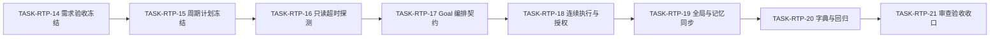
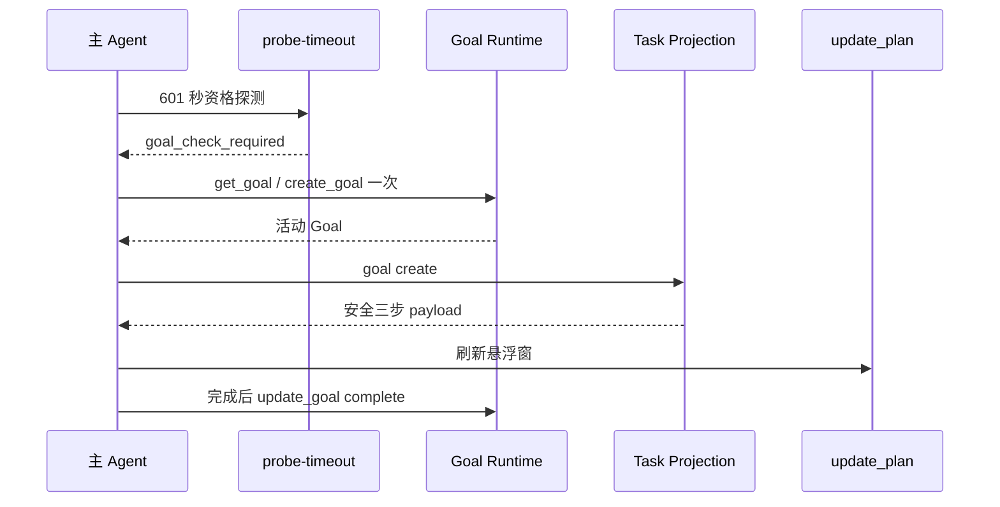

# Codex Desktop 任务悬浮窗断点恢复：实施周期 06 Goal 自动升级

结论：本周期把十分钟普通悬浮窗升级为优先自动目标，失败时保留普通悬浮窗；影响：长任务用户可看到持续目标和步骤；范围：只读探测、目标编排、规则、测试和验收；非范围：桌面端产品代码、后台定时器和版本提交；变化：增加无写入的超时资格检查并串联目标生命周期；完成标准：八个最小任务逐项完成实现、真实测试、审查和验收；术语说明：超时资格检查只返回是否进入目标检查，不修改项目文件；验证状态：周期正在实施，自动化回归已通过，真实桌面可见验收待执行。

## 当前周期目标、边界与进入条件

| 项目 | 内容 |
|---|---|
| 周期 ID | `CYCLE-RTP-06` |
| 唯一目标 | 严格超过 600 秒时优先创建或复用 Goal，失败仍有普通悬浮窗。 |
| 进入条件 | Cycle 05、v4 registry、Goal 安全三步和 57 项回归可用；用户确认 `CHG-RTP-001`。 |
| 收口条件 | 自动、复用、降级、隐私和终态均通过；测试 Goal 已清理。 |
| 最大推进边界 | 不修改 Desktop 产品、不连接非 local 环境、不提交 Git。 |

## 当前代码/文档基线

| 基线 | 当前事实 | 保护要求 |
|---|---|---|
| 超时实现 | `ensure_timeout_projection` 严格 `>600` 后写 exact/fallback | 输入、返回和写入语义不变 |
| Goal 实现 | `handle_goal_event` 支持 create/restore/blocked/complete | 固定安全三步和隐私边界不变 |
| registry | v4 按 session_id 隔离 | 不覆盖其它会话，不新增 schema 字段 |
| 测试 | 实施前 57 项通过；新增 probe 后 61 项通过 | 旧测试不得删除或放宽 |
| 工作树 | 存在其它会话未提交改动 | 仅增量编辑，不 reset/checkout |
| 图片资产决策 | N/A。原因：本周期交付规则、脚本和行为证据，不生产位图或 UI 设计；证据：两张 Mermaid 图和 local 行为测试足以表达关系。 | 不新增图片清单 |

图片资产决策：N/A。原因：本周期交付规则、脚本和行为证据，不生产位图或 UI 设计；证据：两张 Mermaid 图和 local 行为测试足以表达关系。

## 周期内最小任务执行顺序

图形目的：说明本周期串行闭环和依赖；关联 ID：`TASK-RTP-14..21`。



| 顺序 | 任务 ID | 唯一目标 | 文件/符号 | 真实测试 |
|---:|---|---|---|---|
| 1 | `TASK-RTP-14` | 冻结需求变更和验收 | RTP/GTP 需求、RTP 验收 | requirement/acceptance profile |
| 2 | `TASK-RTP-15` | 冻结 Cycle 06 执行契约 | 实施总览、全量顺序、本周期 | implementation profiles |
| 3 | `TASK-RTP-16` | 新增无写入 `probe-timeout` | `probe_timeout_projection`、CLI、测试 | 61 项 Python 回归 |
| 4 | `TASK-RTP-17` | 冻结 Goal 编排和失败降级 | Owner Skill、openai.yaml、公开契约 | 路由正反例、quick validate |
| 5 | `TASK-RTP-18` | 同步连续执行与 standing authorization | autonomous 规则、AGENTS/CLAUDE | 跨文件契约测试、Skill 审计 |
| 6 | `TASK-RTP-19` | 同步全局规则和项目记忆 | 父目录规则、CURRENT/MEMORY/HISTORY | UTF-8、大小、registry 保真 |
| 7 | `TASK-RTP-20` | 完成字典与自动回归 | 字典生成资产、测试报告 | 生成器、py_compile、diff check |
| 8 | `TASK-RTP-21` | 完成真实 Desktop 审查验收 | 测试/审查/验收证据 | Goal 卡片、安全三步和清理 |

## 最小任务闭环

| 任务 | 实现 | 真实测试 | 审查 | 验收 | 停止条件 |
|---|---|---|---|---|---|
| `TASK-RTP-14` | 追加来源、决策、需求、规则和 AC | 严格文档 profile | ID/术语审查 | 无未决 P0/P1 | 旧结论被覆盖 |
| `TASK-RTP-15` | 新建周期并更新总览/全量顺序 | Mermaid 与 implementation profile | 依赖和写集审查 | 零决策可执行 | 计划字段缺失 |
| `TASK-RTP-16` | 共用时间计算并新增 probe CLI | 599/600/601、暂停、状态、损坏、CLI | 无写入/锁/兼容审查 | `AC-RTP-010` | v4 或 ensure 行为漂移 |
| `TASK-RTP-17` | 写明 get/create/goal/update 顺序与摘要契约 | 路由正反例、quick validate | Owner 单一性审查 | `AC-RTP-011/012` | Python 直接调宿主工具 |
| `TASK-RTP-18` | 同步授权、Plan Mode 和主 Agent 边界 | 契约文本测试 | 自动执行权审查 | 子 Agent 不创建 Goal | 权限扩大 |
| `TASK-RTP-19` | 更新规则和项目记忆职责文件 | UTF-8、51,200 字节、registry validate | 跨会话审查 | 记忆无敏感值 | 其它会话被覆盖 |
| `TASK-RTP-20` | 生成字典并跑全回归 | 61+ 测试、py_compile、quick validate、diff check | Skill 合规/演化/审计 | 全部 PASS | 非预期生成漂移 |
| `TASK-RTP-21` | 形成测试、审查、验收证据 | 真实 Desktop happy-path | 实现与当前改动总审查 | `AC-RTP-010..013` | Goal 无法清理或 UI 不一致 |

## 当前周期验证矩阵

| 测试 ID | 场景/样本 | 命令或入口 | 通过断言 | 清理 |
|---|---|---|---|---|
| `TEST-RTP-013` | 599/600/601、暂停后 600/601 | Python 单元测试 | 仅严格 `>600` 进入 Goal 检查；文件字节不变 | TemporaryDirectory |
| `TEST-RTP-014` | active/blocked/inactive/无投影、其它 session | Python 单元测试 | 当前会话隔离且无写入 | TemporaryDirectory |
| `TEST-RTP-015` | get_goal 无活动/匹配/不匹配 | 规则契约与 Desktop | 创建一次、复用、降级 | complete 测试 Goal |
| `TEST-RTP-016` | Goal/投影/UI 失败 | 规则正反例和降级 fixture | 不重复 Goal，普通投影仍可见 | TemporaryDirectory |
| `TEST-RTP-017` | Plan Mode、未授权、任务完成、计时丢失 | 契约测试 | 不创建、不写入、不猜测 | 无清理动作；原因：负向契约测试不产生状态；证据：只读断言 |
| `TEST-RTP-018` | 摘要、隐私、正式任务替换、终态 | Desktop + registry 校验 | 摘要脱敏，投影无原文，完成不复活 | complete 测试 Goal |

## 真实测试与断言

```powershell
python -X utf8 -B task-plan-rehydration-rules/tests/test_task_plan_projection.py
python -X utf8 -B -m py_compile task-plan-rehydration-rules/scripts/task_plan_projection.py task-plan-rehydration-rules/tests/test_task_plan_projection.py
python -X utf8 -B .system/skill-creator/scripts/quick_validate.py task-plan-rehydration-rules
python -X utf8 -B .system/skill-creator/scripts/quick_validate.py autonomous-execution-rules
python -X utf8 -B skill-dictionary/generate_dictionary.py
git diff --check
```

依赖环境为 local Python 3、当前 Skills 工作树和 Codex Desktop 本地运行时；样本全部位于临时目录，不访问数据库、网络或非 local 服务。通过标准为旧 57 项与新增测试全部通过、失败样本原文件字节不变、Skill 和文档门禁 PASS。

图形目的：说明真实宿主验收时序；关联 ID：`TEST-RTP-015/018`、`AC-RTP-011..013`。




## 任务四类证据矩阵

| 证据 ID | 类别 | 任务 | 当前证据 | 状态 |
|---|---|---|---|---|
| `EVD-TASK-RTP-14-IMPL` | IMPL | `TASK-RTP-14` | 需求与验收增量已落盘 | PASS |
| `EVD-TASK-RTP-14-TEST` | TEST | `TASK-RTP-14` | requirement 与 acceptance 严格 profile 通过 | PASS |
| `EVD-TASK-RTP-14-REVIEW` | REVIEW | `TASK-RTP-14` | ID、旧周期结论和双向追踪已复核 | PASS |
| `EVD-TASK-RTP-14-ACCEPT` | ACCEPT | `TASK-RTP-14` | 来源、决策、需求、规则和验收可追踪 | PASS |
| `EVD-TASK-RTP-15-IMPL` | IMPL | `TASK-RTP-15` | 周期、总览和全量顺序已落盘 | PASS |
| `EVD-TASK-RTP-15-TEST` | TEST | `TASK-RTP-15` | 三类 implementation 严格 profile 通过 | PASS |
| `EVD-TASK-RTP-15-REVIEW` | REVIEW | `TASK-RTP-15` | 依赖、命令、回滚和最大边界已复核 | PASS |
| `EVD-TASK-RTP-15-ACCEPT` | ACCEPT | `TASK-RTP-15` | 零决策执行契约完整 | PASS |
| `EVD-TASK-RTP-16-IMPL` | IMPL | `TASK-RTP-16` | 只读探测和 CLI 已实现 | PASS |
| `EVD-TASK-RTP-16-TEST` | TEST | `TASK-RTP-16` | 63 项回归与 py_compile 通过 | PASS |
| `EVD-TASK-RTP-16-REVIEW` | REVIEW | `TASK-RTP-16` | 锁文件副作用已修复，session 与亚秒边界已补测 | PASS |
| `EVD-TASK-RTP-16-ACCEPT` | ACCEPT | `TASK-RTP-16` | 严格大于 600 秒且无文件副作用 | PASS |
| `EVD-TASK-RTP-17-IMPL` | IMPL | `TASK-RTP-17` | Owner、公开契约和默认提示已同步 | PASS |
| `EVD-TASK-RTP-17-TEST` | TEST | `TASK-RTP-17` | 无活动 Goal 的创建与重复查询通过；匹配、不匹配和失败编排缺少可执行宿主模拟 | LIMITED |
| `EVD-TASK-RTP-17-REVIEW` | REVIEW | `TASK-RTP-17` | 单一 Owner、单次创建和隐私边界已审查 | PASS |
| `EVD-TASK-RTP-17-ACCEPT` | ACCEPT | `TASK-RTP-17` | 创建与防重复通过；复用和失败降级按未覆盖分支受限 | LIMITED |
| `EVD-TASK-RTP-18-IMPL` | IMPL | `TASK-RTP-18` | 连续执行与 standing authorization 已同步 | PASS |
| `EVD-TASK-RTP-18-TEST` | TEST | `TASK-RTP-18` | 跨文件契约测试通过；缺少宿主调用拦截器验证零调用 | LIMITED |
| `EVD-TASK-RTP-18-REVIEW` | REVIEW | `TASK-RTP-18` | 权限、Plan Mode 和子 Agent 边界已审查 | PASS |
| `EVD-TASK-RTP-18-ACCEPT` | ACCEPT | `TASK-RTP-18` | 规则冻结仅主 Agent 调用；宿主级强制证据受限 | LIMITED |
| `EVD-TASK-RTP-19-IMPL` | IMPL | `TASK-RTP-19` | 全局规则和项目记忆已同步 | PASS |
| `EVD-TASK-RTP-19-TEST` | TEST | `TASK-RTP-19` | UTF-8、大小和 registry 校验通过 | PASS |
| `EVD-TASK-RTP-19-REVIEW` | REVIEW | `TASK-RTP-19` | 跨会话隔离和敏感信息边界已审查 | PASS |
| `EVD-TASK-RTP-19-ACCEPT` | ACCEPT | `TASK-RTP-19` | 当前状态、稳定记忆和历史职责分离 | PASS |
| `EVD-TASK-RTP-20-IMPL` | IMPL | `TASK-RTP-20` | 字典和证据文档已生成 | PASS |
| `EVD-TASK-RTP-20-TEST` | TEST | `TASK-RTP-20` | 63 项回归、py_compile 和两个 quick validate 通过 | PASS |
| `EVD-TASK-RTP-20-REVIEW` | REVIEW | `TASK-RTP-20` | Skill 合规、演化和多 Skill 边界已审计 | PASS |
| `EVD-TASK-RTP-20-ACCEPT` | ACCEPT | `TASK-RTP-20` | 字典生成仅更新预期资产 | PASS |
| `EVD-TASK-RTP-21-IMPL` | IMPL | `TASK-RTP-21` | 真实宿主 Goal、投影、任务列表和终态链路已执行 | PASS |
| `EVD-TASK-RTP-21-TEST` | TEST | `TASK-RTP-21` | 宿主工具链通过；独立 Desktop 视觉截图受安全规则限制 | LIMITED |
| `EVD-TASK-RTP-21-REVIEW` | REVIEW | `TASK-RTP-21` | 实现审查与当前改动总审查已落盘 | PASS |
| `EVD-TASK-RTP-21-ACCEPT` | ACCEPT | `TASK-RTP-21` | Goal 已 complete 且测试投影已清理；视觉放行保持受限 | LIMITED |

## 周期阻断、停止与回滚

| 类型 | 条件 | 动作 |
|---|---|---|
| 阻断 | registry 损坏、UTF-8/原子写入失败 | 保持原文件并停止投影迁移 |
| 阻断 | Goal 摘要或敏感内容落盘 | 立即停止并修复隐私边界 |
| 停止条件 | Goal 工具不存在或状态无法确认 | 不重复创建，调用原 ensure-timeout 降级 |
| 停止条件 | Plan Mode 发生 Goal/update_plan 调用 | 立即停止并修正规则 |
| 回滚 | probe 或自动路由造成回归 | 删除 probe 路由和本周期规则，保留 Cycle 05、v4、Goal 手动生命周期和原 ensure-timeout |

回滚只撤销 `CYCLE-RTP-06` 新增差异，不使用 reset/checkout，不覆盖其它会话改动；已创建的测试 Goal 必须先真实 complete 或按运行时门槛 blocked。

## 周期追踪矩阵

| 来源/变更 | 决策 | 需求/规则 | 验收 | 任务 | 测试/证据 |
|---|---|---|---|---|---|
| `SRC-RTP-005/CHG-RTP-001` | `DEC-RTP-007` | `REQ-RTP-008`、`RULE-RTP-011/012` | `AC-RTP-010` | `TASK-RTP-14..16` | `TEST-RTP-013/014`、`EVIDENCE-RTP-013/014` |
| `SRC-RTP-005/CHG-RTP-001` | `DEC-RTP-008/009` | `REQ-RTP-009`、`RULE-RTP-013..015` | `AC-RTP-011..013` | `TASK-RTP-17..21` | `TEST-RTP-015..018`、`EVIDENCE-RTP-015/016/017/018` |

## 自审结论

- 当前方案保持单一任务投影 Owner、v4 schema、原 `ensure-timeout` 和 Goal 生命周期兼容。
- 每个最小任务都有文件/符号、真实测试、审查、验收、停止条件和回滚。
- `unresolved_decisions: []`，不存在未决 P0/P1。
- 当前周期最大推进边界明确：本地闭环、无 Git 历史写入、无 Desktop 产品修改。


## 执行附录

执行环境为 Windows local 工作区；Python 与文档命令强制 UTF-8。数据库、缓存、消息队列和外部服务均 N/A。原因：本周期只验证本地规则、临时文件和宿主任务工具；证据：测试矩阵没有任何服务连接入口。

所有测试 fixture 使用 `TemporaryDirectory` 或当前受管项目文件；失败时保留原文件，修复后用相同输入与成功标准复验。Goal 工具的真实验收必须在独立可清理目标中完成，结束前真实收口运行时状态。

## 追踪附录

- 需求文档：`doc/2-需求/2026-07-23_012302_CodexDesktop任务悬浮窗断点恢复.md`。
- 验收文档：`doc/7-验收/2026-07-23_012302_CodexDesktop任务悬浮窗断点恢复_验收标准.md`。
- 实施总览与全量顺序方案承接本周期八个最小任务。
- 主链：`SRC-RTP-005 -> CHG-RTP-001 -> DEC-RTP-007/008/009 -> REQ-RTP-008/009 + RULE-RTP-011..015 -> AC-RTP-010..013 -> CYCLE-RTP-06 -> TASK-RTP-14..21 -> TEST-RTP-013..018 -> EVIDENCE-RTP-013..018`。
- 本附录为文档终点，不在其后追加业务正文。
