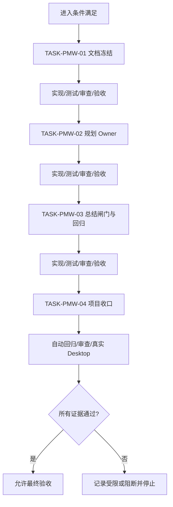
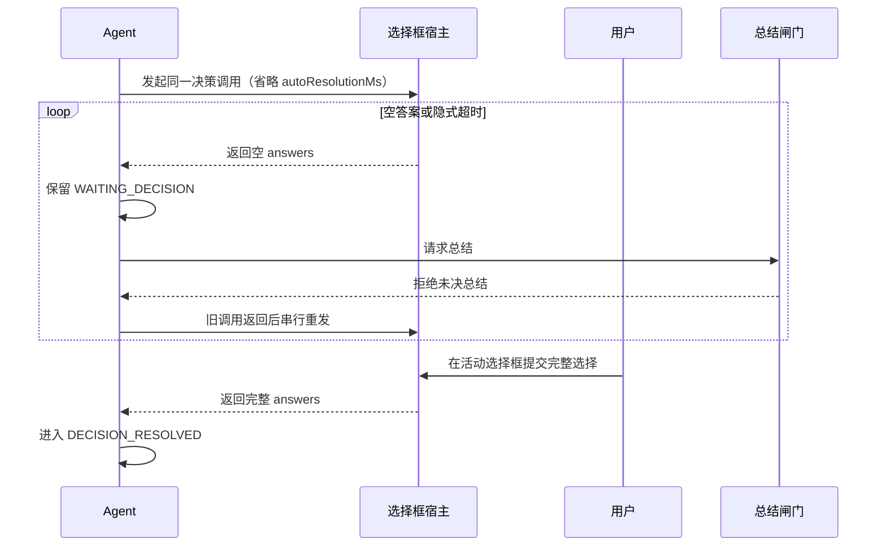

# CYCLE-PMW-01：Plan Mode 永久等待与总结闸门

结论：本周期只闭环 Plan Mode 决策选择框的永久等待、空答案串行重发和未决总结拒绝；影响：用户暂时离开任务不会丢失决策入口，回到当前活动选择框后完成选择才能继续；范围：四份工程文档、两个规则 Owner、专项自动回归、审查和真实 Desktop 验收；非范围：Codex Desktop 产品源码、其它交互工具、Goal、任务投影、Browser Use、数据库和 Git 历史；变化：宿主每次返回空答案都触发同一未决选择框的串行重发，未决期间拒绝冻结输出集合内的全部可见内容；完成标准：四个最小任务逐一完成“实现→真实测试→审查→验收”，自动回归通过，真实宿主证据齐全；术语说明：串行重发是旧选择框调用返回后再创建同一未决问题的单一活动调用，不是并行创建多个选择框；验证状态：规则、测试和审查已完成，真实 Desktop 仍为 LIMITED 人工验收项。

## 当前周期目标

- 周期 ID / 期次定位：`CYCLE-PMW-01` / 第一期。
- 只做这一件事：把宿主空答案固定为未决状态并循环重发同一选择框，同时阻断所有未决总结路径。
- 对应来源：`BUG-PLAN-WAIT-20260726-001`、`AC-PMW-001..007`、实施总览 `IMP-PMW-001`。
- 本周期不做：修改工具 schema、替用户选择、文本替代选择框、后台定时器、Goal/任务投影、其它交互工具、Desktop 产品源码和 Git 历史。

## 周期图片资产决策与边界

- 图片资产决策：`N/A + 原因 + 证据`。原因：本周期不交付 UI、截图对比或视觉原型；证据：状态图、时序图、依赖图和行为断言可完整表达判定关系。
- Mermaid 边界：Mermaid 负责状态、任务依赖和端到端时序；图片不替代这些图，也不创建 `doc/data/images/` 资产。
- 生成与引用：`N/A + 原因 + 证据`，没有 imagegen 输入或 Markdown 图片引用。

## 周期图片资产清单

| 图片 ID | 用途 / 生成输入 | 来源 | 相对路径 | 版本 | 关联 ID | 引用章节 | 敏感状态 | 版权状态 |
| --- | --- | --- | --- | --- | --- | --- | --- | --- |
| `IMG-PMW-NA` | N/A：状态与时序由 Mermaid 表达；原因：不交付视觉资产；证据：本周期 Mermaid 图与行为断言 | N/A：原因：无外部图片来源；证据：本周期不引用图片 | N/A：原因：不创建图片文件；证据：图片决策为 N/A | N/A：原因：本文无图片引用；证据：全文 Markdown 无图片标签 | `CYCLE-PMW-01` | 全文图形章节 | 无图片 | N/A：原因：不交付图片；证据：无图片资产 |

## 进入条件与收口条件

| 类型 | 条件 | 证据/命令 | 状态 |
| --- | --- | --- | --- |
| 进入 | Bug 证据、用户冻结方案、前置验收标准已落盘，用户明确授权实施 | Bug README、验收标准、当前对话 | 已满足 |
| 收口 | `TASK-PMW-01..04` 各自完成实现、真实测试、审查、验收；自动回归和真实 Desktop 全通过 | 本周期测试表、审查记录、真实宿主记录 | 受限：等待 `TEST-PMW-013` |

图形目的：表达周期内严格串行的任务闭环和真实宿主收口门禁；关联 ID：`CYCLE-PMW-01`、`TASK-PMW-01..04`、`AC-PMW-001..007`。

图形目的：说明空答案回流、总结闸门和最终选择的串行顺序；关联 ID：`RULE-PMW-001`、`AC-PMW-002/004/005`、`TASK-PMW-02/03/04`。

## 当前代码/文档基线

- 分支 / 提交：本轮不写 Git 历史；基线以当前工作树和目标文件现状为准。
- 已核实落点：`implementation-planning-rules` 是选择框唯一 Owner；`reasoning-summary-structure-rules` 是最终总结唯一消费方；专项测试位于本周期时间戳目录的 ASCII 路径。
- 依赖与环境：Python 3 标准库、本地 UTF-8 文件；真实 Desktop 是唯一外部人工验证依赖，数据库、缓存、消息队列和 HTTP/RPC 均 N/A；原因：本周期只改规则、文档与测试；证据：文件与符号操作契约及 local 测试表。
- 不一致停止规则：目标文件、既有标题、调用契约或宿主能力与本周期不一致时立即停止当前任务，记录 `GAP-PMW-*`，不得猜测替代落点。

## 周期内最小任务执行顺序

| 顺序 | 任务 ID | 唯一目标 | 前置依赖 | 允许文件 | 禁止触碰区 | 状态 |
| ---: | --- | --- | --- | --- | --- | --- |
| 1 | `TASK-PMW-01` | 冻结四份工程文档与追踪 | Bug/验收已确认 | `doc/4-bugs/`、`doc/7-验收/`、`doc/3-实施/` 四份文件 | Skill、脚本、测试、项目状态、Git 历史 | completed |
| 2 | `TASK-PMW-02` | 固定规划 Owner 的永久等待和串行重发 | TASK-PMW-01 | `implementation-planning-rules/` 四份规则资产 | 总结 Owner、产品源码、其它交互工具 | completed |
| 3 | `TASK-PMW-03` | 增加总结闸门并落专项回归 | TASK-PMW-02 | `reasoning-summary-structure-rules/SKILL.md`、专项测试目录 | 规划 Owner、Goal、任务投影、产品源码 | completed |
| 4 | `TASK-PMW-04` | 完成回归、审查、验收与项目状态同步 | TASK-PMW-03 | 测试 README/证据、四件套、审查/验收记录 | 非 local 服务、Git 历史、无关项目 | in_progress（LIMITED） |

## 文件与符号操作契约

| 任务 | 文件路径 | 符号/区段 | 操作 | 修改前职责 | 修改后职责 | 调用方影响 | 兼容要求 |
| --- | --- | --- | --- | --- | --- | --- | --- |
| `TASK-PMW-01` | 四份工程文档 | front matter、追踪附录 | 新增 Bug、验收、总览、周期 | 无本来源对象文档 | 保存来源、边界、任务和证据契约 | 后续 Owner 按稳定 ID 执行 | UTF-8、既有模板和链接有效 |
| `TASK-PMW-02` | `implementation-planning-rules/SKILL.md` | Plan Mode 入口 | 修改 | 只表达未决不默认推进 | 增加 `WAITING_DECISION` 与无上限循环 | 只影响 Plan Mode 决策 | 不改 description/二级标题 |
| `TASK-PMW-02` | `implementation-planning-rules/references/plan-question-coverage.md` | 无选择协议 | 修改 | 缺少空返回生命周期 | 冻结 `AC-PMW-001..007` | 影响决策调用和重发 | 非决策信息提问仍可使用既有规则 |
| `TASK-PMW-02` | `implementation-planning-rules/references/plan-output-gate.md` | 无选择闸门 | 修改 | 只禁止默认计划 | 拒绝总结、final 和 task_complete | 影响计划消费方 | 保留现有字段矩阵 |
| `TASK-PMW-02` | `implementation-planning-rules/agents/openai.yaml` | default_prompt | 修改 | 未携带空答案循环提示 | 携带完整调用契约 | 影响 Agent 默认执行提示 | YAML 可解析 |
| `TASK-PMW-03` | `reasoning-summary-structure-rules/SKILL.md` | 最终总结前检查 | 修改 | 未检查未决选择 | `SUMMARY-GATE-PMW-001` 拒绝总结 | 影响最终输出 | 不改 description/二级标题 |
| `TASK-PMW-03` | `doc/5-tests/2026-07-26_040607/plan_mode_wait_loop/` | 行为回归入口 | 新增脚本、fixture、README | 无专项回归 | 模拟无限循环、部分答案和消费闸门 | 仅测试资产，不进生产 | ASCII 路径、UTF-8、标准库 |

## 任务图片资产执行契约

| 任务 | 图片决策 | 生成输入与 imagegen 命令 | 目标资产路径 | Markdown 相对引用 | IMG/版本 | 资产清单与引用章节 | Mermaid 不替代说明 |
| --- | --- | --- | --- | --- | --- | --- | --- |
| `TASK-PMW-01..04` | `N/A + 原因 + 证据` | N/A：无视觉交付 | N/A | N/A | `IMG-PMW-NA` | 本节、各任务文档 | Mermaid 已覆盖状态、时序和依赖，图片不承担同一语义 |

## 最小任务闭环

本节按“实现→真实测试→审查→验收”记录四个任务的闭环；每个任务完成前不得推进后续任务，未完成真实宿主验证时周期只能保持 `in_progress/LIMITED`。

### TASK-PMW-01..04 闭环索引

| 任务 | 实现 | 真实测试 | 审查 | 验收 |
| --- | --- | --- | --- | --- |
| `TASK-PMW-01` | 四份工程文档与追踪已落盘 | 四类文档 profile、UTF-8、链接和 Mermaid | 稳定 ID、边界与 N/A 证据 | 文档门禁通过后完成 |
| `TASK-PMW-02` | 规划 Owner 四文件已修改 | 专项参数/空答案/部分答案回归与 Skill 校验 | 唯一 Owner、单活动框、无上限 | `AC-PMW-001..004` 通过后完成 |
| `TASK-PMW-03` | 总结 Owner 闸门与专项测试已落盘 | 10 个本地行为用例全部通过 | 未决状态拒绝总结，历史负例失败 | 已完成（本地） |
| `TASK-PMW-04` | 状态、审查和验收证据同步 | 自动回归、文档门禁、差异检查和真实 Desktop | 无越界、无敏感信息、证据可回放 | 受限：宿主通过后才允许周期完成 |

## 当前周期验证矩阵

本矩阵以 `TEST-PMW-001..013` 连接到任务、验收和证据；本地自动回归先行，真实 Desktop 仍是最终人工门禁，缺失时状态保持 `LIMITED`。

## 真实测试与断言

| 测试 ID | 对应任务 | 精确命令 | local 依赖 | fixture/数据 | 断言 | 失败预期 | 清理 |
| --- | --- | --- | --- | --- | --- | --- | --- |
| `TEST-PMW-001..009` | `TASK-PMW-03` | `python -X utf8 -B doc/5-tests/2026-07-26_040607/plan_mode_wait_loop/test_plan_mode_wait_loop.py` | 本地 Python 标准库 | 两问题样本、历史空答案负例 | 10 个行为/文本用例全部 PASS；2/10/100 次空答案保持等待 | 任意空答案后冻结输出集合中的内容被放行或重发丢问题 | `-B` 不产生 pycache；fixture 只读 |
| `TEST-PMW-010` | `TASK-PMW-01/04` | `python -X utf8 -B artifact-delivery-gate-rules/scripts/validate_engineering_docs.py --profile <profile> --doc <path> --root .` | 本地 Python、仓库文件 | 四份工程文档 | bug/acceptance/implementation_overview/implementation_cycle profile 均为 0 | 任一 profile、链接、front matter 或 UTF-8 检查失败 | 不保留临时输出 |
| `TEST-PMW-011` | `TASK-PMW-02/03` | `python -X utf8 -B .system/skill-creator/scripts/quick_validate.py implementation-planning-rules` 与 `reasoning-summary-structure-rules` | 本地 Python | 修改后的 Skill 文件 | 两个 Skill 合规 PASS，既有 description/二级标题不变 | 资产结构、front matter、触发条件或标题漂移 | 无持久化副作用 |
| `TEST-PMW-012` | `TASK-PMW-04` | `git diff --check` | 本地 Git | 当前 scoped diff | 退出码 0 | 编码/空白或换行错误 | 不写 Git 历史 |
| `TEST-PMW-013` | `TASK-PMW-04` | 真实 Plan Mode Desktop 手工链路 | local 宿主 | 至少两个空答案周期、最终完整选择 | 每次空答案立即重发同一选择框；选择后才恢复计划 | 宿主阻断、并存选择框、提前总结或任务完成 | 关闭测试任务，不保留测试投影 |

## 回滚与停止条件

- `ROLLBACK-PMW-01`：若 TASK-PMW-01 文档门禁失败，只删除本来源对象四份新增文档，不触碰既有文档；修复模板或链接后从 TASK-PMW-01 重入。
- `ROLLBACK-PMW-02`：若规则资产失败，只逆向撤销本轮四个规划 Owner 文件，保留原有未决语义；重新读取 Bug/验收后从 TASK-PMW-02 重入。
- `ROLLBACK-PMW-03`：若总结回归失败，只逆向撤销总结闸门和本轮测试资产；不改产品源码，回到 TASK-PMW-03 复验。
- `ROLLBACK-PMW-04`：项目状态同步失败时保持原四件套不变，先保存 scoped 证据，再从 TASK-PMW-04 重入。
- 停止条件：任一测试失败、出现空答案后总结、并行活动选择框、宿主明确不可恢复、必须修改 Desktop 产品源码、非 local 依赖或用户明确停止。
- 恢复路径：记录失败阶段和最小证据，回到对应任务的原命令与断言；真实宿主阻断时状态只能为 `LIMITED/HOST_BLOCKED`，不得伪报通过。
- 当前 Agent 最大推进边界：只完成本来源 Bug 的规则、测试、文档和验收收口；不创建 Goal、不恢复任务投影、不修改其它交互工具、不写 Git 历史。

## 周期追踪矩阵

| REQ/RULE | AC | TASK | 文件/符号 | TEST | EVIDENCE | 闭环状态 |
| --- | --- | --- | --- | --- | --- | --- |
| `RULE-PMW-001`、`REQ-PMW-001` | `AC-PMW-001` | `TASK-PMW-02` | 规划 Owner 调用约束 | `TEST-PMW-001` | `EVIDENCE-PMW-001` | 已完成 |
| `RULE-PMW-002`、`REQ-PMW-002/003` | `AC-PMW-002/003/004` | `TASK-PMW-02/03` | 空答案消费与部分答案合并 | `TEST-PMW-002..004` | `EVIDENCE-PMW-002..004` | 已完成 |
| `RULE-PMW-003`、`REQ-PMW-004/006` | `AC-PMW-005/007` | `TASK-PMW-03` | 总结 Owner 未决闸门 | `TEST-PMW-007/008` | `EVIDENCE-PMW-007/008` | 已完成（本地） |
| `RULE-PMW-004`、`REQ-PMW-005/007` | `AC-PMW-005/006/007` | `TASK-PMW-03/04` | 授权、停止、故障分支 | `TEST-PMW-005/006/009/013` | `EVIDENCE-PMW-005/006/009/013` | 受限 |

## 自审结论

- 每个任务是否只承载一个目标：是；文档、规划 Owner、总结闸门/回归、项目收口四个垂直切片互不替代。
- 是否按实现→真实测试→审查→验收逐个闭环：是；TASK-PMW-01、02、03 已完成；TASK-PMW-04 已完成自动证据、审查和验收文档，真实 Desktop 保持受限。
- 是否存在未决决策或模糊落点：否；用户已冻结全部决策，宿主真实可重发能力只作为验证条件，不作为实现猜测。
- 图形、表格和正文是否一致：是；流程图只表达任务依赖，测试表表达断言，状态契约表达合法出口。

## 执行附录

### TASK-PMW-01 实现→真实测试→审查→验收

1. 实现：落盘 Bug README、前置验收标准、实施总览和本周期文档，固定 `SRC/DEC/REQ/RULE/AC/CYCLE/TASK/TEST/EVIDENCE` 追踪。
2. 真实测试：运行四份文档 profile、UTF-8 回读、相对链接检查和 Mermaid 解析；任一失败停止在文档域。
3. 审查：确认每个稳定 ID 有上下游，图片资产为 `N/A + 原因 + 证据`，无占位词和无效链接。
4. 验收：文档门禁退出码全为 0 后标记 `TASK-PMW-01` 完成。

### TASK-PMW-02 实现→真实测试→审查→验收

1. 实现：仅修改规划 Owner 四个指定文件；决策调用完全省略 `autoResolutionMs`，空/缺失/隐式超时唯一动作是同框重发，部分答案仅重发剩余问题。
2. 真实测试：运行专项回归的参数负例和规则文本断言，以及两个 Skill quick_validate。
3. 审查：核对未改 description/二级标题、无 Goal/任务投影路由、无最大重试/定时器和单活动框语义。
4. 验收：`AC-PMW-001..004` 对应断言通过后标记 `TASK-PMW-02` 完成。

### TASK-PMW-03 实现→真实测试→审查→验收

1. 实现：在总结 Owner 增加 `SUMMARY-GATE-PMW-001`，并保留专项测试资产的固定入口。
2. 真实测试：运行 10 个本地标准库行为用例，覆盖 2/10/100 空答案、部分答案、延迟选择、授权、停止、故障、负例和文本契约。
3. 审查：确认任何 `WAITING_DECISION`、空答案或隐式超时都拒绝 final/总结/task_complete，且历史违规轨迹被判失败。
4. 验收：`AC-PMW-005..007` 的本地断言和审查已通过，标记 `TASK-PMW-03` 完成；真实宿主相关场景继续由 `TASK-PMW-04` 受限承接。

### TASK-PMW-04 实现→真实测试→审查→验收

1. 实现：更新四件套和测试 README/证据，生成 scoped 审查与验收记录；保持 `PROJECT_CURRENT` registry 原子托管区保真。
2. 真实测试：复跑专项回归、文档 profile、Skill 合规、`git diff --check`，再执行真实 Desktop 两个以上空答案周期。
3. 审查：确认无无关文件、无敏感输入落盘、无 Git 历史动作，真实宿主证据可回放。
4. 验收：自动和真实宿主均通过才标记周期完成；宿主受限则保留 `LIMITED/HOST_BLOCKED`，不得写成 PASS。

## 追踪附录

全链路固定为：`SRC-PMW-001/002 -> DEC-PMW-001..004 -> RULE-PMW-001..004 + REQ-PMW-001..007 -> AC-PMW-001..007 -> CYCLE-PMW-01 -> TASK-PMW-01..04 -> 文件/符号 -> TEST-PMW-001..013 -> EVIDENCE-PMW-001..013`。本周期不新增数据库 schema、公开 API、迁移或第三方依赖；这些维度均为 `N/A + 原因 + 证据`。

当前执行状态：`TASK-PMW-01`、`TASK-PMW-02`、`TASK-PMW-03` 已完成；`TASK-PMW-04` 已完成自动回归、审查、最终验收文档和项目状态同步，但真实 Desktop `TEST-PMW-013` 尚未完成，因此周期和整体结论保持 `LIMITED`，不得宣称正式 PASS。
