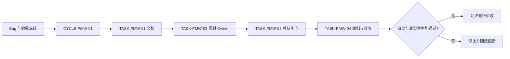
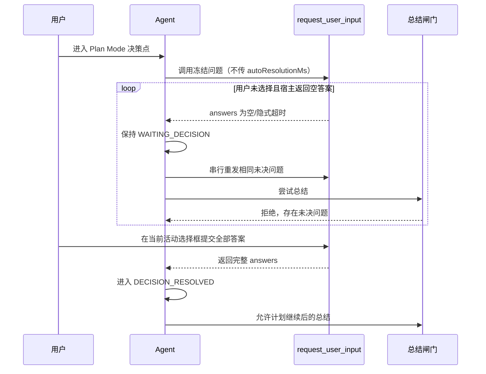
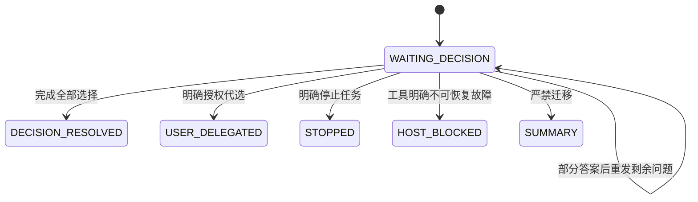

# Plan Mode 选择框永久等待与循环重发实施总览

结论：本计划在规划 Owner 处冻结永久等待和空答案重发，在总结 Owner 处增加未决闸门，再用专项行为回归与真实 Desktop 链路逐层验收；影响：用户离开会话不会让计划自动收敛，回到任务后可从原选择框继续；范围：覆盖规则、总结、测试、审查、验收和项目状态同步；非范围：Codex Desktop 产品源码、其它交互工具、Goal、任务投影、Browser Use、数据库和 Git 历史；变化：宿主每次返回空答案都会触发同一未决选择框重发，且未决期间只保留一个活动选择框；完成标准：四个最小任务逐一完成实现、真实测试、审查和验收，自动回归与真实 Desktop 证据均通过；术语说明：重发是旧调用返回后重新调用同一问题，不是并行创建多个选择框；验证状态：规则、测试和审查已完成，真实 Desktop 仍为 LIMITED 人工验收项。

## 文档信息

| 项目 | 内容 |
| --- | --- |
| 来源 Bug | [BUG-PLAN-WAIT-20260726-001](../4-bugs/2026-07-26_040639_PlanMode选择框永久等待/README.md) |
| 前置验收标准 | [ACDOC-PMW-001](../7-验收/2026-07-26_040639_BUG-PLAN-WAIT-20260726-001_验收标准.md) |
| 当前周期 | [CYCLE-PMW-01](./2026-07-26_040639_BUG-PLAN-WAIT-20260726-001_实施周期01_永久等待与总结闸门.md) |
| 实施授权 | 已获得；来源：用户消息“PLEASE IMPLEMENT THIS PLAN”及随后“继续” |
| 状态说明 | 当前处于实现周期 01；未完成真实 Desktop 验证前不能宣称整体修复通过 |
| 图片资产决策 | `N/A`。原因：规则、状态、依赖和测试断言均可由 Mermaid 与表格表达；证据：本总览的边界图、周期图、端到端图和测试矩阵。 |

## 当前计划最终方案简要说明

当前计划最终方案的简要说明：只在两个唯一 Owner 中收紧解释规则，不修改工具 schema；规划 Owner 将空答案、缺失答案和隐式超时固定为 `WAITING_DECISION` 并循环重发，总结 Owner 在任何未决问题存在时拒绝最终输出，最后由自动回归和真实 Desktop 证明确实能等待到用户选择。

## Agent 对当前问题的理解

- 问题 / 目标：会话 `019f9a43-800a-73b0-80bb-2a79bf2abd67` 在空答案后输出总结；目标是无限等待或立即重发，直到用户完成选择。
- 本轮范围：决策调用参数、空答案与部分答案消费、总结闸门、回归测试、审查、验收和必要项目状态同步。
- 非范围：不代选、不用文本替代选择框、不创建后台定时器/Goal/任务投影、不改 Desktop 产品源码、不改接口 schema、不提交 Git。
- 当前优先闭环：先落盘 Bug/验收/实施文档，再修改规划 Owner 和总结 Owner，随后自动回归，最后执行真实宿主验收。
- 关键假设 / 待确认点：`request_user_input` 返回空答案后允许再次调用；如果宿主明确不可再次调用，按 `HOST_BLOCKED` 记录并停止。
- `unresolved_decisions`：无；用户已经冻结等待、重发频率、无上限、问题身份、部分答案、授权、停止和故障语义。

## 图片资产决策与实施边界

- 图片资产决策：`N/A`。原因：本周期不交付 UI、截图对比、视觉原型或照片；证据：流程、时序、状态、依赖和数据关系由 Mermaid 与测试表覆盖。
- Mermaid 边界：流程、状态、周期依赖和端到端交互必须使用 Mermaid；图片不能替代这些图形门禁。
- 生成契约：N/A + 原因 + 证据：没有需要 `imagegen` 的视觉场景，本周期不生成图片。
- 引用契约：N/A + 原因 + 证据：本文没有 Markdown 图片引用，不创建 `doc/data/images/` 资产。

## 已冻结决策与方案比较

| 决策 ID | 决策问题 | 候选方案 | 选定方案 | 排除原因 | 影响面 | 回滚 | 证据 |
| --- | --- | --- | --- | --- | --- | --- | --- |
| `DEC-PMW-001` | 空答案如何解释 | 取消任务；采用推荐项；保持未决并重发 | 保持未决并重发 | 取消和代选都没有用户授权 | 规划 Owner、用户回访 | `ROLLBACK-PMW-001` | `SRC-PMW-001` |
| `DEC-PMW-002` | 重发方式 | 文本提醒；并行新框；串行重发同一框 | 旧调用返回后串行重发 | 文本不能承载选择，多个框会造成重复操作 | 宿主交互和问题身份 | `ROLLBACK-PMW-002` | `SRC-PMW-002` |
| `DEC-PMW-003` | 总结何时允许 | 空答案后总结；仅完整选择/明确授权/停止/不可恢复故障后继续 | 未决闸门拒绝总结 | 空答案没有终态语义 | 总结 Owner、最终回复 | `ROLLBACK-PMW-003` | `SRC-PMW-001` |
| `DEC-PMW-004` | 等待上限 | 固定次数；固定时间；无上限 | 无次数和时间上限 | 用户可能数小时后回到任务 | 计划生命周期 | `ROLLBACK-PMW-004` | `SRC-PMW-002` |

## 现状与落点

- 已核实来源：会话 JSONL 第 557 行为决策调用，第 558 行为空答案，第 583 行为错误总结。
- 现有 Owner：`implementation-planning-rules` 负责计划问题覆盖和选择框调用；`reasoning-summary-structure-rules` 负责最终总结结构与输出闸门。
- 既有工具：`request_user_input` schema 不修改；本计划只修改调用解释、状态消费和总结判断。
- 外部依赖：Codex Desktop 宿主选择框是必要真实依赖；数据库、缓存、消息队列、HTTP/RPC 上游均 N/A + 原因 + 证据：本 Bug 不读写业务数据。

代码/规则落点目录树：

```text
F:/luode-skills/
├── implementation-planning-rules/
│   ├── SKILL.md                                      # 决策调用与空答案唯一 Owner
│   ├── references/plan-question-coverage.md          # 问题覆盖和永久等待契约
│   ├── references/plan-output-gate.md                # 计划输出闸门与禁止迁移
│   └── agents/openai.yaml                            # Agent 触发提示
├── reasoning-summary-structure-rules/
│   └── SKILL.md                                      # 未决状态下拒绝总结
└── doc/5-tests/<时间戳>/plan-mode-wait-loop/         # TASK-PMW-04 创建的专项行为回归
```

## 实施周期总览

| 顺序 | 周期 ID | 期次定位 | 单一周期目标 | 进入条件 | 收口条件 | 依赖 | 文档 |
| --- | --- | --- | --- | --- | --- | --- | --- |
| 1 | `CYCLE-PMW-01` | 第一期 | 完成永久等待状态机、串行重发、总结闸门和验证闭环 | Bug/验收已冻结，用户已授权实现 | `TASK-PMW-01..04` 四项逐一实现、测试、审查、验收；自动回归和真实 Desktop 证据齐全 | 无上游周期；依赖宿主可再次调用选择框 | [周期 01](./2026-07-26_040639_BUG-PLAN-WAIT-20260726-001_实施周期01_永久等待与总结闸门.md) |

图形目的：说明本 Bug 只有一个周期，且必须先完成四项任务闭环后才允许最终验收；关联 ID：`CYCLE-PMW-01`、`TASK-PMW-01..04`、`AC-PMW-001..007`。



## 阶段计划

| 阶段 | 周期 | 唯一目标 | 输入 | 输出 | 验证门槛 |
| --- | --- | --- | --- | --- | --- |
| `PHASE-PMW-01` | `CYCLE-PMW-01` | 冻结并落盘文档 | Bug 证据、用户冻结方案、仓库模板 | 四份工程文档 | 四类 profile、UTF-8、链接和 Mermaid 通过 |
| `PHASE-PMW-02` | `CYCLE-PMW-01` | 统一决策调用与空答案状态 | `TASK-PMW-01` 已闭环 | 规划 Owner 四个规则落点 | 规则正反例和 Skill 合规通过 |
| `PHASE-PMW-03` | `CYCLE-PMW-01` | 闸门拒绝未决总结 | `TASK-PMW-02` 已闭环 | 总结 Owner 与专项行为测试 | 空答案后冻结输出集合全部拒绝 |
| `PHASE-PMW-04` | `CYCLE-PMW-01` | 完成回归、审查和用户可见验收 | `TASK-PMW-03` 已闭环 | 测试证据、审查、状态同步 | 自动回归、工程门禁、真实 Desktop 全部通过 |

## 最小任务清单

| 周期内顺序 | 任务 ID | 垂直切片目标 | 预计文件数 | 文件/符号契约 | 真实测试 | 完成条件 | 停止条件 |
| --- | --- | --- | ---: | --- | --- | --- | --- |
| 1 | `TASK-PMW-01` | 冻结 Bug、验收、实施总览和周期文档 | 4 | 四份指定 Markdown | 四类 profile、UTF-8、Mermaid | 文档四项闭环通过 | 文档 profile/链接/图形失败 |
| 2 | `TASK-PMW-02` | 让规划 Owner 对空答案唯一重发 | 4 | `SKILL.md`、两个 references、`agents/openai.yaml` | 规则文本正反例、Skill 合规 | 无 `autoResolutionMs` 且重发语义一致 | Owner 竞争、标题/描述边界漂移 |
| 3 | `TASK-PMW-03` | 让总结 Owner 拒绝未决状态总结 | 2-3 | 总结 `SKILL.md` 与专项行为测试 | 空答案/部分答案/授权/停止回归 | 任意未决状态无 final/总结 | 测试能产生空答案后 final |
| 4 | `TASK-PMW-04` | 完成全量回归、审查、验收和状态同步 | 约 5 | 测试 README、报告、项目状态/证据 | 自动 10 类回归、审查、真实 Desktop | 自动与真实宿主均通过 | 宿主阻断或任一关键回归失败 |

## 追踪矩阵

| 来源/验收 | 周期 | 任务 | 文件/符号 | 测试 | 证据 | 状态 |
| --- | --- | --- | --- | --- | --- | --- |
| `REQ-PMW-001`、`AC-PMW-001` | `CYCLE-PMW-01` | `TASK-PMW-02` | `implementation-planning-rules/SKILL.md` 调用约束 | `TEST-PMW-001` | `EVIDENCE-PMW-001` | 已完成 |
| `REQ-PMW-002/003`、`AC-PMW-002/003/004` | `CYCLE-PMW-01` | `TASK-PMW-02/03` | 空答案消费、部分答案保留 | `TEST-PMW-002..004` | `EVIDENCE-PMW-002..004` | 已完成 |
| `REQ-PMW-004`、`AC-PMW-007` | `CYCLE-PMW-01` | `TASK-PMW-03` | `reasoning-summary-structure-rules/SKILL.md` 总结闸门 | `TEST-PMW-007..010` | `EVIDENCE-PMW-007..010` | 已完成（本地） |
| `REQ-PMW-005/006/007`、`AC-PMW-005/006/007` | `CYCLE-PMW-01` | `TASK-PMW-04` | 回归资产、真实 Desktop 链路 | `TEST-PMW-005/006/013` | `EVIDENCE-PMW-005/006/013` | 受限 |

## 任务闭环契约

### `TASK-PMW-01`：冻结文档与追踪

- 唯一目标：让来源、决策、规则、验收、周期、任务、测试和证据在四份文档中双向可追踪。
- 允许文件：本 Bug README、前置验收标准、实施总览、CYCLE-PMW-01 周期文档；不改 Skill、脚本、测试代码和项目四件套。
- 真实测试：运行四类工程文档 profile、UTF-8 回读、链接检查和 Mermaid 静态/真实解析；纯文档不改变可执行行为，但 profile 和图形检查是本任务必需证据。
- 审查/验收：确认 `REQ-PMW-001..007`、`AC-PMW-001..007`、`TASK-PMW-01..04`、`TEST-PMW-001..010` 均有落点；证据分别使用 `EVD-TASK-PMW-01-IMPL`、`EVD-TASK-PMW-01-TEST`、`EVD-TASK-PMW-01-REVIEW`、`EVD-TASK-PMW-01-ACCEPT`。
- 完成条件：四份文档保存为 UTF-8，链接存在，稳定 ID 无孤立，四类 profile 退出码为 0。
- 停止条件：任一 profile、链接、Mermaid 或追踪断言失败；停止在文档域，不进入规则修改。
- 最大推进边界：仅完成文档，不修改任何 Skill、脚本、测试资产、字典、项目状态或 Git 历史。

### `TASK-PMW-02`：修复规划 Owner

- 唯一目标：把空答案、部分答案、缺失问题 ID 和隐式超时固定为 `WAITING_DECISION`，并定义串行重发。
- 允许文件：`implementation-planning-rules/SKILL.md`、`implementation-planning-rules/references/plan-question-coverage.md`、`implementation-planning-rules/references/plan-output-gate.md`、`implementation-planning-rules/agents/openai.yaml`。
- 禁止触碰：工具 schema、总结 Owner、其它交互工具、Goal、任务投影和产品源码。
- 真实测试：规则正例断言决策调用不含 `autoResolutionMs`、空答案后下一动作是同一选择框；负例断言 `60000`、`null`、`0` 被拒绝。
- 审查/验收：确认相同问题 ID、选项、推荐标记、文案和单活动框不变量；证据分别使用 `EVD-TASK-PMW-02-IMPL`、`EVD-TASK-PMW-02-TEST`、`EVD-TASK-PMW-02-REVIEW`、`EVD-TASK-PMW-02-ACCEPT`。
- 完成条件：规则合规通过，任何重发次数都不引入上限，且 Plan Mode 等待期间不创建 Goal/任务投影。
- 停止条件：无法保证串行调用、Owner 竞争、意外修改标题/description、规则语义扩大到非 Plan Mode。
- 最大推进边界：只改四个规划 Owner 文件，不修改总结、脚本、测试或字典。

### `TASK-PMW-03`：增加总结闸门与专项行为测试

- 唯一目标：存在未决决策时拒绝总结、最终回复和任务完成，并保存部分答案。
- 允许文件：`reasoning-summary-structure-rules/SKILL.md` 与 `doc/5-tests/<时间戳>/plan-mode-wait-loop/README.md` 及其 ASCII 测试入口；实际文件数量以周期卡冻结为准，不超过三个。
- 禁止触碰：规划 Owner 已闭环文件、Desktop 产品、Goal、任务投影和非 local 服务。
- 真实测试：模拟空答案 2/10/100 次、部分答案、明确授权、明确停止、工具故障和“空答案后结果与结论”负例；断言未决期间无 commentary/final/task_complete。
- 审查/验收：确认总结闸门消费同一状态契约，证据分别使用 `EVD-TASK-PMW-03-IMPL`、`EVD-TASK-PMW-03-TEST`、`EVD-TASK-PMW-03-REVIEW`、`EVD-TASK-PMW-03-ACCEPT`。
- 完成条件：所有正例通过，历史失败负例被拒绝，测试 fixture 自动清理。
- 停止条件：任一空答案样本能到达 final、总结闸门默认采用推荐项、测试依赖非 local 服务。
- 最大推进边界：只修改总结 Owner 和专项行为测试，不扩展到其它总结或交互工具。

### `TASK-PMW-04`：回归、审查、验收与状态同步

- 唯一目标：用自动证据和真实 Desktop 证明确认永久等待修复，并同步必要项目状态。
- 允许文件：测试 README/报告、`PROJECT_CURRENT.md`、`PROJECT_MEMORY.md`、`PROJECT_HISTORY.md` 或本来源对象验收/审查记录；写入前由主 Agent 复核具体清单，单任务不超过约五个文件。
- 禁止触碰：Codex Desktop 产品源码、非 local 配置、其它项目事实和 Git 历史。
- 真实测试：运行专项回归、规则合规、四类 profile、Mermaid 解析、`git diff --check`，再执行真实 Desktop 两个以上空答案周期和最终选择。
- 审查/验收：实现审查、当前改动审查、前置验收和真实宿主验收均通过；证据分别使用 `EVD-TASK-PMW-04-IMPL`、`EVD-TASK-PMW-04-TEST`、`EVD-TASK-PMW-04-REVIEW`、`EVD-TASK-PMW-04-ACCEPT`，其中宿主项在证据缺失时保持 `planned/LIMITED`。
- 完成条件：自动测试与真实宿主都通过，未决状态没有任何总结或任务完成输出，用户选择后计划恢复。
- 停止条件：宿主阻断重发、多个活动选择框、任一自动回归失败、状态同步会覆盖用户改动或验证状态只能 LIMITED。
- 最大推进边界：完成本来源对象的回归、审查、验收和状态同步；不执行 commit、push、rebase 或其它 Git 历史写入。

## 真实测试安排

| 测试 ID | 任务 | 命令/入口 | local 环境 | 样本 | 断言 | 失败预期 | 清理 | 证据 |
| --- | --- | --- | --- | --- | --- | --- | --- | --- |
| `TEST-PMW-001` | `TASK-PMW-02` | 规则静态契约入口 | 本地 Python/文本 fixture | 有无 `autoResolutionMs` 的调用样本 | 只有无字段调用通过，`60000/null/0` 失败 | 规则接受任一负例 | 临时文本自动删除 | `EVIDENCE-PMW-001` |
| `TEST-PMW-002` | `TASK-PMW-02/03` | 行为回归入口 | 本地临时目录 | 一次空答案 | 下一动作只有相同选择框重发 | 空答案后出现其它消息 | fixture 自动清理 | `EVIDENCE-PMW-002` |
| `TEST-PMW-003` | `TASK-PMW-02/03` | 行为回归入口 | 本地临时目录 | 连续 2、10、100 次空答案 | 状态始终等待，重发无上限 | 任意轮次冻结输出集合中的内容被放行 | fixture 自动清理 | `EVIDENCE-PMW-003` |
| `TEST-PMW-004` | `TASK-PMW-03` | 行为回归入口 | 本地临时目录 | 两问题只答一题 | 已答项保留，只重发剩余项 | 丢答案、重复问题或总结 | fixture 自动清理 | `EVIDENCE-PMW-004` |
| `TEST-PMW-005` | `TASK-PMW-04` | Desktop 手工验收记录 | local Plan Mode 宿主 | 两个以上空答案周期后完整选择 | 选择后从原决策点继续 | 需要文本唤醒或提前继续 | 关闭完成任务，不保留测试投影 | `EVIDENCE-PMW-005` |
| `TEST-PMW-006` | `TASK-PMW-04` | 行为回归入口 | 本地临时目录 | 明确授权、明确停止 | 授权才代选，停止后不重发 | 沉默被当授权/停止 | fixture 自动清理 | `EVIDENCE-PMW-006` |
| `TEST-PMW-007` | `TASK-PMW-03` | 总结闸门回归入口 | 本地临时目录 | 未决状态请求总结 | 总结、final、task_complete 全被拒绝 | 任一总结事件放行 | fixture 自动清理 | `EVIDENCE-PMW-007` |
| `TEST-PMW-008` | `TASK-PMW-03` | 负例回放入口 | 本地临时目录 | 历史“空答案 → 结果与结论” | 判定失败并指出未决状态 | 历史负例被判通过 | 只读回放，不写仓库 | `EVIDENCE-PMW-008` |
| `TEST-PMW-009` | `TASK-PMW-04` | 工具故障回归入口 | 本地故障 fixture | 明确不可恢复调用故障 | 保持未决并报告阻断，不总结 | 吞错或总结 | fixture 自动清理 | `EVIDENCE-PMW-009` |
| `TEST-PMW-010` | `TASK-PMW-04` | 工程文档与 Mermaid 门禁 | 本地工作区 | 四份本轮文档 | profile、UTF-8、链接、Mermaid 全通过 | 任一退出码非零 | 不产生持久化临时文件 | `EVIDENCE-PMW-010` |

## 端到端执行路径

图形目的：把用户未选择、宿主空返回、规划重发、总结拒绝和最终选择恢复串成同一条可验收链路；关联 ID：`REQ-PMW-001..007`、`AC-PMW-001..007`、`TEST-PMW-002..009`。



图形目的：表达等待状态的合法出口和禁止迁移，避免空答案直接进入总结或任务完成；关联 ID：`RULE-PMW-001`、`DEC-PMW-001..004`。



## 风险与阻断项

| ID | 风险/阻断 | 触发证据 | 当前措施 | 恢复路径 | 禁止动作 |
| --- | --- | --- | --- | --- | --- |
| `GAP-PMW-001` | 宿主不允许再次调用选择工具 | 明确工具故障或 API 不可用 | 保持 `HOST_BLOCKED`，不总结 | 报告宿主阻断，宿主恢复后重验 | 不改 Desktop 产品源码，不改为文本选择 |
| `GAP-PMW-002` | 部分答案结构不稳定 | 缺少问题 ID 或返回字段不完整 | 只保存可确认答案，剩余问题继续未决 | 回到规划 Owner 补充契约和测试 | 不猜测缺失答案，不自动补默认值 |
| `GAP-PMW-003` | 总结路径绕过闸门 | 空答案后出现 summary/final/task_complete | 负例回归和总结 Owner 审查 | 回到 `TASK-PMW-03` 修复并复验 | 不以“结果与结论”文字规避闸门 |
| `ROLLBACK-PMW-001` | 规则改动超出本 Bug | scoped diff 出现无关 Skill/工具 | 停止并按文件域逆向撤回本轮增量 | 重读 Bug/验收/实施文档后再进入任务 | 不用 reset/checkout，不覆盖用户改动 |

- 任务完成条件：每个任务均有实现、真实测试、审查和验收证据；四项闭环按顺序完成。
- 任务停止 / 结束条件：任一冻结断言失败、写集冲突、宿主不可恢复、用户明确停止或真实 Desktop 证据缺失时停止当前任务。
- 当前 Agent 最大推进边界：只实现本 Bug 的 Plan Mode 永久等待、循环重发和总结闸门；不扩展到其它交互工具、Goal、任务投影、Browser Use、数据库或 Git 历史。
- 用户开始实施授权：是；来源为当前用户明确“PLEASE IMPLEMENT THIS PLAN”并发送“继续”。

## 自审结论

- 零决策交接：`unresolved_decisions` 为空，等待、重发、部分答案、授权、停止、故障和总结闸门均已冻结。
- 文件/符号落点：规划 Owner 四个文件、总结 Owner 一个文件和专项测试入口已逐任务列明；单任务默认不超过约五个文件。
- 需求/验收/任务/测试覆盖率：`REQ-PMW-001..007`、`AC-PMW-001..007`、`TASK-PMW-01..04`、`TEST-PMW-001..010` 均出现在追踪矩阵和周期文档。
- 周期顺序与闭环：仅 `CYCLE-PMW-01`，严格按 `TASK-PMW-01 -> 02 -> 03 -> 04` 执行，不允许跳任务或统一到周期末测试。
- 图形语义与 Mermaid 解析：周期依赖、端到端时序和等待状态分别使用 flowchart、sequenceDiagram、stateDiagram-v2；实施后需运行真实解析器。
- 占位词和 N/A 证据：计划字段均已填写；所有 N/A 均给出原因和证据。
 - 用户确认状态：已获实施授权；真实 Desktop 验证仍是周期末必需证据，当前结论 LIMITED。

## 执行附录

### 精确验证命令

以下命令在 `F:/luode-skills` 本地工作区执行，使用 Python 3 和 UTF-8；测试入口由 `TASK-PMW-03/04` 实际落盘后替换为对应 ASCII 路径，替换时不得改变测试语义。

```powershell
python -X utf8 -B artifact-delivery-gate-rules/scripts/validate_engineering_docs.py --profile bug --doc "doc/4-bugs/2026-07-26_040639_PlanMode选择框永久等待/README.md" --root .
python -X utf8 -B artifact-delivery-gate-rules/scripts/validate_engineering_docs.py --profile acceptance --doc "doc/7-验收/2026-07-26_040639_BUG-PLAN-WAIT-20260726-001_验收标准.md" --root .
python -X utf8 -B artifact-delivery-gate-rules/scripts/validate_engineering_docs.py --profile implementation_overview --doc "doc/3-实施/2026-07-26_040639_BUG-PLAN-WAIT-20260726-001_实施总览.md" --root .
python -X utf8 -B artifact-delivery-gate-rules/scripts/validate_engineering_docs.py --profile implementation_cycle --doc "doc/3-实施/2026-07-26_040639_BUG-PLAN-WAIT-20260726-001_实施周期01_永久等待与总结闸门.md" --root .
git diff --check
```

`bug` profile 不要求特定 front matter，但本 Bug README 仍采用完整元数据和白话契约；若环境未提供 Mermaid 真解析器，只能记录“解析器不可用”的阻断，不得把静态检查写成真实解析通过。无数据库、API、迁移和外部服务测试；原因：本轮不改变业务数据或接口，证据：文件/符号操作契约与测试矩阵。

### 清理与回滚

- 所有自动回归 fixture 使用临时目录并自动清理；真实 Desktop 测试完成后关闭测试任务，不保留用户数据或测试投影。
- 文档回滚按 `TASK-PMW-01` 的四文件范围逆向撤回；规则、总结和测试回滚分别按各自 `ROLLBACK-PMW-*` 记录执行。
- 任一任务失败只回退本任务，不跨任务删除已验收文档或用户既有改动。

## 追踪附录

### 全链路追踪

`SRC-PMW-001/002 -> DEC-PMW-001..004 -> RULE-PMW-001 + REQ-PMW-001..007 -> AC-PMW-001..007 -> CYCLE-PMW-01 -> TASK-PMW-01..04 -> 文件/符号 -> TEST-PMW-001..013 -> EVIDENCE-PMW-001..013`。

| 上游 | 下游 | 必须证明 | 本文证据 |
| --- | --- | --- | --- |
| `SRC-PMW-001/002`、`DEC-PMW-001..004` | `REQ/RULE` | 每条结论有会话证据和冻结理由 | Bug README、方案比较表 |
| `REQ-PMW-001..007`、`RULE-PMW-001` | `AC-PMW-001..007` | 每条规则可由二值场景验收 | 前置验收标准链接与场景矩阵 |
| `AC-PMW-001..007` | `CYCLE-PMW-01`、`TASK-PMW-01..04` | 每条验收有周期和任务承接 | 周期表、任务表 |
| `TASK-PMW-01..04` | 文件/符号 | 每个动作有精确落点和禁止触碰区 | 文件树、任务闭环契约 |
| `TASK-PMW-01..04` | `TEST-PMW-001..010`、`EVIDENCE-PMW-001..010` | 每个动作有真实测试和证据 | 测试矩阵、周期追踪矩阵 |

### 任务证据类别

每个任务在 CYCLE-PMW-01 中必须登记四类证据。`TASK-PMW-01` 使用 `EVD-TASK-PMW-01-IMPL`、`EVD-TASK-PMW-01-TEST`、`EVD-TASK-PMW-01-REVIEW`、`EVD-TASK-PMW-01-ACCEPT`；`TASK-PMW-02` 使用 `EVD-TASK-PMW-02-IMPL`、`EVD-TASK-PMW-02-TEST`、`EVD-TASK-PMW-02-REVIEW`、`EVD-TASK-PMW-02-ACCEPT`；`TASK-PMW-03` 使用 `EVD-TASK-PMW-03-IMPL`、`EVD-TASK-PMW-03-TEST`、`EVD-TASK-PMW-03-REVIEW`、`EVD-TASK-PMW-03-ACCEPT`；`TASK-PMW-04` 使用 `EVD-TASK-PMW-04-IMPL`、`EVD-TASK-PMW-04-TEST`、`EVD-TASK-PMW-04-REVIEW`、`EVD-TASK-PMW-04-ACCEPT`。在证据尚未产生前，状态保持 planned 或 LIMITED，不得伪报 PASS。
