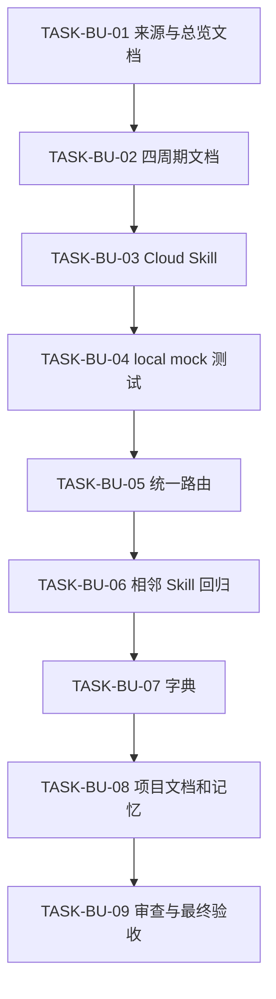

# Browser Use Cloud 浏览器 Skill 升级需求与实施计划全量顺序实施方案

结论：本方案是 Browser Use Cloud 升级的唯一全量执行顺序；影响：任一 Agent 都必须先完成当前周期全部最小任务闭环，再进入下一周期；范围：需求、验收、实施、测试、审查和项目状态；非范围：真实 Cloud、真实 key、本地 Browser Use 与 Git 历史；变化：九个任务被串成可验证的四周期链；完成标准：所有任务和证据均为完成；术语说明：全量顺序表示来源对象到证据的唯一串行索引；验证状态：当前从第一周期的文档冻结任务开始。

## 文档信息

| 项目 | 内容 |
|---|---|
| 来源对象 | `REQ-BU-20260726-001` |
| 当前执行入口 | `CYCLE-BU-01/TASK-BU-01` |
| 总周期数 | 4 |
| 总最小任务数 | 9 |
| 图片资产决策 | N/A。原因：无视觉交付；证据：依赖关系由 Mermaid 表达 |

图片资产决策：N/A + 原因：全量顺序不需要位图 + 证据：下方依赖图覆盖全部关系。

## 来源对象清单

| 来源 | 需求 | 验收 | 实施总览 | 周期 |
|---|---|---|---|---|
| `REQ-BU-20260726-001` | `../2-需求/2026-07-26_063000_BrowserUseCloud浏览器Skill升级.md` | `../7-验收/2026-07-26_063000_REQ-BU-20260726-001_验收标准.md` | `2026-07-26_063000_REQ-BU-20260726-001_实施总览.md` | `CYCLE-BU-01..04` |

## 全量执行顺序

| 全量顺序 | 周期/任务 | 前置依赖 | 输出 | 阻断 |
|---:|---|---|---|---|
| 1 | `CYCLE-BU-01/TASK-BU-01` | 用户实施授权 | 四份来源与总览文档 | strict profile 失败 |
| 2 | `CYCLE-BU-01/TASK-BU-02` | TASK-BU-01 | 四份周期文档 | 追踪或 Mermaid 失败 |
| 3 | `CYCLE-BU-02/TASK-BU-03` | CYCLE-BU-01 | Cloud Skill 五类资产 | Secret 或执行边界缺失 |
| 4 | `CYCLE-BU-02/TASK-BU-04` | TASK-BU-03 | local mock 测试证据 | 六态、脱敏或硬上限失败 |
| 5 | `CYCLE-BU-03/TASK-BU-05` | CYCLE-BU-02 | 三个统一路由增量 | 竞争矩阵或认证绕过 |
| 6 | `CYCLE-BU-03/TASK-BU-06` | TASK-BU-05 | 相邻 Skill 与失败分类增量 | 既有路由回归 |
| 7 | `CYCLE-BU-04/TASK-BU-07` | CYCLE-BU-03 | 字典生成资产 | 字典不一致 |
| 8 | `CYCLE-BU-04/TASK-BU-08` | TASK-BU-07 | 根文档与项目记忆 | 覆盖用户改动 |
| 9 | `CYCLE-BU-04/TASK-BU-09` | TASK-BU-08 | 测试、审查、最终验收 | 任一门禁不通过 |

图形目的：展示全量顺序和跨周期依赖；关联 ID：`CYCLE-BU-01..04`、`TASK-BU-01..09`。

## 当前执行入口

- 当前入口：`TASK-BU-01`。
- 进入规则：每个任务先实现，再完成真实测试或合规免测、审查、验收；四步未闭环不得推进。
- 状态迁移：任务完成后更新本方案、对应周期和项目当前状态；不得把计划状态替代真实证据。

## 依赖与阻断

| 依赖 | 状态 | 阻断处理 |
|---|---|---|
| Python 3 标准库 | local 可用 | 不安装网络依赖 |
| Browser Use 官方 Cloud | 本轮不连接 | 只保留文档链接和 local mock 契约 |
| 工作树其它改动 | 已存在 | 窄 patch，不 reset/checkout/commit |
| Obsidian vault | 未注册 | 记录沉淀阻断，不用文件系统绕过；不影响项目本地实现 |

## 需求/验收/实施文档索引

| 类型 | 文档 | 门禁 profile |
|---|---|---|
| 需求 | `../2-需求/2026-07-26_063000_BrowserUseCloud浏览器Skill升级.md` | `requirement` |
| 验收标准 | `../7-验收/2026-07-26_063000_REQ-BU-20260726-001_验收标准.md` | `acceptance` |
| 实施总览 | `2026-07-26_063000_REQ-BU-20260726-001_实施总览.md` | `implementation_overview` |
| 全量顺序 | 本文 | `implementation_master` |
| 实施周期 | `2026-07-26_063000_REQ-BU-20260726-001_实施周期01..04_*.md` | `implementation_cycle` |

## 自审结论

- 全量顺序覆盖需求、验收、实施、测试、审查与证据，没有平行执行入口。
- 阻断条件、最大推进边界和非范围与用户正式计划一致。
- `unresolved_decisions` 为零；任何运行时 schema 差异均按失败关闭规则处理，不交给执行模型猜测。
- 图片、数据库、真实 Cloud 和 Git 历史均为 N/A 或明确非范围，原因和证据已登记。
