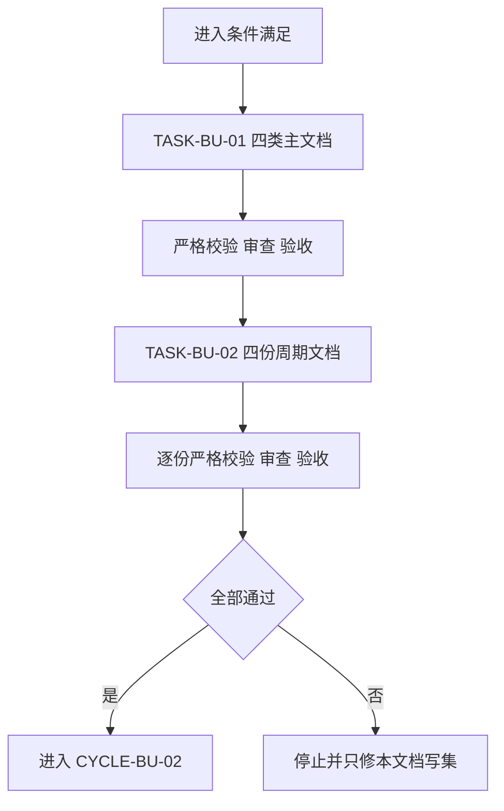

# CYCLE-BU-01：需求边界与验收冻结

结论：本周期只把 Browser Use Cloud 升级的来源、边界、验收和实施顺序冻结为可执行文档；影响：后续实现不得自行决定 Cloud 范围、费用确认或测试边界；范围：需求、验收、实施总览、总顺序和四份周期文档；非范围：不写 Skill、脚本或路由，不调用 Cloud；变化：建立从来源到证据的完整追踪；完成标准：全部文档 strict 校验通过并完成审查验收；术语说明：strict 是工程文档的严格机器门禁；验证状态：主文档和四份周期文档均已通过。

## 当前周期目标、边界与进入条件

- 周期 ID / 期次定位：`CYCLE-BU-01` / 第一期。
- 唯一目标：冻结 `REQ-BU-20260726-001` 的完整工程执行链。
- 进入条件：用户已确认 `1A/2A` 并明确授权实施。
- 本周期不做：Cloud 调用、真实 key、脚本实现、路由修改、Git 历史写入。
- 图片资产决策：N/A。原因：无 UI 或视觉产物；证据：流程与依赖由 Mermaid 完整表达。

## 进入条件与收口条件

| 类型 | 条件 | 证据/命令 | 状态 |
|---|---|---|---|
| 进入 | 需求决策和实施授权明确 | 当前用户指令、`SRC-BU-001/002` | 已满足 |
| 收口 | `TASK-BU-01/02` 均完成文档、测试、审查、验收 | `TEST-BU-C1-001/002` | 已满足 |

图形目的：展示本周期两个任务严格串行闭环；关联 ID：`CYCLE-BU-01`、`TASK-BU-01/02`。

图形目的：展示来源、决策、需求、任务和证据的追踪方向；关联 ID：`SRC-BU-001..003`、`AC-BU-001..012`。

## 当前代码/文档基线

- 分支 / 提交：N/A。原因：本轮明确禁止 Git 历史写入；证据：用户冻结计划的最大推进边界。
- 已核实文档：需求、验收标准、实施总览和全量顺序方案已落盘。
- local 依赖：Windows 本地 Python 3、仓库文档校验器、UTF-8 文件系统。
- 停止规则：任一来源、ID、链接或模板不一致时停止，不猜测替代编号。

## 周期内最小任务执行顺序

| 顺序 | 任务 ID | 唯一目标 | 允许文件 | 禁止触碰区 | 状态 |
|---:|---|---|---|---|---|
| 1 | `TASK-BU-01` | 建立四类主文档 | 需求、验收、实施总览、总顺序四文件 | Skill、脚本、路由 | completed |
| 2 | `TASK-BU-02` | 建立四份周期文档 | 本来源对象四份实施周期文件 | Skill、脚本、路由 | completed |

## 文件与符号操作契约

| 任务 | 文件/符号 | 操作 | 修改后职责 | 兼容要求 |
|---|---|---|---|---|
| `TASK-BU-01` | 四类主文档的 front matter、正文与追踪矩阵 | 新增/补齐 | 冻结业务、安全、费用和验收口径 | UTF-8、链接有效、strict PASS |
| `TASK-BU-02` | `CYCLEDOC-BU-01..04` | 新增 | 冻结周期进入、任务、验证、回滚和停止边界 | 每份不少于两图、四表、完整追踪 |

## 最小任务闭环

| 任务 | 实现 | 真实测试或合规免测 | 审查 | 验收 |
|---|---|---|---|---|
| `TASK-BU-01` | 四份文档已落盘 | 纯文档合规免行为测试；四 profile strict PASS | ID、边界、链接已审查 | 已通过 |
| `TASK-BU-02` | 四份周期文档落盘 | 纯文档合规免行为测试；逐份 cycle strict | 周期顺序、写集、停止边界审查 | 校验通过后完成 |

## 当前周期验证矩阵

| 测试 ID | 任务 | 精确命令 | 断言 | 失败预期 | 清理 |
|---|---|---|---|---|---|
| `TEST-BU-C1-001` | `TASK-BU-01` | `py.exe -3 -X utf8 -B artifact-delivery-gate-rules/scripts/validate_engineering_docs.py --profile <requirement|acceptance|implementation_overview|implementation_master> --doc <path> --root . --strict` | 四份结果均 `valid=true` | 任一必填、链接或追踪失败 | 无临时产物 |
| `TEST-BU-C1-002` | `TASK-BU-02` | `py.exe -3 -X utf8 -B artifact-delivery-gate-rules/scripts/validate_engineering_docs.py --profile implementation_cycle --doc <cycle-path> --root . --strict` | 四份周期均 `valid=true` | 任一周期结构或追踪失败 | 无临时产物 |

## 真实测试与断言

本周期不改变可执行行为，因此行为测试 N/A；原因：只新增工程文档；证据：文件与符号操作契约。真实验证采用 strict 机器门禁、UTF-8 回读、链接与 Mermaid 结构校验，任一失败均停止本周期。

## 回滚与停止条件

- `ROLLBACK-BU-C1-001`：`TASK-BU-01` 失败时只逆向撤销本来源四份主文档的当前任务增量。
- `ROLLBACK-BU-C1-002`：`TASK-BU-02` 失败时只删除或修正对应周期文档，不触碰已验收主文档。
- 停止条件：出现未决 P0/P1、失效链接、孤立 ID、strict 失败、乱码或覆盖用户改动。
- 最大推进边界：周期完成后只允许进入 `CYCLE-BU-02`，不得跳到路由或项目收口。

## 周期追踪矩阵

| REQ/RULE | AC | TASK | 文件/符号 | TEST | EVIDENCE | 状态 |
|---|---|---|---|---|---|---|
| `REQ-BU-001..012` | `AC-BU-001..012` | `TASK-BU-01` | 四类主文档 | `TEST-BU-C1-001` | `EVD-TASK-BU-01-IMPL-001`、`EVD-TASK-BU-01-TEST-001`、`EVD-TASK-BU-01-REVIEW-001`、`EVD-TASK-BU-01-ACCEPT-001` | completed |
| `RULE-BU-ROUTE-001`、`RULE-BU-COST-001` | `AC-BU-001..012` | `TASK-BU-02` | 四份周期文档 | `TEST-BU-C1-002` | `EVD-TASK-BU-02-IMPL-001`、`EVD-TASK-BU-02-TEST-001`、`EVD-TASK-BU-02-REVIEW-001`、`EVD-TASK-BU-02-ACCEPT-001` | completed |

## 自审结论

- 每个任务只有一个目标，文件写集互不跨周期。
- 执行顺序为主文档先通过，再建立周期文档。
- 无 P0/P1 未决项；图片、数据库、真实 Cloud 和 Git 均有 N/A 或非范围证据。
- 图形、表格和正文使用同一组任务与状态术语。

## 执行附录

命令只使用本地 Python 与仓库文档，不读取真实 key、不联网、不创建 session。每次写入后回读关键中文并检查 scoped diff；校验失败只修当前文档写集。

## 追踪附录

固定链路：`SRC-BU-001..003 -> DEC-BU-001..005 -> REQ/RULE-BU -> AC-BU-001..012 -> CYCLE-BU-01 -> TASK-BU-01/02 -> TEST-BU-C1-001/002 -> EVD-TASK-BU-01/02-*`。
