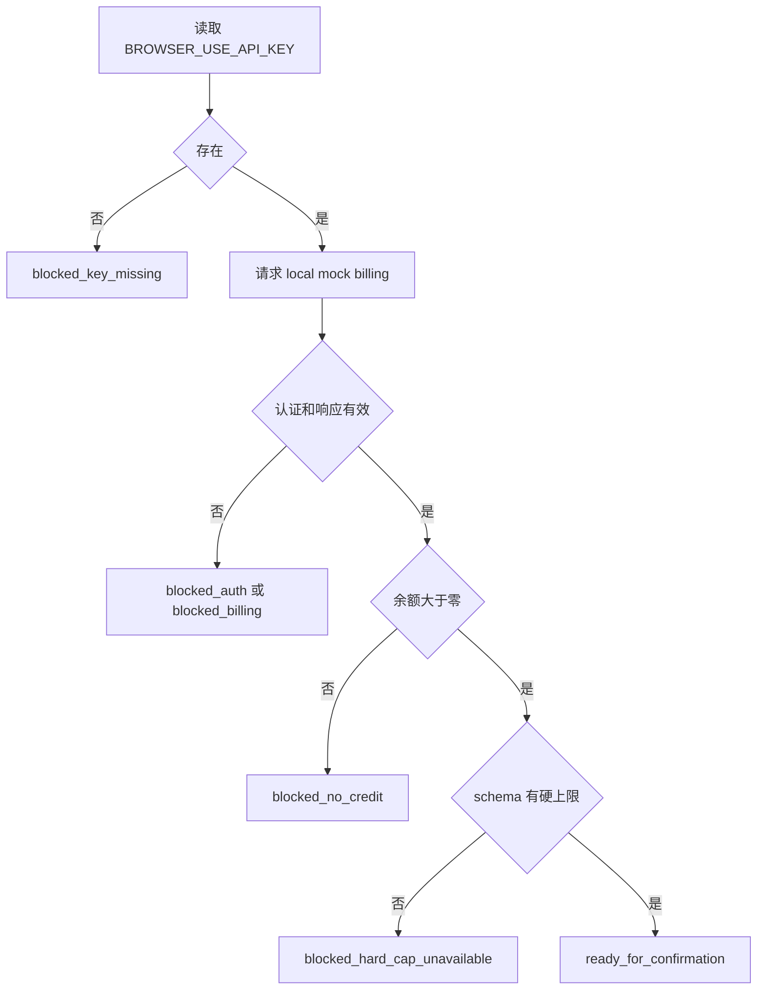
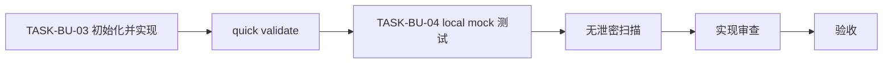

# CYCLE-BU-02：Cloud Owner 与预检

结论：本周期已新增 Browser Use Cloud 的唯一执行 Owner 和只读预检；影响：Cloud 任务在创建或追加收费任务前分别验证密钥存在、账单、余额和当前动作的硬费用上限；范围：五个 Skill 资产和 local mock 测试；非范围：不创建真实 session、不验证真实 key、不消费额度；变化：把收费前置条件收敛成六态失败关闭，并固化 session 级清理与实际费用回读；完成标准：脚本行为、脱敏、Skill 结构和安全审查全部通过；术语说明：local mock 是仅在本机启动的模拟账单服务；验证状态：14 个单元测试、Skill 校验、UTF-8 和无泄密检查通过。

## 当前周期目标、边界与进入条件

- 周期 ID / 期次定位：`CYCLE-BU-02` / 第二期。
- 唯一目标：建立 Cloud 执行、安全、费用和生命周期 Owner。
- 进入条件：`CYCLE-BU-01` completed。
- 禁止范围：真实 key、真实 Billing、真实 session、Cookie/profile 上传、非 local 测试。
- 图片资产决策：N/A。原因：交付物是规则和脚本；证据：状态机与流程图足以表达。

## 进入条件与收口条件

| 类型 | 条件 | 证据 | 状态 |
|---|---|---|---|
| 进入 | 四类主文档和四份周期文档通过 | `EVD-TASK-BU-02-ACCEPT-001` | completed |
| 收口 | `TASK-BU-03/04` 四项闭环完成 | `TEST-BU-C2-001..010` | completed |

图形目的：展示预检状态和默认失败关闭；关联 ID：`REQ-BU-003..006`、`RULE-BU-CAP-001`。

图形目的：展示任务闭环顺序；关联 ID：`CYCLE-BU-02`、`TASK-BU-03/04`。

## 当前代码/文档基线

- 新目录不存在；必须使用 `init_skill.py` 初始化后只保留计划中的五个资产。
- 代码风格基线：Python 标准库、`unittest`、类型注解、中文解释性注释、UTF-8。
- 环境：local Python 3；测试 billing URL 只允许 loopback HTTP。
- 停止规则：真实 MCP schema 与计划假设冲突、脚本可能输出敏感字段或必须联网时立即停止。

## 周期内最小任务执行顺序

| 顺序 | 任务 | 唯一目标 | 允许文件 | 禁止触碰区 | 状态 |
|---:|---|---|---|---|---|
| 1 | `TASK-BU-03` | 新增 Cloud Owner 与预检 | `browser-use-cloud-rules/` 五个计划资产 | 现有浏览器路由、真实配置 | completed |
| 2 | `TASK-BU-04` | 验证六态、schema、session 收口和无泄密 | 同一 Skill 的测试文件与本测试任务证据 | 真实 Cloud、生产代码测试钩子 | completed |

## 文件与符号操作契约

| 任务 | 文件/符号 | 操作 | 职责 | 兼容要求 |
|---|---|---|---|---|
| `TASK-BU-03` | `browser-use-cloud-rules/SKILL.md`、`agents/openai.yaml`、`references/routing-and-safety.md` | 新增 | 定义触发、安全、确认和生命周期契约 | 不复制唯一总路由矩阵 |
| `TASK-BU-03` | `scripts/browser_use_cloud_preflight.py` | 新增 | 读取 env、查询 billing、检查 schema、输出六态 JSON | 只用标准库、所有输出脱敏 |
| `TASK-BU-04` | `tests/test_browser_use_cloud_preflight.py` | 新增 | local HTTP mock 行为测试 | 不读取真实 key、不联网 |

## 最小任务闭环

| 任务 | 实现 | 真实测试 | 审查 | 验收 |
|---|---|---|---|---|
| `TASK-BU-03` | 五个资产初始化和实现 | CLI 对 local mock 的行为调用 | Owner、费用、secret、profile 边界 | `AC-BU-001/003/007/008/011` |
| `TASK-BU-04` | 测试与 fixture | `unittest`、quick validate、无泄密扫描 | 负向路径均失败关闭 | `AC-BU-004..006/009/012` |

## 当前周期验证矩阵

| 测试 ID | 对应任务 | local 样本 | 断言 | 失败预期 |
|---|---|---|---|---|
| `TEST-BU-C2-001` | `TASK-BU-03/04` | env 不含 key | `blocked_key_missing` 和固定提醒 | key 缺失仍可继续 |
| `TEST-BU-C2-002` | `TASK-BU-04` | 401/403/损坏/超时 mock | `blocked_auth` 或 `blocked_billing` | 返回 ready |
| `TEST-BU-C2-003` | `TASK-BU-04` | 零余额 mock | `blocked_no_credit` | 零余额放行 |
| `TEST-BU-C2-004` | `TASK-BU-04` | 有/无 `maxCostUsd` schema fixture | 分别 ready / hard-cap blocked | 无硬上限放行 |
| `TEST-BU-C2-005` | `TASK-BU-04` | 哨兵 key 和隐私字段 | stdout/stderr/异常无原值 | 任一路径泄密 |
| `TEST-BU-C2-006` | `TASK-BU-04` | Skill 全目录 | quick validate PASS | 结构或 front matter 失败 |
| `TEST-BU-C2-007` | `TASK-BU-04` | `send_task` 独立 input schema | 不复用 `run_session` 的硬上限结论 | 追加任务沿用旧授权 |
| `TEST-BU-C2-008` | `TASK-BU-04` | output schema、描述、别名、只读字段 | 全部保持 hard-cap blocked | 不可写字段误放行 |
| `TEST-BU-C2-009` | `TASK-BU-04` | success/failure/cancel 活跃状态 | 固定 `stop_session(strategy="session")` | 只停 task 或遗留 idle session |
| `TEST-BU-C2-010` | `TASK-BU-04` | stopped 与费用字段样本 | 仅 stopped 且非负有限 `totalCostUsd` 收口 | 未停止或非法费用仍宣称完成 |

## 真实测试与断言

- 精确入口：`py.exe -3 -X utf8 -B -m unittest discover -s browser-use-cloud-rules/tests -p "test_*.py"`。
- Skill 校验：`py.exe -3 -X utf8 -B .system/skill-creator/scripts/quick_validate.py browser-use-cloud-rules`。
- local 依赖：Python 标准库的临时 HTTPServer；fixture 全部在测试进程内构造。
- 清理：测试结束关闭 server，`-B` 禁止 pycache，不保留 key 或响应文件。
- 实测结果：14/14 通过；CLI 缺 key 返回退出码 2；无 ResourceWarning。
- 静态门禁：Skill 校验通过；五个资产均为 UTF-8；未生成 `__pycache__`；哨兵 key 和身份字段只存在于测试 fixture，未进入其它资产。

## 回滚与停止条件

- `ROLLBACK-BU-C2-001`：`TASK-BU-03` 失败时删除新增 Skill 目录，不改现有路由。
- `ROLLBACK-BU-C2-002`：`TASK-BU-04` 失败时只回滚测试写集并修复对应实现，不进入下一周期。
- 停止条件：发现 key 原值、真实网络、收费调用、未知状态、无硬上限仍 ready 或需要上传 profile。
- 最大推进边界：本周期不修改任何统一路由文件。

## 周期追踪矩阵

| REQ/RULE | AC | TASK | 文件/符号 | TEST | EVIDENCE | 状态 |
|---|---|---|---|---|---|---|
| `REQ-BU-001/003/007/008/011` | `AC-BU-001/003/007/008/011` | `TASK-BU-03` | Cloud Skill 与预检 | `TEST-BU-C2-001/004/006/007/008` | `EVD-TASK-BU-03-IMPL-001`、`EVD-TASK-BU-03-TEST-001`、`EVD-TASK-BU-03-REVIEW-001`、`EVD-TASK-BU-03-ACCEPT-001` | completed |
| `REQ-BU-004..006/009/012` | `AC-BU-004..006/009/012` | `TASK-BU-04` | local mock 测试 | `TEST-BU-C2-002..010` | `EVD-TASK-BU-04-IMPL-001`、`EVD-TASK-BU-04-TEST-001`、`EVD-TASK-BU-04-REVIEW-001`、`EVD-TASK-BU-04-ACCEPT-001` | completed |

## 自审结论

- 两个任务分别负责实现和验证，不跨写既有路由。
- 所有可执行验证均为 local；真实 Cloud、key、费用和 profile 明确禁止。
- 六态之外无默认状态，所有不明条件失败关闭。
- 图形、状态名、测试表和需求使用一致术语。

## 执行附录

预检 CLI 接受 billing URL、schema fixture 和超时参数；非 loopback mock URL 只在真实运行协议中由 Browser Use 官方 billing endpoint 提供，本轮测试禁止使用。JSON 输出只包含状态、布尔 key_present、脱敏余额/套餐摘要、hard_cap_available 和用户提醒。

## 追踪附录

`CYCLE-BU-02 -> TASK-BU-03/04 -> TEST-BU-C2-001..010 -> EVD-TASK-BU-03/04-*`；没有数据库、公开 API 服务、部署或 Git 写入。
