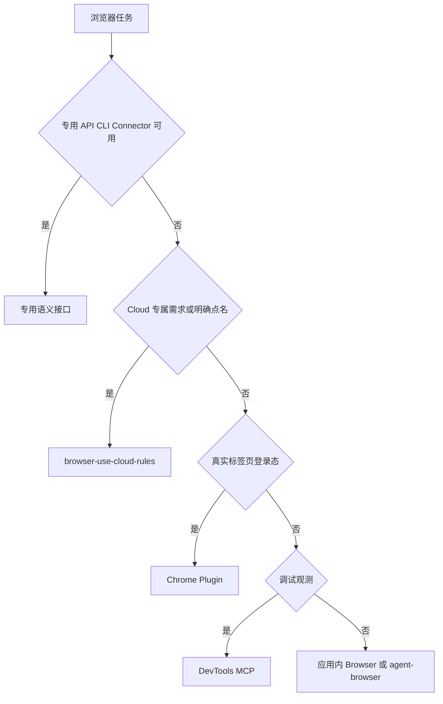

# CYCLE-BU-03：统一浏览器路由接入

结论：本周期已把验证通过的 Cloud Owner 接入唯一浏览器路由，同时让相邻 Skill 明确让路边界；影响：只有 Cloud 专属需求或用户明确点名 Cloud 才命中；范围：统一矩阵、URL 路由、两个浏览器 Skill、团队路由和失败分类；非范围：不改变既有工具内部行为、不安装或配置 MCP；变化：新增条件后端，不新增竞争矩阵；完成标准：正负 trigger 回归和安全审查通过；术语说明：让路边界是相邻 Skill 明确哪些场景不由自己接管；验证状态：8 个 trigger fixture 和 7 个 Skill 校验通过。

## 当前周期目标、边界与进入条件

- 周期 ID / 期次定位：`CYCLE-BU-03` / 第三期。
- 唯一目标：Cloud 专属场景有入口，现有浏览器路由无行为回归。
- 进入条件：`CYCLE-BU-02` 全部测试和验收通过。
- 非范围：不改 Chrome Plugin、应用内 Browser、DevTools 或 agent-browser 的实现。
- 图片资产决策：N/A。原因：只调整规则与路由文字；证据：依赖和选择关系由 Mermaid 表达。

## 进入条件与收口条件

| 类型 | 条件 | 证据 | 状态 |
|---|---|---|---|
| 进入 | Cloud Owner 六态预检完成 | `EVD-TASK-BU-04-ACCEPT-001` | completed |
| 收口 | Cloud 正例与既有路由负例全部通过 | `TEST-BU-C3-001..005` | completed |

图形目的：展示唯一浏览器路由的条件选择；关联 ID：`RULE-BU-ROUTE-001`、`REQ-BU-002`。

图形目的：展示两个任务的文件批次与回归门禁；关联 ID：`TASK-BU-05/06`。

## 当前代码/文档基线

- 唯一矩阵：`mcp-installation-rules/references/tool-priority.md`。
- URL Owner：`authenticated-url-routing-rules`；本地核心/高级 Owner 为两个 `browser-*-rules`。
- local 依赖：仓库 trigger 验证器和静态 fixture；不启动浏览器、不联网。
- 停止规则：发现矩阵竞争、description 误触发或需要改变现有工具安全语义时停止并回到需求边界。

## 周期内最小任务执行顺序

| 顺序 | 任务 | 唯一目标 | 允许文件 | 禁止触碰区 | 状态 |
|---:|---|---|---|---|---|
| 1 | `TASK-BU-05` | 核心路由接入 Cloud | MCP Owner、唯一矩阵、URL Owner 三文件 | 浏览器实现、真实配置 | completed |
| 2 | `TASK-BU-06` | 相邻 Skill 和失败路由让路 | 两个 browser Skill、团队路由、失败分类 | Cloud 预检内部行为 | completed |

## 文件与符号操作契约

| 任务 | 文件/符号 | 操作 | 修改后职责 | 兼容要求 |
|---|---|---|---|---|
| `TASK-BU-05` | `mcp-installation-rules/SKILL.md`、`references/tool-priority.md`、`authenticated-url-routing-rules/SKILL.md` | 修改 | 识别 Cloud 是条件后端并转交唯一 Owner | 保留 API/Connector 优先和真实 Chrome 首路由 |
| `TASK-BU-06` | `browser-session-automation-rules/SKILL.md`、`browser-advanced-testing-rules/SKILL.md` | 修改 | 明确不承接 Cloud 专属场景 | 保留所有现有触发与安全规则 |
| `TASK-BU-06` | 团队路由与失败分类对应区段 | 修改 | 加入 Cloud Owner 和预检失败归属 | 不改变其它域 owner |

## 最小任务闭环

| 任务 | 实现 | 真实测试 | 审查 | 验收 |
|---|---|---|---|---|
| `TASK-BU-05` | 三个核心路由文件增量 | Cloud 正例、普通浏览负例 | 唯一矩阵与认证边界 | `AC-BU-002/010/011` |
| `TASK-BU-06` | 相邻让路与失败归属 | Chrome/DevTools/agent-browser 回归 | 自动触发和用户习惯保留 | `AC-BU-002/007/008` |

## 当前周期验证矩阵

| 测试 ID | 输入场景 | 期望 Owner | 禁止结果 |
|---|---|---|---|
| `TEST-BU-C3-001` | 云端自主长链、托管并发、地域代理 | Cloud Owner | local browser 抢占 |
| `TEST-BU-C3-002` | 用户明确要求 Browser Use Cloud | Cloud Owner + 安全闸门 | 直接创建 session |
| `TEST-BU-C3-003` | 真实标签页、Cookie、扩展、登录态 | Chrome Plugin | Cloud 替代 |
| `TEST-BU-C3-004` | DOM/Console/Network/Performance | DevTools MCP | Cloud 替代 |
| `TEST-BU-C3-005` | 隔离 profile、HAR、diff、trace | 两个 agent-browser Owner | Cloud 替代 |

## 真实测试与断言

- 入口：`py.exe -3 -X utf8 -B doc/5-tests/2026-07-17_155229/skill-split-validation/validate_skill_split.py --mode trigger --root . --cases <BrowserUseCloud测试目录>`。
- fixture：中文正负 trigger 文本，不包含 key、Cookie、姓名、项目或订阅标识。
- 断言：每个样本只有预期 Owner；Cloud 负例不得命中；既有正例保持原 Owner。
- 清理：测试资产保存在同一中央测试根目录，命令不启动浏览器或服务。
- 实测 fixture：`doc/5-tests/2026-07-17_155229/skill-split-validation/cases/browser-use-cloud/trigger_cases.json`。
- 实测结果：3 个 Cloud 正例和 5 个负例全部通过；7 个相关 Skill 结构校验全部通过；UTF-8 与 scoped diff check 通过。

## 回滚与停止条件

- `ROLLBACK-BU-C3-001`：`TASK-BU-05` 失败时只逆向撤销核心路由增量，保留已验收 Cloud Skill。
- `ROLLBACK-BU-C3-002`：`TASK-BU-06` 失败时只撤销相邻让路和失败分类增量。
- 停止条件：Cloud 抢占普通浏览、绕过认证、丢失既有 trigger、出现竞争 Owner 或验证器无法确定唯一命中。
- 最大推进边界：只完成规则路由，不安装 MCP、不写用户配置、不启动 Cloud。

## 周期追踪矩阵

| REQ/RULE | AC | TASK | 文件/符号 | TEST | EVIDENCE | 状态 |
|---|---|---|---|---|---|---|
| `REQ-BU-002/010/011`、`RULE-BU-ROUTE-001` | `AC-BU-002/010/011` | `TASK-BU-05` | 核心路由三文件 | `TEST-BU-C3-001..004` | `EVD-TASK-BU-05-IMPL-001`、`EVD-TASK-BU-05-TEST-001`、`EVD-TASK-BU-05-REVIEW-001`、`EVD-TASK-BU-05-ACCEPT-001` | completed |
| `REQ-BU-002/007/008` | `AC-BU-002/007/008` | `TASK-BU-06` | 相邻让路与失败分类 | `TEST-BU-C3-003..005` | `EVD-TASK-BU-06-IMPL-001`、`EVD-TASK-BU-06-TEST-001`、`EVD-TASK-BU-06-REVIEW-001`、`EVD-TASK-BU-06-ACCEPT-001` | completed |

## 自审结论

- 唯一矩阵保持在既有文件，新 Skill 不复制全量路由。
- 正例只覆盖 Cloud 专属需求，负例覆盖全部既有浏览器用户习惯。
- 测试无需真实浏览器和网络，符合 local 红线。
- 图形、测试和文件表的 Owner 名称一致。

## 执行附录

每次修改 description 或二级标题都记录并触发字典刷新；仅正文让路边界变化但未改 description 时也运行 quick validate 和 trigger 回归。任何含“绕过验证码”措辞必须限定为服务商合规能力，不能表达规避站点安全策略。

## 追踪附录

`CYCLE-BU-03 -> TASK-BU-05/06 -> TEST-BU-C3-001..005 -> EVD-TASK-BU-05/06-*`；Cloud 消费授权和业务副作用授权保持分离。
